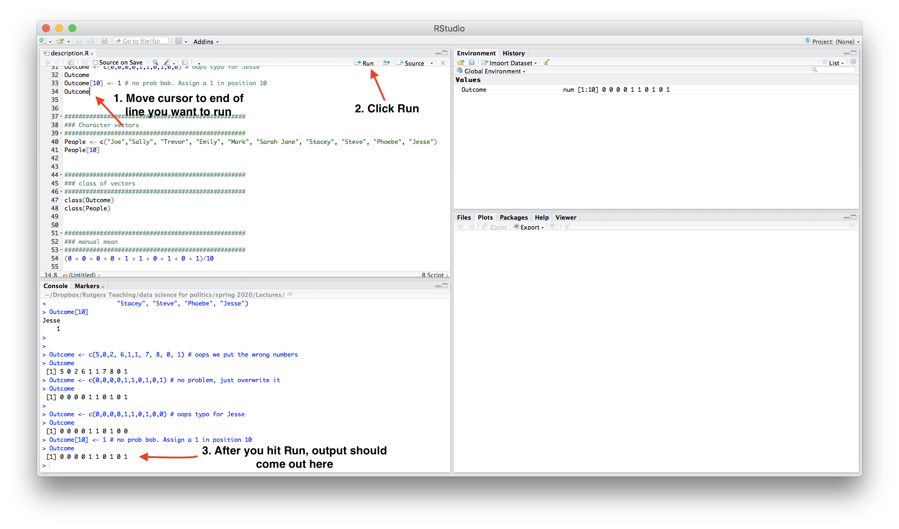

# R Overview {#rover}

This course will primarily use R for analysis, though we will briefly discuss a few areas where Stata may be more efficient.

Learning to program in R is not a primary goal of this course, but in proceeding through the course, you will gain and/or get practice with a lot of R skills.

For those brand new to R, I strongly recommend you complete the following tutorials prior to or at the beginning of the course.

**Goal**

By the end of the first week of the course, you will want to have R and RStudio installed on your computer (both free) and feel comfortable using R as a calculator and loading datasets into R.

**R and RStudio Installation**

  - This [video](http://www.youtube.com/embed/ulIv0NiVTs4?rel=0) from Christopher Bail explains the R and RStudio installation process. This involves
    1. Going to [cran](https://cran.r-project.org/), select the link that matches your operating system, and
then follow the installation instructions, and 
    2. Visiting [RStudio](http://www.rstudio.com/) and follow the download and installation instructions. R is the statistical software and programming language used for analysis. RStudio provides a convenient user interface for running R code. You do not need RStudio to use R, but it is free and can make your life easier! 

```{r, echo=FALSE, warning=FALSE, message=FALSE}
library("vembedr")
library(knitr)

embed_url("https://www.youtube.com/watch?v=ulIv0NiVTs4")
```

  - After installing R and RStudio, you can also follow along with Christopher Bail's [R Basics](https://www.youtube.com/watch?v=vVcH_OvrLEM) and [Data Wrangling](https://www.youtube.com/watch?v=sXVP9256JSQ) videos to learn the basic functionality of R.
  
**Supplemental Resources**

To supplement the above resources, I would recommend playing around with one of the following:

  - An additional great resource is Kosuke Imai's book *Quantitative Social Science.* The [first chapter](https://assets.press.princeton.edu/chapters/s11025.pdf) provides a written overview of installing R and the basic functions of R and R Studio, including loading data and packages into R. Data for the book is available at the bottom of this [page](https://qss.princeton.press/student-resources-for-quantitative-social-science/). Alternate coding in tidyverse for the book is available [here](https://jrnold.github.io/qss-tidy/).
  - If you were having difficulties following Chris Bail or Kosuke Imai's instructions for installation, you can try following the first couple of Rutgers Data Librarian Ryan Womack's videos, which similarly start from the point of installation. They are [here](https://www.youtube.com/watch?v=5rOR31bmoL8&list=PLCj1LhGni3hNxsLsVNHX6V1LICyklHl2a&ab_channel=librarianwomack). He goes at a slow pace and codes along in the videos. He also has a number of videos on more advanced data analysis topics. 
  - [R for Data Science](https://r4ds.had.co.nz/) is another great resource and focuses on "tidyverse" code in R, which can be particularly helpful in data wrangling and visualization.
  
Note: Much of the code used in the course will rely on "base R" functions (functions that already exist in R). People have also developed [tidyverse](https://www.tidyverse.org/) packages that can be easily installed in R, which supplements base R tools with alternative functions and a syntax based on a particular design philosophy, grammar, and data structure that they find preferable to base R. Using base R vs. tidyverse is often just a matter of personal taste. Either is fine to use in this course, and you will get exposure to code that relies on both.

This is a lot of information to digest all at once. Don't worry. No one remembers everything. Plan on going back to these resources often throughout the course and beyond. We will have office hours the first week of the course to help troubleshoot issues. 

## First Time with R and RStudio

This next section provides a few notes on using R and RStudio now that you have installed it. This is mostly repetitive of the other resources. This includes only the bare essential information for opening an R script and digging into using R as a calculator, which we will do in chapter 3. In this section, we cover the following materials:

  - Using R as a calculator and assigning objects using `<-`
  - Setting your working directory and the `setwd()` function.
  - Creating and saving an R script

### **Open RStudio**

RStudio is an open-source and free program that greatly facilitates the use of R, especially for users new to programming. Once you have downloaded and installed R and RStudio, to work in R, all you need to do now is open RStudio (it will open R). It should look like this, though your version number may be different: (*Image from Kosuke Imai's Quantitative Social Science Figure 1.1*)


**Note:** If you only have three windows (e.g., no upper-left window), you may need to **open an R script.** 

  - To do this, in RStudio, click on File, New, and then R script. This will open a blank document for text editing in the upper left of the RStudio window. We will return to this window in a moment.


### **Using R as a Calculator**

The *bottom left* window in your RStudio is the Console. You can type in this window to use R as a calculator or to try out commands. It will show the raw output of any commands you type. For example, we can try to use R as a calculator. Type the following in the Console (the bottom left window) and hit "enter" or "return" on your keyboard:

```{r}
5 + 3

5 - 3

5^2

5 * 3

5/3

(5 + 3) * 2
```

In the other RStudio windows, the upper right will show a history of commands that you have sent from the text editor to the R console, along with other items. The lower right will show graphs, help documents and other features. These will be useful later in the course.

### **Working in an R Script**

Earlier, I asked you to open an R script in the upper left window by doing File, then New File, then R Script. Let's go back to working in that window.

**Set your working directory `setwd()`**

(Almost) every time you work in RStudio, the first thing you will do is set your working directory. This is a designated folder in your computer where you will save your R scripts and datasets.

There are many ways to do this.

  - An easy way is to go to Session $\rightarrow$ Set Working Directory $\rightarrow$ Choose Directory. I suggest choosing a folder in your computer that you can easily find and that you will routinely use for this class. Go ahead and create/select it. 
  - Note: when you selected your directory, code came out in the bottom left Console window. This is the `setwd()` command which can also be used directly to set your working directory in the future.
  - If you aren't sure where your directory has been set, you can also type `getwd()` in your Console. Try it now


```{r, eval=F}
## Example of where my directory was
getwd()
```


If I want to  change the working directory, I can go to the top toolbar of my computer and use Session $\rightarrow$ Set Working Directory $\rightarrow$ Choose Directory or just type my file pathway using the `setwd()` below:

```{r, eval=FALSE}
## Example of setting the working directory using setwd().
## Your computer will have your own file path.
setwd("/Users/ktmccabe/Dropbox/Rutgers Teaching/")
```


**Saving the R Script**

Let's now save our R script to our working directory and give it an informative name. To do so, go to File, then Save As, make sure you are in the same folder on your computer as the folder you chose for your working directory.

Give the file an informative name, such as: "McCabeWeek1.R". Note: all of your R scripts will have the .R extension.


### **Preparing your R script**

Now that we have saved our R script, let's work inside of it. Remember, we are in the top-left RStudio window now.

  - Just like the beginning of a paper, you will want to title your R script. In R, any line that you start with a \# will not be treated as a programming command. You can use this to your advantage to write titles/comments. Below is a screenshot example of a template R script.
  - You can specify your working directory at the top, too. Add your own filepath inside `setwd()`


  - Then you can start answering problems in the rest of the script.
  - Think of the R script as where you write the final draft of your paper. In the Console (the bottom-left window), you can mess around and try different things, like you might when you are taking notes or outlining an essay. Then, write the final programming steps that lead you to your answer in the R script. For example, if I wanted to add 5 + 3, I might try different ways of typing it in the Console, and then when I found out `5 + 3` is the right approach, I would type that into my script.


### **Executing Commands in your R script**

The last thing we will note in this initial handout is how to execute commands in your R script.

To run / execute a command in your R script (the upper left window), you can

  1. Highlight the code you want to run, and then hold down "command + return" on a Mac or "control + enter" on Windows
  2. Place your cursor at the end of the line of code (far right), and hit "command + return" on a Mac or "control + return" on Windows, or
  3. Do 1 or 2, but instead of using the keyboard to execute the commands, click "Run" in the top right corner of the upper-left window.

Try it: Type `5 + 3` in the R script. Then, try to execute `5 + 3`. It should look something like this:


After you executed the code, you should see it pop out in your Console:
```{r}
5 + 3
```

{width=90%}

Note: The symbol \# also allows for annotation behind commands or on a separate line. Everything that follows \# will be ignored by R. You can annotate your own code so that you and others can understand what each part of the code is designed to do.

```{r}
## Example
sum53 <- 5 + 3 # example of assigning an addition calculation
```

### **Objects**

Sometimes we will want to store our calculations as "objects" in R. We use `<-` to assign objects by placing it [to the left](https://www.youtube.com/watch?v=vLZA67L7gIo&ab_channel=BeyonceSasha1) of what we want to store. For example, let's store the calculation `5 + 3` as an object named `sum53`:

```{r}
sum53 <- 5 + 3
```

After we execute this code, `sum53 now stores the calculation. This means, that if we execute a line of code that just has `sum53`, it will output 8. Try  it:

```{r}
sum53
```

Now we no longer have to type `5 + 3`, we can just type `sum53`. For example, let's say we wanted to subtract 2 from this calculation. We could do:

```{r}
sum53 - 2
```

Let's say we wanted to divide two stored calculations:
```{r}
ten <- 5 + 5
two <- 1 + 1
ten / two
```

The information stored does not have to be numeric. For example, it can be a word, or what we would call a character string, in which case you need to use quotation marks.

```{r}
mccabe <- "professor for this course"
mccabe
```


*Note:* Object names cannot begin with numbers and no spacing is allowed. Avoid using special characters such as \% and \$, which have specific meanings in R. Finally, use concise and intuitive object names.}

  - GOOD CODE: `practice.calc <- 5 + 3`
  - BAD CODE: `meaningless.and.unnecessarily.long.name <- 5 + 3`

While these are simple examples, we will use objects all the time for more complicated things to store (e.g., like full datasets!) throughout the course.

We can also store an array or "vector" of information using `c()`

```{r}
somenumbers <- c(3, 6, 8, 9)
somenumbers
```

**Importance of Clean Code**

Ideally, when you are done with your R script, you should be able to highlight the entire script and execute it without generating any error messages. This means your code is clean. Code with typos in it may generate a red error message in the Console upon execution. This can happen when there are typos or commands are misused.

For example, R is case sensitive. Let's say we assigned our object like before:
```{r}
sum53 <- 5 + 3
```

However, when we went to execute `sum53`, we accidentally typed `Sum53`:
```{r, error=TRUE}
Sum53
```

Only certain types of objects can be used in mathematical calculations. Let's say we tried to divide `mccabe` by 2:

```{r, error=TRUE}
mccabe / 2
```

A big part of learning to use R will be learning how to troubleshoot and detect typos in your code that generate error messages.

{width=80%}


### **Practice** 

Below is an exercise that will demonstrate you are able to use R as a calculator and create R scripts.

  1. Create an R script saved as ``LastnameSetup1.R" (use your last name). Within the R script, follow the example from  this handout and title the script.
  2. Set your working directory, and include the file pathway (within `setwd()`) at the top of your .R script.
  3. Do the calculation 4 + 3 - 2 in R. Store it as an object with an informative name.
  4. Do the calculation 5 $\times$ 4 in R. Store it as an object with an informative name.
  5. Add these two calculations together. In R, try to do this by adding together the objects you created, not the underlying raw calculations. 


## Tutorials

Occasionally in this course, there will be some interactive tutorials I've created that you can do to practice the concepts and R skills.

In order to be able to run the tutorials, you need to run the following in your R script.

  - `install.packages("devtools", dependencies=T)`

After `devtools` is installed, you shouldn't have to run that line of code again. However, you will need to run the below line each time there is a new tutorial, as this package will be updated throughout the course. 

  - `devtools::install_github("ktmccabe/interactivepack", dependencies = T)`
  
Our first tutorial is practicing R skills to load and manipulate dataframes. You should be able to complete that after reviewing the Chris Bail video and Kosuke Imai QSS Chapter 1 resource. The tutorial is based on information provided in Imai Chapter 1. To load the tutorial, run the line of code below in your RStudio Console. It should open up a web browser on your local machine with the tutorial. If a browser does not open, you may need to manually copy/paste the numeric url that pops out on the console into a browser window.

To close out of a tutorial, you can click the stop sign or hit the "Escape" key in the console. 

If you encounter an error, you may need to install a package or application that is indicated in the error message. 

  - `learnr::run_tutorial("rintro", package="interactivepack")`


This is a new program that I am using in this course for the first time to create tutorials, so feel free to email if you encounter bugs!! 

## Data Wrangling

So you have some data.... AND it's a mess!!!

A lot of the data we may encounter in courses has been simplified to allow students to focus on other concepts. We may have data that look like the following:
```{r, results="asis"}
nicedata <- data.frame(gender = c("Male", "Female", "Female", "Male"),
           age = c(16, 20, 66, 44),
           voterturnout = c(1, 0, 1, 0))
```

```{r, echo=FALSE}
kable(nicedata)
```

In the real world, our data may hit us like a ton of bricks, like the below:
```{r, results="asis"}
uglydata <- data.frame(VV160002 = c(2, NA, 1, 2),
           VV1400068 = c(16, 20, 66, 44),
           VV20000 = c(1, NA, 1, NA))
```

```{r, echo=FALSE}
kable(uglydata)
```


A lot of common datasets we use in the social sciences are messy, uninformative, sprawling, misshaped, and/or incomplete. What do I mean by this?

  - The data might have a lot of missing values. For example, we may have `NA` values in R, or perhaps a research firm has used some other notation for missing data, such as a `99`.
  - The variable names may be uninformative. 
      + For example, there may be no way to know by looking at the data, which variable represents gender. We have to look at a codebook.
  - Even if we can tell what a variable is, its categories may not be coded in a way that aligns with how we want to use the data for our research question. 
      + For example, perhaps you are interested in the effect of a policy on people below vs. 65 and over in age. Well, your age variables might just be a numeric variable. You will have to create a new variable that aligns with your theoretical interest.
  - Datasets are often sprawling. Some datasets may have more than 1000 variables. It is hard to sort through all of them. Likewise, datasets may have millions of observations. We cannot practically look through all the values of a column to know what is there.
  - Sometimes we have data shaped into separate columns when we'd rather it be reshaped into different rows.
  - Maybe you have encountered a beautiful dataset that provides many measures of your independent variables of interest, but there's one catch-- it has no variable related to your outcome! You have to merge data from multiple sources to answer your research question.

Below are a few tips and resources. Ultimately, research is a constant debugging process. The nice thing about R is that a lot of researchers constantly post coding tips and questions online. Google ends up being your friend, but it's entirely normal to have to devote several hours (days?) to cleaning data.

{width=75%}


### Dealing with Uninformative Variable Names

Hopefully, there is an easy fix for dealing with uninformative variable names. I say "hopefully" because hopefully when you encounter a dataset with uninformative variable names, the place where you downloaded the data will also include a codebook telling you what each variable name means, and how the corresponding values are coded.

Unfortunately, this may not always be the case. One thing you can do as a researcher is when you create a dataset for your own work, keep a record (in written form, on a word document or in a pdf or code file) of what each variable means (e.g., the survey question it corresponds to or the exact economic measure), as well as how the values of the variables are coded. This good practice will help you in the short-term, as you pause and come back to working on a project over the course of a year, as well as benefit other researchers in the long run after you publish your research.

For examples of large codebooks, you can view the [2016 American National Election Study Survey](https://electionstudies.org/data-center/2016-time-series-study/) and click on a codebook.

I recommend that once you locate the definition of a variable of interest, rename the variable in your dataset to be informative. You can do this by creating a new variable or overwriting the name of the existing variable. You might also comment a note for yourself of what the values mean.

```{r}
## Option 1: create new variable
## gender 2=Male, 1=Female
uglydata$gender <- uglydata$VV160002

## Option 2: Overwrite
names(uglydata)[1] <- "gender2"
```

### Dealing with Missing Data

When we have a column with missing data, it is best to do a few things:

  - Try to quantify how much missing data there is and poke at the reason why data are missing.
      + Is it minor non-response data?
      + Or is it indicative of a more systematic issue? For example, maybe data from a whole group of people or countries is missing for certain variables.
  - If the data are missing at a very minor rate and/or there is a logical explanation for the missing data that should not affect your research question, you may choose to "ignore" the missing data when performing common analyses, such as taking the mean or running a regression.
      + If missing data are a bigger problem, you may consider alternative solutions, such as "imputing" missing data or similarly using some type of auxilliary information to help fill in the missing values.
      

If we want to figure out how much missing data we have in a variable, we have a couple of approaches:

```{r}
## Summarize this variable
summary(uglydata$gender)

## What is the length of the subset of the variable where the data are missing
length(uglydata$gender[is.na(uglydata$gender) == T])
```

If we choose to ignore missing data, this can often be easily accomplished in common operations. For example, when taking the `mean` we just add an argument `na.rm = T`:

```{r}
mean(uglydata$VV1400068, na.rm=T)
```

If we do a regression using `lm` or `glm`, R will automatically "listwise" delete any observation that has missing data (`NA`) on any of the variables in our regression model.

We should always be careful with missing data to understand how R is treating it in a particular scenario. 

For example if we were to run `table(uglydata$gender)`, we would have no idea there were missing data unless we knew that the total number of observations `nrow(uglydata)` was greater than 3. The `table()` command is omitting the missing values by default.
```{r}
table(gender= uglydata$gender)
```

### Dealing with Variable Codings that Aren't Quite Right

Often times the ways that variables are coded in datasets we get off-the-shelf are not coded exactly as how we were dreaming up operationalizing our concepts. Instead, we are going to have to wrangle the data to get them into shape.

This may involve creating new variables that recode certain values, creating new variables that collapse some values into a smaller number of categories, combining multiple variables into a single variable (e.g., representing the average), or setting some of the variable values to be missing (`NA`). All of these scenarios may come up when you are dealing with real data.

[Chapter 2](http://assets.press.princeton.edu/chapters/s2-11025.pdf) of Kosuke Imai's book *Quantitative Social Science* walks through some examples of how to summarize your data, subset the data (2.2.3), create new variables using conditional statements (Section 2.2.4, e.g., "If age is below 65, assign the new variable a value of "0", otherwise, assign it a value of "1"), and creating new factor variables (2.2.5, e.g., coding anyone who is Protestant, Catholic, or Lutheran in the data as "Christian").

### Dealing with Incomplete Data (Merging!)

Sometimes in order to answer our research questions, we need to combine data from multiple sources. If we have a large amount of data, this may be quite daunting. Fortunately, R has several commands that allow us to merge or append datasets.

Here are a few resources on merging and appending data:

  - Using the `merge` command in R. [See Explanation.](https://sejdemyr.github.io/r-tutorials/statistics/tutorial5.html)
    + It will look for variable(s) held in common between datasets and join the datasets by the matching values on these variables.
  - Appending data in R (e.g., Maybe you have one dataset from 2010 and another from 2012, and you want to stack them on top of each other). [See Explanation.](https://www.princeton.edu/~otorres/Merge101R.pdf)
  
Some merging problems are extremely difficult. For example, some researchers need to merge large datasets--like the voter file-- with other administrative records. However, how someone's name is displayed in one dataset might not match at all with the other dataset. For these complex problems, we might need "fuzzy matching." Here is an R package that helps with this more complex [case](https://github.com/kosukeimai/fastLink) and related [paper](https://imai.fas.harvard.edu/research/files/linkage.pdf).


### Dealing with Poorly Shaped Data

Data can come in a variety of shapes and sizes. It's a [beautiful disaster](https://www.youtube.com/watch?v=g4vQeHP_nxg).

Sometimes it's particularly useful to have data in wide formats, where every row relates to a particular unit of data-- such as a country or a survey respondent. And perhaps each column represents information about that unit at a particular point in time. For example, perhaps you have a column with information on that subject for the past five years.

```{r, results="asis"}
countrywide <- data.frame(country = c("Canada", "USA"),
                          economy2016 = c(10, 12),
                          economy2017 = c(11, 11),
                          economy2018 = c(9, 5),
                          economy2019 = c(13, 8),
                          economy2020 = c(12, 6))
```
```{r, echo=FALSE}
kable(countrywide)
```

However, other times, it would be more useful to you, as you dig into your data analysis, to have this information arranged in "long" format, such that every row is now a unit-year combination. You have a row for Canada in 2020, a row for Canada in 2019, and so on. Countries are now represented in multiple rows of your data.

```{r, results="asis"}
countrylong <- data.frame(country = rep(c("Canada", "USA"),5),
                          year = 2016:2020,
                          economy= c(10, 12,11, 11,9, 5,13, 8,12, 6))
```
```{r, echo=FALSE}
kable(countrylong)
```

Ultimately, different shapes of data are advantageous for different research questions. This means it is best if we have a way to (at least somewhat) easily shift between the two formats.

Here is a resource on how to "reshape" your data between wide and long from [UCLA](https://stats.idre.ucla.edu/r/faq/how-can-i-reshape-my-data-in-r/).

Here are a few additional resources:
 
 - More on [reshape](https://www.r-bloggers.com/converting-a-dataset-from-wide-to-long)
 – For the tidyverse fans. Using `gather()` and `spread()` in tidyverse from [R for Data Science](https://r4ds.had.co.nz/) and explained by Chris Bail [here](https://www.youtube.com/watch?v=sXVP9256JSQ).

### Reproducing your steps

It is really important to keep a record of all of the changes you have made to the original data. An R script or R markdown file is a useful way to do this, so long as you add comments that explain what you are doing. 

You want to get your code to a place when a stranger can open your R file, load your data, and reproduce each step you took to get to the final results--- all while never even needing to contact you with questions. That can be difficult, but it's good to aim for that high bar, even if sometimes, we fall short in how we are documenting each step.

This website provides a nice introduction to R Markdown, one tool for embedding R code inside textual documents. See [here](https://rpubs.com/brandonkopp/RMarkdown). 

If you want to get advanced with reproducibility, you can watch Chris Bail's on the [subject](https://www.youtube.com/watch?v=98IcckSOfnw) describing the uses of R Markdown and GitHub among other tools for communicating and collaboration. He also links to other resources.


