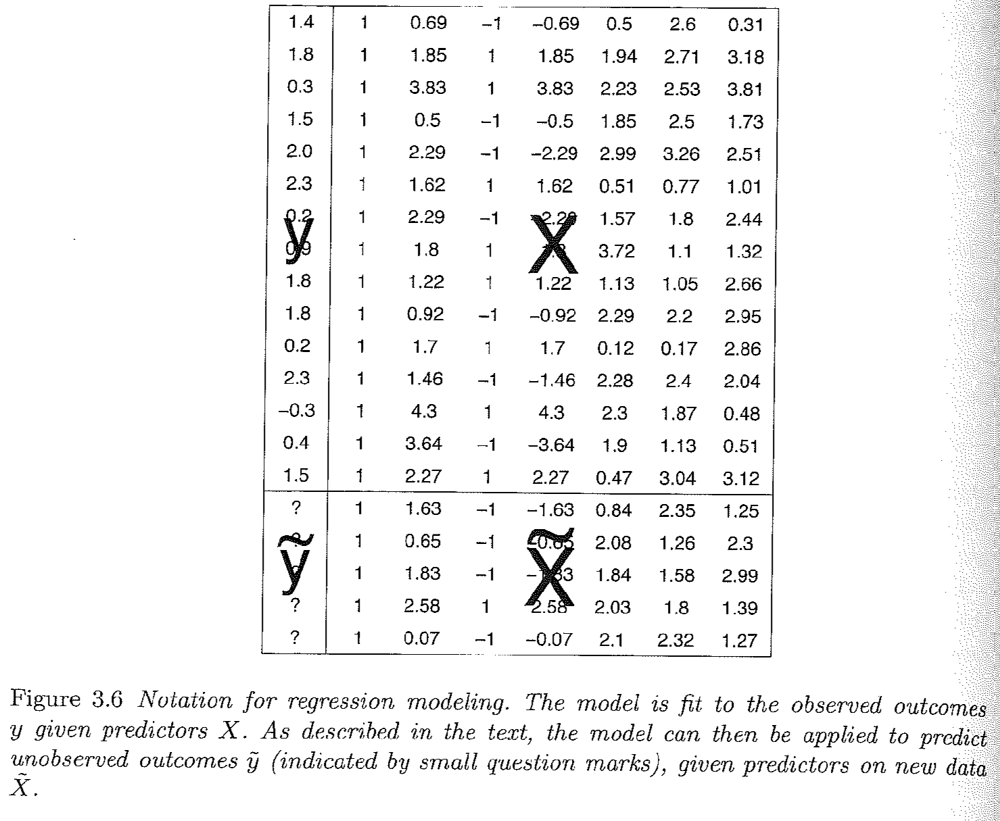

# Review of OLS {#ols}

\newcommand\bE{\mathbf{E}}


This section will provide a review of OLS.

OLS is the workhorse of empirical political science. We will learn a lot beyond OLS, but OLS is often "good enough" and sometimes preferable for explaining the relationship between variables. That is to say, MLE will expand your toolkit, but OLS should remain a big part of your toolkit.

I recommend that you review the following readings to familiarize yourself with regression. I will make note within this section where particular readings are most relevant. These readings are available on Canvas in the modules- Week 1 section.

  - Wheelan, Charles. 2012. *Naked Statistics*. W.W. Norton. Chapter 11. This provides an accessible overview of regression and the interpretation of regression results.
  - Gelman, Andrew, and Jennifer Hill. 2006. Data analysis using regression and multilevel/hierarchical models. Cambridge University Press. Chapter 3. This is a slightly more technical overview and includes some R code for running regressions.
  - Building models and breaking models.
  
    - (Optional) Fox, John. 2015. Applied Regression Analysis and Generalized Linear Models, 2nd Edition. Sage. Chapter 11. This reading describes diagnostic tests to probe whether the model is a good fit of the data. We won't go into detail about this in this class, but is material classes focused on linear regression will generally cover.
    - Messing, Solomon. [“How to break regression.”](https://medium.com/pew-research-center-decoded/how-to-break-regression-f48230f0ca68)
    - Lenz, G., & Sahn, A. (2020). "Achieving Statistical Significance with Control Variables and Without Transparency." *Political Analysis*, 1-14. doi:10.1017/pan.2020.31. This paper talks about how to build a regression model, and in particular, why adding more and more controls isn't always a good thing.


## Introducing OLS Regression 


The regression method describes how one variable depends on one or more other variables. Ordinary Least Squares regression is a linear model with the matrix representation:


$Y = \alpha + X\beta + \epsilon$


Given values of variables in $X$, the model predicts the average of an outcome variable $Y$. For example, if $Y$ is a measure of how wealthy a country is, $X$ may contain measures related to the country's natural resources and/or features of its institutions (things that we think might contribute to how wealthy a country is.) In this equation:

  - $Y$ is the outcome variable ($n \times 1$).^[Recall this notation means rows by columns, $Y$ is a vector of length $n$ (the number of observations), and since there is only 1 outcome measure, it is 1 column.]
  - $\alpha$ is a parameter representing the intercept
  - $\beta$ is a parameter representing the slope/marginal effect ($k \times 1$), and 
  - $\epsilon$ is the error term ($n \times 1$).

In OLS, we estimate a line of best fit to predict $\hat{Y}$ values for different values of X: 

  - $\hat{Y} = \hat{\alpha} + X\hat{\beta}$. 
  - When you see a "$\hat{hat}$" on top of a letter, that means it is an estimate of a parameter. 
  - As we will see in the next section, in multiple regression, sometimes this equation is represented as just $\hat{Y} = X\hat{\beta}$, where this generally means that $X$ is a matrix that includes several variables and $\hat \beta$ is a vector that includes several coefficients, including a coefficient representing the intercept $\hat \alpha$

We interpret linear regression coefficients as describing how a dependent variable is expected to change when a particular independent variable changes by a certain amount. Specifically:

  - "Associated with each one unit increase in a variable $x_1$, there is a $\hat{\beta_1}$ estimated expected average increase in $y$." 
  - If we have more than one explanatory variable (i.e., a multiple regression), we add the phrase "controlling on/ holding constant other observed factors included in the model." 
  
We can think of the interpretation of a coefficient in multiple regression using an analogy to a set of light switches:

{width=40%}

We ask: How much does the light in the room change when we flip one switch, while holding constant the position of all the other switches?

This would be a good place to review the Wheelan chapter and Gelman and Hill 3.1 and 3.2 to reinforce what a regression is and how to interpret regression results.


## Diving Deeper into OLS Matrix Representation

In this section, we will review the matrix representation of the OLS regression in more detail and discuss how to derive the estimators for the regression coefficients.^[This  [video](https://www.youtube.com/watch?v=GMVh02WGhoc&ab_channel=BenLambert) from Ben Lambert provides additional intuition for understanding OLS in a matrix form and how it can be useful.]


OLS in Matrix Form:
Let $X$ be an $n \times k$ matrix where we have observations on k independent variables for n observations. Since our model will usually contain a constant term, one of the columns in the X matrix will contain only ones. This column should be treated exactly the same as any other column in the X matrix.

  - Let $Y$ be an $n \times 1$ vector of observations on the dependent variable. Note: because $Y$ is a vector (a matrix with just one column), sometimes it is written in lowercase notation as $\mathbf y$.
  - Let $\epsilon$ be an $n \times 1$ vector of disturbances or errors.
  - Let $\beta$ be an $k \times 1$ vector of unknown population parameters that we want to estimate.


$\begin{pmatrix} y_1 \\ y_2 \\ y_3 \\ y_4 \\ ... \\ y_n \end{pmatrix}$ = $\begin{pmatrix}   1 & x_{11} & x_{12} & x_{13} & ... & x_{1k}\\ 
1 & x_{21} & x_{22} & x_{23} & ... &  x_{2k} \\ 
1 & x_{31} & x_{32} & x_{33} & ... & x_{3k}\\
1 & x_{41} & x_{42} & x_{43} & ... & x_{4k} \\
... & ... & ... & ... & ... & ... \\
1 & x_{n1} & x_{n2} & x_{n3} & ... & x_{nk}\end{pmatrix}$ X $\begin{pmatrix} \alpha \\ \beta_1 \\ \beta_2 \\ \beta_3 \\  ... \\ \beta_k \end{pmatrix}$ + $\begin{pmatrix} \epsilon_1 \\ \epsilon_2 \\ \epsilon_3 \\ \epsilon_4 \\ ... \\ \epsilon_n \end{pmatrix}$


Our estimates are then $\mathbf{ \hat y} = X\hat \beta$. What are the dimensions of this quantity?

Gelman and Hill Section 3.4, pg. 38 provides a nice visual of how this representation maps onto what a typical dataset may look like, where we will try to estimate a set of coefficients that map the relationship between the columns of $X$ and $\mathbf y$:

{width=70%}\\

This is a good place to review Gelman and Hill 3.4 on different notations for representing the regression model.

### Estimating the Coefficients

Models generally start with some goal. In OLS, our goal is to minimize the sum of squared "residuals." Here is a video I created to explain why we can represent this as $\mathbf{e'}\mathbf{e}$.

```{r, echo=FALSE, warning=FALSE, message=FALSE}
library("vembedr")

embed_url("https://www.youtube.com/watch?v=IFX_n16YTm0")
```
*Note: at the end of the video it should read $X\hat\beta$, not $\hat X \beta$*

What is a residual? It's the difference between y and our estimate of y: $y - \hat y$. It represents the error in our prediction-- how far off our estimate is of the outcome.

We can write this in matrix notation in the following way where $\mathbf e$ is an $n \times 1$ vector of residuals-- a residual for each observation in the data:

\begin{align*}
\mathbf{e'}\mathbf{e} &= (Y' - \hat{\beta}'X')(Y - X\hat{\beta})\\
&=Y'Y - \hat{\beta}'X'Y - Y'X\hat{\beta} + \hat{\beta}'X'X\hat{\beta} \\
&= Y'Y - 2\hat{\beta}'X'Y + \hat{\beta}'X'X\hat{\beta}
\end{align*}

Recall we want a line that minimizes this quantity. We minimize the sum of squared residuals by taking the derivative with respect to $\beta$. (We want to identify the coefficients that help us achieve the goal of minimizing the squared error.) Because we are now deriving an estimate, we will use the hat over $\beta$:

  - $\frac{\delta }{\delta \hat \beta} = -2X'Y + 2X'X\hat{\beta}$
  - So what is our estimate for $\hat{\beta}$? We take first order conditions
  
  \begin{align*}
  0 &=-2X'Y + 2X'X\hat{\beta}\\
   \hat{\beta} &= (X'X)^{-1}X'Y
   \end{align*}
  
You may wonder how we got to these answers. Don't worry, you will get your chance to solve this! The important thing to note for now, is that we have an analytic solution to our coefficient estimates.

 
## OLS Regression in R

To run a linear regression in R, we use the `lm()` function. 
  
The syntax is `lm(y ~ x1, data = mydata)` for a regression with `y` as the name of your dependent variable and there is one explanatory variable  `x1` where `mydata` is the name of your data frame. 
      
`lm(y ~ x1 + x2 , data = mydata)` is the syntax for a regression with two explanatory variables `x1` and `x2`, where you would add additional variables for larger multivariate regressions. By default, R will include an intercept term in the regression.

### Example: Predicting Current Election Votes from Past Election Votes

In the American presidential election in 2000, there was an actual controversy in how ballots were cast in the state of Florida. Social scientists used data comparing the election results from 1996 in the state with 2000 as one way to help detect irregularities in the 2000 vote count. For more information on the background of this example, you can watch this [video](https://www.youtube.com/watch?v=D-nR_hmS6V0).

We will use the data `florida.csv` available [here](https://github.com/ktmccabe/teachingdata/blob/main/florida.csv): 

```{r}
## Load Data
florida <- read.csv("https://raw.githubusercontent.com/ktmccabe/teachingdata/main/florida.csv")
```

This data set includes several variables described below, where each row represents the voting information for a particular county in Florida.

| Name | Description |
|:------------- |:--------------------------:| 
| `county` | county name |
| `Clinton96` | Clinton's votes in 1996 |
| `Dole96` | Dole's votes in 1996 |
| `Perot96` | Perot's votes in 1996 |
| `Bush00` | Bush's votes in 2000 |
| `Gore00` | Gore's votes in 2000 |
| `Buchanan00` | Buchanan's votes in 2000 |

In 2000, Buchanan was a third party candidate, similar to Perot in 1996. One might think that counties where Perot received a lot of votes in 1996 should also receive a lot in 2000. That is: with a one-vote increase in Perot's vote, we might expect an average increase in Buchanan's 2000 vote. 

We can translate that language into a regression equation:

  - $Buchanan2000 = \alpha + Perot1996 * \beta + \epsilon$

In R, we run this regression the following way. We will save it as an object `fit.1`. You can name your regression objects anything you want.
```{r}
fit.1 <- lm(Buchanan00 ~ Perot96, data = florida)
```

  - `summary(model)` provides the summary statistics
   of the model.  In particular, the following statistics are
   important
   
      - `Estimate`: point estimate of each coefficient
      - `Std. Error`: standard error of each estimate
      - `t value`: indicates the $t$-statistic of each
        coefficient under the null hypothesis that it equals zero
     - `Pr(>|t|)`: indicates the two-sided $p$-value
        corresponding to this $t$-statistic where asterisks indicate
        the level of statistical significance.
      - `Multiple R-squared`: The coefficient of
       determination
     - `Adjusted R-squared`: The coefficient of
       determination adjusting for the degrees of freedom 
       
We will say more to define these quantities in future sections.     
```{r}
summary(fit.1)
```

R also allows several shortcuts for accessing particular elements of your regression results. Examples:

```{r}
## Vector of the coefficient estimates only
coef(fit.1)

## Compute confidence intervals for these coefficients
confint(fit.1)

## Table of coefficient results only
summary(fit.1)$coefficients

## Extract standard errors only
summary(fit.1)$coefficients[,2]

## Variance-Covariance matrix
vcov(fit.1)

## Note that the square root of the diagonal of this matrix provides the standard errors
sqrt(diag(vcov(fit.1)))

## Degrees of freedom
fit.1$df.residual
```

### Plotting Regression Results

We often don't want to hide our data under a bushel basket or in complicated regression models. Instead, we might also want to visualize data in R. The function  `plot()` and the function `ggplot()` from the package `ggplot2` are two terrific and flexible functions for visualizing data. We will use the `plot()` function to visualize the relationship between Perot and Buchanan votes. The example below provides a few arguments you can use within each of these functions, but they are capable of much more.

At the core, plotting functions generally work as coordinate systems. You tell R specifically at which x and y coordinates you want your points to be located (e.g., by providing R with a vector of x values and a vector of y values). Then, each function has its own way of allowing you to add bells and whistles to your figure, such as labels (e.g., `main, xlab, ylab`), point styles ({\tt pch}), additional lines and points and text (e.g., `abline(), lines(), points(), text()`), or x and y scales for the dimensions of your axes (e.g., `xlim, ylim`). You can create a plot without these additional features, but most of the time, you will add them to make your plots look good! and be informative! We will do a lot of plotting this semester.


Note: feel free to use `plot()` or `ggplot()` or both. `ggplot` has similar capabilities as `plot` but relies on a different "grammar" of graphics. For example, see the subtle differences in the two plots below.

```{r, message=FALSE, fig.width=7}

## Plot
plot(x = florida$Perot96, # x-values
     y = florida$Buchanan00, # y-values
     main = "Perot and Buchanan Votes", # label for main title
     ylab = "Buchanan Votes", # y-axis label
     xlab = "Perot Votes", # x-axis label
     pch = 20) # point type
abline(fit.1, col = "red") # adds a red regression line
```

```{r, warning=FALSE}
## ggplot version
library(ggplot2)
ggplot(data = florida, # which data frame
       mapping = aes(x = Perot96, y = Buchanan00)) + # x and y coordinates
  geom_point() +  # tells R we want a scatterplot
  geom_smooth(method = "lm",
              se = FALSE, colour = "red",
              data = florida, aes(x=Perot96, y=Buchanan00)) + # adds lm regression line
  ggtitle("Perot and Buchanan Votes") + # main title
  labs(x = "Perot Votes", y = "Buchanan Votes") + # x and y labels
  theme_bw() # changes theme (e.g., color of background)

## Note: data = florida, aes(x=Perot96, y=Buchanan00) in the geom_smooth line is not necessary if it is the same mapping at the first line. Required if data are different
```


Tip: you might want to save your plots as .pdf or .png after you create it. You can do this straight from your R code. How you do it varies by function. The files will save to your working directory unless you specify a different file path. The code below is the same as above except it has additional lines for saving the plots:

```{r, eval=FALSE}
## Plot
pdf(file = "myfirstmleplot.pdf", width = 7, height = 5) # play around with the dimensions
plot(x = florida$Perot96, # x-values
     y = florida$Buchanan00, # y-values
     main = "Perot and Buchanan Votes", # label for main title
     ylab = "Buchanan Votes", # y-axis label
     xlab = "Perot Votes", # x-axis label
     pch = 20) # point type
abline(fit.1, col = "red") # adds a red regression line
dev.off() # this closes your pdf file

## ggplot version
ggplot(data = florida, # which data frame
       mapping = aes(x = Perot96, y = Buchanan00)) + # x and y coordinates
  geom_point() +  # tells R we want a scatterplot
  geom_smooth(method = "lm",  ,
              se = FALSE, colour = "red",
              data = florida, aes(x=Perot96, y=Buchanan00)) + # adds lm regression line
  ggtitle("Perot and Buchanan Votes") + # main title
  labs(x = "Perot Votes", y = "Buchanan Votes") + # x and y labels
  theme(plot.title = element_text(hjust = 0.5)) +# centers the title
  theme_bw() # changes theme (e.g., color of background)
ggsave("myfirstmleggplot.png", device="png", width = 7, height = 5) # saves the last ggplot
```

### Finding Coefficients without `lm`

Let's put our matrix algebra and R knowledge together. In the previous section, we found that $\hat \beta = (X'X)^{-1}X'Y$. If we do that math directly in R, there is no need to use `lm()` to find those coefficients.

To do so, we need $X$ and $Y$.

Recall $Y$ is an $n \times 1$ vector representing the outcome of our model. In this case, $Y$ is `Buchanan00`.
```{r}
Y <- florida$Buchanan00
```

Recall, $X$ is a $n \times k$ matrix representing our independent variables and a column of 1's for the intercept. Let's build this matrix using `cbind` which was introduced in section 2.

```{r}
X <- cbind(1, florida$Perot96)
dim(X)
```

Great, now we have $X$ and $Y$, so it's just about a little math. Because $Y$ is a vector, let's make sure R knows to treat it like an $n \times 1$ matrix.
```{r}
Y <- cbind(Y)
dim(Y)
```

Recall the `solve()` and `t()` functions take the inverse and transpose of matrices.
```{r}
betahat <- solve(t(X) %*% X) %*% t(X) %*% Y
```

Finally, let's compare the results from our model using `lm()` with these results.

```{r, results='hold'}
betahat
coef(fit.1)
```

We did it! In the problem set, you will get more experience using the analytic solutions to solve for quantities of interest instead of the built-in functions. 

### Practice Problems

Here are a couple of (ungraded) problems to modify the code above and gain additional practice with data wrangling and visualization in R. As you might have noticed in the example, there is a big outlier in the data. We will see how this observation affects the results.

1. Using a linear regression examine the relationship between Perot and Buchanan votes, controlling for Bill Clinton's 1996 votes.

  - Provide a one sentence summary of the relationship between Perot and Buchanan's votes. 
  - Is the relationship significant at the $p < 0.05$ level? What about the relationship between Clinton and Buchanan votes?
  - What are the confidence intervals for the Perot coefficient results? 
  - What is the residual for the estimate for Palm Beach County-- `PalmBeach` in the `county` variable? 

2. Let's go back to the bivariate case. 

  - Subset the data to remove the county `PalmBeach`. 
  - Create a scatterplot of the relationship between Perot votes and Buchanan votes within this subset. This time make the points blue. 
  - Add a regression line based on this subset of data. 
  - Add a second regression line in a different color based on the initial bivariate regression we ran in the example, where all data were included. 
  - Describe the differences in the regression lines.


```{r, eval=FALSE, include=FALSE}
fit.multiple <- lm(Buchanan00 ~ Perot96 + Clinton96, data = florida)
summary(fit.multiple)
confint(fit.multiple)[2,]

florida$res <- residuals(fit.multiple)
florida$res[florida$county == "PalmBeach"]

florida.pb <- subset(florida, subset = (county != "PalmBeach"))
fit2 <- lm(Buchanan00 ~ Perot96, data = florida.pb)

ggplot(data = florida.pb, # which data frame
       mapping = aes(x = Perot96, y = Buchanan00)) + # x and y coordinates
  geom_point(color="blue") +  # tells R we want a scatterplot
  geom_smooth(method = "lm", 
              se = FALSE, colour = "green",
              data = florida.pb, aes(x=Perot96, y=Buchanan00)) + # adds lm regression line
    geom_smooth(method = "lm", 
              se = FALSE, colour = "red",
              data = florida, aes(x=Perot96, y=Buchanan00)) + # adds lm regression line
  ggtitle("Perot and Buchanan Votes") + # main title
  labs(x = "Perot Votes", y = "Buchanan Votes") + # x and y labels
  theme(plot.title = element_text(hjust = 0.5)) +# centers the title
  theme_bw() # changes theme (e.g., color of background)

```
