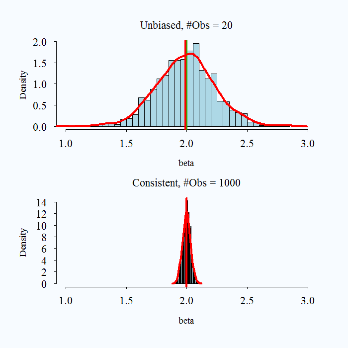
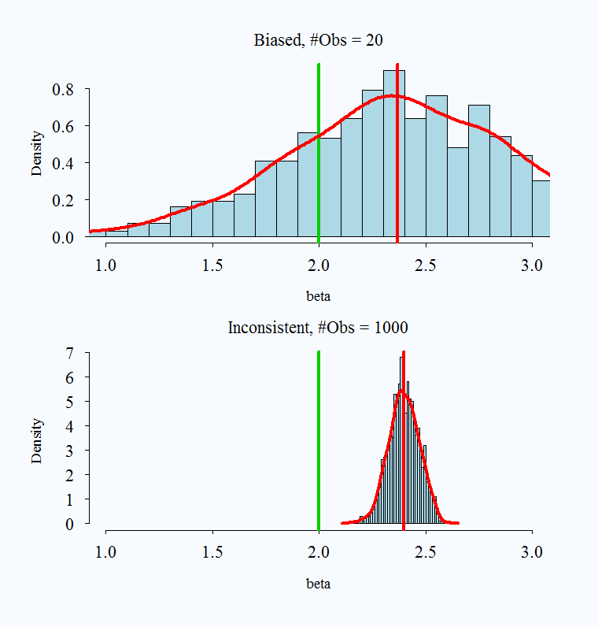

# Introduction to MLE {#mle}

This section will provide an overview of MLE. There are a few general connections we can make between the things we know (the linear least squares model) and the concepts introduced here.

  - Practical Uses: Going from nice continuous outcome data to outcome data generated differently
  - Estimation: Going from minimizing squared error to maximizing likelihood. 
      + Both involve optimization. In likelihood, we are trying to find the optimal values of parameters for a distribution given observed data.
  - Formulation: Going from Linear Model to Generalized Linear Model
  - Mechanics in R: Going from `lm()` to `glm()` and its friends.

The first sections will focus on drawing out these connections. We will then get into the details on the derivations for common methods. 

This video is an overview of some of the concepts we discuss. Don't worry about the mathematical details in the video. For a given model, we will go into greater depth in the future. Focus on the general concepts and process. The notes to follow in sections 5.1 and 5.2 elaborate on the concepts in the video.

```{r, echo=FALSE, warning=FALSE, message=FALSE}
library("vembedr")

embed_url("https://www.youtube.com/watch?v=jHCsPLDcWTM")
```

I also encourage you to watch this video from StatQuest to get an initial understanding of likelihood and what it means to "choose the maximum likelihood" using a visual example.

  - StatQuest [video](https://www.youtube.com/watch?v=XepXtl9YKwc)
  
These concepts are also addressed in: King, Gary. 1998. Unifying political methodology: The likelihood theory of statistical inference. University of Michigan Press. Note: Available as an electronic resource through the Rutgers library. Chapters 1, 2, 3, 4.6-4.8. (Available online through Rutgers University)


## What is likelihood?

Just like the derivation of the OLS coefficient estimators $\hat \beta$ for the $\beta$ parameters started with a goal (minimizing least squared errors) in describing the relationship between variables, with likelihood we also start with a goal.

The "***likelihood***" is going to ask the question: ***What values of the unknown parameters make the data we see least surprising?***

When we get into likelihood, we will be drawing more directly on concepts within probability. We start by making a choice about what type of data generating process best describes our outcome data. Eventually, our likelihood function represents the "probability density of the data given the parameters and predictors." (Definition taken from Gelman et al. 2020, pg. 105).

  - In MLE, we are going to choose parameter estimates $\widehat{\theta}$ for $\theta$ that maximize the likelihood that our data came from the particular distribution.

Already, we are placing a lot of emphasis on the nature of our outcome data. The nature of our likelihood will change depending on if the data are dichotomous (e.g, similar to a set of coin flips that could be head or tails) or a count (e.g., similar to the number of events expected to occur over a certain interval) or more of a continuous numeric distribution with (e.g., where the probabilities of certain levels can be visualized similar to a bell curve). Each of these sets of data are generated through a different process, which is described by a particular probability function.

*Example*

This introduction is based on Ben Lambert's video. I highly recommend watching this 8-9 minute [video](https://www.youtube.com/watch?v=I_dhPETvll8). Below we highlight a few of the key concepts and definitions. 

Take the UK population of 70 million. We have a sample of this, and in our sample some observations are male and some female. How can we use what we have, a sample, to estimate the probability that an individual is male?^[In the future, we may want to know the probability of turning out to vote, or of going to war, or voting "yes" on a particular policy question, etc.]

  - First, we can make a judgment about the data generating process. We can suppose there is some probability distribution function that determines the probability is a male or female. A probability density function (PDF for continuous data or PMF for discrete data) tells you the relative probability or likelihood of observing a particular value given the parameters of the distribution.
      + Let's call this $f(y_i | p)$ where $y_i = 1$ if male, 0 if female. 
      + We will say $p$ is the probability an individual is male. $p^{y_i}(1 - p)^{1-y_i}$
 
 - We are going to treat this like a toss of a coin, which has a Bernouilli distribution (every probability distribution we are dealing with is going to have an associated formula. You don't need to memorize these. You can look them up on the internet when needed.) So, $f()$ tells us the probability we would have gotten the value of the observation if we think of our observation as this Bernouilli toss of coin. This is the likelihood for a single observation.
 
  - For example, we can now plug this into our Bernoulli function for the two possible cases of values for $y_i$.
      + $f(1|p) = p^1(1-p)^{1-1} = p$  probability an individual is male
      + $f(0 |p) p ^0(1-p)^{1-0} = 1-p$ probability individual is female

  - Now we want an estimate using our entire sample of observations, not just a single $i$. What if we have $n$ observations? $f(y_1, y_2, ... y_n | p)$. We can write the joint probability as all individual probabilities multiplied together if we assume our observations are independent. This will now represent the likelihood for all observations. 
      + $L = P(Y_1 = y_1, Y_2=y_2, ..., Y_n = y_n)= \prod_{i=1}^n p^y_i(1 - p)^{1-y_i}$
      + This answers what is the probability that $Y_1$ took on the particular value $y_1$
      + Ok, now we have the statement $L = P(Y_1 = y_1, Y_2=y_2, ..., Y_n = y_n)$. This joint probability is the likelihood. 
  - Generally, we don't know $p$. We are trying to estimate it. ***What we want to do is choose the $\hat p$ to maximize the likelihood that we would have gotten this set of observations given that $Y_i$ has a probability distribution as specified.***
      + We have used a buzz word: "maximize." Just as in OLS, that should be our signal that a derivative should be taken so that we can find the quantities that represent the maximum.
      + We differentiate L with respect to p, set it to 0, to give us $\hat{p}$.
  - Our issue (or at least one of our issues) is that products are tough to differentiate. A chain rule disaster. Instead, we use a trick of taking the log of the likelihood: log $\prod ()$.^[Why does this work? It has to do with the shape of the log (always increasing). Details are beyond the scope.] Benefit: it turns it into a sum, much easier. $\log ab = \log a + \log b$. So we will actually differentiate the $\log$ of the likelihood. Yes, this is why we had logs as part of Section 3. 


### Summarizing Steps for Maximum Likelihood

Initial Setup

  1. What is the data generating process? This means think about the structure of the dependent variable. Is it continuous, is it a count, is it binary, is it ordered?  Based on this, describe the probability distribution for $Y_i$.
  2. Define the likelihood for a single observation
  3. Define the likelihood for all observations
  4. Find the log-likelihood

Then, the derivation begins! Yes, we've only just [begun](https://www.youtube.com/watch?v=uaqoQr-aCtQ), but that first step of deciding the data generating process is huge.

**Example: Count Data**

Let's say we are trying to understand the relationship between an independent variable and the number of news articles reported on a topic. This is a count of data. It goes from 0 to some positive number, never extending below 0. A distribution that is a good fit for this is the Poisson. We start by specifying this as our data generating process and looking up the Poisson probability density function, which has the parameter $\lambda$.

  1. Data Generating Process and probability density function.
  
\begin{align*}
&Y_i \stackrel{\rm i.i.d.}{\sim} Pois(\lambda)\Rightarrow\\
&\Pr(Y=Y_i|\lambda)=\lambda \frac{exp(-\lambda) \lambda^{Y_i}}{Y_i!}
\end{align*}

Note: we assume our observations are iid (independently and identically distributed (For [definition](http://www.statisticshowto.com/iid-statistics/}).) This assumption can be relaxed.

  2. What is the likelihood for a single observation?
  
\begin{align*}
\mathcal L(\lambda|Y_i)=\Pr(Y=Y_i|\lambda)
\end{align*}

  3.  What is the likelihood for all observations?
  
\begin{align*}
\mathcal L(\lambda|Y)&=\mathcal L(\lambda|Y_1)\times\mathcal  L(\lambda|Y_2)\times \ldots \times \mathcal L(\lambda|Y_{N})\\
\mathcal L(\lambda|Y)&=\prod_{i=1}^N\mathcal L(\lambda|Y_i)\\
\end{align*}

  4.  Easier to work with log-likelihood
  
\begin{align*}
\ell(\lambda|Y)&=\sum_{i=1}^N\mathcal \log(\mathcal L(\lambda|Y_i))\\
\end{align*}

Given observed data $Y$, what is the likelihood it was generated from $\lambda$? We will be choosing estimates of the parameters that maximize the likelihood we would have seen these data. Generally, we will also consider parameters like $\lambda$ to be functions of our covariates-- the things we think help explain our otucome.

For additonal practice, try to write down the likelihood of a single observation, the likelihood for all observations, and the log likelihood for an outcome we believe is normally distributed. We have $Y_i \sim N(\mu, \sigma^2)$. Our PDF is:

\begin{align*}
f(Y_i | \theta) &=  \frac{1}{\sigma\sqrt{2\pi}}e^{\frac{-(Y_i-\mu)^2}{2\sigma^2}}
\end{align*}

You can take it from here. 

<details> <summary>Try on your own, then expand for the solution.</summary>

We have the PDF.

  2. Let's write the likelihood for a single observation.

\begin{align*}
L(\theta | Y_i) = L(\mu, \sigma^2 | Y_i) &= \frac{1}{\sigma\sqrt{2\pi}}e^{\frac{-(Y_i-\mu)^2}{2\sigma^2}}
\end{align*}

  3. Let's write the likelihood for all observations.

\begin{align*}
L(\mu, \sigma^2 | Y) &=  \prod_{i=1}^{N} \frac{1}{\sigma\sqrt{2\pi}}e^{\frac{-(Y_i-\mu)^2}{2\sigma^2}}
\end{align*}

  4. Let's write the log likelihood.

\begin{align*}
\ell(\mu, \sigma^2 | Y) &= \sum_{i = 1}^N \log \Bigg( \frac{1}{\sigma\sqrt{2\pi}}e^{\frac{-(Y_i-\mu)^2}{2\sigma^2}}\Bigg)
= \sum_{i = 1}^N \log  \frac{1}{\sigma\sqrt{2\pi}} - \frac{(Y_i-\mu)^2}{2\sigma^2}\\
&= \sum_{i = 1}^N \log  \frac{1}{\sigma\sqrt{2\pi}} - \frac{(Y_i-x_i'\beta)^2}{2\sigma^2}
\end{align*}

Note how we usually will sub in $X\beta$ or $\mathbf{x_i'\beta}$ for the parameter because we think these will vary according to covariates in our data. 

</details>

## Generalized Linear Models

Before we get into the details of deriving the estimators, we are going to discuss another connection between linear models and the types of models we will work with when we are using common maximum likelihood estimators.

Recall our linear model: $y_i =  \beta_o + \beta_1x_{i1} + ... \beta_kx_{ik} + \epsilon$

  - $Y$ is modelled by a linear function of explanatory variables $X$
  - $\hat \beta$ is our estimate of how much $X$ influences $Y$ (the slope of the line)
  - On average, a one-unit change in $X_{ik}$ is associated with a $\hat \beta_{k}$ change in $Y_i$
  - Slope/rate of change is linear, does not depend on where you are in $X$. Every one-unit change has the same expected increase or decrease

Sometimes we are dealing with outcome data that are restricted or "limited" in some way such that this standard linear predictor will no longer make sense. If we keep changing $X$ we may eventually generate estimates of $\hat y$ that extend above or below the plausible range of values for our actual observed outcomes.

The generalized linear model framework helps address this problem by adding two components: a nonlinear transformation and a probability model. This allows us to make predictions of our outcomes that retain the desired bounded qualities of our observed data. Generalized linear models include linear regression as a special case (a case where no nonlinear transformation is required), but as its name suggests, is much more general and can be applied to many different outcome structures.

### GLM Model.

In a GLM, we still have a "linear predictor": $\eta_i = \beta_o + \beta_1x_{i1} + ... + \beta_kx_{ik}$

  - But our $Y_i$ might be restricted in some way (e.g., might be binary).
  - So, now we require a "link" function which tells us how $Y$ depends on the linear predictor. This is the key to making sure our linear predictor, when transformed, will map into sensible units of Y.
  
Our $Y_i$ will also now be expressed in terms of a probability model, and it is this probability distribution that generates the randomness (the stochastic component of the model). For example, when we have binary outcome data, such as $y_i =$ 1 or 0 for someone turning out to vote or not, we may try to estimate the probability that someone turns out to vote given certain explanatory variables. We can write this as $Pr(Y_i = 1 | x_i$).

In a GLM, we need a way to transform our linear predictor such that as we shift in values of $X\hat \beta$, we stay within plausible probability ranges. 

  - To do so we use a "link" function that is used to model the data.
      + For example, in logistic regression, our link function will be the "logit":
      
      \begin{align*}
Pr(Y_i = 1 | x_i) &= \pi_i\\
\eta_i &= \text{logit}(\pi_i) = \log \frac{\pi_i}{1-\pi_i} &= \beta_o + \beta_1x_{i1} + ... + \beta_kx_{ik}
\end{align*}

  - One practical implication of this is that when we generate our coefficient estimates $\hat \beta$, these will no longer be in units if $y_i$ or even in units of probability. Instead, they will be in units as specified by the link function. In logistic regression, this means they will be in "logits." 
    + For every one-unit change in $x_k$, we get a $\hat \beta_k$ change in **logits** of $y$
    
  - However, the nice thing is that because we know the link function, with a little bit of work, we can use the "response" function to transform our estimates back into the units of $y_i$ that we care about.

\begin{align*}
Pr(Y_i = 1 | x_i) &= \pi_i = g^{-1}(\eta_i) \\
&= \text{logit}^{-1}(\pi_i) \\
&= \frac{exp^{x_i'\beta}}{1 + exp^{x_i'\beta}}
\end{align*}
  
  
### Linking likelihood and the GLM

Let's use $\theta$ to represent the parameters of the pdf/pmf that we have deemed appropriate for our outcome data. As discussed before, we can write the likelihood for an observation as a probability statement. 

  - $\mathcal L (\theta | Y_i) = \Pr(Y=Y_i | \theta)$

In social science, instead of thinking of these parameters as just constants (e.g., $p$ or $\mu$), we generally believe that they vary according to our explanatory variables in $X$. We think $Y_i$ is distributed according to a particular probability function and that the parameters that shape that distribution are a function of the covariates.

  - $Y_i \sim f(y_i | \theta_i)$ and $\theta_i = g(X_i, \beta)$

Each type of model we come across--guided by the structure of the dependent variable-- is just going to have different formulas for each of these components. 

**Examples**

|Model | PDF | $\theta_i$ ; Link$^{-1}$ | $\eta_i$|  
|:-------|-------|---------|--------|------:|
|Linear  | $Y_i \sim \mathcal{N}(\mu_i,\sigma^2)$ | $\mu_i = X_i^\prime\beta$ | $\mu_i$|
|Logit   | $Y_i \sim \rm{Bernoulli}(\pi_i)$ | $\pi_i=\frac{\exp(X_i^\prime\beta)}{(1+\exp(X_i^\prime\beta))}$ | logit$(\pi_i)$|
|Probit  | $Y_i \sim \rm{Bernoulli}(\pi_i)$ | $\pi_i = \Phi(X_i^\prime\beta)$ | $\Phi^{-1}(\pi_i)$|

These generalized linear models are then fit through maximum likelihood estimation, through an approach discussed in the next section where we use algorithms to choose the most likely values of the $\beta$ parameters given the observed data.

Note: not all ML estimators can be written as generalized linear models, though many we use in political science are indeed GLMs. To be a GLM, the distribution we specify for the data generating process has to be a part of the exponential family of probability distributions (fortunately the gaussian normal, poisson, bernouilli, binomial, gamma, and negative binomial are), and after that, we need the linear predictor and link function.

### GLM in R

The way generalized linear models work in R is very similar to lm.

Below is a simple example where we will specify a linear model in `lm()` and `glm()` to compare.

```{r}
## Load Data
florida <- read.csv("https://raw.githubusercontent.com/ktmccabe/teachingdata/main/florida.csv")

fit.lm <- lm(Buchanan00 ~ Perot96, data=florida)
fit.glm <- glm(Buchanan00 ~ Perot96, data=florida, 
               family=gaussian(link = "identity"))
```

For the glm, we just need to tell R the family of distributions we are using and the appropriate link function. In this example, we are going to use the normal gaussian distribution to describe the data generating process for `Buchanan00`. This is appropriate for nice numeric continuous data, even if it isn't perfectly normal. The normal model has a link function, but it is the special case where the link function is just the identity. There is no nonlinear transformation that takes place. Therefore, we can still interpret the $\hat \beta$ results in units of $Y$ (votes in this case).

In this special case, the $\hat \beta$ estimates from `lm()` and `glm()` will be the same.

```{r}
coef(fit.lm)
coef(fit.glm)
```

There are some differences in the mechanics of how we get to the results in each case, but we will explore those more in the next section. I.e., these coefficients do not come out of thin air. Just like in OLS, we have to work for them.


## MLE Estimation 

This section will discuss the general process for deriving maximum likelihood estimators. It's all very exciting. It builds on the resources from the previous sections. In the next section, we will go through this process for a binary dependent variable. Here, we lay out the overview.

### Deriving Estimators 

Recall, we've already gone through a few steps of maximum likelihood estimation.

Initial Setup

  1. What is the data generating process? This means think about the structure of the dependent variable. Is it continuous, is it a count, is it binary, is it ordered?  Based on this, describe the probability distribution for $Y_i$.
  2. Define the likelihood for a single observation
  3. Define the likelihood for all observations
  4. Find the log-likelihood
  
Now we add steps building on the log-likelihood.

  5. Maximize the function with respect to (wrt) $\theta$
      + Take the derivative wrt $\theta$. We call this the "score"
      + Set $S(\theta) = 0$ and solve for $\hat \theta$ (if possible)
      + If not possible (often the case), we use an optimization algorithm to maximize the log likelihood.
  6. Take the second derivative of the log likelihood to get the "hessian" and help estimate the uncertainty of the estimates.
  

### Score function

The first derivative of the log-likelihood is called the score function: $\frac{\delta \ell}{\delta \theta} = S(\theta)$. This will tell us how steep the slope of the log likelihood is given certain values of the parameters. What we are looking for as we sift through possible values of the parameters, is the set of values that will make the slope zero, signalling that the function has reached a peak (maximizing the likelihood.)

We set the $S(\theta) = 0$ and solve for $\hat \theta$ (if possible).

  - $\hat \theta$ are the slopes/gradient, which we use as estimates (e.g., $\hat \beta$).
  - We can interpret the sign and significance just as we do in OLS.
  - But, unlike OLS, most of the time, these are not linear changes in units of $Y$
  - We have to transform them into interpretable quantities


**Example: Normally distributed outcome**


Start with the log-likelihood

\begin{align*}
\ell(\theta | Y) &= \sum_{i = 1}^N \log \Bigg( \frac{1}{\sigma\sqrt{2\pi}}e^{\frac{-(Y_i-\mu)^2}{2\sigma^2}}\Bigg)
= \sum_{i = 1}^N \log  \frac{1}{\sigma\sqrt{2\pi}} - \frac{(Y_i-\mu)^2}{2\sigma^2}\\
&= \sum_{i = 1}^N \log  \frac{1}{\sigma\sqrt{2\pi}} - \frac{(Y_i-x_i'\beta)^2}{2\sigma^2}
\end{align*}

Take the derivative wrt $\theta$. Note: we have to take two derivatives- one for $\mu$ ($\beta$) and one for $\sigma^2$. For this example we will focus only on the derivative wrt to $\beta$, as that it what gets us the coefficient estimates.^[Essentially, you need to take derivatives with respect to each of the parameters. Some models we use will have only one parameter, which is easier.]

\begin{align*}
\delta \ell(\theta | Y) &= -\frac{1}{2\sigma^2}\sum_{i = 1}^N \delta (Y_i-x_i'\hat \beta)^2
\end{align*}
The right term should look familar! We will end up with a $S(\hat \theta)_\beta = \frac{1}{\sigma^2}X'(Y - X\hat \beta)$. We set this equal to 0.
\begin{align*}
\frac{1}{\sigma^2}X'(Y - X\hat \beta) &= 0\\
\frac{1}{\sigma^2}X'Y &= \frac{1}{\sigma^2}X'X\hat \beta \\
(X'X)^{-1}X'Y = \hat \beta
\end{align*}


### Hessian and Information Matrix

The second derivative of the log-likelihood is the Hessian $(H(\theta))$. 

  - The second derivative is a measure of the curvature of the likelihood function. This will help us confirm that we are at a maximum, and it will also help us calculate the uncertainty.
  - The more curved (i.e., the steeper the curve), the more certainty we have.
  - The $I$ stands for the information matrix. The $H$ stands for Hessian. $I(\theta) = - \mathbb{E}(H)$
      + $var(\theta) = [I(\theta)]^{-1} = ( - \mathbb{E}(H))^{-1}$
      + Standard errors are the square roots of the diagonals of this $k \times k$ matrix (like  `vcov()` in OLS)

***Example: Normal***

Start with the log-likelihood

\begin{align*}
\ell(\theta | Y) &= \sum_{i = 1}^N \log  \frac{1}{\sigma\sqrt{2\pi}} - \frac{(Y_i-x_i'\beta)^2}{2\sigma^2}
\end{align*}

Because our $\theta$ has two parameters, the Hessian actually has four components. For this example, we will focus on one: the first and second derivatives wrt $\beta$. 

  - Recall the first derivative = $\frac{1}{\sigma^2}X'(Y - X\hat \beta)$. 
  - We now take the second derivative with respect to $\hat \beta$
    
    \begin{align*}
    \frac{\delta^2}{\delta \hat \beta} \frac{1}{\sigma^2}X'(Y - X\hat \beta)&= -\frac{1}{\sigma^2}X'X
    \end{align*}
  - To get our variance, we take the inverse of the negative (-) of this: 
      + $\sigma^2(X'X)^{-1}$ Should look familiar!

With this example, we can start to see why `lm` and `glm` for a normally distributed outcome generate the same estimates. The maximum likelihood estimator is the same as the least squares estimator.


### MLE Estimation Algorithm

Suppose we are interested in finding the true probability $p$ that a comment made on twitter is toxic, and we have a small sample of hand-coded data. Let's say we have $n=8$ observations where we could observe a $y_i = 1$ or $0$. For example, let's say we read an online sample of tweets and we classified tweets as "toxic=1" or "nontoxic=0." In our sample of $n=8$, we coded 6 of them as toxic and 2 as nontoxic. 

{width=40%}

We can write down the likelihood for a single observation using the Bernouilli pmf:

$L(p | y_i) = p^{y_i}*(1-p)^{(1-y_i)}$

We could then write out the likelihood for all 8 observations as follows:
  
  - Where the equation simplifies to $p$ for observations where $y_i$ = 1 and (1-p) for observations where $y_i$ = 0. For simplicity, let's say $i=1$ to $6$ were toxic, and $i=7$ to $8$ were nontoxic.
  - $L(p | \mathbf{y}) = p * p * p * p * p * p * (1-p) * (1-p)$

Now a naive way to maximize the likelihood would be to just try out different quantities for $p$ and see which give us the maximum.

```{r}
## Let's try this for different p's
p <- seq(.1, .9, .05)
L <- p * p * p * p * p * p * (1-p) * (1-p)
```

We can then visualize the likelihood results and figure out about at which value for $\hat p$ we have maximized the likelihood.
```{r}
plot(x=p, y=L, type="b",
     xaxt="n")
axis(1, p, p)
```


When we have more complicated models, we are taking a similar approach--trying out different values and comparing the likelihood (or log likelihood), but we will rely on a specific algorithm(s) that will help us get to the maximum a bit faster than a naive search would allow.

Don't worry the built-in functions in R will do this for you (e.g., what happens under the hood of `glm()`), but if you were to need to develop your own custom likelihood function for some reason, you could directly solve it through an optimization algorithm if no such built-in function is appropriate.

***You can skip the details below if you wish. They will only be involved in problem sets as extra credit***

The `optim` function in R provides one such approach. For this optimization approach, we will need to.

  - Derive the likelihood and/or log likelihood function and score
  - Create an R `function` for the quantity to want to optimize (often the log likelihood) where given we provide the function certain values, the function returns the resulting quantity. (Kind of like when we supply the function `mean()` with a set of values, it returns the average of the values by computing the average under the hood of the function.)
  - Use `optim()` to maximize 
      + `optim(par, fn, ..., gr, method, control, hessian,...)`, where
      + `par`: initial values of the parameters
      + `fn`: function to be maximized (minimized) 
      + `gr`: optional argument, can include the gradient to help with optimization
      + `...`: (specify other variables in `fn`)
      + `method`: optimization algorithm 
      + `control`: parameters to fine-tune optimization 
      + `hessian`: returns the Hessian matrix if `TRUE`

By default, `optim` performs minimization. Make sure to set `control = list(fnscale=-1)` for maximization

  - For starting values `par`, least squares estimates are often used. More sensible starting values help your optimize more quickly. You may need to adjust the `maxit` control parameter to make sure the optimization converges. 
  - A commonly used `method` is `BFGS` (a variant of Newton-Raphson), similar to what `glm()` uses, but there are other methods available.

***Example 1: p***

Let's take our relatively simple example about toxic tweets above and optimize the likelihood. First, we create a function for the likelihood that will calculate the likelihood for the values supplied. In the future, our models will be complicated enough, we will stick with the log likelihood, which allows us to take a sum instead of a product.

One benefit of R is that you can write your own functions, just like `mean()` is a built-in function in R. For more information on writing functions, you can review Imai [QSS Chapter 1 pg. 19.](https://assets.press.princeton.edu/chapters/s11025.pdf). 

```{r}
lik.p <- function(p){
  lh <- p * p * p * p * p * p * (1-p) * (1-p)
  return(lh)
}
```

Ok, now that we have our likelihood function, we can optimize. We just have to tell R a starting parameter for $\hat p$. Let's give it a (relatively) bad one just to show how it works (i.e., can `optim` find the sensible .75 value. If you give the function too bad of a value, it might not converge before it maxes out and instead return a local min/max instead of a global one.

```{r}
startphat <- .25
opt.fit <- optim(par = startphat, fn=lik.p, method="BFGS",
                 control=list(fnscale=-1))

## This should match our plot
opt.fit$par

## you should check convergence. Want this to be 0 to make sure it converged
opt.fit$convergence
```

***Example 2: Linear Model***

We can use `optim` to find a solution for a linear model by supplying R with our log likelihood function.

For the MLE of the normal linear model, our log likelihood equation is:

\begin{align*}
\ell(\theta | Y) &= \sum_{i = 1}^N \log  \frac{1}{\sigma\sqrt{2\pi}} - \frac{(Y_i-\mathbf{x}_i'\beta)^2}{2\sigma^2}
\end{align*}

  - Note: when you see $\mathbf{x}_i'\beta$, usually that is the representation of the multiplication of $k$ covariates (a $1 \times k$ vector) for a particular observation $i$ by $k \times 1$ coefficient values $\beta$. You can contrast this with $X\beta$, which represents $n \times k$ rows of observations with $k$ covariates multiplied by the $k \times 1$ coefficients. You will see both notations depending on if notation is indexed by $i$ or represented fully in matrix form.

Now that we have our log likelihood, we can write a function that for a given set of $\hat \beta$ and $\hat \sigma^2$ parameter values, $X$, and $Y$, it will return the log likelihood.

  - Below we indicate we will supply an argument `par` (an arbitrary name) that will inclue our estimates for the parameters: $k$ values for the set of $\hat \beta$ estimates and a $k + 1$ value for the $\hat \sigma^2$ estimate. Many models with only have one set of parameters. This is actually a slightly more tricky example.
  - The `lt` line is the translation of the equation above into R code

```{r}
## Log Likelihood function for the normal model
l_lm <- function(par, Y, X){
  k <- ncol(X)
  beta <- par[1:k]
  sigma2 <- par[(k+1)]
  lt <- sum(log(1/(sqrt(sigma2)*sqrt(2*pi))) - ((Y - X %*% beta)^2/(2*sigma2)))
  return(lt)
}
```


Now that we have our function, we can apply it to a problem.

Let's use an example with a sample of Democrats from the 2016 American National Election Study dataset. This example is based on the article "Hostile Sexism, Racial Resentment, and Political Mobilization" by Kevin K. Banda and Erin C. Cassese published in *Political Behavior* in 2020. We are not replicating their article precisely, but we use similar data and study similar relationships.

The researchers were interested in how cross-pressures influence the political participation of different partisan groups. In particular, they hypothesized that Democrats in the U.S. who held more sexist views would be demobilized from political participation in 2016, a year in which Hillary Clinton ran for the presidency. 

The data we are using are available [anesdems.csv](https://github.com/ktmccabe/teachingdata) and represent a subset of the data for Democrats (including people who lean toward the Democratic party). We have a few variables of interest

  - `participation`: a 0 to 8 variable indicating the extent of a respondent's political participation
  - `female`: a 0 or 1 variable indicating if the respondent is female
  - `edu`: a numeric variable indicating a respondent's education level
  - `age`: a numeric variable indicating a respondent's age.
  - `sexism`: a numeric variable indicating a respondent's score on a battery of questions designed to assess hostile sexism, where higher values indicate more hostile sexism.
  
Let's regress participation on these variables and estimate it using OLS, GLM, and `optim`. Note, OLS and GLM fit through their functions in R will automatically drop any observations that have missing data on these variables. To make it comparable with `optim`, we will manually eliminate missing data.

```{r, message=FALSE, warning=FALSE}
anes <- read.csv("https://raw.githubusercontent.com/ktmccabe/teachingdata/main/anesdems.csv")
## choose variables we will use
anes <- subset(anes, select=c("participation", "age", "edu", "sexism", "female"))
## omit observations with missing data on these variables
anes <- na.omit(anes)

## OLS and GLM regression
fit <- lm(participation ~ female + edu + age + sexism, data=anes)
fit.glm <- glm(participation ~ female + edu + age + sexism, data=anes,
               family=gaussian(link="identity"))
```

Now we will build our data for `optim`. We need $X$, $Y$, and a set of starting $\hat \beta$ and $\hat \sigma^2$ values.

```{r, warning=FALSE, message=FALSE}
## X and Y data
X.anes <- model.matrix(fit)
Y.anes <- as.matrix(anes$participation)
## make sure dimensions are the same
nrow(X.anes)
nrow(Y.anes)

## Pick starting values for parameters
startbetas <- coef(fit)
## Recall our estimate for sigma-squared based on the residuals
k <- ncol(X.anes)
startsigma <- sum(fit$residuals^2) / (nrow(X.anes) - k )
startpar <- c(startbetas, startsigma)

## Fit model
## But let's make it harder on the optimization by providing arbitrary starting values
## (normally you wouldn't do this)
startpar <- c(1,1,1,1,1,1)
opt.fit <- optim(par = startpar, fn=l_lm, X = X.anes,
                 Y=Y.anes, method="BFGS",
                 control=list(fnscale=-1),
                   hessian=TRUE)
```
We can compare this optimization approach to the output in `glm()`.

We can first compare the log likelihoods
```{r}
logLik(fit.glm)
opt.fit$value
```

We can compare the coefficients.
```{r, results="hold"}
## Coefficients
round(coef(fit), digits=4)
round(coef(fit.glm), digits=4)
round(opt.fit$par, digits=4)[1:k]
```

We can add the gradient of the log likelihood to help improve optimization. This requires specifying the first derivative (the score) of the parameters. Unfortunately this means taking the derivative of that ugly normal log likelihood above. Again, with the normal model, we have two scores because of $\hat \beta$ and $\hat \sigma^2$. For others, we may just have one.

```{r, warning=FALSE, message=FALSE}
## first derivative function
score_lm <- function(par, Y, X){
  k <- ncol(X)
  beta <- as.matrix(par[1:k])
  scorebeta <- (1/par[k+1]) * (t(X) %*% (Y - X %*% beta))
  scoresigma <- -nrow(X)/(par[k+1]*2) + sum((Y - X %*% beta)^2)/(2 * par[k+1]^2)
  return(c(scorebeta, scoresigma))
}

## Fit model
opt.fit <- optim(par = startpar, fn=l_lm, gr=score_lm, X = X.anes,
                 Y=Y.anes, method="BFGS",
                 control=list(fnscale=-1),
                   hessian=TRUE)
```

In addition to using `optim`, we can program our own Newton-Raphson algorithm, which is a method that continually updates the coefficient estimates $\hat \beta$ until it converges on a set of estimates. We will see this in a future section. The general algorithm involves the components we've seen before: values for $\hat \beta$, the score, and the Hessian.

  -  Newton-Raphson: $\hat \beta_{new} = \hat \beta_{old} - H(\beta_{old})^{-1}S(\hat \beta_{old})$


## MLE Properties

Just like OLS had certain properties (BLUE) that made it worthwhile, models using MLE also have desirable features under certain assumptions and regularity conditions.

Large sample properties

  - MLE is consistent: $p\lim \hat \theta^{ML} = \theta$
  - It is also asymptotically normal: $\hat \theta^{ML} \sim N(\theta, [I(\theta)]^{-1})$
      + This will allow us to use the normal approximation to calculate z-scores and p-values
  - And it is asymptotically efficient. "In other words, compared to any other consistent and uniformly asymptotically Normal estimator, the ML estimator has a smaller asymptotic variance" (King 1998, 80).


***Note on consistency***

What does it mean to say an estimator is consistent? As samples get larger and larger, we converge to the truth.

Consistency: $p\lim \hat{\theta} =\beta$ As $n \rightarrow \infty P(\hat{\theta} - \theta> e) \rightarrow 0$.

  - Convergence in probability: the probability that the absolute difference between the estimate and parameter being larger than $e$ goes to zero as $n$ gets bigger. 

Note that bias and consistency are different: Consistency means that as the sample size ($n$) gets large the estimate gets closer to the true value. Unbiasedness is not affected by sample size. An estimate is unbiased if over repeated samples, its expected value (average) is the true parameter.

It is possible for an estimator to be unbiased and consistent, biased and not consistent, or consistent yet biased.

{width=40%}; {width=40%}

{width=40%}

Images taken from [here](https://eranraviv.com/bias-vs-consistency/)

What is a practical takeaway from this? The desirable properties of MLE kick in with larger samples. When you have a very small sample, you might use caution with your estimates.


***No Free Lunch***

We have hinted at some of the assumptions required, but below we can state them more formally.
  
  - First, we assume a particular data generating process: the probability model.
  - We are generally assuming that observations are independent and identically distributed (allowing us to write the likelihood as a product)-- unless we explicitly write the likelihood in a way that takes this into account.
      + When we have complicated structures to our data, this assumption may be violated, such as data that is clustered in particular hierarchical entities.
  - We assume the model (i.e., the choice of covariates and how they are modeled) is correctly specified. (e.g., no omitted variables.)
  - We have to meet certain technical regularity conditions--meaning that our problem is a "regular" one. These, in the words of Gary King are "obviously quite technical" (1998, 75). We will not get into the details, but you can see pg. 75 of *Unifying Political Methodology* for the formal mathematical statements. In short, our paramaters have to be [identifiable](https://en.wikipedia.org/wiki/Identifiability) and within the parameter space of possible values (this identifiability can be violated, for example, when we have too many parameters relative to the number of observations in the sample), we have to be able to differentiate the log-likelihood (in fact, it needs to be twice continuously differentiable) along the support (the range of values) in the data. The information matrix, which we get through the second derivative, must be positive definite and finitely bounded. This helps us know we are at a maximum, and the maximum exists and is finite. You can visualize this as a smooth function, that is not too sharp (which would make it non differentiable), but has a peak (a maximum) that we can identify.


### Hypothesis Tests

We can apply the same hypothesis testing framework to our estimates here as we did in linear regression. First, we can standardize our coefficient estimates by dividing them by the standard error. This will generate a "z score." Just like when we had the t value in OLS, we can use the z score to calculate the p-value and make assessments about the null hypothesis that a given $\hat \beta_k$ = 0.

\begin{align*}
z &= \frac{\hat \theta_k}{\sqrt{Var(\hat \theta)_k}} \sim N(0,1)
\end{align*}

Note: to get p-values, we typically now use, `2 * pnorm(abs(z), lower.tail=F)` instead of `pt()` and our critical values are based on `qnorm()` instead of `qt()`. R will follow the same in most circumstances. In large samples, these converge to the same quantities.


### Model Output in R

As discussed, we can fit a GLM in R using the `glm` function: 

  - `glm(formula, data, family = XXX(link = "XXX", ...), ...)`
      + `formula`: The model written in the form similar to `lm()`
      + `data`: Data frame
      + `family`: Name of PDF for $Y_i$ (e.g. `binomial`, `gaussian`)
      + `link`: Name of the link function (e.g. `logit`, ``probit`, `identity`, `log`)


```{r}
## Load Data
fit.glm <- glm(participation ~ female + edu + age + sexism, data=anes,
               family=gaussian(link="identity"))
```


We've already discussed the coefficient output. Like `lm()`, GLM wiil also display the standard errors, z-scores / t-statistics, and p-values of the model in the model summary.

```{r}
summary(fit.glm)$coefficients
```

For this example, R reverts to the t-value instead of the z-score given that we are using the linear model. In other examples, you may see `z` in place of `t`. There are only small differences in these approximations because as your sample size gets larger, the degrees of freedom (used in the calculation of p-calues for the t distribution) are big enough that the t distribution converges to the normal distribution.


**Goodness of fit**

The `glm()` model has a lot of summary output.

```{r}
summary(fit.glm)
```

Some of the output represents measures of the goodness of fit of the model. However, their values are not directly interpretable from a single model.

  - Larger (less negative) likelihood, the better the model fits the data. (`logLik(mod)`). The becomes relavent when comparing two or more models.
  - Deviance is calculated from the likelihood. A measure of discrepancy between observed and fitted values. (Smaller values, better fit)
      + Null deviance: how well the outcome is predicted by a model that includes only the intercept. ($df = n - 1$)
      + Residual deviance: how well the outcome is predicted by a model with our parameters. ($df = n-k$)
  - AIC- used for model comparison. Smaller values indicate a more parsimonious model. Accounts for the number of parameters ($K$) in the model (like Adjusted R-squared, but without the ease of interpretation). Sometimes used as a criteria in prediction exercises (using a model on training data to predict test data).


**Likelihood Ratio Test**

The likelihood ratio test compares the fit of two models, with the null hypothesis being that the full model does not add more explanatory power to the reduced model. Note: You should only compare models if they have the same number of observations. 

```{r}
fit.glm2 <- glm(participation ~ female + edu + age + sexism, data=anes,
               family=gaussian(link="identity"))

fit.glm1 <- glm(participation ~ female + edu + age, data=anes, 
               family=gaussian(link = "identity"))
               
anova(fit.glm1, fit.glm2, test = "Chisq") #  reject the null
```


**Pseudo-R-squared**

We don't have an exact equivalent to the R-squared in OLS, but people have developed "pseudo" measures.

Example: McFadden's R-squared

  - $PR^2 = 1 - \frac{\ell(M)}{\ell(N)}$
      + where $\ell(M)$ is the log-likelihood for your fitted model and $\ell(N)$ is the log-likelihood for a model with only the intercept
  - Recall, greater (less negative) values of the log-likelihood indicate better fit
  - McFadden's values range from 0 to close to 1


```{r}
# install.packages("pscl")
library(pscl)
fit.glm.null <- glm(participation ~ 1, anes, family = gaussian(link = "identity"))
pr <- pR2(fit.glm1)
pr["McFadden"]

## Or, by hand:
1 - (logLik(fit.glm1)/logLik(fit.glm.null))
```


