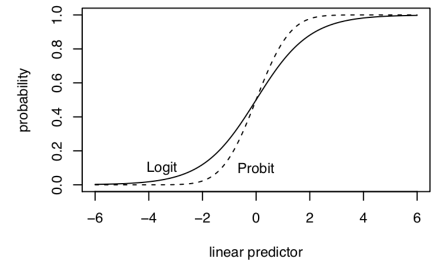
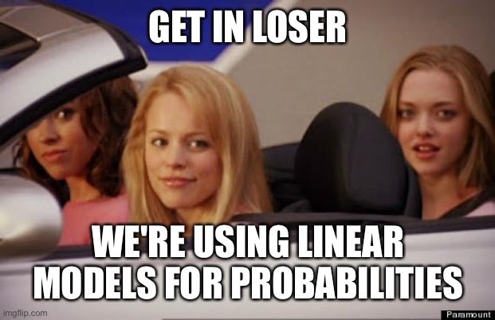

# Binary Dependent Variables {#binary}


In this section, we review models specifically designed for estimating the relationships between our independent variables and a dichotomous dependent variable. This is where "logit" and "probit" regression models become relevant.

**Resources**

These concepts are discussed in King, Gary. 1998. *Unifying political methodology: The likelihood theory of statistical inference.* University of Michigan Press.  5.1-5.3 
(available through Rutgers online library)

The 2020 Gelman et al. book referenced in the syllabus also has a chapter devoted to logistic regression.

Key limitations of OLS in the binary case are discussed [here](https://www.dummies.com/education/economics/econometrics/3-main-linear-probability-model-lpm-problems/), and will be referenced at the end of the section.


## Data Generating Process

Let's say $Y_i$ is a set of 0's and 1's for whether two states have experienced a dispute, an outcome common in IR studies.

\begin{gather*}
Y_i = \begin{cases}1, \;\text{a dispute happened}\\ 0,\;
\text{a dispute did not happen}\end{cases}
\end{gather*}

  - Outside of political science, for example, in the field of higher education, we might instead think about an outcome related to whether a student has (= 1) or has not (= 0) had a negative advising experience.


```{r, eval=F}
# Example of first 20 observations (Y1, Y2, ..., Y20)
1 0 1 0 0 0 0 0 0 0 0 0 0 0 0 0 0 0 0 1
```

We need to align these data with a data generating process and distribution.

  - For each $Y_i$, it is like a single trial, where you have a dispute with some probability $(\pi)$
      + This sounds like the Bernoulli distribution! $Y_i \sim Bernouli(\pi)$

### MLE Estimation

Let's do the steps we saw in the previous section.

  1. ***What is the data generating process?***  Based on this, describe the probability distribution for $Y_i$.
      + Note: if you are using a function like `glm()` you can proceed directly there after this step. However, let's work under the hood for a bit.
      
      \begin{align*}
Y_i \sim f(Y_i | \pi) &= Pr(Y_i = y_i |\pi_i) = \underbrace{\pi^{y_i}(1 -\pi)^{(1-y_i)}}_\text{pmf for Bernoulli}
\end{align*}
for $y = 0,1$

  2. ***Define the likelihood for a single observation***
  3. ***Define the likelihood for all observations***
  4. ***Find the log-likelihood***
  
  \begin{align*}
\mathcal L( \pi | Y_i) &= \underbrace{\pi^{y_i}(1 -\pi)^{(1-y_i)}}_\text{Likelihood for single observation}\\
\mathcal L( \pi | Y) &= \underbrace{\prod_{i=1}^n\pi^{y_i}(1 -\pi)^{(1-y_i)}}_\text{Likelihood for all observations}\\
\ell( \pi | Y) &= \underbrace{\sum_{i=1}^n\log \pi^{y_i}(1 -\pi)^{(1-y_i)}}_\text{Log likelihood}\\
\hat \pi &= \text{Next step: arg max } \ell( \pi | Y) \text{ wrt $\pi$}
\end{align*}

***Add step: nonlinear transformation to $X\beta$***
  
  - Note that because we are likely using covariates, we need to express our parameter as a function of $X\beta$. Why? Because we don't think there is a constant probability for a dispute. Instead, we think the probability of a dispute varies according to different independent variables, which are included in the $X$ matrix and everntually will each have their own $\beta_k$ relationship with the probability of dispute.
      + Now that we are outside of linear territory, we cannot just simply replace $\pi$ with $X\beta$ in the equation. Instead, $\pi$ is a function of $X\beta$. $\pi = g(X_i, \beta) \neq \mathbf{x}_i'\beta$
  - This is because we need a transformation, such as the logit or probit to map our linear predictor into the outcome to make sure the linear predictor can be transformed back into sensible units of the outcome. The logit is one variety, as is the probit. Like two roads diverged in a yellow wood, this is the point in the process where we choose the transformation. For this first example, let's apply a logit transformation, which restricts our estimates to between 0 and 1 (a good thing for probability!) where:

  - $\pi_i = \text{logit}^{-1}(\eta_i) = \frac{exp^{\eta_i}}{1 + exp^{\eta_i}} = \frac{exp^{\mathbf{x}_i'\beta}}{1 + exp^{\mathbf{x}_i'\beta}}$
  - $\eta_i = \text{logit}(\pi_i)   = \log\frac{\pi_i}{1-\pi_i} = \mathbf{x}_i'\beta$


  5. ***Maximize the function with respect to (wrt) $\theta$***

Where $\pi_i = \frac{exp^{\mathbf{x}_i'\beta}}{1 + exp^{\mathbf{x}_i'\beta}}$

\begin{align*}
\hat \pi &= \text{arg max } \ell( \pi | Y) \text{ wrt $\pi$} \\
&= \text{arg max} \sum_{i=1}^n\log \pi_i^{y_i}(1 -\pi_i)^{(1-y_i)}\\
&= \text{arg max} \sum_{i=1}^n \underbrace{y_i \log \Big( \frac{exp^{\mathbf{x}_i'\beta}}{1 + exp^{\mathbf{x}_i'\beta}}\Big) + (1-y_i)\log \Big(1-\frac{exp^{\mathbf{x}_i'\beta}}{1 + exp^{\mathbf{x}_i'\beta}}\Big)}_\text{We replaced $\pi_i$ and used the rule $\log a^b = b \log a$ to bring down the $y_i$ terms.}
\end{align*}

At this point, we take the derivative with respect to $\beta$. You can try this on your own, and, if you're lucky, it may show up on a problem set near you. With a bit of work, we should get something that looks like the below, which we can represent in terms of a sum or in matrix notation.

\begin{align*}
S(\theta) &=  \sum_{i=1}^n (Y_i - \pi_i)\mathbf{x}^T_i\\
&= X^T(Y - \mathbf{\pi})
\end{align*}

*You can note that the matrix notation retains the dimensions $k \times 1$, which we would expect because we want to choose a set of $k$ coefficients in our $k \times 1$ vector $\beta$. The score, as written in summation notation, also has length $k$ but here, we use a convention as writing $\mathbf{x}_i'$ in row vector representation instead of a column vector. You could instead represent this as multiplied by $\mathbf{x}_i$, which would give us the $k \times 1$ dimensions. Either way we have $k$ coefficients. These are just different notations.* 

  6. Take the second derivative of the log likelihood to get the "hessian" and help estimate the uncertainty of the estimates. Again, we can represent this as a sum or in matrix notation, which might be easier when translating this into R code where our data is more naturally inside a matrix.
  

\begin{align*}
H(\theta) &=  - \sum_{i=1}^n \mathbf{x}_i\mathbf{x}^T_i(\pi_i)(1 - \pi_i)\\
&= -X^TVX
\end{align*}
 where $V$  is  $n \times n$ diagonal matrix with weights that are the ith element of  $(\pi)(1 - \pi)$

Once we have these quantities, we can optimize the function with an algorithm or go to `glm` in R, which will do that for us.

## R code for fitting logistic regression

We can fit logistic regressions in R through `glm()`. Let's build on the ANES example from section 5.3 and analyze a dichotomized measure of participation where 1=participated in at least some form and 0=did not participate.

```{r}
anes <- read.csv("https://raw.githubusercontent.com/ktmccabe/teachingdata/main/anesdems.csv")
anes$partbinary <- ifelse(anes$participation > 0, 1, 0)
```

We can then fit using `glm` where `family = binomial(link="logit")`

```{r}
out.logit <- glm(partbinary ~ female + edu + age + sexism, data=anes,
                 family = binomial(link="logit"))
```

The summary output includes the logit coefficients, standard errors, z-scores, and p-values.

```{r}
summary(out.logit)
```


### Writing down the regression model

In the articles you write, you will describe the methods you use in detail, including the variables in the model and the type of regression (e.g., logistic regression). Sometimes you may want to go a step further and be very explicit about the model that you ran. We've already seen the regression equations for linear models. For the GLMs, they will look very similar, but we need to make the link/response function an explicit part of the equation.

For example, for logistic regression we have a few ways of writing it, including:

  - $\log \frac{\pi_i}{1-\pi_i} = \mathbf{x_i'}\beta$, or alternatively
  - $Pr(Y_i = 1 | \mathbf{x}_i) = logit^{-1}(\mathbf{x}_i'\beta) = \frac{exp(\mathbf{x_i'}\beta)}{(1 + exp(\mathbf{x_i'}\beta)}$

(You can also write out the individual variable names.) There is a new R package [equatiomatic](https://github.com/datalorax/equatiomatic) that can also be used to help write the equations from regression models. It's not perfect, but should get you there for most basic models.
```{r, results="asis"}
## First time, you need to install one of these
#remotes::install_github("datalorax/equatiomatic")
#install.packages("equatiomatic")

## Each time after, run library
library(equatiomatic)

## Will output in latex code, though see package for details on options
extract_eq(out.logit, wrap = TRUE, terms_per_line = 3)
```


## Probit Regression

Probit regression is very similar to logit except we use a different link function to map the linear predictor into the outcome. Both the logit and probit links are suitable for binary outcomes with a Bernoulli distribution. If we apply a probit transformation, this also restricts our estimates to between 0 and 1.

  - $\pi_i = Pr(Y_i = 1| X_i) = \Phi(\pi_i)$
  - $\eta_i = \Phi^{-1}(\pi_i)  =  x_i'\beta$

Here, our coefficients $\hat \beta$ represent changes in "probits" or changes "z-score" units. We use the Normal CDF ($\Phi()$) aka `pnorm()` in R to transform them back into probabilities, specifically, the probability that $Y_i$ is 1.

Let's fit our binary model with probit. We just need to change the link function.

We can then fit using `glm` where `family = binomial(link="probit")`

```{r}
out.probit <- glm(partbinary ~ female + edu + age + sexism, data=anes,
                 family = binomial(link="probit"))
```

Let's apply the equation tool to this:

```{r, results="asis", message=FALSE}
## Each time after, run library
library(equatiomatic)

## Will output in latex code, though see package for details on options
extract_eq(out.probit, wrap = TRUE, terms_per_line = 3)
```


The summary output includes the probit coefficients, standard errors, z-scores, and p-values.

```{r}
summary(out.probit)
```

We can interepret the sign and significance of the coefficients similarly to OLS. They just aren't in units of $Y$. In the section next week, we will discuss in detail how to generate quantities of interest from this output.

## To logit or to probit?

Both approaches produce a monotonically increasing S-curve in probability between 0 and 1, which vary according to the linear predictor ($\mathbf{x_i}^T\beta$). In this way, either approach satisfies the need to keep our estimates, when transformed, within the plausible range of $Y$.

{width=50%}
*Image from Kosuke Imai.*

  - Both also start with $Y_i$ as bernoulli
  - Both produce the same function of the log-likelihood BUT define $\pi_i$ and link function differently
  - Results--in terms of sign and significance of coefficients-- are very similar
      + Logit coefficients are roughly 1.6*probit coefficients
  - Results--in terms of predicted probabilities-- are very similar
      + Exception-- at extreme probabilities-- Logit has "thicker tails", gets to 0 and 1 more slowly
  - Sometimes useful--Logit can also be transformed into "odds ratios"
  - By convention, logit slightly more typically used in political science but easy enough to find examples of either
  
  
***Note on Odds Ratios in Logistic Regression***

Coefficients are in "logits" or changes in "log-odds" ($\log \frac{\pi_i}{1 - \pi}$). Some disciplines like to report "odds ratios"

  - Odds ratio: $\frac{\pi_i(x1)/(1 - \pi(x1))}{\pi_i(x0)/(1 - \pi(x0))}$  (at a value of x1 vs. x0)
      + If $\log \frac{\pi_i}{1 - \pi} = logodds$; $\exp(logodds) = \frac{\pi_i}{1 - \pi}$
      + Therefore, if we exponentiate our coefficients, this represents an odds ratio: the odds of $Y_i = 1$ increase by a factor of ($\exp(\hat \beta_k)$) due to 1-unit change in X


```{r}
## odds ratio for the 4th coefficient
exp(coef(out.logit)[4])

## CI for odds ratios
exp(confint(out.logit)[4, ])
```

In political science, we usually opt to present predicted probabilities instead of odds ratios, but ultimately you should do whatever you think is best.
  

## Latent propensity representation

Sometimes you will see the binary outcome problem represented as a latent propensity where $Y^*_i$ is a continuous variable that represents an unobserved propensity (e.g., to have a dispute, to be a toxic tweet, to participate), where

\begin{gather*}
Y_i = \begin{cases}1, \; y^*_i > \tau \\ 0,\; 
y^*_i \leq \tau \end{cases}
\end{gather*} 

and $\tau$ is some threshold after which a the event (e.g., dispute) occurs.

This becomes particularly relevant when the goal is to classify outcome estimates given certain $X$ features. This type of threshold will also be relevant when we move into ordinal outcome variables where we want to estimate the probability an outcome belongs to a specific category.

## Linear Probability Models

People (who me? yes, I admit, me) will sometimes still use a linear OLS model when we have dichotomous outcomes. In that case, we interpret the results as a "linear probability model" where a one-unit change in $x$ is associated with a $\hat \beta$ change in the probability that $Y_i = 1$.

This may sound like a disaster because linear models are generally meant for nice continuous outcomes, and there is no way to prevent extreme values of $X\beta$ from extending above 1 or below 0. This is not to mention the heteroskedasticity issues that come from binary outcome because the error terms depend on the values of $X$. This website has a good overview of the potential problems with linear [regression](https://www.dummies.com/education/economics/econometrics/3-main-linear-probability-model-lpm-problems/) with binary outcomes.


{width=60%}\\

*Image from Chelsea Parlett-Pelleriti @ChelseaParlett on Twitter*

However, we can address some of these potential issues: 1) we can use robust standard errors to account for non-constant error variance , 2) if you look at the S-curve in the previous section, you will note that a large part of the curve is pretty linear over a wide range of $X\beta$ values. For many applications, the estimates transformed from a logit or probit into probability will look similar to the estimates from a linear probability model (i.e., OLS). 3) Linear probability models are easier to interpret, and there is no need to transform coefficients.

LPM vs. logit/probit has spurred a lot of debate throughout the years. Reviewers disagree, twitter users disagree, some people just like to stir the pot, etc. This is just something to be aware of as you choose modeling approaches. Particularly when it comes to experiments and other causal inference approaches, there is a non-trivial push among active scholars to stick with linear probability models when your key independent variable is a discrete treatment ind    icator variable. See this new [article](https://psyarxiv.com/4gmbv/) from Robin Gomilla who lays out the considerations for using LPM, particularly in experimental settings, as well as follow up discussion from [Andrew Gelman](https://statmodeling.stat.columbia.edu/2020/01/10/linear-or-logistic-regression-with-binary-outcomes/). That said, even if you run with an LPM and cite the Gomilla article, a reviewer may still ask you to do a logit/probit. And there are certainly circumstances where LPM will fall short. So what's the upshot? Probably try both, and then choose your own adventure.


