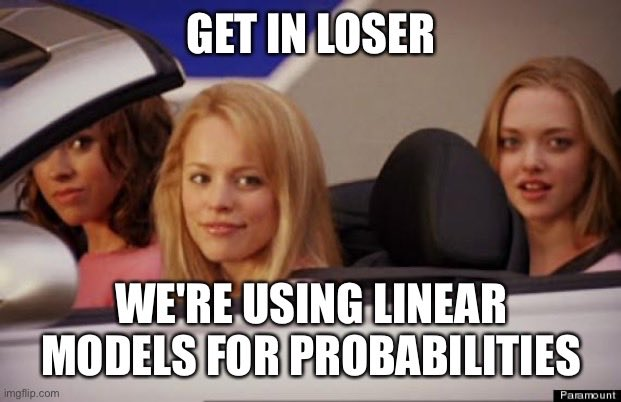

```{r, include=F}
knitr::knit_exit()
```


# MLE Estimation {#mleest}

This section will discuss the general process for deriving maximum likelihood estimators. It's all very exciting. It builds on the resources from the previous sections. In the next section, we will go through this process for a binary dependent variable. Here, we lay out the overview.

## Deriving Estimators 

Recall, we've already gone through a few steps of maximum likelihood estimation.

Initial Setup

  1. What is the data generating process? This means think about the structure of the dependent variable. Is it continuous, is it a count, is it binary, is it ordered?  Based on this, describe the probability distribution for $Y_i$.
  2. Define the likelihood for a single observation
  3. Define the likelihood for all observations
  4. Find the log-likelihood
  
Now we add steps building on the log-likelihood.

  5. Maximize the function with respect to (wrt) $\theta$
      + Take the derivative wrt $\theta$. We call this the "score"
      + Set $S(\theta) = 0$ and solve for $\hat \theta$ (if possible)
      + If not possible (often the case), we use an optimization algorithm to maximize the log likelihood.
  6. Take the second derivative of the log likelihood to get the "hessian" and help estimate the uncertainty of the estimates.
  

### Score function

The first derivative of the log-likelihood is called the score function: $\frac{\delta \ell}{\delta \theta} = S(\theta)$. This will tell us how steep the slope of the log likelihood is given certain values of the parameters. What we are looking for as we sift through possible values of the parameters, is the set of values that will make the slope zero, signalling that the function has reached a peak (maximizing the likelihood.)

We set the $S(\theta) = 0$ and solve for $\hat \theta$ (if possible).

  - $\hat \theta$ are the slopes/gradient, which we use as estimates (e.g., $\hat \beta$).
  - We can interpret the sign and significance just as we do in OLS.
  - But, unlike OLS, most of the time, these are not linear changes in units of $Y$
  - We have to transform them into interpretable quantities


**Example: Normally distributed outcome**


Start with the log-likelihood

\begin{align*}
\ell(\theta | Y) &= \sum_{i = 1}^N \log \Bigg( \frac{1}{\sigma\sqrt{2\pi}}e^{\frac{-(Y_i-\mu)^2}{2\sigma^2}}\Bigg)
= \sum_{i = 1}^N \log  \frac{1}{\sigma\sqrt{2\pi}} - \frac{(Y_i-\mu)^2}{2\sigma^2}\\
&= \sum_{i = 1}^N \log  \frac{1}{\sigma\sqrt{2\pi}} - \frac{(Y_i-x_i'\beta)^2}{2\sigma^2}
\end{align*}

Take the derivative wrt $\theta$. Note: we have to take two derivatives- one for $\mu$ ($\beta$) and one for $\sigma^2$. For this example we will focus only on the derivative wrt to $\beta$, as that it what gets us the coefficient estimates.^[Essentially, you need to take derivatives with respect to each of the parameters. Some models we use will have only one parameter, which is easier.]

\begin{align*}
\delta \ell(\theta | Y) &= -\frac{1}{2\sigma^2}\sum_{i = 1}^N \delta (Y_i-x_i'\hat \beta)^2
\end{align*}
The right term should look familar! We will end up with a $S(\hat \theta)_\beta = \frac{1}{\sigma^2}X'(Y - X\hat \beta)$. We set this equal to 0.
\begin{align*}
\frac{1}{\sigma^2}X'(Y - X\hat \beta) &= 0\\
\frac{1}{\sigma^2}X'Y &= \frac{1}{\sigma^2}X'X\hat \beta \\
(X'X)^{-1}X'Y = \hat \beta
\end{align*}


### Hessian and Information Matrix

The second derivative of the log-likelihood is the Hessian $(H(\theta))$. 

  - The second derivative is a measure of the curvature of the likelihood function. This will help us confirm that we are at a maximum, and it will also help us calculate the uncertainty.
  - The more curved (i.e., the steeper the curve), the more certainty we have.
  - The $I$ stands for the information matrix. The $H$ stands for Hessian. $I(\theta) = - \mathbb{E}(H)$
      + $var(\theta) = [I(\theta)]^{-1} = ( - \mathbb{E}(H))^{-1}$
      + Standard errors are the square roots of the diagonals of this $k \times k$ matrix (like  `vcov()` in OLS)

***Example: Normal***

Start with the log-likelihood

\begin{align*}
\ell(\theta | Y) &= \sum_{i = 1}^N \log  \frac{1}{\sigma\sqrt{2\pi}} - \frac{(Y_i-x_i'\beta)^2}{2\sigma^2}
\end{align*}

Because our $\theta$ has two parameters, the Hessian actually has four components. For this example, we will focus on one: the first and second derivatives wrt $\beta$. 

  - Recall the first derivative = $\frac{1}{\sigma^2}X'(Y - X\hat \beta)$. 
  - We now take the second derivative with respect to $\hat \beta$
    
    \begin{align*}
    \frac{\delta^2}{\delta \hat \beta} \frac{1}{\sigma^2}X'(Y - X\hat \beta)&= -\frac{1}{\sigma^2}X'X
    \end{align*}
  - To get our variance, we take the inverse of the negative (-) of this: 
      + $\sigma^2(X'X)^{-1}$ Should look familiar!

With this example, we can start to see why `lm` and `glm` for a normally distributed outcome generate the same estimates. The maximum likelihood estimator is the same as the least squares estimator.


### MLE Estimation Algorithm

Suppose we had a problem with $n=8$ observations where we could observe a $y_i = 1$ or $0$. For example, let's say we read an online sample of tweets and we classified tweets as "toxic=1" or "nontoxic=0." In our sample of $n=8$, we coded 6 of them as toxic and 2 as nontoxic. We are interested in finding the true probability $p$ that a comment is toxic.

We can write down the likelihood for a single observation using the Bernouilli pmf:

$L(p | y_i) = p^{y_i}*(1-p)^{(1-y_i)}$

We could then write out the likelihood for all 8 observations as follows:
  
  - Where the equation simplifies to $p$ for observations where $y_i$ = 1 and (1-p) for observations where $y_i$ = 0. For simplicity, let's say $i=1$ to $6$ were toxic, and $i=7$ to $8$ were nontoxic.
  - $L(p | \mathbf{y}) = p * p * p * p * p * p * (1-p) * (1-p)$

Now a naive way to maximize the likelihood would be to just try out different quantities for $p$ and see which give us the maximum.

```{r}
## Let's try this for different p's
p <- seq(.1, .9, .05)
L <- p * p * p * p * p * p * (1-p) * (1-p)
```

We can then visualize the likelihood results and figure out about at which value for $\hat p$ we have maximized the likelihood.
```{r}
plot(x=p, y=L, type="b",
     xaxt="n")
axis(1, p, p)
```


When we have more complicated models, we are taking a similar approach--trying out different values and comparing the likelihood (or log likelihood), but we will rely on a specific algorithm(s) that will help us get to the maximum a bit faster than a naive search would allow.

Don't worry the built-in functions in R will do this for you (e.g., what happens under the hood of `glm()`), but if you were to need to develop your own custom likelihood function for some reason, you could directly solve it through an optimization algorithm if no such built-in function is appropriate.

***You can skip the details below if you wish. They will only be involved in problem sets as extra credit***

The `optim` function in R provides one such approach. For this optimization approach, we will need to.

  - Derive the likelihood and/or log likelihood function and score
  - Create an R `function` for the quantity to want to optimize (often the log likelihood) where given we provide the function certain values, the function returns the resulting quantity. (Kind of like when we supply the function `mean()` with a set of values, it returns the average of the values by computing the average under the hood of the function.)
  - Use `optim()` to maximize 
      + `optim(par, fn, ..., gr, method, control, hessian,...)`, where
      + `par`: initial values of the parameters
      + `fn`: function to be maximized (minimized) 
      + `gr`: optional argument, can include the gradient to help with optimization
      + `...`: (specify other variables in `fn`)
      + `method`: optimization algorithm 
      + `control`: parameters to fine-tune optimization 
      + `hessian`: returns the Hessian matrix if `TRUE`

By default, `optim` performs minimization. Make sure to set `control = list(fnscale=-1)` for maximization

  - For starting values `par`, least squares estimates are often used. More sensible starting values help your optimize more quickly. You may need to adjust the `maxit` control parameter to make sure the optimization converges. 
  - A commonly used `method` is `BFGS` (a variant of Newton-Raphson), similar to what `glm()` uses, but there are other methods available.

***Example 1: p***

Let's take our relatively simple example about toxic tweets above and optimize the likelihood. First, we create a function for the likelihood that will calculate the likelihood for the values supplied. In the future, our models will be complicated enough, we will stick with the log likelihood, which allows us to take a sum instead of a product.

One benefit of R is that you can write your own functions, just like `mean()` is a built-in function in R. For more information on writing functions, you can review Imai [QSS Chapter 1 pg. 19.](https://assets.press.princeton.edu/chapters/s11025.pdf). 

```{r}
lik.p <- function(p){
  lh <- p * p * p * p * p * p * (1-p) * (1-p)
  return(lh)
}
```

Ok, now that we have our likelihood function, we can optimize. We just have to tell R a starting parameter for $\hat p$. Let's give it a (relatively) bad one just to show how it works (i.e., can `optim` find the sensible .75 value. If you give the function too bad of a value, it might not converge before it maxes out and instead return a local min/max instead of a global one.

```{r}
startphat <- .25
opt.fit <- optim(par = startphat, fn=lik.p, method="BFGS",
                 control=list(fnscale=-1))

## This should match our plot
opt.fit$par

## you should check convergence. Want this to be 0 to make sure it converged
opt.fit$convergence
```

***Example 2: Linear Model***

We can use `optim` to find a solution for a linear model by supplying R with our log likelihood function.

For the MLE of the normal linear model, our log likelihood equation is:

\begin{align*}
\ell(\theta | Y) &= \sum_{i = 1}^N \log  \frac{1}{\sigma\sqrt{2\pi}} - \frac{(Y_i-\mathbf{x}_i'\beta)^2}{2\sigma^2}
\end{align*}

  - Note: when you see $\mathbf{x}_i'\beta$, usually that is the representation of the multiplication of $k$ covariates (a $1 \times k$ vector) for a particular observation $i$ by $k \times 1$ coefficient values $\beta$. You can contrast this with $X\beta$, which represents $n \times k$ rows of observations with $k$ covariates multiplied by the $k \times 1$ coefficients. You will see both notations depending on if notation is indexed by $i$ or represented fully in matrix form.

Now that we have our log likelihood, we can write a function that for a given set of $\hat \beta$ and $\hat \sigma^2$ parameter values, $X$, and $Y$, it will return the log likelihood.

  - Below we indicate we will supply an argument `par` (an arbitrary name) that will inclue our estimates for the parameters: $k$ values for the set of $\hat \beta$ estimates and a $k + 1$ value for the $\hat \sigma^2$ estimate. Many models with only have one set of parameters. This is actually a slightly more tricky example.
  - The `lt` line is the translation of the equation above into R code

```{r}
## Log Likelihood function for the normal model
l_lm <- function(par, Y, X){
  k <- ncol(X)
  beta <- par[1:k]
  sigma2 <- par[(k+1)]
  lt <- sum(log(1/(sqrt(sigma2)*sqrt(2*pi))) - ((Y - X %*% beta)^2/(2*sigma2)))
  return(lt)
}
```


Now that we have our function, we can apply it to a problem.

Let's use an example with a sample of Democrats from the 2016 American National Election Study dataset. This example is based on the article "Hostile Sexism, Racial Resentment, and Political Mobilization" by Kevin K. Banda and Erin C. Cassese published in *Political Behavior* in 2020. We are not replicating their article precisely, but we use similar data and study similar relationships.

The researchers were interested in how cross-pressures influence the political participation of different partisan groups. In particular, they hypothesized that Democrats in the U.S. who held more sexist views would be demobilized from political participation in 2016, a year in which Hillary Clinton ran for the presidency. 

The data we are using are available [anesdems.csv](https://github.com/ktmccabe/teachingdata) and represent a subset of the data for Democrats (including people who lean toward the Democratic party). We have a few variables of interest

  - `participation`: a 0 to 8 variable indicating the extent of a respondent's political participation
  - `female`: a 0 or 1 variable indicating if the respondent is female
  - `edu`: a numeric variable indicating a respondent's education level
  - `age`: a numeric variable indicating a respondent's age.
  - `sexism`: a numeric variable indicating a respondent's score on a battery of questions designed to assess hostile sexism, where higher values indicate more hostile sexism.
  
Let's regress participation on these variables and estimate it using OLS, GLM, and `optim`. Note, OLS and GLM fit through their functions in R will automatically drop any observations that have missing data on these variables. To make it comparable with `optim`, we will manually eliminate missing data.

```{r, message=FALSE, warning=FALSE}
anes <- read.csv("https://raw.githubusercontent.com/ktmccabe/teachingdata/main/anesdems.csv")
## choose variables we will use
anes <- subset(anes, select=c("participation", "age", "edu", "sexism", "female"))
## omit observations with missing data on these variables
anes <- na.omit(anes)

## OLS and GLM regression
fit <- lm(participation ~ female + edu + age + sexism, data=anes)
fit.glm <- glm(participation ~ female + edu + age + sexism, data=anes,
               family=gaussian(link="identity"))
```

Now we will build our data for `optim`. We need $X$, $Y$, and a set of starting $\hat \beta$ and $\hat \sigma^2$ values.

```{r, warning=FALSE, message=FALSE}
## X and Y data
X.anes <- model.matrix(fit)
Y.anes <- as.matrix(anes$participation)
## make sure dimensions are the same
nrow(X.anes)
nrow(Y.anes)

## Pick starting values for parameters
startbetas <- coef(fit)
## Recall our estimate for sigma-squared based on the residuals
k <- ncol(X.anes)
startsigma <- sum(fit$residuals^2) / (nrow(X.anes) - k )
startpar <- c(startbetas, startsigma)

## Fit model
## But let's make it harder on the optimization by providing arbitrary starting values
## (normally you wouldn't do this)
startpar <- c(1,1,1,1,1,1)
opt.fit <- optim(par = startpar, fn=l_lm, X = X.anes,
                 Y=Y.anes, method="BFGS",
                 control=list(fnscale=-1),
                   hessian=TRUE)
```
We can compare this optimization approach to the output in `glm()`.

We can first compare the log likelihoods
```{r}
logLik(fit.glm)
opt.fit$value
```

We can compare the coefficients.
```{r, results="hold"}
## Coefficients
round(coef(fit), digits=4)
round(coef(fit.glm), digits=4)
round(opt.fit$par, digits=4)[1:k]
```

We can add the gradient of the log likelihood to help improve optimization. This requires specifying the first derivative (the score) of the parameters. Unfortunately this means taking the derivative of that ugly normal log likelihood above. Again, with the normal model, we have two scores because of $\hat \beta$ and $\hat \sigma^2$. For others, we may just have one.

```{r, warning=FALSE, message=FALSE}
## first derivative function
score_lm <- function(par, Y, X){
  k <- ncol(X)
  beta <- as.matrix(par[1:k])
  scorebeta <- (1/par[k+1]) * (t(X) %*% (Y - X %*% beta))
  scoresigma <- -nrow(X)/(par[k+1]*2) + sum((Y - X %*% beta)^2)/(2 * par[k+1]^2)
  return(c(scorebeta, scoresigma))
}

## Fit model
opt.fit <- optim(par = startpar, fn=l_lm, gr=score_lm, X = X.anes,
                 Y=Y.anes, method="BFGS",
                 control=list(fnscale=-1),
                   hessian=TRUE)
```

In addition to using `optim`, we can program our own Newton-Raphson algorithm, which is a method that continually updates the coefficient estimates $\hat \beta$ until it converges on a set of estimates. We will see this in a future section. The general algorithm involves the components we've seen before: values for $\hat \beta$, the score, and the Hessian.

  -  Newton-Raphson: $\hat \beta_{new} = \hat \beta_{old} - H(\beta_{old})^{-1}S(\hat \beta_{old})$


### MLE Properties

Just like OLS had certain properties (BLUE) that made it worthwhile, models using MLE also have desirable features under certain assumptions and regularity conditions.

Large sample properties

  - MLE is consistent: $p\lim \hat \theta^{ML} = \theta$
  - It is also asymptotically normal: $\hat \theta^{ML} \sim N(\theta, [I(\theta)]^{-1})$
      + This will allow us to use the normal approximation to calculate z-scores and p-values
  - And it is asymptotically efficient. "In other words, compared to any other consistent and uniformly asymptotically Normal estimator, the ML estimator has a smaller asymptotic variance" (King 1998, 80).


***Note on consistency***

What does it mean to say an estimator is consistent? As samples get larger and larger, we converge to the truth.

Consistency: $p\lim \hat{\theta} =\beta$ As $n \rightarrow \infty P(\hat{\theta} - \theta> e) \rightarrow 0$.

  - Convergence in probability: the probability that the absolute difference between the estimate and parameter being larger than $e$ goes to zero as $n$ gets bigger. 

Note that bias and consistency are different: Consistency means that as the sample size ($n$) gets large the estimate gets closer to the true value. Unbiasedness is not affected by sample size. An estimate is unbiased if over repeated samples, its expected value (average) is the true parameter.

It is possible for an estimator to be unbiased and consistent, biased and not consistent, or consistent yet biased.

{width=40%}; {width=40%}

{width=40%}

Images taken from [here](https://eranraviv.com/bias-vs-consistency/)

What is a practical takeaway from this? The desirable properties of MLE kick in with larger samples. When you have a very small sample, you might use caution with your estimates.


***No Free Lunch***

We have hinted at some of the assumptions required, but below we can state them more formally.
  
  - First, we assume a particular data generating process: the probability model.
  - We are generally assuming that observations are independent and identically distributed (allowing us to write the likelihood as a product)-- unless we explicitly write the likelihood in a way that takes this into account.
      + When we have complicated structures to our data, this assumption may be violated, such as data that is clustered in particular hierarchical entities.
  - We assume the model (i.e., the choice of covariates and how they are modeled) is correctly specified. (e.g., no omitted variables.)
  - We have to meet certain technical regularity conditions--meaning that our problem is a "regular" one. These, in the words of Gary King are "obviously quite technical" (1998, 75). We will not get into the details, but you can see pg. 75 of *Unifying Political Methodology* for the formal mathematical statements. In short, our paramaters have to be [identifiable](https://en.wikipedia.org/wiki/Identifiability) and within the parameter space of possible values (this identifiability can be violated, for example, when we have too many parameters relative to the number of observations in the sample), we have to be able to differentiate the log-likelihood (in fact, it needs to be twice continuously differentiable) along the support (the range of values) in the data. The information matrix, which we get through the second derivative, must be positive definite and finitely bounded. This helps us know we are at a maximum, and the maximum exists and is finite. You can visualize this as a smooth function, that is not too sharp (which would make it non differentiable), but has a peak (a maximum) that we can identify.


### Hypothesis Tests

We can apply the same hypothesis testing framework to our estimates here as we did in linear regression. First, we can standardize our coefficient estimates by dividing them by the standard error. This will generate a "z score." Just like when we had the t value in OLS, we can use the z score to calculate the p-value and make assessments about the null hypothesis that a given $\hat \beta_k$ = 0.

\begin{align*}
z &= \frac{\hat \theta_k}{\sqrt{Var(\hat \theta)_k}} \sim N(0,1)
\end{align*}

Note: to get p-values, we typically now use, `2 * pnorm(abs(z), lower.tail=F)` instead of `pt()` and our critical values are based on `qnorm()` instead of `qt()`. R will follow the same in most circumstances. In large samples, these converge to the same quantities.


### Model Output in R

As discussed, we can fit a GLM in R using the `glm` function: 

  - `glm(formula, data, family = XXX(link = "XXX", ...), ...)`
      + `formula`: The model written in the form similar to `lm()`
      + `data`: Data frame
      + `family`: Name of PDF for $Y_i$ (e.g. `binomial`, `gaussian`)
      + `link`: Name of the link function (e.g. `logit`, ``probit`, `identity`, `log`)


```{r}
## Load Data
fit.glm <- glm(participation ~ female + edu + age + sexism, data=anes,
               family=gaussian(link="identity"))
```


We've already discussed the coefficient output. Like `lm()`, GLM wiil also display the standard errors, z-scores / t-statistics, and p-values of the model in the model summary.

```{r}
summary(fit.glm)$coefficients
```

For this example, R reverts to the t-value instead of the z-score given that we are using the linear model. In other examples, you may see `z` in place of `t`. There are only small differences in these approximations because as your sample size gets larger, the degrees of freedom (used in the calculation of p-calues for the t distribution) are big enough that the t distribution converges to the normal distribution.


**Goodness of fit**

The `glm()` model has a lot of summary output.

```{r}
summary(fit.glm)
```

Some of the output represents measures of the goodness of fit of the model. However, their values are not directly interpretable from a single model.

  - Larger (less negative) likelihood, the better the model fits the data. (`logLik(mod)`). The becomes relavent when comparing two or more models.
  - Deviance is calculated from the likelihood. A measure of discrepancy between observed and fitted values. (Smaller values, better fit)
      + Null deviance: how well the outcome is predicted by a model that includes only the intercept. ($df = n - 1$)
      + Residual deviance: how well the outcome is predicted by a model with our parameters. ($df = n-k$)
  - AIC- used for model comparison. Smaller values indicate a more parsimonious model. Accounts for the number of parameters ($K$) in the model (like Adjusted R-squared, but without the ease of interpretation). Sometimes used as a criteria in prediction exercises (using a model on training data to predict test data).


**Likelihood Ratio Test**

The likelihood ratio test compares the fit of two models, with the null hypothesis being that the full model does not add more explanatory power to the reduced model. Note: You should only compare models if they have the same number of observations. 

```{r}
fit.glm2 <- glm(participation ~ female + edu + age + sexism, data=anes,
               family=gaussian(link="identity"))

fit.glm1 <- glm(participation ~ female + edu + age, data=anes, 
               family=gaussian(link = "identity"))
               
anova(fit.glm1, fit.glm2, test = "Chisq") #  reject the null
```


**Pseudo-R-squared**

We don't have an exact equivalent to the R-squared in OLS, but people have developed "pseudo" measures.

Example: McFadden's R-squared

  - $PR^2 = 1 - \frac{\ell(M)}{\ell(N)}$
      + where $\ell(M)$ is the log-likelihood for your fitted model and $\ell(N)$ is the log-likelihood for a model with only the intercept
  - Recall, greater (less negative) values of the log-likelihood indicate better fit
  - McFadden's values range from 0 to close to 1


```{r}
# install.packages("pscl")
library(pscl)
fit.glm.null <- glm(participation ~ 1, anes, family = gaussian(link = "identity"))
pr <- pR2(fit.glm1)
pr["McFadden"]

## Or, by hand:
1 - (logLik(fit.glm1)/logLik(fit.glm.null))
```


## Binary Dependent Variables 


Let's say $Y_i$ is a set of 0's and 1's for whether two states have experienced a dispute, an outcome common in IR studies.

\begin{gather*}
Y_i = \begin{cases}1, \;\text{a dispute happened}\\ 0,\;
\text{a dispute did not happen}\end{cases}
\end{gather*}

```{r, eval=F}
# Example of first 20 observations (Y1, Y2, ..., Y20)
1 0 1 0 0 0 0 0 0 0 0 0 0 0 0 0 0 0 0 1
```

We need to align these data with a data generating process and distribution.

  - For each $Y_i$, it is like a single trial, where you have a dispute with some probability $(\pi)$
      + This sounds like the Bernoulli distribution! $Y_i \sim Bernouli(\pi)$


Let's do the steps

  1. ***What is the data generating process?***  Based on this, describe the probability distribution for $Y_i$.
      + You may have picked up on this, but if you are using a function like `glm()` you can proceed directly there after this step. However, let's work under the hood for a bit.
      
      \begin{align*}
Y_i \sim f(Y_i | \pi) &= Pr(Y_i = y_i |\pi_i) = \underbrace{\pi^{y_i}(1 -\pi)^{(1-y_i)}}_\text{pmf for Bernoulli}
\end{align*}
for $y = 0,1$

  2. ***Define the likelihood for a single observation***
  3. ***Define the likelihood for all observations***
  4. ***Find the log-likelihood***
  
  \begin{align*}
\mathcal L( \pi | Y_i) &= \underbrace{\pi^{y_i}(1 -\pi)^{(1-y_i)}}_\text{Likelihood for single observation}\\
\mathcal L( \pi | Y) &= \underbrace{\prod_{i=1}^n\pi^{y_i}(1 -\pi)^{(1-y_i)}}_\text{Likelihood for all observations}\\
\ell( \pi | Y) &= \underbrace{\sum_{i=1}^n\log \pi^{y_i}(1 -\pi)^{(1-y_i)}}_\text{Log likelihood}\\
\hat \pi &= \text{Next step: arg max } \ell( \pi | Y) \text{ wrt $\pi$}
\end{align*}

***Add step: nonlinear transformation to $X\beta$***
  
  - Note that because we are likely using covariates, we need to express our parameter as a function of $X\beta$. Now that we are outside of linear territory, $\pi = g(X_i, \beta) \neq x_i'\beta$
  - At this point we need a transformation, such as the logit or probit to map our linear predictor into the outcome. The logit is one variety. We apply a logit transformation, which restricts our estimates to between 0 and 1 (a good thing for probability!) where:

  - $\pi_i = \text{logit}^{-1}(\eta_i) = \frac{exp^{\eta_i}}{1 + exp^{\eta_i}} = \frac{exp^{x_i'\beta}}{1 + exp^{x_i'\beta}}$
  - $\eta_i = \text{logit}(\pi_i)   = \log\frac{\pi_i}{1-\pi_i} = x_i'\beta$


  5. ***Maximize the function with respect to (wrt) $\theta$***

Where $\pi_i = \frac{exp^{x_i'\beta}}{1 + exp^{x_i'\beta}}$
\begin{align*}
\hat \pi &= \text{arg max } \ell( \pi | Y) \text{ wrt $\pi$} \\
&= \text{arg max } \sum_{i=1}^n y_i \log \Big( \frac{exp^{x_i'\beta}}{1 + exp^{x_i'\beta}}\Big) + (1-y_i)\log \Big(1-\frac{exp^{x_i'\beta}}{1 + exp^{x_i'\beta}}\Big)\\
\end{align*}


\begin{align*}
S(\theta) &=  \sum_{i=1}^n (Y_i - \pi_i)x^T_i\\
&= X^T(Y - \pi)
\end{align*}

  6. Take the second derivative of the log likelihood to get the "hessian" and help estimate the uncertainty of the estimates.
  

\begin{align*}
H(\theta) &=  - \sum_{i=1}^n x_ix^T_i(\pi_i)(1 - \pi_i)\\
&= -X^TVX
\end{align*}
 where $V$  is  $n \times n$ diagonal matrix with weights that are the ith element of  $(\pi)(1 - \pi)$


### R code for fitting logistic regression

We can fit logistic regressions in R through `glm()`. Let's build on the ANES example and analyze a dichotomized measure of participation where 1=participated in at least some form and 0=did not participate.

```{r}
anes <- read.csv("https://raw.githubusercontent.com/ktmccabe/teachingdata/main/anesdems.csv")
anes$partbinary <- ifelse(anes$participation > 0, 1, 0)
```

We can then fit using `glm` where `family = binomial(link="logit")`

```{r}
out.logit <- glm(partbinary ~ female + edu + age + sexism, data=anes,
                 family = binomial(link="logit"))
```

The summary output includes the logit coefficients, standard errors, z-scores, and p-values.

```{r}
summary(out.logit)
```


### Writing down the regression model

In the articles you write, you will describe the methods you use in detail, including the variables in the model and the type of regression (e.g., logistic regression). Sometimes you may want to go a step further and be very explicit about the model that you ran. We've already seen the regression equations for linear models. For the GLMs, they wiil look very similar, but we need to make the link/response function an explicit part of the equation.

For example, for logistic regression we have a few ways of writing it, including:

  - $\log \frac{\pi_i}{1-\pi_i} = \mathbf{x_i'}\beta$, or alternatively
  - $Pr(Y_i = 1 | \mathbf{x}_i) = logit^{-1}(\mathbf{x}_i'\beta) = \frac{exp(\mathbf{x_i'}\beta)}{(1 + exp(\mathbf{x_i'}\beta)}$

(You can also write out the individual variable names.) There is a new R package [equatiomatic](https://github.com/datalorax/equatiomatic) that can also be used to help write the equations from regression models. It's not perfect, but should get you there for most basic models.
```{r, results="asis"}
## First time, you need to install one of these
#remotes::install_github("datalorax/equatiomatic")
#install.packages("equatiomatic")

## Each time after, run library
library(equatiomatic)

## Will output in latex code, though see package for details on options
extract_eq(out.logit, wrap = TRUE, terms_per_line = 3)
```


### Probit Regression

Very similar to logit except we use a different link function to map the linear predictor into the outcome. Both the logit and probit links are suitable for binary outcomes with a Bernouilli distribution. If we apply a probit transformation, this restricts our estimates to between 0 and 1.

  - $\pi_i = Pr(Y_i = 1| X_i) = \Phi(\pi_i)$
  - $\eta_i = \Phi^{-1}(\pi_i)  =  x_i'\beta$

Here, our coefficients $\hat \beta$ represent changes in "probits" or changes "z-score" units. We use the Normal CDF ($\Phi()$) aka `pnorm()` in R to transform them back into probabilities.

Let's fit our binary model with probit. We just need to change the link function.

We can then fit using `glm` where `family = binomial(link="logit")`

```{r}
out.probit <- glm(partbinary ~ female + edu + age + sexism, data=anes,
                 family = binomial(link="probit"))
```

Let's apply the equation tool to this:

```{r, results="asis", message=FALSE}
## Each time after, run library
library(equatiomatic)

## Will output in latex code, though see package for details on options
extract_eq(out.probit, wrap = TRUE, terms_per_line = 3)
```


The summary output includes the probit coefficients, standard errors, z-scores, and p-values.

```{r}
summary(out.probit)
```

### To logit or to probit?

Both produce a monotonically increasing S-curve in probability between 0 and 1, which vary according to the linear predictor ($x_i^T\beta$)

{width=50%}

  - Both start with $Y_i$ as bernoulli
  - Both produce the same function of the log-likelihood BUT define $\pi_i$ and link function differently
  - Results--in terms of sign and significance of coefficients-- are very similar
      + Logit coefficients are roughly 1.6*probit coefficients
  - Results--in terms of predicted probabilities-- are very similar
      + Exception-- at extreme probabilities-- Logit has "thicker tails", gets to 0 and 1 more slowly
  - Sometimes useful--Logit can also be transformed into "odds ratios"
  - By convention, logit more typically used in political science but easy enough to find examples of either
  
  
***Note on Odds Ratios in Logistic Regression***

Coefficients are in "logits" or changes in "log-odds" ($\log \frac{\pi_i}{1 - \pi}$). Some disciplines like to report "odds ratios"

  - Odds ratio: $\frac{\pi_i(x1)/(1 - \pi(x1))}{\pi_i(x0)/(1 - \pi(x0))}$  (at a value of x1 vs. x0)
      + If $\log \frac{\pi_i}{1 - \pi} = logodds$; $\exp(logodds) = \frac{\pi_i}{1 - \pi}$
      + Therefore, if we exponentiate our coefficients, this represents an odds ratio: the odds of $Y_i = 1$ increase by a factor of ($\exp(\hat \beta_k)$) due to 1-unit change in X


```{r}
## odds ratio for the 4th coefficient
exp(coef(out.logit)[4])

## CI for odds ratios
exp(confint(out.logit)[4, ])
```

In political science, we usually opt to present predicted probabilities instead of odds ratios, but ultimately you should do whatever you think is best.
  

### Latent variable representation

Sometimes you will see the binary outcome problem represented as a latent propensity where $Y^*_i$ is a continuous variable that represents an unobserved propensity (e.g., to have a dispute, to be a toxic tweet, to participate), where

\begin{gather*}
Y_i = \begin{cases}1, \; y^*_i > \tau \\ 0,\; 
y^*_i \leq \tau \end{cases}
\end{gather*} 

and $\tau$ is some threshold after which a the event (e.g., dispute) occurs.

People (who me? yes, I admit, me) will sometimes still use a linear model when we have dichotomous outcomes. In that case, we interpret the results as a "linear probability model" where a one-unit change in $x$ is associated with a $\hat \beta$ change in the probability that $Y_i = 1$.  


*Image from Chelsea Parlett-Pelleriti @ChelseaParlett on Twitter*


This may sound like a disaster because linear models are generally meant for nice continuous outcomes, and there is no way to prevent extreme values of $X\beta$ from extend above 1 or below 0. This is not to mention the heteroskedasticity issues that come from binary outcome because the error terms depend on the values of $X$. This website has a good overview of the potential problems with linear [regression](https://www.dummies.com/education/economics/econometrics/3-main-linear-probability-model-lpm-problems/).

However, 1) we can use robust standard errors , 2) if you look at the S-curve in the previous section, you will note that a large part of the curve is pretty linear over a wide range of $X\beta$ values. For many applications, the estimates transformed from a logit or probit into probability will look similar to the estimates from a linear probability. 3) Linear probability models are easier to interpret, and there is no need to transform coefficients.

LPM vs. logit/probit has spurred a lot of debate throughout the years. Reviewers disagree, twitter users disagree, etc. This is just something to be aware of as you choose modeling approaches. Particularly when it comes to experiments and other causal inference approaches, there is a growing push to stick with linear probability models when your key independent variable is a discrete treatment indicator variable. See this new [article](https://psyarxiv.com/4gmbv/) from Robin Gomilla and who lays out the considerations for using LPM, particularly in experimental settings, as well as follow up discussion from [Andrew Gelman](https://statmodeling.stat.columbia.edu/2020/01/10/linear-or-logistic-regression-with-binary-outcomes/). That said, even if you run with an LPM and cite the Gomilla article, a reviewer may still ask you to do a logit/probit. And there are certainly circumstances where LPM will fall short. Probably try both, and choose your own adventure.


