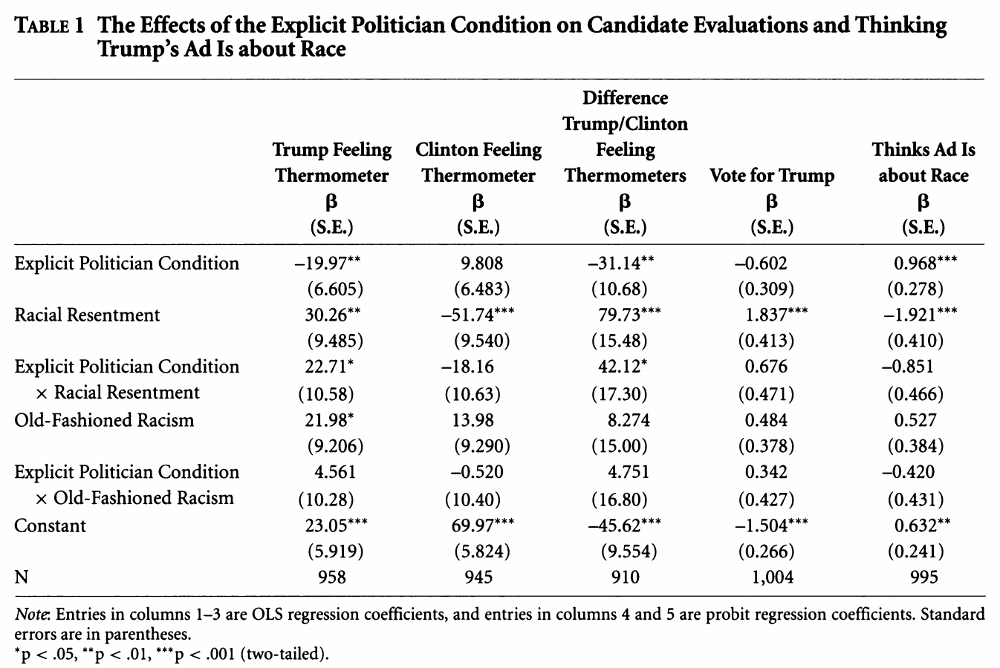

# Quantities of Interest {#qoi}

This section will provide information about calculating quantities of interest. Often, in linear regression, our coefficients might directly represent the quantities we are interested in interpreting. However, in other models, we might need to do a bit of work to make it easier on our readers (and ourselves).

The quantities of interest you generate should be directly related to your research question and hypotheses. For example, if my hypothesis was about how the competitiveness of a state is related to the probability that someone is contacted by a campaign, then my quantities of interest would involve a comparison of the predicted probability of campaign contact for those in more vs. less competitive states. In contrast, if my hypothesis was about the number of bills passed in a legislature under unified vs. divided government, I would want to express my quantities of interest as a different in counts of bills or rate of bills pasesed.

We will discuss computing quantities of interest, uncertainty for these quantities, and visualization.

We can take something that looks like column 5 in the table from Antoine Banks and Heather Hicks example from the previous section and move it into a figure, as the authors did.

{width=40%} {width=40%}


Here are a few external resources that relate to the concepts discussed in this section.

  - Michael J. Hanmer and Kerem Ozan Kalkan.  [Behind the Curve: Clarifying the Best Approach to Calculating Predicted Probabilities and Marginal Effects from limited Dependent Variable Models.](http://onlinelibrary.wiley.com/doi/10.1111/j.1540- 5907.2012.00602.x/pdf) American Journal of Political Science. 
  - Why plot results? Jonathan P. Kastellec and Eduardo L. Leoni. [Using Graphs Instead of Tables in Political Science.](http://www.princeton.edu/~jkastell/Tables2Graphs/graphs.pdf)
  - Short overviews of the bootstrap method for calculating uncertainty: 
      + Pezullo, John. [The Bootstrap Method for Standard Errors and Confidence Intervals.](https://www.dummies.com/education/science/biology/the-bootstrap-method-for-standard-errors-and-confidence-intervals/)
      + Banks, David. [Lecture from Duke University.](http://www2.stat.duke.edu/~banks/111-lectures.dir/lect13.pdf)
  - Overview of simulation approach for calculating uncertainty from [King, Tomz, and Wittenberg 2000](https://gking.harvard.edu/files/abs/making-abs.shtml).
  - R packages helpful for quantities of interest 
      + Thomas Leeper: [prediction](https://github.com/leeper/prediction) and [margins](https://github.com/leeper/margins)
      + Gary King and colleagues: [Zelig](https://zeligproject.org/)


## Using the response functions to generate quantities of interest

Recall, in linear regression, to get our estimated values $\hat Y$ we said $\hat Y = X\hat\beta$.

  - In glm's, we can do the same to get our estimated values on the scale of the linear predictor $\hat \eta = X\hat\beta$.
  - We then use our $Link^{-1}$ response function to transform these values into the quantity of interest.
      + E.g., in logistic regression we want $\hat{\pi} = \frac{\exp(X\hat\beta)}{1 + \exp(X\hat\beta)}$.
      + E.g., in probit regression we want $\hat{\pi} = \Phi(X \hat \beta)$.
      + These represent the predicted probability of $Y_i = 1$ given our coefficient estimates and designated values of the covariates
        

Let's use a subset of the MIDs `mids.txt` data available [here](https://github.com/ktmccabe/teachingdata).

This dataset has variables related to whether a dyad of states is engaged in a militarized interstate dispute between the two countries in a given year. The variable that will be our outcome of interest is `Conflict` which takes the values 0 or 1. We will also look at the relationship between a few independent variables and the propensity for conflict. Data are at Dyad Level.

  - whether the pair of countries 
      + include a major power (`MajorPower`, 1=yes, 0=otherwise), 
      + are contiguous ( `Contiguity`, 1=yes, 0=otherwise), 
      + are allies (`Allies`, 1=yes, 0=otherwise), 
      + and/or have similar foreign policy portfolios (`ForeignPolicy`, 1=yes, 0=otherwise)
  - `BalanceofPower`: balance of military power
  - `YearsSince`: the number of years since the last dispute

```{r}
## Load data
mids <- read.table("https://raw.githubusercontent.com/ktmccabe/teachingdata/main/midsshort.txt")

table(mids$Conflict)
```
As can be seen from the table above, conflicts (fortunately) are relatively rare in our data. This means are predicted probabilities are likely going to be pretty small in this example.


We will run a logistic regression with a few covariates.
```{r}
out.logit <-glm(Conflict ~  MajorPower + Contiguity + Allies + ForeignPolicy +
    BalanceOfPower + YearsSince, 
                family = binomial(link = "logit"), data = mids)
```

Our logistic regression equation is:

  - $\log \frac{\pi_i}{1-\pi_i} = \mathbf{x_i'}\beta$, or alternatively
  - $Pr(Y_i = 1 | \mathbf{x}_i) = logit^{-1}(\mathbf{x}_i'\beta) = \frac{exp(\mathbf{x_i'}\beta)}{1 + exp(\mathbf{x_i'}\beta)}$

Our coefficients are in the "logit" aka log-odds scale of the linear predictor, so we use the response function to put them into probability estimates.

For logistic regression, we can generate predicted probabilities for each $Y_i$ using the

  1. `predict(model, type="response")` function, using the 
  2. `plogis` function with $X\hat \beta$, or 
      + Question: What would be the equivalent function for probit?
  3. manually writing down the response function $\frac{exp(\mathbf{x_i'}\beta)}{1 + exp(\mathbf{x_i'}\beta)}$. 


We use the `predict` function exactly the same way as before, but the key argument we need to specify is `type`. If you have `type = link` this generates answers that are still on the log-odds linear predictor scale. It is switching this to `response` that goes into probability in the logit case or probit case.

**Example**

First, let's just generate predicted probabilities for each observation in our data, without specifiying any designated values for $X$-- just keeping the values as they are in the data aka "as observed."
```{r}
## Method with predict()
## When you don't specify newdata, R assumes you want the X data from the model
pp <- predict(out.logit, type = "response")

## Manual way #1
X <- model.matrix(out.logit)
bh <- coef(out.logit)
pplogis <- plogis(X %*% bh)

## Manual way # 2
ppexp <- exp(X %*% bh)/(1 + exp(X %*% bh))

## Compare the first five rows of each to see they are the same
cbind(pplogis, ppexp, pp)[1:5,]
```

The code above generates a predicted probability associated with each observation in the data. This is similar to generating a fitted value $\hat y$ for each observation in OLS.


## QOI at Designated Values

Usually in social science we have hypotheses about how the predicted probabilities change as one or more of our independent variables change. We will now turn to calculating predicted responses according to specific values of the independent variables.

Recall, sometimes in linear regression, we wanted to calculate a specific estimated value of $\hat Y_i$ for when we set $X$ at particular values. (e.g., What value do we estimate for $Y$ when $X1 = 2$ and $X2=4$?)

  - In OLS, this would be $\hat Y_i = \hat \alpha + 2*\hat \beta_1 + 4*\hat \beta_2$

Here, we can do the same for GLMs by setting specific values for $X$ when we apply the $Link^{-1}$ response function.

  - E.g., What is the predicted probability of $Y_i = 1$ when $X1 = 2$ and $X2=4$?
      + In logistic regression, $\hat{\pi_i} = \frac{\exp(\hat \alpha + 2*\hat \beta_1 + 4*\hat \beta_2)}{1 + \exp(\hat \alpha + 2*\hat \beta_1 + 4*\hat \beta_2)}$


**Example 1**

Example using the Conflict data using different approaches in R.

```{r}
## Predicted probability when Allies = 1, and all other covariates = 0
allies1 <- predict(out.logit, newdata = 
                     data.frame( MajorPower = 0,
                                 Contiguity = 0, 
                                 Allies = 1, 
                                 ForeignPolicy = 0,BalanceOfPower = 0, 
                                 YearsSince = 0),
                   type = "response")
allies1

## for allies = 1, careful of the order to make same as coefficients
X <- cbind(1, 0, 0, 1, 0, 0 , 0) 
Bh <- coef(out.logit)

## Approach 1
plogis(X %*% bh)

## Approach 2
exp(X%*% bh)/(1 + exp(X%*% Bh))
```

**Example 2**

Second example keeping X at observed values. Here the manual approach is easier given the limitations of `predict` (at least until we learn a new package). Now we are estimating $N$ predicted probabilities, so we take the mean to get the average estimate.

```{r}
## for allies = 1careful of the order to make same as coefficients
X <- model.matrix(out.logit)
X[, "Allies"] <- 1 # change Allies to 0, leave everything else as is
Bh <- coef(out.logit)

## Approach 1
mean(plogis(X %*% bh))

## Approach 2
mean(exp(X%*% bh)/(1 + exp(X%*% Bh)))
```

This is the average predicted probability of having a dispute when the dyad states are Allies, holding other covariates at their observed values.


### Marginal Effects

Recall, in linear regression a one-unit change in $X_k$ is associated with a $\hat \beta_k$ change in $Y$ no matter where we are in the domain of $X_k$. (The slope of a line is constant!)

The catch for glm's, again, is that our linear predictor ($\eta$) is often not in the units of $Y$ that we want. E.g., In logistic regression, a one-unit change in $X_k$ is associated with a $\hat \beta_k$ logits change

  - Recall, for logit and probit, this takes us into an S-curve for $Pr(Y_i = 1)$ instead of a line
  - Well, the slope of an S-curve is not constant. Depending on where we are in $X$, it will influence how much change we have in the predicted probability of $Y_i = 1$.
  - Therefore, to understand the marginal effect in glm's we have to set $X$ to particular values and be careful about the values we select. 
    + By "careful," this means choosing sensible, theoretically informed values of interest.


You can generate predictions based on any values. Here are three common approaches for understanding the marginal effect of a particular variable $X_k$.

  - Marginal effects at the mean
  - Average marginal effects
  - Marginal effects at representative values

Wait, what do we mean by marginal effects?

  - For a discrete (categorical/factor) variable ($X_k$) this will be the change in predicted probability associated with a one-unit change in ($X_k$). 
  - For continuous variables ($X_k$), this technically is the instantaneous rate of change (change in probability associated with a very small change in $X$). 
      + Usually instead of estimating this (what is a very small change anyway?) we will do this by hand instead, and set the specific amount of change). Often, this is called "discrete change" or "first difference" effect. 


### Marginal effects at the mean

In this approach, when we calculate the difference in predicted probability resulting from a one-unit change in $X_k$, we set all other covariates $X_j$ for $j \neq k$ at their ***mean values***.

  - This gives us 1 estimate for the difference in predicted probability
  - When can this be problematic? (think categorical variables)

### Marginal effects at representative values

In this approach, when we calculate the difference in predicted probability resulting from a one-unit change in $X_k$, we set all other covariates $X_j$ for $j \neq k$ at values that are of theoretical interest. This could be the mean value, modal vale, or some other value that makes sense for our research question.

  - This gives us 1 estimate for the difference in predicted probability
  - Depending on your research question, there may/may not be a particularly interesting set of representative values on all of your covariates.

The example above where we held all other covariates at zero would be an example of calculating marginal effects at representative values.

### Average marginal effects 

In this approach, when we calculate the difference in predicted probability resulting from a one-unit change in $X_{ik}$, we hold all covariates $X_{ij}$ for $j \neq k$ at their ***observed values***.

  - This gives us $N$ estimates for the difference in predicted probability
  - We report the average of these estimates

Here is an example for average marginal effects. Let's sat we were interested in the difference in probability of a dispute for Allies vs. non-Allies, when all other covariates are zero. We can do this manually or in `predict`.

```{r}
## Extract beta coefficients
Bh <- coef(out.logit)

## Set Allies to 1, hold all other covariates as observed
X1 <- model.matrix(out.logit)
X1[, "Allies"] <- 1

## Set Allies to 0, hold all other covariates as observed
X0 <- model.matrix(out.logit)
X0[, "Allies"] <- 0

pp1 <- mean(plogis(X1 %*% Bh))
pp0 <- mean(plogis(X0 %*% Bh))
pp1 - pp0
```

This represents the average difference in predicted probability of having a dispute for Dyads that are Allies vs. not Allies.

### `prediction` and `margins` packages.

There are functions that can make this easier so long as you understand what they are doing. One package developed by Dr. Thomas Leeper is `prediction`. A second is `margins`. Documentation available [here](https://github.com/leeper/prediction) and [here](https://github.com/leeper/margins). It is always important to understand what's going on in a package because, for one, it's possible that the package will stop being updated, and you will have to find an alternative solution.

We will focus on the `prediction` package first. The `prediction` function generates specific quantities of interest. An advantage it has over the built-in `predict` function is that it makes it easier to "hold all other variables at observed values." In the `prediction` function, you specify the designated values for particular variables, and then by default, it assumes you want to hold all other variables at observed values. Here is an example of generating predicted probabilities for `Allies = 1` and `Allies = 0`. It will generate the summary means of these two predictions.

```{r}
## install.packages("prediction")
library(prediction)

## By default, allows covariates to stay at observed values unless specified
prediction(out.logit, at = list(Allies = c(0, 1)), 
           type = "response")

## compare with the manual calculated values above
pp0
pp1
```


### QOI Practice Problems

1. Conduct the following regression using `glm`

$Pr(Conflict_i = 1 | X) = logit^{-1}(\alpha + \beta_1 * Allies_i + \beta_2 * MajorPower_i + \beta_3 * ForeignPolicy_i)$

2. What is the predicted probability of entering a dispute when the dyad includes a major power, holding all covariates at observed values?

3. Repeat the previous exercise, but now use probit. How similar/different are the predicted probability estimates?


<details> <summary>Try on your own, then expand for the solution.</summary>

```{r}
## Problem 1
out.logit2 <- glm(Conflict ~ Allies + MajorPower + ForeignPolicy, data=mids,
                  family = binomial(link = "logit"))

## Problem 2
library(prediction)
prediction(out.logit, at = list(MajorPower = 1), 
           type = "response")

## Problem 3
out.probit <- glm(Conflict ~ Allies + MajorPower + ForeignPolicy, data=mids,
                  family = binomial(link = "probit"))
prediction(out.probit, at = list(MajorPower = 1), 
           type = "response")

## Manual approach
X <- model.matrix(out.probit)
X[, "MajorPower"] <- 1
Bhat <- coef(out.probit)

mean(pnorm(X %*% Bhat))
```

</details>


## Uncertainty

Usually, we want to report a confidence interval around our predicted probabilities, average predicted probabilities, or around the difference in our predicted probabilities or difference in our average predicted probabilities.

This is different from the uncertainty of a coefficient, which we already have from our `glm` output. Here, if we say there is a 0.01 probability of a dispute, that is just an estimate, it is going to vary over repeated samples. We want to generate a confidence interval that represents this variability in $\hat \pi$.

We have already discussed using the `predict` function in `lm` to generate confidence intervals for OLS estimates. In a limited set of cases, we can also use this shortcut for `glm` by taking advantage of the distribution being approximately normal on the scale of the linear predictor. When we are estimating confidence intervals around 1) one or multiple single quantities of interest (a predicted probability, as opposed to a difference in predicted probability) 2) where the $X$ values are set at specific values (and not at their observed values) then, we can plug this into the `predict` function in the following way:

  1. Generate the prediction and standard errors of the prediction on the `link` linear predictor scale.
      + On the scale of the linear predictor, the standard errors of the prediction are calculated as $\sqrt{\mathbb{x'}_c \text{vcov(fit)} \mathbb{x}_c}$ using the delta method.
  2. Calculate the CI on the linear predictor scale: $CI(\hat \theta) = \hat \theta - z_{crit}*se_{\hat \theta}$ ; $\hat \theta + z_{crit}*se_{\hat \theta}$
      + $z_{crit}$ for the 95\% confidence interval is 1.96 (so this is saying +/- about 2 standard errors). We get this by using `qnorm()`.
  3. Convert the prediction and confidence intervals to the response scale.
  
Here is an example:
```{r}
## Predicted probability when Allies = 1 and all other covariates = 0
## Note type = "link"
allies1.link <- predict(out.logit, newdata = 
                     data.frame( MajorPower = 0,
                                 Contiguity = 0, 
                                 Allies = 1, 
                                 ForeignPolicy = 0,BalanceOfPower = 0, 
                                 YearsSince = 0),
                   type = "link", se = T)

allies1 <-  plogis(allies1.link$fit)
allies1.lb <- plogis(allies1.link$fit - qnorm(.975)*allies1.link$se.fit)
allies1.ub <- plogis(allies1.link$fit + qnorm(.975)*allies1.link$se.fit)

## Confidence interval
c(allies1, allies1.lb, allies1.ub)

## By hand (using x as a k x 1 vector)
x.c <- rbind(1, 0, 0, 1, 0, 0, 0)
se.hand <- sqrt(t(x.c) %*% vcov(out.logit) %*% x.c)
p.hand <- t(x.c) %*% coef(out.logit)
allies1.hand <- plogis(p.hand)
allies1.hand.lb <- plogis(p.hand- qnorm(.975)*se.hand)
allies1.hand.ub <- plogis(p.hand + qnorm(.975)*se.hand)
c(allies1.hand, allies1.hand.lb, allies1.hand.ub)
```

Beyond this simple case, there are three general approaches to calculating the uncertainty of the quantities of interest.

  - Delta Method (based on calculus, first order Taylor Expansion approximation)
  - Bootstrapping (very flexible, common, computationally demanding)
  - Quasi-bayesian (flexible, less computationally demanding), also described as simulation/Monte carlo simulation.

For now, we will focus on the second two methods, but some statistical software programs will report uncertainty estimates based on the Delta method. Here is more information on this [method](https://stats.idre.ucla.edu/r/faq/how-can-i-estimate-the-standard-error-of-transformed-regression-parameters-in-r-using-the-delta-method/) and the `deltamethod` [function](https://www.r-bloggers.com/2018/01/delta-method-standard-errors/) in R. 

### Bootstrapping

Bootstrapping simulates the idea of conducting repeated samples to generate a distribution of estimates of your quantity of interests. We "resample" from our existing data to generate thousands of new datasets, and use each dataset to generate a slightly different quantity of interest. This distribution is then used to construct the confidence interval.

Process: 

  - Sample from the data to generate new data frame
  - Run the model: this gives new coefficient estimates and new covariate matrices
  - Use new coefficient and covariate estimates to compute quantity of interest
  - Replicate the previous process for about 1000 iterations to get 1000 estimates of quantity of interest
  - Use the distribution of these estimates to calculate confidence intervals


Why? How does this work?

  - It is simulating the exercise of hypothetical repeated samples
  - Similar to Law of Large Numbers- with sufficient iterations, the empirical "bootstrap" distribution is a good approximation of the true distribution (will get closer and closer to the truth)
      + It won't help us correct a bad estimate-- have to work from the data we have.
  - The logic is we think the distribution of $\bar x$ sample estimate is centered on $\mu$ (the truth), and then we assume the distribution of $\bar x*$ (the bootstrapped estimate) is centered on $\bar x$

This would be a good place to review the Bootstrap resources at the front of the section:
  
  - Pezullo, John. [The Bootstrap Method for Standard Errors and Confidence Intervals.](https://www.dummies.com/education/science/biology/the-bootstrap-method-for-standard-errors-and-confidence-intervals/)
  -  Banks, David. [Lecture from Duke University.](http://www2.stat.duke.edu/~banks/111-lectures.dir/lect13.pdf)

How do we implement this procedure?

***Example*** 

Find the point estimate and 95\% CI for the average predicted probability of conflict when the dyad are allies and all other covariates are held at observed values

```{r}
## Original regression
out.logit <-glm(Conflict ~  MajorPower + Contiguity + Allies + ForeignPolicy +
    BalanceOfPower + YearsSince, 
                family = binomial(link = "logit"), data = mids)

## We need to build our bootstrap procedure
## Let's assume we just want 1 iteration

## Step 1: sample to generate new data
## this selects N row numbers from mids, with replacement
wrows <- sample(x =1:nrow(mids), size = nrow(mids), replace = T)

## Create subset of data based on these rows
subdata <- mids[wrows, ]

## Step 2: run your regression model with the new data
boot.logit <-glm(Conflict ~  MajorPower + Contiguity + Allies + ForeignPolicy +
    BalanceOfPower + YearsSince, 
                family = binomial(link = "logit"), data = subdata)

## Step 3: generate average predicted probability
Xboot <- model.matrix(boot.logit)
Xboot[, "Allies"] <- 1
Bh <- coef(boot.logit)
p.boot <- mean(plogis(Xboot %*% Bh))
```

<details> <summary> Expand below for more details on what the sample function does.</summary>

Let's say we have a dataframe of different colors and shapes.

```{r}
somedata <- data.frame(colors = c("red", "blue", "yellow", "green", 
                                  "purple", "orange", "black"),
                       shapes = c("circle", "square", "triangle", 
                                  "rectangle", "diamond", "line", "sphere"))
somedata                                  
```
I could generate a new "resampled" dataset with the `sample` function. We tell the function three things: 1) choose from the row numbers in my dataframe (`1:nrow(somedata)`), 2) pick $N$ row numbers in total (`nrow(somedata)`), 3) Each time you pick a given row number $i$, put it back in the data, allowing the possibility that you may randomly sample it again (`replace = TRUE`).

```{r}
sample(1:nrow(somedata), nrow(somedata), replace = TRUE)
sample(1:nrow(somedata), nrow(somedata), replace = TRUE)
sample(1:nrow(somedata), nrow(somedata), replace = TRUE)
```
What happened is the function generated a set of row numbers. Note how it is possible for the same row number to be picked multiple times. Each time we run the sample function, we get slightly different row numbers.

We can subset our data based on these row indices.

```{r}
## store row indices
wrows <- sample(1:nrow(somedata), nrow(somedata), replace = TRUE)
wrows
## subset data to include rows sampled
## note if row indices are in wrows more than once, they will also be in the subset more than once
subdata <- somedata[wrows,]
subdata
```

Given that each time the sample function runs, we get slightly different random samples of the data, that's how we end up with a distribution of slightly different estimates of our quantities of interest. Each time the regression is run with a slightly different dataset.

</details>

This gives us one estimate of the average predicted probability stored in `p.boot`. However, the idea of a bootstrap is that we repeat this procedure at least 1000 times to generate a distribution of estimates of the quantity of interest, the average predicted probability in this case.

We could literally repeat that code chunk 1000 times.... but, we have better things to do than that much copy/paste. Instead, we will create a function that will do this automatically.

To do so, we are going to wrap our procedure above inside the syntax for creating functions in R. In R, to create a function, 

  - We first name the function. (Let's call this `myboot`. You could call yours anything.) 
  - The next syntax is always `myboot <- function(){}`. 
  - Inside the `function()` part, you tell R what you are going to supply the function each time you want it to run. Sometimes functions only have one input, others like `lm` have multiple inputs.
      + For example, in the function `mean(x)`, we always supply that function with a vector of values.
      + For this bootstrap example, we are going to write the function as one where we will supply the function with a dataframe. Let's call this `df`. 
  - The inside part of the function, between the `{}` is the procedure from above. All we do is 
      + Instead of writing `mids`, we keep it generic by writing `df`. 
      + We add a final line that tells R what we want it to `return()` as the output of the function. Here, we want it to return the average predicted probability.
  
```{r}
## We need to build our bootstrap function
## Step 4: Let's wrap our current steps into a function that we can replicate

## Note: all we need as an input is our data.frame mids
## I will label it something generic to show how a function can work
myboot <- function(df){
  wrows <- sample(x =1:nrow(df), size = nrow(df), replace = T)
  ## Create subset of data based on these rows
  subdata <- df[wrows, ]
  ## Step 2: run your regression model with the new data
  boot.logit <-glm(Conflict ~  MajorPower + Contiguity + Allies + ForeignPolicy +
    BalanceOfPower + YearsSince, 
                family = binomial(link = "logit"), data = subdata)
  ## Step 3: generate average predicted probability
  Xboot <- model.matrix(boot.logit)
  Xboot[, "Allies"] <- 1
  Bh <- coef(boot.logit)
  p.boot <- mean(plogis(Xboot %*% Bh))
  return(p.boot)
}
```

Note: here, our quantity of interest is the predicted probability of a dispute when the dyad are Allies. Let's say, instead, we wanted the difference in predicted probability of a dispute between Allies and Non-Allies. Well, we would just adjust our function to calculate the mean probabilities for Allies and Non-Allies and return the difference in these means as the quantity of interest. We would then get 10000 estimates of this ***difference*** in probabilties.

Now that we have the function from above, instead of copying/pasting this 1000 times, we will use the function called `replicate` which will do this for us. We indicate the number of estimates we want and then indicate which function (and in our case, which dataframe inside the function) we want to replicate. 


```{r}
## This may take a minute to run. 
## We will do just 50, Normally you will want this to be more like 1000
set.seed(1234) # this helps us get the same results each time, good for reproducibility
myestimates <- replicate(50, myboot(mids))
```

The bootstrapping approach is very computationally demanding given it has to repeat an operation several (thousand) times. After you hit "run,"  just sit back, relax and wait for the [water to run dry.](https://www.youtube.com/watch?v=9N9opF-PK5k)

<details> <summary>For a troubleshooting tip, expand.</summary>

If you get an error message at the `replicate(1000, myboot(mids))` stage, it is best to see if your function runs at all. Try just the below to see if it generates output:

```{r}
myboot(mids)
```

If you get the error here, then it means there is a bug within the function code, not the replicate code.
</details>

Each time we replicate the function, it will generate slightly different results because the `sample` functions is randoming sampling rows of data each time. We can plot the distribution of estimates to show this.

```{r}
library(ggplot2)
ggplot(data.frame(x = myestimates), aes(x = myestimates)) + 
  geom_histogram(aes(y=..density..)) + geom_density(color="red")
```

The final step after generating the bootstrap distribution of estimates is to use it to construct a confidence interval for the quantity of interest. There are a few ways to do this.

  - Normal approximation
  - Percentile
  - Bias correction

In each approach, we take our original "point estimate" from the computation of the quantity of interest from our original data and use the bootstrap estimates for the lower and upper bounds of the confidence interval. Here we will assume we want a 95\% confidence interval.

```{r}
## Find the original point estimate
Bh <- coef(out.logit)
X1 <- model.matrix(out.logit)
X1[, "Allies"] <- 1
pe1 <- mean(plogis(X1 %*% Bh))

## Normal
c((pe1 - qnorm(.975)*sqrt(var(myestimates))),(pe1 + qnorm(.975)*sqrt(var(myestimates))))

## Percentile
quantile(myestimates, c(0.025, .975))

## Bias correction
bc <- 2*pe1 - myestimates
quantile(bc, c(0.025, .975))
```

Each of these is pretty commonly used, but they may generate slightly different results.

### Simulated Confidence Intervals

Quasi-Bayesian or simulated confidence intervals take advantage of the large sample properties of our estimates $\hat \beta$ having a Normal sampling distribution due to the Central Limit Theorem.

Like the bootstrap, the simulation procedure also generates hypothetical new samples. However, here, we are sampling new $\hat \beta$ estimates each time instead of sampling a new underlying dataset each time. This allows use to skip the step of generating a new dataset and running the regression 1000 times. Here, we just run the regression model once. The simulation process takes place after this step.

Process

  - Estimate your model (e.g., with `optim` or `glm`)
  - Sample $\sim$ 1000 new estimates of the vector of $\hat \beta$ by using the `vcov` of $\hat \beta$ to generate the uncertainty
  - For each of these new $\hat \beta_c$, calculate $\hat \theta_c$, in this case, the predicted probabilities.
  - Estimate "fundamental uncertainty" by drawing new y's based on these parameters
      + Only necessary in some cases. Depends on Jensen's Inequality discussed in the Gary King resources and in the details on the use of `rbinom` function below.
      + We are going to average over this, which means we are calculating "expected values."
  - Use this distribution to compute the CI's

This would be a good place to review the resources from Gary King:

  - Overview of simulation approach for calculating uncertainty from [King, Tomz, and Wittenberg 2000](https://gking.harvard.edu/files/abs/making-abs.shtml).
  - Lecture video from Gary King on [simulating quantities of interest](https://www.youtube.com/watch?v=gbokhfMdfE8)

***Example*** 

The code for this approach will more simple in a case where we are computing quantities of interest when covariates are held at means or representative values (cases where we get just one predicted probability associated with each set of $X$ values). It will look a little more complex in cases where we want to hold covariates at observed values and calculate the average predicted probability.

First, let's find the point estimate and 95\% CI for the predicted probability of conflict when the dyad are Allies, and all other covariates are held at zero.

```{r}
## install.packages("mvtnorm")
library(mvtnorm)

## Step 2: Sample 1000 new Bhs (we will use 50 for this example)
## This uses the multivariate normal distribution for resampling
set.seed(1234)
numsims <- 50
qb.beta <- rmvnorm(numsims, coef(out.logit), vcov(out.logit)) 
## This generates numsims X k coefficients matrix

## Step 3: Iterate through the estimates
## Create an empty vector to store 1000 quantities of interest
qestimatessimple <- rep(NA, numsims)

## Here, our covariate matrix stays the same each time
## We have a 1 for intercept and 1 for Allies, everything else at zero
X1 <- cbind(1, 0, 0, 1, 0, 0 , 0) 
## X1 is a 1 X k matrix

## Use a loop to iterate through each set of betas
for(i in 1:numsims){
  
  ## for each set of betas, calculate p probs
  ## for a given set of betas, this gives us nrow(X1) predicted probabilities
  pestimate <-plogis(X1 %*% qb.beta[i,])
  
  ## Fundamental uncertainty
  ## not required for logit/probit, but we will show how
  ## rbinom generates 1000 0's or 1's based on the predicted probability
  ## We use rbinom bc of the bernoulli, other glm's will have other distributions
  ## then we take the mean to get our estimate of the predicted probability
  moutcome <- mean(rbinom(numsims, 1, pestimate))
  
  qestimatessimple[i] <-moutcome
  ## repeat for set of simulated betas
}

## Step 4: Similar to bootstrap distribution, find CI using the percentiles
quantile(qestimatessimple, c(0.025, 0.975))
```

For more information on loops in R, you can follow this [tutorial](https://drive.google.com/file/d/18sX5B5bXum0WPC5sRhQIHtJAwEh76VIn/view?usp=sharing) we created for 2020 SICSS-Rutgers.

<details> <summary>Expand for details on rbinom.</summary>

`rbinom` is the random generation function for the binomial distribution. If we supply it with number of trials (in the Bernoulli, this is 1), and a probability of success, it will generate our desired number of outcomes according to this distribution.

For example, let's say we wanted to generate a random set of 100 coin flips for a coin that is fair-- where the probability of success is .5. We will get a sample of 0's and 1's. If we take the mean, it will be close to .5, and with enough coin flips, will converge on .5.

```{r}
rb.res <- rbinom(100, 1, .5)
rb.res
mean(rb.res)
```

In logit/probit, this step is unneccessary because the $\mathbb{E}(y_i) = \pi_i$. When we take the mean of our `rbinom` estimates, we are just going to recover the probability we supplied to it.

However, in other cases, Jensen's inequality may apply, which states that $\mathbb{E}[g(X)] \neq g(\mathbb{E}[X])$. For example, if we have an outcome that is distributed according to the exponential distribution: Here, the $\theta$ is $\lambda$ where $\lambda = \frac{1}{e^{X\beta}}$ but $\mathbb{E}(y)= \frac{1}{\lambda}$. Unfortunately, $\mathbb{E}(\frac{1}{\hat \lambda}) \neq \frac{1}{\mathbb{E}(\hat \lambda)} = \frac{1}{\mathbb{E}(e^{X\beta})}$. For that example, the `rexp()` step in this case would be essential.

If we're not sure when Jensen's inequality will apply, we can just keep the fundamental uncertainty step as part of the process. 
</details>


Find the point estimate and 95\% CI for the average predicted probability of conflict when the dyad are allies and all other covariates are held at observed values. Here, the code is more complicated, because every time we generate a predicted probability (for any observed value), we need to go through the fundamental uncertainty step (when applicable).
```{r}
## install.packages("mvtnorm")
library(mvtnorm)

## Step 2: Sample 1000 new Bhs (we will use 50 for this example)
## This uses the multivariate normal distribution for resampling
set.seed(1234)
numsims <- 50
qb.beta <- rmvnorm(numsims, coef(out.logit), vcov(out.logit)) 
## This generates numsims X k coefficients matrix

## Step 3: Iterate through the estimates
## Create an empty vector to store 1000 quantities of interest
qestimates <- rep(NA, numsims)

## Here, our covariate matrix stays the same
X1 <- model.matrix(out.logit)
X1[, "Allies"] <- 1

## Use a loop to 
for(i in 1:numsims){
  
  ## for each set of betas, calculate p probs
  ## for a given set of betas, this gives us nrow(X1) predicted probabilities
  pestimates <-plogis(X1 %*% qb.beta[i,])
  
  ## Fundamental uncertainty
  ## not required for logit/probit, but we will show how
  
  ## generate empty vector for outcomes
  moutcomes <- rep(NA, numsims)
  
  ## for each probability estimate, calculate the mean of simulated y's
  for(j in 1:length(pestimates)){
    ## rbinom generates 1000 0's or 1's based on the predicted probability
    ## We use rbinom bc of the bernoulli, other glm's will have other distributions
    ## then we take the mean to get our estimate of the predicted probability for a given observation
    moutcomes[j] <- mean(rbinom(numsims, 1, pestimates[j]))
  }
  
  ## take the mean of the predicted probability estimates across all observations
  qestimates[i] <- mean(moutcomes)
  ## repeat for set of simulated betas
}

## Step 4: Similar to bootstrap distribution, find CI using the percentiles
quantile(qestimates, c(0.025, 0.975))
```

Because the shortcut applies where we do not need to calculate fundamental uncertainty in the logit / probit case, we can simplify this to:

```{r}
## install.packages("mvtnorm")
library(mvtnorm)

## Step 2: Sample 1000 new Bhs (we will use 50 for this example)
## This uses the multivariate normal distribution for resampling
set.seed(1234)
numsims <- 50
qb.beta <- rmvnorm(numsims, coef(out.logit), vcov(out.logit)) 
## This generates numsims X k coefficients matrix

## Step 3: Iterate through the estimates
## Create an empty vector to store 1000 quantities of interest
qestimates <- rep(NA, numsims)

## Here, our covariate matrix stays the same
X1 <- model.matrix(out.logit)
X1[, "Allies"] <- 1

for(i in 1:numsims){
  pestimates <-plogis(X1 %*% qb.beta[i,])
  qestimates[i] <- mean(pestimates)
}

## Step 4: Similar to bootstrap distribution, find CI using the percentiles
quantile(qestimates, c(0.025, 0.975))
```


We can also plot the distribution of estimates

```{r}
library(ggplot2)
ggplot(data.frame(x = qestimates), aes(x = qestimates)) + 
  geom_histogram(aes(y=..density..)) + geom_density(color="red")
```


## Visualizing Results

Now that we have our point estimates of our quantities of interest and our confidence intervals, we can [kick it up a notch](https://www.youtube.com/watch/XvazQUYG1kE) by visualizing these results.


Let's plot our predicted probability when Allies = 1 with percentile Quasi-Bayesian CI's and Bias-Corrected Bootstrap CI's

```{r}
plot(x = 1:2, y= c(pe1, pe1),
     ylim = c(0, .004),
     xlim = c(0.5, 2.5),
     pch = 20, cex = 1.6,
     main = "Average Predicted Probability of Dispute when Allies",
     cex.main = .7, cex.lab = .7, cex.axis = .7,
     ylab = "Predicted Probability",
     xlab = "", 
     xaxt = "n") # removes x-axis
# add lines from c(x1, x2) on the x-axis and from c(y1, y2) on the y-axis
# note, we don't want any horizontal movement, so we keep x1 and x2 the same c(1,1)
lines(c(1,1), c(quantile(qestimates, c(0.025, 0.975))), lwd = 1.5)
lines(c(2,2), c(quantile(bc, c(0.025, .975))), lwd = 1.5)
# add text a
text(c(1, 2), c(0.001, 0.001), c("Quasi-Bayesian", "BC Bootstrap"), cex = .7 )
```


Here is the same but in `ggplot` form.

```{r}
## ggplot works best if you create a dataframe of the data you want to plot
myg <- data.frame(rbind(c(pe1, quantile(qestimates, c(0.025, 0.975))),
                       c(pe1, quantile(bc, c(0.025, .975)))))
colnames(myg) <- c("pp", "qb", "bc") 
myg

## now provide this dataframe to ggplot
ggplot(myg, aes(x = 1:nrow(myg), y = pp))+ 
  geom_point(stat = "identity", size = 3) +
  geom_errorbar(data=myg, aes(x =1:nrow(myg),  
                         ymin = qb, ymax = bc), 
                width = 0, size = 1.1) +
  xlim(.5, 2.5) +
  ylim(0, .005) +
  theme(axis.title.x=element_blank(),
        axis.text.x=element_blank(),
        axis.ticks.x=element_blank(),
        plot.title = element_text(hjust = 0.5)) +
  ylab("Predicted Probability") +
  ggtitle("Average Predicted Probability of Dispute when Allies") +
  annotate("text", x = c(1,2), y = .004, label = c("Quasi-Bayesian", "BC Bootstrap"))
```

## Additional R shortcuts

There are a few R packages that help generate these quantities of interest AND estimate uncertainty. If you understand what is going on underneath the packages, then you should feel free to use them to avoid manually coding up each process.

### Prediction

We've already used the prediction package, but now let's add uncertainty calculation to this. This package is useful for generating confidence intervals around single quantities of interest. The package below is better for constructing confidence intervals around the difference between quantities of interest.

```{r}
library(prediction)
preout <- prediction(out.logit, at = list(Allies = c(0, 1)), 
           type = "response", calculate_se = T)
summary(preout)
```      
I believe `prediction` relies on the delta method for uncertainty. The others below will have options for simulations or bootstrapped standard errors.

### Margins

Thomas Leeper developed a package called `margins` which is modeled after the Stata `margins` command. Here is some [documentation](https://thomasleeper.com/margins/articles/Introduction.html) for this package. 

We first fit a regression model like normal.
```{r, warning=F, message=F}
out <- glm(Conflict ~  MajorPower + Contiguity + Allies + ForeignPolicy +
    BalanceOfPower + YearsSince, data=mids, family=binomial(link = "logit"))
```


Open the package and use the `margins` command. It is similar to `prediction` but we will specify the uncertainty with `vce` and tell it which variable we want the marginal effect, and what type of change in that variable we want to calculate the effect.
```{r}
## install.packages("margins")
library(margins)

## Difference in Allies 0 vs. 1 holding other covariates at 0
## Using Delta Method for uncertainty
marg1 <- margins(out, vce = "delta",
                 at = list(MajorPower=0, Contiguity=0,
              ForeignPolicy=0, BalanceOfPower=0, YearsSince=0),
                 variables = "Allies",
                 change = c(0, 1),
              type="response") 
summary(marg1)
```

Let's try a second example, shifting the uncertainty estimate and the X covariates.
```{r}
## Difference in Allies 0 vs. 1 holding MajorPower at 1, other covariates at observed values
## Using simulations for uncertainty
marg2 <- margins(out, vce = "simulation",
                 at = list(MajorPower =1),
                 variables = "Allies",
                 change = c(0, 1),
              type="response") 
summary(marg2)

## Manual equivalent of point estimate
X.marg1 <- model.matrix(out)
X.marg1[, "Allies"] <-1
X.marg1[, "MajorPower"] <- 1

X.marg0 <- model.matrix(out)
X.marg0[, "Allies"] <-0
X.marg0[, "MajorPower"] <- 1

BH <- coef(out)
ame <- mean(plogis(X.marg1 %*% BH) - plogis(X.marg0 %*% BH))

## Compare
ame
summary(marg2)$AME
```


### Zelig

Zelig has a lot of built-in plotting functions. This can be a great package if you want to present results the way they have set up the package. They make it slightly harder to extract specific elements from the results. Documentation [here](https://docs.zeligproject.org/index.html).

```{r,  warning=FALSE, message=FALSE}
## install.packages("Zelig")
library(Zelig)

z.out <- zelig(Conflict ~  MajorPower + Contiguity + Allies + ForeignPolicy +
    BalanceOfPower + YearsSince, data=mids, model = "logit", cite = F)

## Use function setx to designate values of X
## Let's set everything to 0
set.x <- setx(z.out, MajorPower=0, Contiguity=0, Allies=0,
              ForeignPolicy=0, BalanceOfPower=0, YearsSince=0)
s.out1 <- sim(z.out, set.x, num = 100) # should do more like 1000

## Expected value and 95% CI
s.out1
```

```{r}
## Change Allies to 1, and let's look at the difference between Allies vs. Non-Allies
set.x1 <- setx1(z.out, MajorPower=0, Contiguity=0, Allies=1,
              ForeignPolicy=0, BalanceOfPower=0, YearsSince=0)

## Let's look at the QOI that is the difference between these
s.out2 <- sim(z.out, set.x, set.x1, num = 50)

## Get mean and CI's from distribution
mean(s.out2$get_qi(qi="fd", xvalue="x1"))
quantile(s.out2$get_qi(qi="fd", xvalue="x1"), c(0.025, 0.975))
```

### Using `expand.grid`

When we use the `predict` function in R, we specify a "`newdata" dataframe to indicate for which values of $X$ we want to estimate values of the outcome. When we do this, we are actually building a dataframe, like the below:

```{r}
df <- data.frame(MajorPower = 0, Allies=1, Contiguity = 0)
df
```

In cases where we want to make predictions for multiple values of a given variable, we can feed a vector into the data.frame:

```{r}
df <- data.frame(MajorPower = 0, Allies=c(0,1), Contiguity = 0)
df
```
However, this becomes more tedious when we want to estimate for combinations of different variables (e.g., `MajorPower` and `Allies` as 0 or 1). You have to tell R precisely which rows should include which values. This means indicating four separate values for each variables to get all possible combinations.

```{r}
df <- data.frame(MajorPower = c(0, 0, 1,1), Allies=c(0,1, 0, 1), Contiguity = 0)
df
```
What `expand.grid` does is let you more quickly indicate that you want to estimate for all possibles combinations of the values of the variables you supply. E.g.:

```{r}
df <- expand.grid(MajorPower = c(0, 1), Allies=c(0,1), Contiguity = 0)
df
```
This can be a useful shortcut when you need to look at combinations of variables that have many different values. 

## Putting things together: Example 

Let's return to the example at the end of section 6, and calculate predicted probabilities, now with estimates of uncertainty.

Recall, we can take something that looks like column 5 in the table from Antoine Banks and Heather Hicks example from the previous section and move it into a figure, as the authors did.

{width=40%} {width=40%}


Let's load the data again and run the model.
```{r}
library(rio)
study <- import("https://github.com/ktmccabe/teachingdata/blob/main/ssistudyrecode.dta?raw=true")

fit.probit5 <- glm(abtrace1 ~ factor(condition2)*racresent 
                   + factor(condition2)*oldfash,
                  data=study, family=binomial(link = "probit"))
```


Let's generate predicted probabilities for thinking the ad is about race across levels of racial resentment in the sample, for people in the implicit and explicit conditions, holding all covariates at observed values.

```{r}
library(prediction)
pr.imp <- prediction(fit.probit5, at= list(racresent = seq(0, 1,.0625),
                                               condition2=1),
                         calculate_se = TRUE)
## Let's store the summary output this time
## And to make it easier to plot, we'll store as dataframe
pr.imp.df <- summary(pr.imp)

pr.exp <- prediction(fit.probit5, at= list(racresent = seq(0, 1,.0625),
                                               condition2=2),
                         calculate_se = TRUE)
pr.exp.df <- summary(pr.exp)
```

You can peek inside `pr.imp.df` to see the format of the output.

Let's now visualize! We will try to stay true to the authors' visual choices here.

```{r}
## Plot results
plot(x=pr.imp.df$`at(racresent)`, y=pr.imp.df$Prediction, 
     type="l",
     ylim = c(0, 1), lty=2,
     ylab = "Predicted Probability",
     xlab = "Racial Resentment",
     main = "Predicted Probability of Viewing the Ad as about Race",
     cex.main = .7)
## add explicit point values
points(x=pr.exp.df$`at(racresent)`, y=pr.exp.df$Prediction, type="l")

## add additional lines for the upper and lower confidence intervals
points(x=pr.exp.df$`at(racresent)`, y=pr.exp.df$lower, type="l", col="gray")
points(x=pr.exp.df$`at(racresent)`, y=pr.exp.df$upper, type="l", col="gray")

points(x=pr.imp.df$`at(racresent)`, y=pr.imp.df$lower, type="l", lty=3)
points(x=pr.imp.df$`at(racresent)`, y=pr.imp.df$upper, type="l", lty=3)

## Legend
legend("bottomleft", lty= c(2,1, 3,1), 
       c("Implicit", "Explicit", 
         "Implicit 95% CI", "Explicit 95% CI"), cex=.7)

```


Let's combine the two dataframes.

```{r}
pr.comb <- rbind(pr.imp.df, pr.exp.df)
```

```{r}
library(ggplot2)
ggplot(pr.comb, aes(x=`at(racresent)`, 
                    y= Prediction, 
                    color=as.factor(`at(condition2)`)))+
  geom_line()+
  geom_ribbon(aes(ymin=lower, ymax=upper, fill=as.factor(`at(condition2)`)), alpha=.5)+
  xlab("Racial Resentment")+
  theme_bw()+
  theme(legend.position = "bottom") +
  scale_color_discrete(name="Condition",
                         breaks=c(1,2),
                         labels=c("Implicit", "Explicit"))+
  scale_fill_discrete(name="Condition",
                         breaks=c(1,2),
                         labels=c("Implicit", "Explicit"))

```


We could instead show the ***difference*** between the conditions across levels of racial resentment.

```{r}
library(margins)
marest <- margins(fit.probit5, at= list(racresent = seq(0, 1,.0625)),
                  variables="condition2",
                  change = c(1,2),
                         vce="delta",
                  type="response")

## Store summary as dataframe
marest.df <- summary(marest)

## plot res
ggplot(marest.df, aes(x=racresent, y=AME))+
  geom_line()+
  geom_errorbar(aes(ymin=lower, ymax=upper), alpha=.5, width=0)+
  theme_bw()+
  xlab("Racial Resentment")+
  ggtitle("AME: Explicit - Implicit Condition on Pr(Ad About Race)")+
  geom_hline(yintercept = 0, color="red")
```

