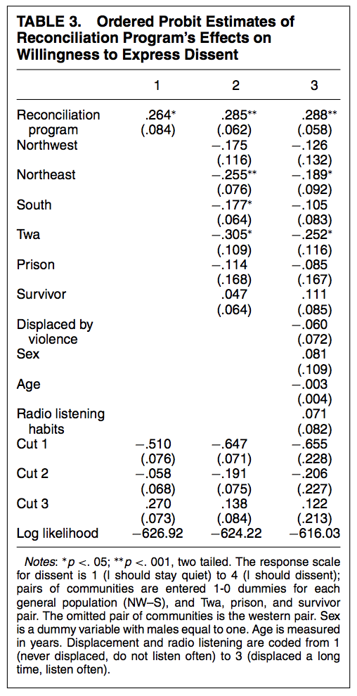

# Ordinal Outcomes {#ordinal}

This section will cover ordinal logit and probit regression. These are models that work well for outcome variables that include a set of (more than 2) ordered discrete categories.

Often, survey responses have this form of outcome (e.g., a likert scale from "strongly agree" to "strongly disagree"). We also might categorize behavioral responses in an ordinal way from "stay home" to "protest", for example.

You can review the following for additional external resources on this section.

  - King, Gary. 1998. *Unifying political methodology: The likelihood theory of statistical inference*. University of Michigan Press. Chapter 5.4.
  - Resources for ordinal models in R [here](http://r-statistics.co/Ordinal-Logistic-Regression-With-R.html) and [here](https://stats.idre.ucla.edu/r/dae/ordinal-logistic-regression/)
  - A section from Gelman and Hill Chapter 6, posted to Canvas.


## Ordinal Outcome Data

Here is a motivating example for the use of ordered data from Paluck and Green "Deference, Dissent, and Dispute Resolution: An Experimental Intervention Using Mass Media to Change Norms and Behavior in Rwanda" which was published in the *American Political Science Review* in 2009. doi:10.1017/S0003055409990128

*Abstract. Deference and dissent strike a delicate balance in any polity. Insufficient deference to authority may incapacitate government, whereas too much may allow leaders to orchestrate mass violence. Although cross-national and cross-temporal variation in deference to authority and willingness to express dissent has long been studied in political science, rarely have scholars studied programs designed to change these aspects of political culture. This study, situated in post-genocide Rwanda, reports a qualitative and quantitative assessment of one such attempt, a radio program aimed at discouraging blind obedience and reliance on direction from authorities and promoting independent thought and collective action in problem solving. Over the course of one year, this radio program or a comparable program dealing with HIV was randomly presented to pairs of communities, including communities of genocide survivors, Twa people, and imprisoned genocidaires ... Although the radio program had little effect on many kinds of beliefs and attitudes, it had a substantial impact on listeners' willingness to express dissent and the ways they resolved communal problems.*

In a field experiment, the authors have randomly assigned participants in different research sites to listen to a radio program over the course of a year that varied in its message. As the authors note, "Because radios and batteries are relatively expensive for Rwandans, they usually listen to the radio in groups. Thus, we used a group-randomized design in which adults from a community listened together either to the treatment (reconciliation) program or to the control program (another entertainment-education radio soap opera about health and HIV)." The authors have 14 clusters without 40 individuals within each cluster.


  - Treatment (`treat`): radio program with one of two messages, where 1=the treatment condition with a reconciliation message and 0=control, listening to a health message.
  - Outcome (`dissent`): Willingness to Display Dissent: An ordered scale with four categories from 1 ("I should stay quiet") to 4 ("I should dissent")

Let's load the data and look at the treatment and outcome.

```{r, warning=FALSE, message=FALSE}
library(rio)
pg <- import("https://github.com/ktmccabe/teachingdata/blob/main/paluckgreen.dta?raw=true")

## Let's treat the outcome as a factor
pg$dissent <- as.factor(pg$dissent)

## Let's visualize the outcome by group
library(ggplot2)
library(tidyverse)
pg %>%
  filter(is.na(dissent)==F) %>%
  ggplot(aes(x=dissent, group=factor(treat), 
               fill=factor(treat)))+
  geom_bar(aes(y=..prop..),stat= "count", position="dodge", color="black")+
  theme_minimal()+
  theme(legend.position = "bottom")+
  scale_fill_brewer("Condition", labels=c("Control", "Treatment"),palette="Paired")+
  scale_x_discrete(labels= c("Should Stay Quiet", "2", "3", "Should Dissent"))
```

We can see variation in the outcome, where some people are at the "stay quiet" end of the scale, while others are at the opposite end. We might have a few questions about the outcome:

  - What is the probability of being in a particular category given a set of $\mathbf{x_i'}$ values? 
  - Does the treatment influence likelihood of expressing dissent?
  - Does the treatment significantly affect the probability of responding in a particular category?

**What model should they use to help answer these questions?**

One approach would be to use OLS. 

  - They could treat 1 to 4 scale as continuous from Should stay quiet to Should dissent
  - If they do this, the interpretation of the regression coefficients would be: 
      + Going from Control to Treatment (0 to 1), is associated with $\hat \beta$ movement on this scale.
  - What could be problematic here?
      + Might go below or above scale points
      + Distance between scale points might not be an equal interval
      + Doesn't answer the "probability" question, just describes movement up and down the scale.

A second approach could be to collapse the scale to be dichotomous and use logit/probit or a linear probability model.

  - For example, they could treat the outcome to 0 = (lean toward stay quiet/stay quiet) vs. 1 (lean toward dissent/dissent)
  - Here, after converting the outcomes in probability, the interpretation would be
      + Going from Control to Treatment (0 to 1), is associated with an average difference in predicted probability of dissent ($Y_i = 1$)
  - What could be problematic here?
      + We lose information.


A third approach--and the focus of this section-- would be to use an ordinal logistic or probit regression.

  - This is appropriate when our goal, at least in part, is to estimate the probability of being in a specific category, and these categories have a natural ordering to them.


### Ordinal Model


With ordered data, we have an outcome variable $Y_i$ that can fall into different, ordered categories: $Y_i \in \{C_1, C_2, \ldots, C_J \}$ with some probability.

```{r,echo=F}
x = seq(-3, 3, .05)
y=dnorm(x)
plot(x, y, type="l", yaxt="n", xaxt="n", ylab="", xlab="", bty="n")
lines(c(-1.5, -1.5), c(0, dnorm(-1.5)))
lines(c(0,0), c(0, dnorm(0)))
lines(c(1, 1), c(0, dnorm(1)))
abline(h=0)
axis(1, c(-1.5, 0, 1), c("z1", "z2", "z3 (J-1)"), tick = F)
text(c(-1.8, -.8,.7,1.5),y=.05, c("C1", "C2", "C3", "C4 (J)"))
```

*The image above shows a distribution where the area under the curve sums to 1, with the area divided into 4 categories, separated by three cutpoints. The area represents probability mass. For example, the area to the left of z1 represents the $Pr(Y_i^\ast \leq z1)$.*


In our ordered model, we assume that there is a latent (unobserved) $Y^\ast_i  = X_i\beta + \epsilon$ 

  - This means we can still have a single model $X_i \beta$, which determines what outcome level is achieved (this requires an assumption).
  - where $\epsilon$ is either assumed to be normally distributed (probit) or distributed logistically (logit), and corresponds to the fuzziness of the cutpoints ($\zeta_j$), which define in which category an outcome is observed to fall.

We observe this category in our outcome: $Y_i$. 

  - For example, we observe if someone said "should stay quiet" or "should dissent" vs. one of the two middle categories.

\begin{gather*}
Y_i=\begin{cases}
C_1 \textrm{ if } Y^\ast_i  \le \zeta_1\\
C_2 \textrm{ if } \zeta_1 < Y^\ast_i  \le \zeta_2\\
C_3 \textrm{ if } \zeta_2 <  Y^\ast_i  \le \zeta_3\\
\ldots\\
C_J\textrm{ if } \zeta_{J-1} < Y^\ast_i \\
\end{cases}\\
\end{gather*}

The $\zeta_j$ are called "cutpoints"

  - Need cutpoints that are distinct, but the distance between cutpoints does not have to be the same. 
      + This can be particularly useful when we have scales that have a natural ordering, but the distance between scale points might not have the same meaning or be the same (e.g., "Agree","Disagree", "Revolt"). This is different from an interval variable, where we assume the difference between scale points carries the same meaning (e.g., credit score, cups of flour in a recipe).
  - Note: There is no intercept in linear prediction model in this case. Instead of the intercept, we have the specific cutpoints.
  - Rule of thumb: Estimation with more than 3-5 categories unstable


### Interpretation

Here is an example of what the ordered probit model output can look like from the authors' paper. You can see coefficients similar to the models we've been working with before but instead of an intercept, we have the different cutpoints, in this case, three cutpoints for $J-1$ categories.




We can interpret the coefficients as a one-unit increase in $x$ has a $\hat \beta$ increase/decrease in the linear predictor scale of $Y^\ast$ (in log-odds for logit or probit z-score standard deviations).

  - This gives us an initial sense (based on sign and significance) of how an independent variable positively or negatively affects the position of $Y*$. However, it does not give us any information about specific categories.
  - Thus, alas, this is unsatisfying for a couple of reasons.
      + $Y_i^\ast$ is an unobserved variable (not the categories themselves)
      + The scale is harder to interpret than probability
  
  - Therefore, we will generally want to convert our estimates into probabilities (our quantities of interest)
      + One wrinkle here is we now have $J$ predicted probabilities to estimate, one for each category.
      + A second wrinkle here is any change in the probability of being in the $jth$ category of $Y$ also affects the probabilities of being in the $\neq jth$ categories because the probabilities of being in each category have to sum together to 1. (E.g., Increasing the probability that someone said "should dissent" affects the probability they said "should stay quiet.)
      


## Likelihood Framework 

In the binary case, we wanted to estimate $Pr(Y_i = 1 | X)$. Our goal in an ordinal model is to estimate the probability that $Y_i$ is in a particular $j$ category $C_j$.

$Pr(Y_i = C_j | X)$

To do so, we are going to use the cumulative distribution functions to estimate the probability that $Y_i$ is below a particular cutpoint $\zeta_j$ or between two cutpoints $\zeta_j$ and $\zeta_{j+1}$.

Finding predicted probabilities for a given $j$ category can be written as follows: $Pr(Y_i|X_i) = \mathbf 1(Y_i=C_j) \{ \Pr(Y^\ast  \le \zeta_{j})- \Pr(Y^\ast  \le \zeta_{j-1})\}$

We can spell this out more explicitly for each $j$ category:

  - $Pr(Y_i = C_{J} | X) =  1 - Pr(Y^\ast\leq \zeta_{J - 1} | X_i)$
  - $Pr(Y_i = C_{3} | X) =  Pr(Y^\ast \leq \zeta_{3} | X_i) - Pr(Y^\ast \leq \zeta_{2} | X_i)$
  - $Pr(Y_i = C_{2} | X) =  Pr(Y^\ast \leq \zeta_{2} | X_i) - Pr(Y^\ast \leq \zeta_{1} | X_i)$
  - $Pr(Y_i = C_{1} | X) =  Pr(Y^\ast \leq \zeta_{1} | X_i)$


Just as in the binary case, we use our $\Phi()$ `pnorm` or $\frac{exp^{X\beta}}{1 + exp^{X\beta}}$ `plogis` functions to get our probabilities from the linear predictors. However, in this ordered case, we also have to include the estimate for the cutpoint $\zeta_j$ when performing this operation. You can kind of think of this as having a separate intercept for each category instead of just one intercept in the binary case.

For example, in the ordinal logit case, the linear predictor is in the scale of log of the proportional-odds. We can write our regression as:

$\log \frac{P(Y \leq j | X)}{P(Y > j | X)} = (\zeta_j - \eta)$ where $\eta = x_1\beta_1 + x_2\beta_2 + ... + x_k\beta_k$

  - To get probability we apply the `plogis` function $logit^{-1}(\zeta_j - \eta)$
  - Same for probit, but we use `pnorm`: $probit^{-1}(\zeta_j - \eta)$

### Likelihood

The likelihood of all observations, assuming independence is:

$\mathcal L(\beta, \zeta | Y) = \prod_{i=1}^{N} Pr(Y_i = C_j)$ for a given category. To incorporate all $J$ categories, we can write:


$\mathcal L(\beta, \zeta | Y) = \prod_{i=1}^{N} \prod_{j=1}^{J} \mathbf 1(Y_i=C_j) \{ \Pr(Y^\ast  \le \zeta_{j}) - \Pr(Y^\ast  \le \zeta_{j-1})\}$ where $\mathbf 1(Y_i=C_j)$ is an indicator for whether or not a given $Y_i$ is observed in the $jth$ category.

Note that here instead of estimating just $\beta$, we now also estimate the cutpoints $\zeta$. 

The log likelihood then just changes this to the sum:

\begin{align*}
\mathcal l(\beta, \zeta | Y) &= \sum_{i=1}^{N} \sum_{j=1}^{J}\mathbf 1(Y_i=C_j) \{  \log( \Pr(Y^\ast  \le \zeta_{j}) - \Pr(Y^\ast  \le \zeta_{j-1}))\}\\
&= \sum_{i=1}^{N} \sum_{j=1}^{J} \mathbf 1(Y_i=C_j) \{\log(\Phi(\zeta_j - \mathbf x_i'\beta) - \Phi(\zeta_{j-1} - \mathbf x_i'\beta))\}
\end{align*}

In addition to assuming independence of our observations, we assume each category has a nonzero probability of being observed and that the cutpoints are monotonically increasing: $\zeta_j < \zeta_{j+1}$.


## Fitting Ordinal Models in R

To fit an ordinal logit or probit model in R, we can use the `MASS` package and `polr` function.

You may need to install this in your RStudio the first time you use it.
```{r, eval=FALSE}
install.packages("MASS")
```

When we are ready to run the model, we then open the package and use the function `polr`. The first inputs are very similar to `lm` and `glm`. However, we add an argument specifying the `method =` which can be "logistic" (the default) or "probit." We also specify `Hess=T` to make sure we get the uncertainty estimates with the results.

  - By the way, why would that argument be called `Hess`?

```{r, message=F, warning=F}
library(MASS)
fit <- polr(as.factor(dissent) ~ treat, data= pg, Hess = T, method = "probit")
summary(fit)
```

To get p-values, we can use the `AER` package.
```{r, message=FALSE}
library(AER)
coeftest(fit)
```

Or calculate manually
```{r}
round(2*pnorm(abs(summary(fit)$coefficients[,3]), 
              lower.tail = F), digits=6)
```

<details> <summary>For details on how to fit this manually in R using `optim`, expand.</summary>

```{r, warning=F, message=F}
# Grab X and Y, listwise deletion
pgsub <- na.omit(cbind(pg$dissent, pg$treat))
Y <- pgsub[,1]
X <- pgsub[, 2]

## Log likelihood in R for this example
llikor <- function(par, Y, X){
  k <- 1 # X columns
  j <- 4 # categories
  beta <- par[1:k]
  zeta <- par[(k+1):length(par)]
  X <-cbind(X)
  beta <- cbind(beta)
  ## linear predictor
  eta <- X %*% beta
  ## indicator variables
  y1 <- ifelse(Y==1, 1, 0)
  y2 <- ifelse(Y==2, 1, 0)
  y3 <- ifelse(Y==3, 1, 0)
  y4 <- ifelse(Y==4, 1, 0)
  ## likelihood for each category
  l1 <- y1*log(pnorm(zeta[1] - eta))
  l2 <- y2*log(pnorm(zeta[2] - eta) - pnorm(zeta[1] - eta)) 
  l3 <- y3*log(pnorm(zeta[3] - eta) - pnorm(zeta[2] - eta)) 
  l4 <- y4*log(1 - pnorm(zeta[3] - eta))
  ## sum together
  llik <- sum(c(l1, l2, l3, l4))
  return(llik)
}

## Optimize
opt.out <- optim(par=c(.2, 1, 2, 3), fn=llikor, X=X, Y=Y, method="BFGS",
      control=list(fnscale=-1), hessian = T)

## Coefficients
opt.out$par[1]
coef(fit)

## Cutpoints
opt.out$par[2:4]
fit$zeta

## Standard errors
sqrt(diag(solve(- opt.out$hessian)))
sqrt(diag(vcov(fit)))
```

</details>

### Quantities of Interest

In discussing the results of Table 3 from the ordered probit analysis in the paper, the authors note, "A shift of .26 probits implies, for example, that a health group respondent with a 30\% chance of strongly agreeing to dissent would move to a 40\% chance if assigned to the reconciliation program group. This is a large, but not implausibly large, shift in opinion."

Similar to the binary case, we can convert our estimates to probability, but here we will do it for specific categories. Let's first conduct an estimate of the difference in probability of being in the top category of dissent for those in the treatment - control conditions.
```{r}
## probability of being in top category
cutpoint3 <- fit$zeta[3]
X <- 1 # in treatment
b <- coef(fit) # coefficient
pp1 <- 1 - pnorm(cutpoint3 - X*b)
X <- 0 # in control
pp0 <- 1 - pnorm(cutpoint3 - X*b)

## difference
pp1 - pp0
```

We recover that there is an 10 percentage point difference in probability predicted for those in the treatment vs. control.


If we were interested in other categories, we could similarly compare probabilities within those. For example, what about category 3?

```{r}
cutpoint3 <- fit$zeta[3]
cutpoint2 <- fit$zeta[2]
X <- 1 # in treatment
b <- coef(fit) # coefficient
pp1 <- pnorm(cutpoint3 - X*b) - pnorm(cutpoint2 - X*b)
X <- 0 # in control
pp0 <- pnorm(cutpoint3 - X*b) - pnorm(cutpoint2 - X*b)
pp1 - pp0
```

We can use our R shortcuts for all categories. Here, to make sure we are in probabilities, we can use `type="probs"`.

```{r}
## predict
prs <- predict(fit, newdata = data.frame(treat = c(0,1)), type = "probs")

## Prediction
library(prediction)
## specify which category
outp <- prediction(fit, at = list(treat = c(0,1)), 
                   category = 1)
summary(outp)$Prediction
```

How can we visualize the results?

  - Given our independent variable of interest, `treat` just has two categories, we could make a plot similar to the barplot at the beginning of the section.
  - When our independent variable of interest has several categories, things can get a bit messier. We will do an example in a weekly tutorial.

How can we get uncertainty? 

  - Like before, we can use bootstrap or simulation, or ask [`Zelig`](https://christophergandrud.github.io/Zelig/articles/zeligchoice_ologit.html) or `margins` to do it for us.

How can we incorporate covariates? 

  - Like before, we would just have a matrix of $X$ covariates instead of a single column for the treatment. 
  - Like before, we could also calculate probabilities holding those covariates at observed values or setting them to designated values of interest.

How could we fit a logit version? 

  - We just switch the `method = "logistic"`, and then we should be careful to also use `plogis()` in place of `pnorm` for the probability calculation.
  - Note: ordered logits also have the benefit of having the odds ratio interpretation when we `exp(coef(fit))` exponentiate the coefficients. See this [post](https://stats.idre.ucla.edu/r/dae/ordinal-logistic-regression/)'s section on "Interpreting the odds ratio" halfway down the page for more information. Again, it is more common in political science to see probabilities than odds ratios, but different disciplines prefer different quantities of interest.


## Assumptions

A key assumption for the ordinal models is Parallel lines/Proportional Odds: We only have one set of $k \times 1$ $\hat \beta$, not a separate set of coefficients for each ordinal category.

  - This means that the relationship between the lowest versus all higher categories of the response variable are assumed to be the same as those that describe the relationship between the next lowest category and all higher categories, etc. 
      + For each $X$ term included in the model, the coefficient 'slopes' are the same regardless of the threshold. If not, we would need a separate set of coefficients describing each pair of outcomes (e.g., Slopes for being in Cat 1 vs. Cat 2; Cat 2 vs. Cat 3, etc.)
  - Even though we have different cutpoint values across categories, a one-unit change, going from control to treatment, the effects are parallel across response categories.
  - For example, if theoretically, being a woman vs. a man has a positive effect on moving between Categories 3 and 4 in a particular model, but you believe it would have the opposite effect for moving from Category 1 to 2, this would suggest the ordinal model is not appropriate.
  
What to do if assumption is violated? Ignore, Do Binary, Do multinomial (discussed in the next session), use a model that has been developed for relaxing this assumption (e.g., see `clm` function in R).

One test for this that has been developed for the ordered logit case is the Brant test.

```{r, warning=F, message=F}
fit.l <- polr(as.factor(dissent) ~ treat, data= pg, 
            Hess = T, method = "probit")

## One way to test this
#install.packages("brant")
library(brant)
brant(fit.l,by.var=F)

## Second way- compare fit of ordinal and multinom models
#install.packages("nnet")
library(nnet)
mlm <- multinom(as.factor(dissent) ~ treat, data=pg)
M1 <- logLik(fit.l)
M2 <- logLik(mlm)
G <- -2*(M1[1] - M2[1])
pchisq(G, 6 - 4,lower.tail = FALSE)
```

  
  
In both cases, our p-value is large enough that we cannot reject the null hypothesis, meaning that we are "okay" sticking with the assumption in this case.


## Ordinal Practice Problems

Here are a few practice problems for ordered models.

  1. Try to replicate column 2 from Table 3 by adding `factor(site_pr)` to the regression model. Note that the standard errors will not exactly match. We will discuss why in a follow-up section.
  2. Calculate the average predicted probability of leaning toward staying quiet (category 2) for the treatment and control group, holding covariates at observed values.
      + Note: If you do this manually, you need to remove the intercept column that is automatically added to the `model.matrix`

  
<details> <summary>Try on your own, and then expand for the solution.</summary>
```{r}
fit.c2 <- polr(as.factor(dissent) ~ treat + factor(site_pr), 
               data=pg, method="probit", Hess =T)
coef(fit.c2)

## Option 1
library(prediction)
p1 <- prediction(fit.c2, at=list(treat=c(0,1)), category=2)
summary(p1)$Prediction

## Option 2
X <- model.matrix(fit.c2)[,-1]
X[, "treat"]<-1
bh <- coef(fit.c2)
eta <- X %*% bh
cutpoint2 <- fit.c2$zeta[2]
cutpoint1 <- fit.c2$zeta[1]
mean(pnorm(cutpoint2 - eta) - pnorm(cutpoint1 - eta))

X[, "treat"] <-0
bh <- coef(fit.c2)
eta <- X %*% bh
cutpoint2 <- fit.c2$zeta[2]
cutpoint1 <- fit.c2$zeta[1]
mean(pnorm(cutpoint2 - eta) - pnorm(cutpoint1 - eta))
```

</details>

