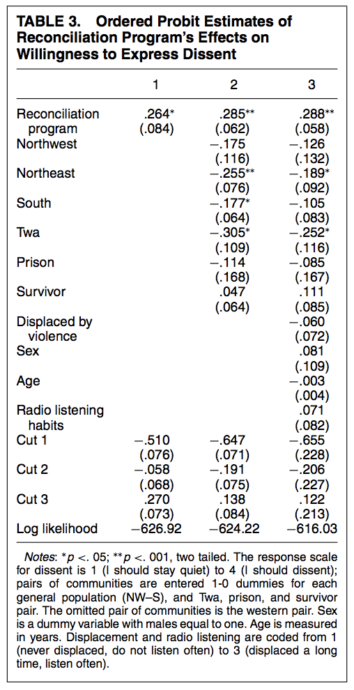
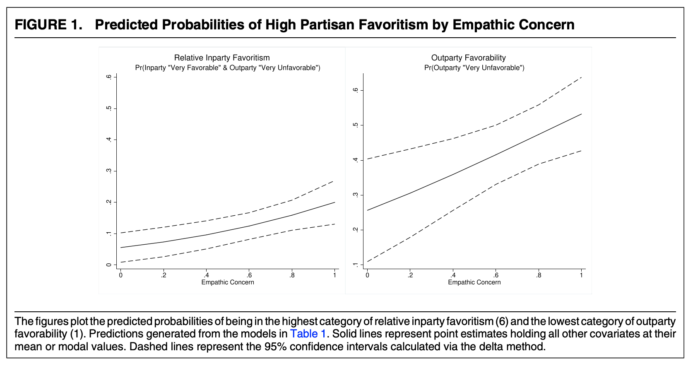

# Ordinal Outcomes {#ordinal}

This section will cover ordinal logit and probit regression. These are models that work well for outcome variables that include a set of (more than 2) ordered discrete categories.

Often, survey responses have this form of outcome (e.g., a likert scale from "strongly agree" to "strongly disagree"). We also might categorize behavioral responses in an ordinal way from "stay home" to "protest", for example.

You can review the following for additional external resources on this section.

  - King, Gary. 1998. *Unifying political methodology: The likelihood theory of statistical inference*. University of Michigan Press. Chapter 5.4.
  - Resources for ordinal models in R [here](http://r-statistics.co/Ordinal-Logistic-Regression-With-R.html) and [here](https://stats.idre.ucla.edu/r/dae/ordinal-logistic-regression/)
  - A section from Gelman and Hill Chapter 6, posted to Canvas.


## Ordinal Outcome Data

Here is a motivating example for the use of ordered data from Paluck and Green "Deference, Dissent, and Dispute Resolution: An Experimental Intervention Using Mass Media to Change Norms and Behavior in Rwanda" which was published in the *American Political Science Review* in 2009. doi:10.1017/S0003055409990128

*Abstract. Deference and dissent strike a delicate balance in any polity. Insufficient deference to authority may incapacitate government, whereas too much may allow leaders to orchestrate mass violence. Although cross-national and cross-temporal variation in deference to authority and willingness to express dissent has long been studied in political science, rarely have scholars studied programs designed to change these aspects of political culture. This study, situated in post-genocide Rwanda, reports a qualitative and quantitative assessment of one such attempt, a radio program aimed at discouraging blind obedience and reliance on direction from authorities and promoting independent thought and collective action in problem solving. Over the course of one year, this radio program or a comparable program dealing with HIV was randomly presented to pairs of communities, including communities of genocide survivors, Twa people, and imprisoned genocidaires ... Although the radio program had little effect on many kinds of beliefs and attitudes, it had a substantial impact on listeners' willingness to express dissent and the ways they resolved communal problems.*

In a field experiment, the authors have randomly assigned participants in different research sites to listen to a radio program over the course of a year that varied in its message. As the authors note, "Because radios and batteries are relatively expensive for Rwandans, they usually listen to the radio in groups. Thus, we used a group-randomized design in which adults from a community listened together either to the treatment (reconciliation) program or to the control program (another entertainment-education radio soap opera about health and HIV)." The authors have 14 clusters without 40 individuals within each cluster.


  - Treatment (`treat`): radio program with one of two messages, where 1=the treatment condition with a reconciliation message and 0=control, listening to a health message.
  - Outcome (`dissent`): Willingness to Display Dissent: An ordered scale with four categories from 1 ("I should stay quiet") to 4 ("I should dissent")

Let's load the data and look at the treatment and outcome.

```{r, warning=FALSE, message=FALSE}
library(rio)
pg <- import("https://github.com/ktmccabe/teachingdata/blob/main/paluckgreen.dta?raw=true")

## Let's treat the outcome as a factor
pg$dissent <- as.factor(pg$dissent)

## Let's visualize the outcome by group
library(ggplot2)
library(tidyverse)
pg %>%
  filter(is.na(dissent)==F) %>%
  ggplot(aes(x=dissent, group=factor(treat), 
               fill=factor(treat)))+
  geom_bar(aes(y=..prop..),stat= "count", position="dodge", color="black")+
  theme_minimal()+
  theme(legend.position = "bottom")+
  scale_fill_brewer("Condition", labels=c("Control", "Treatment"),palette="Paired")+
  scale_x_discrete(labels= c("Should Stay Quiet", "2", "3", "Should Dissent"))
```

We can see variation in the outcome, where some people are at the "stay quiet" end of the scale, while others are at the opposite end. We might have a few questions about the outcome:

  - What is the probability of being in a particular category given a set of $\mathbf{x_i'}$ values? 
  - Does the treatment influence likelihood of expressing dissent?
  - Does the treatment significantly affect the probability of responding in a particular category?

**What model should they use to help answer these questions?**

One approach would be to use OLS. 

  - They could treat 1 to 4 scale as continuous from Should stay quiet to Should dissent
  - If they do this, the interpretation of the regression coefficients would be: 
      + Going from Control to Treatment (0 to 1), is associated with $\hat \beta$ movement on this scale.
  - What could be problematic here?
      + Might go below or above scale points
      + Distance between scale points might not be an equal interval
      + Doesn't answer the "probability" question, just describes movement up and down the scale.

A second approach could be to collapse the scale to be dichotomous and use logit/probit or a linear probability model.

  - For example, they could treat the outcome to 0 = (lean toward stay quiet/stay quiet) vs. 1 (lean toward dissent/dissent)
  - Here, after converting the outcomes in probability, the interpretation would be
      + Going from Control to Treatment (0 to 1), is associated with an average difference in predicted probability of dissent ($Y_i = 1$)
  - What could be problematic here?
      + We lose information.


A third approach--and the focus of this section-- would be to use an ordinal logistic or probit regression.

  - This is appropriate when our goal, at least in part, is to estimate the probability of being in a specific category, and these categories have a natural ordering to them.


### Ordinal Model


With ordered data, we have an outcome variable $Y_i$ that can fall into different, ordered categories: $Y_i \in \{C_1, C_2, \ldots, C_J \}$ with some probability.

```{r,echo=F}
x = seq(-3, 3, .05)
y=dnorm(x)
plot(x, y, type="l", yaxt="n", xaxt="n", ylab="", xlab="", bty="n")
lines(c(-1.5, -1.5), c(0, dnorm(-1.5)))
lines(c(0,0), c(0, dnorm(0)))
lines(c(1, 1), c(0, dnorm(1)))
abline(h=0)
axis(1, c(-1.5, 0, 1), c("z1", "z2", "z3 (J-1)"), tick = F)
text(c(-1.8, -.8,.7,1.5),y=.05, c("C1", "C2", "C3", "C4 (J)"))
```

*The image above shows a distribution where the area under the curve sums to 1, with the area divided into 4 categories, separated by three cutpoints. The area represents probability mass. For example, the area to the left of z1 represents the $Pr(Y_i^\ast \leq z1)$.*


In our ordered model, we assume that there is a latent (unobserved) $Y^\ast_i  = X_i\beta + \epsilon$ 

  - This means we can still have a single model $X_i \beta$, which determines what outcome level is achieved (this requires an assumption).
  - where $\epsilon$ is either assumed to be normally distributed (probit) or distributed logistically (logit), and corresponds to the fuzziness of the cutpoints ($\zeta_j$), which define in which category an outcome is observed to fall. Instead of [fine lines](https://www.youtube.com/watch?v=Ojp71GGm-LQ), we estimate probabilistically in which category $Y_i$ is predicted to fall.

We observe this category in our outcome: $Y_i$. 

  - For example, we observe if someone said "should stay quiet" or "should dissent" vs. one of the two middle categories.

\begin{gather*}
Y_i=\begin{cases}
C_1 \textrm{ if } Y^\ast_i  \le \zeta_1\\
C_2 \textrm{ if } \zeta_1 < Y^\ast_i  \le \zeta_2\\
C_3 \textrm{ if } \zeta_2 <  Y^\ast_i  \le \zeta_3\\
\ldots\\
C_J\textrm{ if } \zeta_{J-1} < Y^\ast_i \\
\end{cases}\\
\end{gather*}

The $\zeta_j$ are called "cutpoints"

  - Need cutpoints that are distinct, but the distance between cutpoints does not have to be the same. 
      + This can be particularly useful when we have scales that have a natural ordering, but the distance between scale points might not have the same meaning or be the same (e.g., "Agree","Disagree", "Revolt"). This is different from an interval variable, where we assume the difference between scale points carries the same meaning (e.g., credit score, cups of flour in a recipe).
  - Note: There is no intercept in linear prediction model in this case. Instead of the intercept, we have the specific cutpoints.
  - Rule of thumb: Estimation with more than 3-5 categories unstable


### Interpretation

Here is an example of what the ordered probit model output can look like from the authors' paper. You can see coefficients similar to the models we've been working with before but instead of an intercept, we have the different cutpoints, in this case, three cutpoints for $J-1$ categories.




We can interpret the coefficients as a one-unit increase in $x$ has a $\hat \beta$ increase/decrease in the linear predictor scale of $Y^\ast$ (in log-odds for logit or probit z-score standard deviations).

  - This gives us an initial sense (based on sign and significance) of how an independent variable positively or negatively affects the position of $Y*$. However, it does not give us any information about specific categories.
  - Thus, alas, this is unsatisfying for a couple of reasons.
      + $Y_i^\ast$ is an unobserved variable (not the categories themselves)
      + The scale is harder to interpret than probability
  
  - Therefore, we will generally want to convert our estimates into probabilities (our quantities of interest)
      + One wrinkle here is we now have $J$ predicted probabilities to estimate, one for each category.
      + A second wrinkle here is any change in the probability of being in the $jth$ category of $Y$ also affects the probabilities of being in the $\neq jth$ categories because the probabilities of being in each category have to sum together to 1. (E.g., Increasing the probability that someone said "should dissent" affects the probability they said "should stay quiet.)
      


## Likelihood Framework 

In the binary case, we wanted to estimate $Pr(Y_i = 1 | X)$. Our goal in an ordinal model is to estimate the probability that $Y_i$ is in a particular $j$ category $C_j$.

$Pr(Y_i = C_j | X)$

To do so, we are going to use the cumulative distribution functions to estimate the probability that $Y_i$ is below a particular cutpoint $\zeta_j$ or between two cutpoints $\zeta_j$ and $\zeta_{j+1}$.

Finding predicted probabilities for a given $j$ category can be written as follows: $Pr(Y_i|X_i) = \mathbf 1(Y_i=C_j) \{ \Pr(Y^\ast  \le \zeta_{j})- \Pr(Y^\ast  \le \zeta_{j-1})\}$

We can spell this out more explicitly for each $j$ category:

  - $Pr(Y_i = C_{J} | X) =  1 - Pr(Y^\ast\leq \zeta_{J - 1} | X_i)$
  - $Pr(Y_i = C_{3} | X) =  Pr(Y^\ast \leq \zeta_{3} | X_i) - Pr(Y^\ast \leq \zeta_{2} | X_i)$
  - $Pr(Y_i = C_{2} | X) =  Pr(Y^\ast \leq \zeta_{2} | X_i) - Pr(Y^\ast \leq \zeta_{1} | X_i)$
  - $Pr(Y_i = C_{1} | X) =  Pr(Y^\ast \leq \zeta_{1} | X_i)$


Just as in the binary case, we use our $\Phi()$ `pnorm` or $\frac{exp^{X\beta}}{1 + exp^{X\beta}}$ `plogis` functions to get our probabilities from the linear predictors. However, in this ordered case, we also have to include the estimate for the cutpoint $\zeta_j$ when performing this operation. You can kind of think of this as having a separate intercept for each category instead of just one intercept in the binary case.

For example, in the ordinal logit case, the linear predictor is in the scale of log of the proportional-odds. We can write our regression as:

$\log \frac{P(Y \leq j | X)}{P(Y > j | X)} = (\zeta_j - \eta)$ where $\eta = x_1\beta_1 + x_2\beta_2 + ... + x_k\beta_k$

  - To get probability we apply the `plogis` function $logit^{-1}(\zeta_j - \eta)$
  - Same for probit, but we use `pnorm`: $probit^{-1}(\zeta_j - \eta)$

### Likelihood

The likelihood of all observations, assuming independence is:

$\mathcal L(\beta, \zeta | Y) = \prod_{i=1}^{N} Pr(Y_i = C_j)$ for a given category. To incorporate all $J$ categories, we can write:


$\mathcal L(\beta, \zeta | Y) = \prod_{i=1}^{N} \prod_{j=1}^{J} \mathbf 1(Y_i=C_j) \{ \Pr(Y^\ast  \le \zeta_{j}) - \Pr(Y^\ast  \le \zeta_{j-1})\}$ where $\mathbf 1(Y_i=C_j)$ is an indicator for whether or not a given $Y_i$ is observed in the $jth$ category.

Note that here instead of estimating just $\beta$, we now also estimate the cutpoints $\zeta$. 

The log likelihood then just changes this to the sum:

\begin{align*}
\mathcal l(\beta, \zeta | Y) &= \sum_{i=1}^{N} \sum_{j=1}^{J}\mathbf 1(Y_i=C_j) \{  \log( \Pr(Y^\ast  \le \zeta_{j}) - \Pr(Y^\ast  \le \zeta_{j-1}))\}\\
&= \sum_{i=1}^{N} \sum_{j=1}^{J} \mathbf 1(Y_i=C_j) \{\log(\Phi(\zeta_j - \mathbf x_i'\beta) - \Phi(\zeta_{j-1} - \mathbf x_i'\beta))\}
\end{align*}

In addition to assuming independence of our observations, we assume each category has a nonzero probability of being observed and that the cutpoints are monotonically increasing: $\zeta_j < \zeta_{j+1}$.


## Fitting Ordinal Models in R

To fit an ordinal logit or probit model in R, we can use the `MASS` package and `polr` function.

You may need to install this in your RStudio the first time you use it.
```{r, eval=FALSE}
install.packages("MASS")
```

When we are ready to run the model, we then open the package and use the function `polr`. The first inputs are very similar to `lm` and `glm`. However, we add an argument specifying the `method =` which can be "logistic" (the default) or "probit." We also specify `Hess=T` to make sure we get the uncertainty estimates with the results.

  - By the way, why would that argument be called `Hess`?

```{r, message=F, warning=F}
library(MASS)
fit <- polr(as.factor(dissent) ~ treat, data= pg, Hess = T, method = "probit")
summary(fit)
```

To get p-values, we can use the `AER` package.
```{r, message=FALSE}
library(AER)
coeftest(fit)
```

Or calculate manually
```{r}
round(2*pnorm(abs(summary(fit)$coefficients[,3]), 
              lower.tail = F), digits=6)
```

<details> <summary>For details on how to fit this manually in R using `optim`, expand.</summary>

```{r, warning=F, message=F}
# Grab X and Y, listwise deletion
pgsub <- na.omit(cbind(pg$dissent, pg$treat))
Y <- pgsub[,1]
X <- pgsub[, 2]

## Log likelihood in R for this example
llikor <- function(par, Y, X){
  k <- 1 # X columns
  j <- 4 # categories
  beta <- par[1:k]
  zeta <- par[(k+1):length(par)]
  X <-cbind(X)
  beta <- cbind(beta)
  ## linear predictor
  eta <- X %*% beta
  ## indicator variables
  y1 <- ifelse(Y==1, 1, 0)
  y2 <- ifelse(Y==2, 1, 0)
  y3 <- ifelse(Y==3, 1, 0)
  y4 <- ifelse(Y==4, 1, 0)
  ## likelihood for each category
  l1 <- y1*log(pnorm(zeta[1] - eta))
  l2 <- y2*log(pnorm(zeta[2] - eta) - pnorm(zeta[1] - eta)) 
  l3 <- y3*log(pnorm(zeta[3] - eta) - pnorm(zeta[2] - eta)) 
  l4 <- y4*log(1 - pnorm(zeta[3] - eta))
  ## sum together
  llik <- sum(c(l1, l2, l3, l4))
  return(llik)
}

## Optimize
opt.out <- optim(par=c(.2, 1, 2, 3), fn=llikor, X=X, Y=Y, method="BFGS",
      control=list(fnscale=-1), hessian = T)

## Coefficients
opt.out$par[1]
coef(fit)

## Cutpoints
opt.out$par[2:4]
fit$zeta

## Standard errors
sqrt(diag(solve(- opt.out$hessian)))
sqrt(diag(vcov(fit)))
```

</details>

### Quantities of Interest

In discussing the results of Table 3 from the ordered probit analysis in the paper, the authors note, "A shift of .26 probits implies, for example, that a health group respondent with a 30\% chance of strongly agreeing to dissent would move to a 40\% chance if assigned to the reconciliation program group. This is a large, but not implausibly large, shift in opinion."

Similar to the binary case, we can convert our estimates to probability, but here we will do it for specific categories. Let's first conduct an estimate of the difference in probability of being in the top category of dissent for those in the treatment - control conditions.

We will follow the formulas outlined above. For the top category (category 4 here) we have:

  - $Pr(Y_i = C_4) = 1 - Pr(Y* \leq \zeta_{4-1} | X_i)$ where our estimate of $Y* = X\hat \beta$.

To calculate this we take $1 -$ `pnorm`$(\zeta_{4-1} - X\hat \beta)$

  - Note that we use `pnorm` because this is a probit model. If it were a logistic model, we would use `plogis` instead.
  - We are estimating the probability that our observation is in category 4, when setting $X$ to particular values. In this case, we will estimate the probability when an observation is in the treatment or control group.

Let's find $X$

```{r}
X <- model.matrix(fit)
head(X)
```
Let's estimate the probability when someone is in the treatment group vs. control group. For this, we will set X to be 1 or 0. Because we only have one coefficient in our model, we actually don't need the entire matrix. For example, once we set `treat` to be 1, all observations (rows) are identical to each other:

```{r}
X[, "treat"] <- 1 # in treatment
head(X)
```
So instead of estimating the outcome for every single row and then take the mean, we could just estimate the outcome for one row given that all rows are identical. In regressions where you have other covariates, those covariates will likely have different values, making the rows distinct. This is a special case where the below code would give identical results.

```{r}
Xt <- cbind(1,1) # A 1 for the intercept and 1 for the treatment
Xc <- cbind(1,0) # A 1 for the intercept and 0 for the treatment (being in the control)
```

By default, R will include an Intercept in the `model.matrix`. We actually do not want this when calculating ordinal regression quantities of interest because the cutpoints will be serving the purpose of the intercept. So we will remove this from $X$, but we will use `as.matrix()` to make sure R will still treat the object like a matrix.

  - If you instead used the full $X$ matrix, the only extra step you would need to do is to take the `mean()` of the probability estimates below (e.g., the mean of `pp1.4`). See the practice problem solution in 8.5 for an example.

```{r}
X <- as.matrix(X[, -1])
head(X)

Xt <- as.matrix(Xt[, -1])
Xt

Xc <- as.matrix(Xc[, -1])
Xc
```
  

  
```{r}
## probability of being in top category
cutpoint3 <- fit$zeta[3] # grab the top cutpoint J - 1, 4-1=3
b <- coef(fit) # coefficients

pp1.4 <- 1 - pnorm(cutpoint3 - Xt%*%b) # prob of top category for treatment
pp1.4
pp0.4 <- 1 - pnorm(cutpoint3 - Xc%*%b) # prob of top category for control
pp0.4
## difference
pp1.4 - pp0.4
```

We recover that there is an 10 percentage point difference in probability of being in the top category of dissent, predicted for those in the treatment vs. control.


If we were interested in other categories, we could similarly compare probabilities within those. For example, what about category 3?

  - Here we just apply a different formula from 8.2:  $Pr(Y_i = C_3) = Pr(Y* \leq \zeta_{3} | X_i) - Pr(Y* \leq \zeta_{2} | X_i) $ where our estimate of $Y* = X\hat \beta$.

To calculate this we take `pnorm`$(\zeta_{3} - X\hat \beta)$ - `pnorm`$(\zeta_{2} - X\hat \beta)$

```{r}
cutpoint3 <- fit$zeta[3]
cutpoint2 <- fit$zeta[2]

pp1.3 <- pnorm(cutpoint3 - Xt%*%b) - pnorm(cutpoint2 - Xt%*%b)
pp1.3

pp0.3 <- pnorm(cutpoint3 - Xc%*%b) - pnorm(cutpoint2 - Xc%*%b)
pp0.3

pp1.3 - pp0.4
```
These represent the estimated probabilities of being in category 3, or the estimated difference in probability of being in category 3 for the treatment vs. control condition.


We can use our R shortcuts for all categories. Here, to make sure we are in probabilities, we can use `type="probs"`.

```{r}
## predict
prs <- predict(fit, newdata = data.frame(treat = c(0,1)), type = "probs")
prs
```
The first row shows the probability of being in each category (1 through 4) for the first entry for the treat variable (0), implying that the observation was in the control group. The second row does the same thing for when the treat variable is 1, implying that the observation was in the treatment group. These should match up with our manual calculations.


The `prediction` package will also work to some extent, which is nice when you have covariates you want to hold at observed values. Note that we put whatever the names of the levels of our variables are. 

  - It just so happens that in this case, both `treat` and our `dissent` outcomes have numbers for the categories. In other cases, you might have text as the category names, in which case you would enter those text values (e.g., "Somewhat Agree" or "Treatment condition") as the variable or category labels.
```{r}
## Prediction
library(prediction)
## specify which category
outp <- prediction(fit, at = list(treat = c(0,1)), 
                   category = "4")
summary(outp)$Prediction
```

Finally, the `margins` package should also work in many cases. You can compare this output with the `pp1.4 - pp0.4` calculation from above.

```{r}
library(margins)
marg.obj <- summary(margins(fit, variables = "treat", change = c(0, 1), 
                            vce="bootstrap", category = "4"))
marg.obj
```


How can we visualize the results?

  - Given our independent variable of interest, `treat` just has two categories, we could make a plot similar to the barplot at the beginning of the section.
  - When our independent variable of interest has several categories, things can get a bit messier. We will do an example in a weekly tutorial.

How can we get uncertainty? 

  - Like before, we can use bootstrap or simulation, or ask [`Zelig`](https://christophergandrud.github.io/Zelig/articles/zeligchoice_ologit.html) or `margins` to do it for us.

How can we incorporate covariates? 

  - Like before, we would just have a matrix of $X$ covariates instead of a single column for the treatment. 
  - Like before, we could also calculate probabilities holding those covariates at observed values or setting them to designated values of interest.

How could we fit a logit version? 

  - We just switch the `method = "logistic"`, and then we should be careful to also use `plogis()` in place of `pnorm` for the probability calculation.
  - Note: ordered logits also have the benefit of having the odds ratio interpretation when we `exp(coef(fit))` exponentiate the coefficients. See this [post](https://stats.idre.ucla.edu/r/dae/ordinal-logistic-regression/)'s section on "Interpreting the odds ratio" halfway down the page for more information. Again, it is more common in political science to see probabilities than odds ratios, but different disciplines prefer different quantities of interest.


## Assumptions

A key assumption for the ordinal models is Parallel lines/Proportional Odds: We only have one set of $k \times 1$ $\hat \beta$, not a separate set of coefficients for each ordinal category.

  - This means that the relationship between the lowest versus all higher categories of the response variable are assumed to be the same as those that describe the relationship between the next lowest category and all higher categories, etc. 
      + For each $X$ term included in the model, the coefficient 'slopes' are the same regardless of the threshold. If not, we would need a separate set of coefficients describing each pair of outcomes (e.g., Slopes for being in Cat 1 vs. Cat 2; Cat 2 vs. Cat 3, etc.)
  - Even though we have different cutpoint values across categories, a one-unit change, going from control to treatment, the effects are parallel across response categories.
  - For example, if theoretically, being a woman vs. a man has a positive effect on moving between Categories 3 and 4 in a particular model, but you believe it would have the opposite effect for moving from Category 1 to 2, this would suggest the ordinal model is not appropriate.
  
What to do if assumption is violated? Ignore, Do Binary, Do multinomial (discussed in the next session), use a model that has been developed for relaxing this assumption (e.g., see `clm` function in R).

One test for this that has been developed for the ordered logit case is the Brant test.

```{r, warning=F, message=F}
fit.l <- polr(as.factor(dissent) ~ treat, data= pg, 
            Hess = T, method = "probit")

## One way to test this
#install.packages("brant")
library(brant)
brant(fit.l,by.var=F)

## Second way- compare fit of ordinal and multinom models
#install.packages("nnet")
library(nnet)
mlm <- multinom(as.factor(dissent) ~ treat, data=pg)
M1 <- logLik(fit.l)
M2 <- logLik(mlm)
G <- -2*(M1[1] - M2[1])
pchisq(G, 6 - 4,lower.tail = FALSE)
```

  
  
In both cases, our p-value is large enough that we cannot reject the null hypothesis, meaning that we are "okay" sticking with the assumption in this case.


## Ordinal Practice Problems

Here are a few practice problems for ordered models.

  1. Try to replicate column 2 from Table 3 by adding `factor(site_pr)` to the regression model. Note that the standard errors will not exactly match. We will discuss why in a follow-up section.
  2. Calculate the average predicted probability of leaning toward staying quiet (category 2) for the treatment and control group, holding covariates at observed values.
      + Note: If you do this manually, you need to remove the intercept column that is automatically added to the `model.matrix`

  
<details> <summary>Try on your own, and then expand for the solution.</summary>
```{r}
fit.c2 <- polr(as.factor(dissent) ~ treat + factor(site_pr), 
               data=pg, method="probit", Hess =T)
coef(fit.c2)

## Option 1
library(prediction)
p1 <- prediction(fit.c2, at=list(treat=c(0,1)), category=2)
summary(p1)$Prediction

## Option 2
X <- model.matrix(fit.c2)[,-1]
X[, "treat"]<-1
bh <- coef(fit.c2)
eta <- X %*% bh
cutpoint2 <- fit.c2$zeta[2]
cutpoint1 <- fit.c2$zeta[1]
mean(pnorm(cutpoint2 - eta) - pnorm(cutpoint1 - eta))

X[, "treat"] <-0
bh <- coef(fit.c2)
eta <- X %*% bh
cutpoint2 <- fit.c2$zeta[2]
cutpoint1 <- fit.c2$zeta[1]
mean(pnorm(cutpoint2 - eta) - pnorm(cutpoint1 - eta))
```

</details>

### A note on robust standard errors

In writing down our likelihood equations, we assume our observations are independent. However, that is not always the case. For example, in Paluck and Green's article, the experimental design is based on clustered pairs, and the treatment is randomly assigned to one unit of a pair. Ideally, we want to account for this non-independence in our model.

In linear models (e.g., using `lm`), this is often accomplished post-estimation by adjusting the standard errors. We might adjust them for clustering if we have a case like the authors' or for suspected heteroskedasticity (maybe the errors are not constant, but instead, are larger for higher values of a given X variable). 

Professor Jeffrey Wooldridge, an expert on econometrics, is a proponent of robust standard errors, given the stringent assumption of homoskedasticity.

{width=60%}

There are many types of these "robust" standard errors, and we may encounter more later in the course. Generally, what each of these robust standard errors does is alter the nature of the variance covariance matrix from which we extract the standard errors. Recall in OLS, we have an expression for the variance of the coefficients that looks like the below. By assuming constant error variance, we can simplify it.

\begin{align*}
\mathbf{V}(\widehat{\beta})  &= (X^T X)^{-1}X^T \mathbf{V}( \epsilon) X (X^T X)^{-1}\\
&= \underbrace{(X^T X)^{-1}X^T \sigma^2I_n X (X^T X)^{-1}}_\text{Assume homoskedasticity}\\
&= \underbrace{\sigma^2(X^T X)^{-1} X^T X (X^T X)^{-1}}_\text{Because it is a constant, we can move it out in front of the matrix multiplication, and then simplify the terms.}  \\
&= \sigma^2(X^T X)^{-1} 
\end{align*}

After we plug in $\hat \sigma^2$ for $\sigma^2$, we arrive at our variance-covariance matrix `vcov`:$\hat \sigma^2(X^T X)^{-1}=\frac{1}{N-K} \mathbf{e'e}(X^T X)^{-1}$

When we don't have constant error variance, we have to pause here:

$(X^T X)^{-1}X^T \mathbf{V}( \epsilon) X (X^T X)^{-1}$

and assume something different about the structure of the error terms in $\mathbf{V}( \epsilon)$ and end up with a different final expression for `vcov`.

The robust estimators differ in how they specify an estimate for $\mathbf{V}( \epsilon) = \Sigma$ and whether they take into account the degrees of freedom in the model (number of observations, number of variables, number of clusters, etc.)


For example, let's fit the authors' model as a linear model using MacKinnon and White HC1 robust standard errors. Those specify the following inside portion for an estimate of $\mathbf{V}( \epsilon)$.This is what Stata uses as a default "robust" standard error:

$\Sigma = \frac{n}{n-k} \text{diag}(\hat \epsilon_i^2)$

This means we have a slightly different term for each observation instead of a constant estimate $\hat \sigma^2$ for all observations.

```{r, warning=F, message=F}
fit.lin <- lm(as.numeric(dissent) ~ treat + factor(site_pr), 
               data=pg)

## Option 1: Adjusting for heteroskedasticity
library(sandwich)
newvcov <- vcovHC(fit.lin, type="HC1")
sqrt(diag(newvcov))

## Option 2: Adjusting for heteroskedasticity
library(estimatr)
fit.lin2 <- lm_robust(as.numeric(dissent) ~ treat + factor(site_pr), 
               data=pg, se_type = "stata")
sqrt(diag(vcov(fit.lin2)))
```


Another adjustment takes into account the grouped or "clustered" nature of the data. Here, we have a separate estimate for each group in the data. This can be implemented in R by using `vcovCL` or the `clusters` argument in `lm_robust`.

```{r}
## Option 1: Adjusting for clustering
library(sandwich)
newvcov <- vcovCL(fit.lin, type="HC1", cadjust=T, cluster = pg$sitcode)
sqrt(diag(newvcov))

## Option 2: Adjusting for clustering
library(estimatr)
fit.lin2 <- lm_robust(as.numeric(dissent) ~ treat + factor(site_pr), 
               data=pg, se_type = "stata", clusters = sitcode)
sqrt(diag(vcov(fit.lin2)))
```


This is all great, but the authors don't have a linear model, they have an ordered probit model. It turns out that people have developed similar robust standard error estimators to adjust the standard errors from these non-linear models. For more details, see slides from [Molly Roberts](https://projects.iq.harvard.edu/files/gov2001/files/sesection_5.pdf) on this point.

These take a slightly different form, but the intuition is the same. What we are altering is the structure of the variance-covariance matrix (which is a function of the Hessian in the likelihood case), making adjustments across all observations or clusters of observations. 

We can also implement these in R using HC0 standard errors.

```{r}
## Adjusting for clustered standard errors
fit.c2 <- polr(as.factor(dissent) ~ treat + factor(site_pr), 
               data=pg, method="probit", Hess =T)
clval <- vcovCL(fit.c2, type="HC0", cluster = pg$sitcode)
```

You can compare these standard errors to column 2 from Table 3 in the paper.
```{r}
sqrt(diag(clval))
```

The `coeftest` function in R, when applied to a new `vcov` will reproduce the full regression output.

```{r}
library(lmtest)
coeftest(fit.c2, vcov=clval)
```


**I got 99 problems, and standard errors are just one**

However, robust standard errors cannot correct underlying model misspecification. Recall that the initial likelihood equation is what assumes independence-- this is the equation we use for everything, not only for computing standard errors but also for estimating the coefficients themselves. If we truly believe we have dependence among our observations, we might consider using an entirely different likelihood function-- one that incorporates this dependence, instead of just adjusting the standard errors after the fact.

Nonetheless, we may still think our model is good enough, even if not "correct." So long as you recognize that the robust standard errors don't correct for this underlying problem, some are still proponents for using robust standard errors in these cases. For example, Wooldridge recommends reporting robust standard errors, and writes, 

{width=60%}
{width=60%}


## Week 6 Tutorial

For this example, we will replicate a portion of the article"How Empathic Concern Fuels Partisan Polarization" by Elizabeth N. Simas, Scott Clifford, and Justin H. Kirkland.published in 2020 in the *American Political Science Review*. Replication files are available [here](https://dataverse.harvard.edu/dataset.xhtml?persistentId=doi:10.7910/DVN/RJL2DK)

Abstract. *Over the past two decades, there has been a marked increase in partisan social polarization, leaving scholars in search of solutions to partisan conflict. The psychology of intergroup relations identifies empathy as one of the key mechanisms that reduces intergroup conflict, and some have suggested that a lack of empathy has contributed to partisan polarization. Yet, empathy may not always live up to this promise. We argue that, in practice, the experience of empathy is biased toward one’s ingroup and can actually exacerbate political polarization. First, using a large, national sample, we demonstrate that higher levels of dispositional empathic concern are associated with higher levels of affective polarization. Second, using an experimental design, we show that individuals high in empathic concern show greater partisan bias in evaluating contentious political events. Taken together, our results suggest that, contrary to popular views, higher levels of dispositional empathy actually facilitate partisan polarization.*

We are going to replicate Study 1's analysis testing Hypotheses 1 and 2. Here, the authors conduct an original survey fielded by YouGov during May 2016 with 1000 respondents. 

Let's load the data. 

  - How many observations do we have?

```{r}
library(foreign)
emp <- read.dta("https://github.com/ktmccabe/teachingdata/blob/main/week6.dta?raw=true")
```

The authors' first two hypotheses are:

  - Empathic concern should predict more positive affect for copartisans, relative to outpartisans (H1).
  - Empathic concern should increase negative affect for outpartisans (H2).

Outcome Measure: "To examine this type of partisan favoritism, we utilize responses to two questions asking respondents to rate the Democratic and Republican Parties on a seven-point scale ranging from "very favorable" to "very unfavorable." We then subtract respondents’ ratings of the opposite party from their ratings of their own party to create an ordinal measure that ranges from six (highest inparty rating, lowest outparty rating) to −6 (lowest inparty rating and highest outparty rating)"

  - `affectpol`: an ordinal measure that ranges from six (highest inparty rating, lowest outparty rating) to −6 (lowest inparty rating and highest outparty rating)"
  - `outfav`: rating of opposing party on a seven-point scale ranging from "very favorable" to "very unfavorable."

Let's take a look at these variables. 

  - Are they coded as the authors describe?
  - What class are they currently?

```{r}
table(emp$affectpol)
class(emp$affectpol)
```

```{r}
table(emp$outfav)
class(emp$outfav)
```


Independent Variables.

  - `empconc`: Mean of empathetic concern items from the Interpersonal Reactivity Index (IRI)
  - Additional variables to measure other dimensions of empathy:
      + `empdist` personal distress, `emppers` perspective taking, `empfant` fantasy
  - Additional controls for strength of party identification `pidext`, ideological extremity `ideoext`, news interest `news`, dummy variable for party membership `dem`, and demographics: `educ`, `age`, `male`, `white`, `inc3miss` (income)


What type of model could they use to test H1 and H2?


They choose to run an ordinal logistic regression. Let's do as they do. To run an ordinal model in R, we need to make sure our outcome is ordinal! (meaning a factor variable)

```{r}
emp$outfav <- as.factor(emp$outfav)
table(emp$outfav)
class(emp$outfav)
```


Go ahead and replicate the first regression in the table with all of the controls, making sure to treat income as a factor variable but education as a numeric variable.


  - Note: your coefficients will not exactly match because the authors weight their data using survey weights.
  
```{r}
library(MASS)
fit.emp <- polr(outfav ~ empconc + empdist + emppers + empfant +
                  + pidext + ideoext + news + dem +
                  as.numeric(educ) + age + male + white + factor(inc3miss),
                data=emp, Hess=T, method="logistic")
summary(fit.emp)
```


  - Let's take a look out how the weights affect the result by using the `survey` package. 
      + There are many options in establishing an `svydesign`. Ours is a relatively simple case where all we have is a vector of weights. In other cases, samples might include information about the sampling units or strata.
      + Once we establish an `svydesign` object, we now need to use `svy` commands for our operations, such as `svymean` or `svyglm` or `svyolr`

```{r, warning=F, message=F}
## install.packages("survey", dependencies =T)
library(survey)
empd <- svydesign(ids=~1, weights = emp$weight_group, data=emp)
fit.empw2 <- svyolr(outfav ~ empconc + empdist + emppers + empfant +
                  + pidext + ideoext + news + dem +
                  as.numeric(educ) + age + 
                    male + white + factor(inc3miss), 
               design=empd, method="logistic")
summary(fit.empw2)
```


The weights seem to make a difference! Now we are closely matching what the authors report. The use of survey weights represents yet another point of researcher discretion. 


Let's use the weighted results and proceed to make them easier to interpret. Recall, H2 was:
*Empathic concern should increase negative affect for outpartisans (H2).*

We want to show how negative affect toward the outparty changes across levels of empathic concern. How should we visualize this?

  1. Could calculate probabilities of being in each of the `outfav` seven categories across different levels of empathetic concern.
  2. Could calculate probabilities of being in theoretically interesting `outfav` categories across different levels of empathetic concern.
  
Note: in each case, we need to decide where to set our covariate values and potentially also calculate uncertainty estimates.

What do they do? (focus on the right side for the out-party measure)



Let's estimate the probability of being in the lowest category for empathy values from 0 to 1 by .2 intervals. ***Let's set all covariates at their observed values.***

  - We could do this in `predict` or manually. We will do it manually for now.

```{r}
## Set covariates to particular values (here, we hold at observed)
X <- model.matrix(fit.empw2)
X <- X[, -1] #remove intercept
X[,"empconc" ] <- 0

# Find Xb and zeta
coef(fit.empw2)
# this piece [1:ncol(X)] makes sure we omit the zetas
# this is only necessary for svyolr. The polr function already omits zetas from coef()
b <- coef(fit.empw2)[1:ncol(X)]
eta <- X %*% b
zeta <- fit.empw2$zeta

## Find Pr(lowest category)
emp0 <- mean(plogis(zeta[1] - eta))
emp0
```

```{r}
## Repeat for each value of empconc of interest
X[,"empconc"] <- .2
# Find Xb and zeta
eta <- X %*% coef(fit.empw2)[1:ncol(X)]
zeta <- fit.empw2$zeta
## Find Pr(lowest category)
emp2 <- mean(plogis(zeta[1] - eta))
emp2
```

```{r}
## Or put it in a function to be faster
findpr <- function(val){
  X[,"empconc"] <- val
  # Find Xb and zeta
  eta <- X %*% coef(fit.empw2)[1:ncol(X)]
  zeta <- fit.empw2$zeta
  ## Find Pr(lowest category)
  pr <- mean(plogis(zeta[1] - eta))
  return(pr)
}
## Does it work? Test
findpr(0)

## Repeat for all values of empathy
emp.prs <- sapply(seq(0, 1, .2), findpr)
emp.prs
```

We can visualize these estimates similar to the authors.

```{r}
plot(x=seq(0, 1, .2),
     y=emp.prs,
     ylim = c(.1, .7),
     type="l",
     xlab = "Empathic Concern",
     ylab = "",
     main = "Outparty Favorability \n Pr(Outparty Very Unfavorable)",
     cex.main=.8)
```

We could add lines for all categories. We'll just add it to the function for now.

```{r}
findprall <- function(val){
  X[,"empconc"] <- val
  # Find Xb and zeta
  eta <- X %*% coef(fit.empw2)[1:ncol(X)]
  zeta <- fit.empw2$zeta
  ## Find Pr(7th lowest category)
  pr7 <- mean(1 - plogis(zeta[6] - eta))
  ## Find Pr(6th lowest category)
  pr6 <- mean(plogis(zeta[6] - eta) - plogis(zeta[5] - eta))
  ## Find Pr(5th lowest category)
  pr5 <- mean(plogis(zeta[5] - eta) - plogis(zeta[4] - eta))
  ## Find Pr(4th lowest category)
  pr4 <- mean(plogis(zeta[4] - eta) - plogis(zeta[3] - eta))
  ## Find Pr(3rd lowest category)
  pr3 <- mean(plogis(zeta[3] - eta) - plogis(zeta[2] - eta))
  ## Find Pr(2nd lowest category)
  pr2 <- mean(plogis(zeta[2] - eta) - plogis(zeta[1] - eta))
  ## Find Pr(lowest category)
  pr1 <- mean(plogis(zeta[1] - eta))
  return(c(pr1, pr2, pr3, pr4, pr5, pr6, pr7))
}
## Repeat for all values of empathy
emp.prsall <- sapply(seq(0, 1, .2), findprall)
```
A note on the survey weights:

  - When we take the `mean()` of our estimates for each observation, we are treating each row of our $X$ matrix as if it should have equal weight in this mean. This is normally fine, but with weighted data, we might instead want to weight the mean, according to the survey weights we used in our regression. The function `weighted.mean` can facilitate this. Either approach is valid, but you may want to remember this distinction and the possibility that you could even incorporate the survey weights at this final stage.


We can add these lines to the plot. Yikes! A bit messy. You can see why they focus on the first category only.

```{r}
plot(x=seq(0, 1, .2),
     y=emp.prsall[1,],
     ylim = c(0, 1),
     type="l",
     xlab = "Empathic Concern",
     ylab = "",
     main = "Outparty Favorability \n Pr(Outparty Very Unfavorable)",
     cex.main=.8)
points(x=seq(0, 1, .2), y=emp.prsall[2,], type="l", lty=2)
points(x=seq(0, 1, .2), y=emp.prsall[3,], type="l", lty=3)
points(x=seq(0, 1, .2), y=emp.prsall[4,], type="l", lty=4)
points(x=seq(0, 1, .2), y=emp.prsall[5,], type="l", lty=5)
points(x=seq(0, 1, .2), y=emp.prsall[6,], type="l", lty=6)
points(x=seq(0, 1, .2), y=emp.prsall[7,], type="l", lty=7)
legend("topleft",  lty=1:7, c("Very Unfav", "2", "3", "4", "5", "6", "Very Fav"), cex=.6)
```


A last step would be to calculate uncertainty. Just like before, we could use simulation or the bootstrap method. In the bootstrap method, the manual calculations would be the "meat" of the bootstrap function that you used in the previous course notes section.

A special note: The `svyolr` function does not appear compatible with the `prediction` function. As an alternative, we could fit the `polr` model with an extra argument for weights. These should produce the same coefficient estimates, though the standard errors might be incorrect. You could potentially use this to generate the raw probability estimates. See for example, estimates for being in category 1 below:

```{r}
fit.emp2 <- polr(outfav ~ empconc + empdist + emppers + empfant +
                  + pidext + ideoext + news + dem +
                  as.numeric(educ) + age + male + white + factor(inc3miss),
                data=emp, Hess=T, method="logistic", weights = emp$weight_group)
summary(fit.emp2)

preds <- prediction(fit.emp2, at=list(empconc = seq(0,1,.2)), category=1)
round(summary(preds), digits=3)

## Compare with the manual approach
round(emp.prsall[1,], digits=3) # category 1
```


