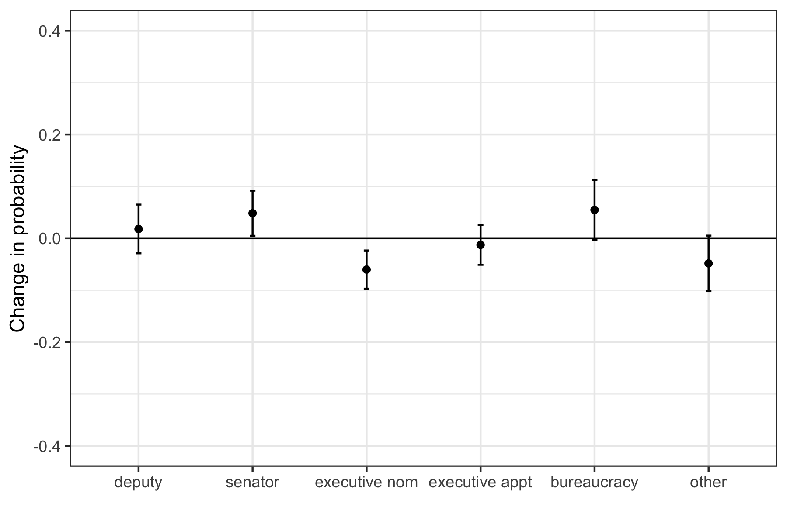
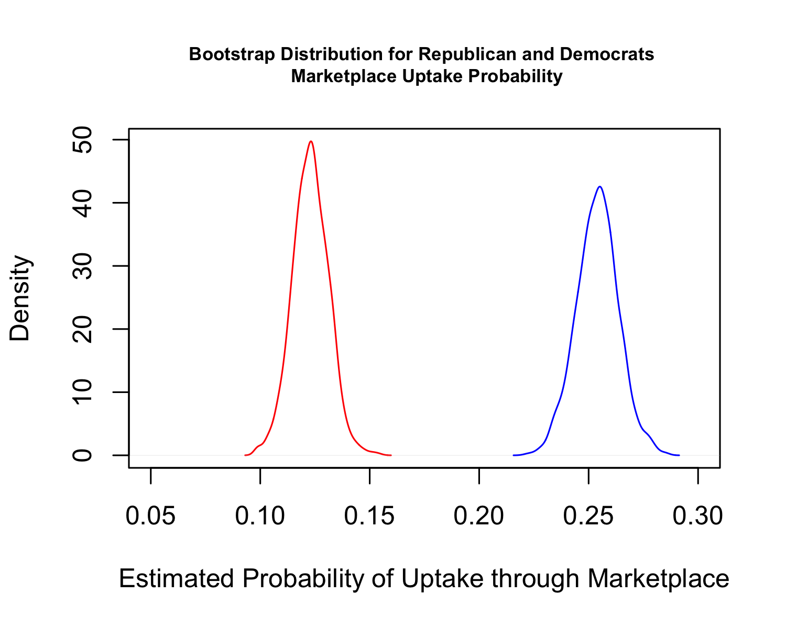

# Multinomial Outcomes {#ml}

This section will describe cases where we have unordered categorical outcome variables.

The following supplemental resources may be useful here.

  - Rodriguez Chapter 6.1-6.2.4 (see pdf on Canvas)
  - Ledolter Chapter 11,  pgs. 132-134 (see pdf on Canvas)
  - Multinomial R resources via [UCLA](https://stats.idre.ucla.edu/r/dae/multinomial-logistic-regression/) 
  

$Y_i$ can take any of $J$ categories like ordinal logit. Usually, we use this for more than 2 categories, or else it would collapse to a simple binary outcome. The key here is these are not ordered! 

  - For example, a nominal set of categories might be vote choice between different candidates, 
  - Instead, it could be choice of different investment or insurance plans,
  - Perhaps it is a choice of locations to target in an attack,
  - Or maybe it is a type of campaign strategy-- direct mail vs. online ads, etc.
 
## Overview of Nominal Data
  
Our goal in these models is generally to predict the probability of being in a particular category $C_j$.  

The model we will use to estimate this is the multinomial logit.

  - This is a generalization of binary and ordered logit. 
  - Coefficients defined relative to baseline outcome category $J$: 
  
  $\log \frac{\pi_j}{\pi_J} = \eta_j$ where $\eta_j = \alpha_j + X_1\beta_{1j} + X_2\beta_{2j} + ... X_k\beta_{kj}$ 
  
  - Note that $\pi_i$ (our probability) is now indexed by $j$ or $J$
      + This means we have more than just one set of estimates for $\hat \beta$, depending on the category comparison we make 
      + (Recall that in ordinal logit we had to assume that one set of coefficients was sufficient. Here, we have $J-1$ sets of coefficients.)
  - $\beta_J = 0$ by design for identification ($J$ represents the baseline category); 
  - $\sum_{j=1}^{J} \pi_j  = 1$, The probabilities of being in each category, together, must sum to 1.
  - $Y_i = C_j$ according to $Y_{ij}^* = max(Y_{i1}^*, Y_{i2}^*, ..., Y_{ij}^*)$. The outcome belongs to the category that has the highest $Y_i*$.
  - The probability of $Y_i$ being in a particular category is:

\begin{align*}
\pi_{ij} = Pr(Y_i = C_j | x_i) &= \frac{\exp(\mathbf x_i^T\beta_j)}{1 + \sum_{j=1}^{J-1} \exp(\mathbf x_i^T\beta_j)}
\end{align*}


### Multinomial Likelihood

Here, similar to the ordinal log likelihood, we need to sum over all observations and all outcome categories to represent the joint probability:

$\mathcal L(\beta, | Y) = \prod_i^N \prod_{j=1}^{J} \mathbf 1(Y_i=C_j){\pi_{i, j}}$

$\mathcal l(\beta, | Y) = \sum_i^N \sum_{j=1}^{J} \mathbf 1(Y_i=C_j){\log \pi_{i, j}}$

Like we have done previously in likelihood, where $\pi$ is a function of $X$ and $\beta$.

## Motivating Example

To work through the model we will use data from the article "Empowering Women? Gender Quotas and Women's Political Careers" by Yann Kerevel, in *The Journal of Politics* [here](https://www.journals.uchicago.edu/doi/pdf/10.1086/704434)

*Women’s representation in executive office continues to lag behind that of their female peers in legislatures, and several studies find women face an executive glass ceiling. One way to shatter this executive glass ceiling is through the adoption of legislative gender quotas. However, scholars know little about how legislative quotas affect women’s access to executive office. Previous research has been unable to determine whether once elected through quotas, women advance to executive office at similar rates to men. Using data on the future career paths of nearly 2,000 Mexican legislators, I find women face a glass ceiling in winning nomination to executive office. Using career data before and after quota implementation, and exploiting lax enforcement in the district component of the mixed electoral system, I find quotas have done little to increase the advancement of women into executive office, although they have increased opportunities for women in other legislative positions.*

On pg. 1169, Kerevel writes, "If a glass ceiling exists, women may find it harder to advance to executive office compared to men. Female legislators may still be able to develop successful political careers in similar roles, such as seeking reelection, winning nomination to other legislative offices, or receiving some type of political appointment. However, women may be less likely than men to secure executive nominations to elected positions or appointments to important cabinet posts. The introduction of gender quotas is unlikely to shatter this glass ceiling given the numerous ways women are marginalized once elected and the general lack of executive quotas."

The first hypothesis following this claim is:
  
  - H1. Glass ceiling- Women legislators will be nominated to future executive office at lower rates than men.
  
We will focus on this first hypothesis, but if you are interested, the author also discusses specific hypotheses related to the potential negative and positive effects of gender quotas in the paper.

**Data**

The data include information on the future career moves of nearly 2000 Mexican federal deputies who served between 1997-2009. 

  - Outcome: `genderimmedambcat3`, first future career move
      + ballot access for state legislature/city council, for Senate, for mayor/governor; appointment to cabinet or party leadership; bureaucratic appointment; other office
  - Explanatory variables: `female, party_cat, leg_exp_dum, exec_exp_dum, leadership`


Let's load the data and take a look at the outcome variable.
```{r}
library(foreign)
ker <- read.dta("https://github.com/ktmccabe/teachingdata/blob/main/kerevel.dta?raw=true")

table(ker$genderimmedambcat3)
```

The outcome categories focus on *nominations* to these offices (i.e., ballot access), as the author finds that gender has less to do with electoral success. 


### Assumption and Considerations

Let's focus on the author's research question. How could we evaluate this relationship? The [UCLA](One problem with this approach is that each analysis is potentially run on a different sample.) site has a good discussion of these tradeoffs.

  - One option would be to collapse this to a more simple problem of multiple separate binary logit models comparing two outcome categories at a time. 
      + One possible issue is there is no constraint such that multiple pairwise logits won't generate probabilities that when summed together exceed 1. Another is that each pairwise comparison might involve a slightly different sample. In contrast, the multinomial logit uses information from all $N$ observations when jointly estimating the likelihood.
      
  - A second option would be to collapse the outcome categories down to two levels only (E.g., 1=Mayor/governor or Bureaucrat vs. 0=Otherwise)
      + Just like we said collapsing a scale in ordinal models loses information, the same thing would happen here. This only makes sense to do in a case where a collapseed scale is theoretically interesting.
  
  - Assess the scale-- maybe the categories actually are ordered!
      + Think about whether the categories actually could be considered ordered or even on an interval scale. If that is the case, then you might be able to return to a linear or ordinal model.

Instead, if we want to keep the nominal categories as they are, and we believe they are not ordered, we can move forward with the multinomial model.

  - If we do so, we will want to make sure we have enough data in each outcome category to feel comfortable estimating the predicted probability of being in that category. We also want to avoid situations where there is no variation in our independent variables for a given outcome category (e.g., maybe only men were nominated for mayor/governor)
      + If we run into those situations, we might need more data or think about alternative modelling strategies.


### Key Assumption: Independence of Irrelevant Alternatives

The IIA assumption requires that our probability of choosing a particular outcome over another (A over B) does not depend on the choice set, in particular, the presence or absence of some choice C.

Classic case: bus example

  - Suppose you have the transportation choice set below, where the numbers are the probabilities of choosing a particular form of transportation.
  - Choice set: \{train, red bus, blue bus\} = \{.5, .25, .25\}
       + Choice set: \{train, red bus\} = \{.5, .5\}--Violates IIA
       + Choice set: \{train, red bus\} = \{2/3, 1/3\}--Does not violate IIA

The is because we assume the independence of the error terms $\epsilon_i$ across choices. In a multinomial probit model, this can be relaxed. However, multinomial probit is very computationally intensive, often not used.


## Running multinomial logit in R

The multinomial specification will estimate coefficients that are relative to a baseline level of the outcomes. We should be thoughtful about what we choose as the baseline so that the coefficients are useful to us. Here, the author chooses to use "other" as the baseline.

In R, we can easily change the baseline level of a factor variable. So first, we should check the class of the outcome variable and convert it into a factor variable if needed.
```{r}
class(ker$genderimmedambcat3)
```

We can then adjust the baseline level using the `relevel` command as has the `ref` argument for specifying a reference category.

```{r}
## Sets a level as the base category for the factor
ker$genderimmedambcat3 <- relevel(ker$genderimmedambcat3, ref = "other")
```

Let's run a simple regression model with just `female` as a covariate to see how the regression output differs from other models we have used thus far.

```{r, message=F}
## install.packages("nnet")
library(nnet)
fit0 <- multinom(genderimmedambcat3 ~ factor(female), data = ker)
```

You can see that there is now a set of coefficients-- Intercept and for female, for each outcome category-baseline comparison. We also do not automatically have the p-values for the output.

We can find the p-values the same way we have done before by calculating z-scores through the division of the coefficients over the standard errors. Once we have the z-scores we can use `pnorm` the same way we did in the ordinal section.


```{r}
z <- summary(fit0)$coefficients/summary(fit0)$standard.errors
p <- as.matrix(2*(pnorm(abs(z), lower.tail = F)))
p
```


As you can see, the output here for the coefficients is already messy, and we only have one covariate!! Just imagine how messy it can get with several covariates. Often, because of this, researchers move to present results visually instead. The practice problems will include a chance to replicate one of the author's visuals from the JOP paper.

### Multinomial Quantities of Interest

Like the previous models, we can calculate predicted probabilities at specific values of our $X$ covariates. What differs here is just the specific form of this function.

Predicted probabilities of the outcome being in a particular outcome category $C_j$: 

  - $Pr(Y_i = C_j | X) = \frac{\exp(X\hat \beta_j)}{1 + \sum_{j=1}^{J-1} \exp(X \hat \beta_j)}$
      + The numerator is very similar to the numerator for when we have a binary logistic regression
      + The denominator sums up $\exp(X \hat \beta_j)$ where $\hat \beta_j$ represents the set of coefficients for each outcome category except for the baseline (i.e., $J- 1$ means 1 less than the total number of outcome categories).
      + Recall that in the baseline category $J$, $\hat \beta_J$ is forced to 0 to help with the estimation or "identification" of the other coefficients relative to that category. Well why bring that up now? Well, $exp(X \hat \beta_J) = exp(0) = 1$. When we estimate probabilities in the baseline category, the numerator will just be 1.

Let's take an example of finding the predicted probability of $C_j$ = Senate ballot access when $x_i$ is set to be female = 1.

```{r}
## Create the model matrix
Xfemale <- cbind(1, 1) # 1 for intercept, 1 for female

## Extract coefficients and give them informative labels
Bsenate <- coef(fit0)[2,] # 2nd row of coefficients
Bdep <- coef(fit0)[1,]
Bmayor <- coef(fit0)[3,]
Bcabinet <- coef(fit0)[4,]
Bbur <- coef(fit0)[5,]

## Probability of senate ballot access for female
exp(Xfemale %*% Bsenate)/ (1 + exp(Xfemale %*% Bsenate) + exp(Xfemale %*% Bdep) +
                             exp(Xfemale %*% Bmayor) + exp(Xfemale %*% Bcabinet) +
                             exp(Xfemale %*% Bbur))
```

Let's do the same for female = 0. We just need to change X.
```{r}
Xnfemale <- cbind(1, 0)
exp(Xnfemale %*% Bsenate)/ (1 + exp(Xnfemale %*% Bsenate) + exp(Xnfemale %*% Bdep) +
                             exp(Xnfemale %*% Bmayor) + exp(Xnfemale %*% Bcabinet) +
                             exp(Xnfemale %*% Bbur))
```


We might also be interested in the probability of $C_j$ = other. The syntax here will look slightly different because "other" was the baseline category. The denominator stays the same, but the numerator is just 1.

```{r}
## Manual- probability of other for female (the base category)
1/ (1 + exp(Xfemale %*% Bsenate) + exp(Xfemale %*% Bdep) +
                             exp(Xfemale %*% Bmayor) + exp(Xfemale %*% Bcabinet) +
                             exp(Xfemale %*% Bbur))
```

Just like in the other models, we can rely on outside packages, too. For some models, these packages are not going to have full capabilities-- they might not be able to calculate standard errors, for example. These are "living packages" so you can always check the documentation and update the packages to see if new capabilities have been added.

```{r, message=F, warning=F}
library(prediction)
p.senate <- prediction(fit0, at  = list(female = 1))
mean(p.senate$`Pr(senate ballot access)`)
mean(p.senate$`Pr(other)`)
```

We can use `margins` to calculate the difference in predicted probabilities, for example, between `female=1` and `female=0`. We should specify the category for which we want this comparison. It appears we need to set `vce = booststrap` for this to work.
```{r, message=F, warning=F, eval=F}
library(margins)
m.senate <- margins(fit0, variables = "female", category = "senate ballot access", 
                    vce="bootstrap", change=c(0,1))
summary(m.senate)
```


Of course, we could also do this manually, and run the bootstrap ourselves!


## Practice Problems for Multinomial

We will try to replicate a portion of the analysis from the paper. Note that different multinomial functions in R and in Stata (which the author used) might rely on slightly different optimization and estimation algorithms, which in smaller samples, might lead to slightly different results. This is one place where your results might not **exactly** match the authors', but they should be close.

  1. Let's try to replicate Figure 1a in the paper (which corresponds to Table 1a in the appendix), which shows the average marginal effect of being female vs. male on the first future career move, for each outcome category in the data.
      + In addition to the `female` covariate, the author includes covariates for `party_cat` (party identification), `leg_exp_dum` and `exec_exp_dum` (legislative and executive experience), and `leadership` (chamber leadership experience) which are each treated as factor variables in the regression.
      + We should set `party_cat` to have the baseline of `PRI` to match the author.
  
```{r}
ker$party_cat <- relevel(as.factor(ker$party_cat), ref="PRI")
```
  

 


The author sets covariates to observed levels when estimating the marginal effects.

  2. Based on the marginal effects, how would you evaluate the author's hypothesis on the effect of gender on future career moves to executive office?
  

<details> <summary>Try on your own and then expand for the solution.</summary>

```{r, message=FALSE, warning=FALSE, eval=F}
fit2 <- multinom(genderimmedambcat3 ~ factor(female) + party_cat + factor(leg_exp_dum) + 
                   factor(exec_exp_dum) + factor(leadership), data=ker)
library(margins)
marg.effect.execnom <- margins(fit2, variables="female", change=c(0, 1), vce= "bootstrap", category="mayor/gov ballot access")
marg.effect.deputy <- margins(fit2, variables="female", change=c(0, 1), vce= "bootstrap", category="deputy/regidor ballot access")
marg.effect.senator <- margins(fit2, variables="female", change=c(0, 1), vce= "bootstrap", category="senate ballot access")
marg.effect.execappt <- margins(fit2, variables="female", change=c(0, 1), vce= "bootstrap", category="cabinet/party leader")
marg.effect.bureau <- margins(fit2, variables="female", change=c(0, 1), vce= "bootstrap", category="bur appt")
marg.effect.other <- margins(fit2, variables="female", change=c(0, 1), vce= "bootstrap", category="other")
```

Let's make a visual close to the authors using `ggplot`. Recall, `ggplot` is easiest to work with when the data you want to plot are in a data.frame. So we are going to bind together the summary output and specify which row corresponds to which outcome.
```{r, message=FALSE, warning=FALSE, eval=F}
mcomb <- data.frame(rbind(summary(marg.effect.execnom), 
                          summary(marg.effect.deputy), 
                          summary(marg.effect.senator), 
                          summary(marg.effect.execappt),
                          summary(marg.effect.bureau), 
                          summary(marg.effect.other)))
mcomb$outcome <- c("executive nom", "deputy", "senator", "executive appt", "bureaucracy", "other")
mcomb$outcome <- factor(mcomb$outcome, levels = c("deputy", "senator", "executive nom", "executive appt", "bureaucracy", "other"))
```

We can now use `geom_point` and `geom_errorbar` to plot the AME point estimates and bootstrap confidence intervals.

```{r, message=FALSE, warning=FALSE, eval=F}
library(ggplot2)
ggplot(mcomb, aes(x=outcome, y=AME))+
  geom_point()+
  geom_errorbar(aes(ymin=lower, ymax=upper), width=.05)+
  theme_bw()+
  ylim(-.4, .4)+
  geom_hline(yintercept=0)+
  ylab("Change in probability")+
  xlab("")
ggsave("images/kerplot.png", device="png", width=6, height=4)
```




Based on this analysis, women have a significantly lower probability of being nominated for a future mayoral or gubernatorial position, which aligns with the author's hypothesis.

</details>


## Week 7 Tutorial

For this exercise, we will use data from Amy Lerman, Meredith Sadin, and Samuel Trachtman's 2017 article in the *American Political Science Review*, "[Policy Uptake as Political Behavior: Evidence from the Affordable Care Act](https://www.cambridge.org/core/journals/american-political-science-review/article/abs/policy-uptake-as-political-behavior-evidence-from-the-affordable-care-act/98F8D71C0336627AE97A357D2F145C27)." 

*Abstract. Partisanship is a primary predictor of attitudes toward public policy. However, we do not yet know whether party similarly plays a role in shaping public policy behavior, such as whether to apply for government benefits or take advantage of public services. While existing research has identified numerous factors that increase policy uptake, the role of politics has been almost entirely overlooked. In this paper, we examine the case of the Affordable Care Act to assess whether policy uptake is not only about information and incentives; but also about politics. Using longitudinal data, we find that Republicans have been less likely than Democrats to enroll in an insurance plan through state or federal exchanges, all else equal. Employing a large-scale field experiment, we then show that de-emphasizing the role of government (and highlighting the market's role) can close this partisan gap.*


In a portion of their analysis, they use survey data to assess the relationship between partisanship and insurance uptake through the ACA marketplaces. The researchers' hypothesis is:

*First, we expect that partisanship will be a strong predictor of policy behavior. In the case of the ACA, we anticipate that Republicans—who on average are much less supportive of the health insurance reform and are generally more resistant to government intervention in the private market—will be less likely than Democrats to take advantage of health insurance options provided by the ACA.*

Key variables include

  - `ins`: insurance status, 1="uninsured", 3= "marketplace", 4= "private"
  - `republican`: 1= Republican, 0= Democrat
  - `age2`: numeric variable for age
  - `ed`: education level of respondent
  - `racethn`: race/ethnicity of respondent
  - `income2`: categorical income of respondent
  - `sex`: sex of respondent
  - `state` : respondent's state of residence (coded as a FIPs code)
  - `empl2`: respondent's employment status
  - `date`: date of the survey poll

Let's load the data and look at the outcome `ins`.
```{r}
library(foreign)
library(nnet) # install this package
lst <- read.dta("https://github.com/ktmccabe/teachingdata/blob/main/lst.dta?raw=true")
```

```{r}
table(lst$ins)
```


Let's assess the research question. 

  1. Our goal is to understand the relationship between party identification and uptake of ACA marketplace insurance. What are the possible ways we could model this relationship given our outcome data?
  2. Let's suppose we decided to go with the multinomial logistic regression.
      - What `class()` should our outcome variable be?
      - What would make sense to use as a baseline category?

<details> <summary>Go ahead and recode the variable as necessary.</summary>

Even if your variable is a factor, I would recommend giving it informative labels instead of numbers so that it is easier to interpret the regression outcome.

```{r}
class(lst$ins)
lst$ins <- as.factor(ifelse(lst$ins == 1, "uninsured",
                  ifelse(lst$ins == 3, "marketplace",
                         ifelse(lst$ins == 4, "private", NA))))
lst$ins <- relevel(lst$ins, ref = "marketplace")
```

</details>

Let's conduct a multinomial logistic regression of the following form:

$\log \frac{ \pi_{j}}{ \pi_{J}} = \alpha_{ij} + Republican_i\beta_{kj} + 
age2_i \beta_{j} + ed_i\beta_{kj}  + racethn_i \beta_{kj} + income2_i\beta_{kj} + sex_i\beta_{kj}  + empl2_i\beta_{kj}$

where all covariates are treated as factor variables.

<details> <summary>Run the model.</summary>

```{r}

fit <- multinom(as.factor(ins) ~ republican + age2 + factor(ed)
                + factor(racethn) + factor(income2)
                + as.factor(sex) 
                + as.factor(empl2), data = lst)

```

</details>

Let's consider our assumptions.

  3. What is a key assumption of the multinomial logistic regression model?
      - How could it potentially be violated in the authors' case?

<details> <summary>Expand for one example.</summary>
The key assumption is the IIA assumption. The authors consider potential violations to this assumption in footnote 4. "Consistent estimation using the multinomial logistic model relies on the Independence of Irrelevant Alternatives (IIA) assumption, which requires that the choice of one of the available options does not depend on whether some alternative option is present. While this assumption is hard to test (Allison 2012), there is some evidence that it could be violated in this case, with the presence of the "uninsured" option affecting the distribution of choices across private and marketplace insurance. Thus, as a robustness check, we also estimate a model in which we first analyze the decision to insure (for the study population), and second, conditional on having insurance, analyze the private versus marketplace choice."
  
</details>

Let's assume we are okay with our assumptions. Let's now try to use the model to evaluate the research hypothesis.

  4. First, we should get comfortable extracting coefficients from multinomial output.
      - Extract the coefficients on the Republican covariate and their standard errors
      - Calculate z-scores and p-values
      - Assess the statistical significance
      - Provide an initial evaluation of the authors' research hypothesis

Note that `coef(fit)` is now a matrix of output. We want to extract the `republican` column.      
```{r}
repcoef <- coef(fit)[, "republican"]
repse <- summary(fit)$standard.errors[, "republican"]

## Calculate z-scores
rep.zs <- repcoef/repse
rep.ps <- 2*(pnorm(abs(rep.zs), lower.tail = F))

round(cbind(repcoef, rep.zs, rep.ps), digits=3)
```
      

Let's now transform these into quantities of interest that closely evaluate the research question.

  5. What quantity of interest should we estimate?
      - Compute the quantity of interest
      - Compute uncertainty
      - Consider ways to visualize the results


<details> <summary>Quantity of Interest calculation.</summary>

Let's calculate the average difference in predicted probability of signing up for marketplace insurance for Republicans vs. Democrats, holding covariates at observed values.

Recall from above that the probability of $Y_i$ being in a particular category is:

\begin{align*}
Pr(Y_i = C_j |X) &= \frac{\exp(\mathbf x_i^T\beta_j)}{1 + \sum_{j=1}^{J-1} \exp(\mathbf x_i^T\beta_j)}
\end{align*}

Recall that marketplace insurance is the baseline category. So this means our formula is 

\begin{align*}
Pr(Y_i = Marketplace | X) &= \frac{1}{1 + \sum_{j=1}^{J-1} \exp(\mathbf x_i^T\beta_j)}
\end{align*}

```{r}
## Point estimates
Xrep <- model.matrix(fit)
Xrep[, "republican"] <- 1

Xdem <- model.matrix(fit)
Xdem[, "republican"] <- 0

## Extract all coefficients
B <- t(coef(fit))
Bprivate <- coef(fit)[1, ]
Buninsured <- coef(fit)[2, ]


## Approach one
repmarket.p <- mean(1 / (1 + exp(Xrep %*% Bprivate) + exp(Xrep %*% Buninsured)))
demmarket.p <- mean(1 / (1 + exp(Xdem %*% Bprivate) + exp(Xdem %*% Buninsured)))
diffmarket.p <- repmarket.p- demmarket.p

## Approach two (easier when you have a lot of outcome categories)
repmarket.p <- mean(1 / (1 + rowSums(exp(Xrep %*% B))))
demmarket.p <- mean(1 / (1 + rowSums(exp(Xdem %*% B))))
diffmarket.p <- repmarket.p - demmarket.p
diffmarket.p 
```

```{r, eval=FALSE}
## Approach three
library(margins)
marg.effect.market <- margins(fit, variables="republican", change=c(0, 1), 
                              vce= "bootstrap", category="marketplace")
summary(marg.effect.market)
```

</details>


<details> <summary>Uncertainty calculation.</summary>

We can use the simulation or bootstrap approach like before to calculate uncertainty. We will use the bootstrap because the syntax for the simulation approach is more complicated because our coefficients are in a matrix. The package [Zelig](http://docs.zeligproject.org/articles/zeligchoice_mlogit.html) has this capability. Simulation can be more faster given the multinomial model takes a moment to run.

```{r, eval=FALSE}
## Bootstrap
myboot <- function(df){
  
  wrows <- sample(1:nrow(df), size=nrow(df), replace = T)
  subdata <- df[wrows, ]
  
  fit.boot <- multinom(as.factor(ins) ~ republican + age2 + factor(ed)
                + factor(racethn) + factor(income2)
                + as.factor(sex) 
                + as.factor(empl2), data = subdata)
  
  ## Point estimates
  Xrep <- model.matrix(fit.boot)
  Xrep[, "republican"] <- 1

  Xdem <- model.matrix(fit.boot)
  Xdem[, "republican"] <- 0

  ## Extract all coefficients
  B <- t(coef(fit.boot))
  Bprivate <- coef(fit.boot)[1, ]
  Buninsured <- coef(fit.boot)[2, ]

  ## Approach one
  repmarket.p <- mean(1 / (1 + exp(Xrep %*% Bprivate) + exp(Xrep %*% Buninsured)))
  demmarket.p <- mean(1 / (1 + exp(Xdem %*% Bprivate) + exp(Xdem %*% Buninsured)))
  diffmarket.p.boot <- repmarket.p- demmarket.p

  return(cbind(repmarket.p, demmarket.p, diffmarket.p.boot))
}

myboot.ests <- do.call("rbind", replicate(1000, myboot(lst), simplify = F))


## Confidence intervals around the difference
cis.diff <- quantile(myboot.ests[, "diffmarket.p.boot"], c(0.025, 0.975))
cis.diff

## Visualize the two distributions
png("images/boostrappid.png", res=300, width=5, height=4, units="in")
plot(density(myboot.ests[, "repmarket.p"]), col="red",
     main = "Bootstrap Distribution for Republican and Democrats \n Marketplace Uptake Probability",
     cex.main = .7,
     xlim = c(0.05, .3),
     xlab="Estimated Probability of Uptake through Marketplace")
points(density(myboot.ests[, "demmarket.p"]), col="blue", type="l")
dev.off()
```




</details>
