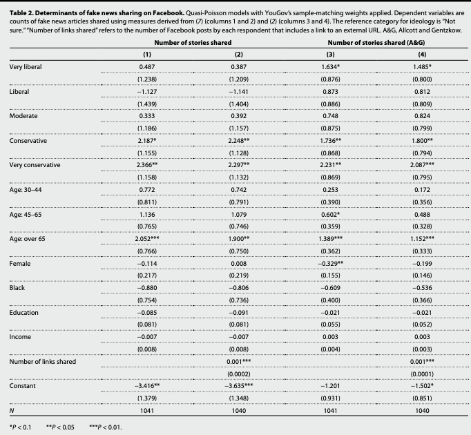

# Count data {#count}

In this section, we will talk about models that are appropriate for estimating outcomes that are structured as "count data"-- non-negative integer data.

The key characteristics of count data are:

  - $Y$ is not continuous and $Y_i \geq 0$
  - Typically the count can be small for many observations (not always)
  - Describes number of occurrences in a specified time period (the observation period) or space (e.g., per state) (e.g., vetoes during a term in office)

The following supplemental resources may be useful:

  - King, Gary. 1998. Unifying political methodology: The likelihood theory of statistical inference. University of Michigan Press. Chapters: 5.5-5.10
  - Gelman and Hill Chapter 6. (on Canvas)
  - Resources for R related to count data
      + R help for negative binomial from [UCLA](https://stats.idre.ucla.edu/r/dae/negative-binomial-regression/)
      + R help for [poisson](https://stats.idre.ucla.edu/r/dae/poisson-regression/)


## Overview of Count Data

Many of our dependent variables in social science may be considered counts:

  - The number of arrests or traffic stops
  - The number of bills passed
  - The number of terrorist attacks
  - The number of tweets
  - The number of judges a president nominates per year
  
Each of these variables shares the features that they are discrete and range from 0 to some positive number.

Example: Your outcome data might look like this, where each $i$ observation represents a count of some kind:
```{r}
Y <- rpois(n=30, lambda = 2)
Y
```

A common way one might approach modeling data of this type is to use OLS to estimate a linear model. After all, the data seem quasi-continuous! Sometimes, this might be just fine, but let's think about some situations where this could go awry.

  - Oftentimes count data are heavily right-skewed and very sparse.
      + For example, suppose we were interested in the number of times a social media user makes a comment on a discussion forum. It is very common for a large number of people to make close to zero posts, while a small share of users might make a larger number of posts. 
      + Particularly in small samples, OLS can struggle with heavily skewed data because the error variance is likely not going to be homogenous, the distribution of errors is not going to be normal^[Count data will always prevent the errors from being normality distributed, which can be problematic for estimates in small samples. In large samples, the uncertainty estimates will still approximate the correct values.], and the linearity assumption could very well be suspect (violations of the usual assumptions). 
      + When continuous data are heavily right-skewed (e.g., sometimes income is), it is often recommended to $\log$ transform the $y$ variable before fitting the regression with a linear model. With count data, we can pursue other options. Moreover, if you have a lot of counts that are 0, this transformation is problematic anyway because $\log(0) = -Inf$. The transformation won't really work, as standard statistical software will often treat those values as missing.

     
Below is an example of this type of skew, sparsity, and clustering toward 0.      
```{r, echo=F}
counts <- c(rpois(1000, lambda=.9), 12:24, 12:24, 12:24, rep(30, 2))
ggplot()+aes(counts)+
  geom_histogram(binwidth = 1, color="black")+
  theme_minimal()
```


  - Nonsensical values?
      + With OLS, there is also no guarantee that smaller estimated $\hat y$ values from the regression line will stay non-negative even though we know that the actual count outcomes are always going to be non-negative. 
      + There is also no guarantee that larger $\hat y$ values will stay within the possible upper-range of $y$ values.
      + When data are heavily skewed, the regression line, which represents the "conditional mean" $\mathbf E(Y |X=x)$ given some values of $X$ might be a poor estimate given that generally we know that means can be poor estimates of highly skewed data (e.g., picture how estimates of income given a certain level of education would change if Bill Gates and Mark Zuckerberg are in your sample vs. if they are not).
      

For more information on dealing with skewed data and non-normal errors in linear regression, see Chapter 12.1 posted on Canvas from the Fox textbook. 
 

## Poisson Model

So we are left unsatisfied with a linear model for our count data. What do we do? Fortunately, there are multiple probability distributions that may be appropriate for the data generating process that generates counts, which we can use maximum likelihood to estimate. Since we have been in Bernoulli world for a while, let's refresh on the steps we consider when approaching a potential maximum likelihood problem.

  1. ***What is the data generating process?***  Based on this, describe the probability distribution for $Y_i$.
  2. ***Define the likelihood for a single observation***
  3. ***Define the likelihood for all observations***
  4. ***Find the log-likelihood***
  5. ***Maximize the function with respect to (wrt) $\theta$***

The first probability distribution we will consider is the Poisson. This is a discrete distribution (so we are in pmf instead of pdf territory). Let's go step-by-step.

  1. ***What is the data generating process?***  Based on this, describe the probability distribution for $Y_i$.
      + $Y_i \sim Pois(\lambda)$
      + $\Pr(Y=Y_i|\lambda)= \frac{exp(-\lambda) \lambda^{Y_i}}{Y_i!}$, which describes the probability that the outcome takes a particular value, given $\lambda$.
      
We assume no two events occur at the same time. We also assume the probability of an event occurring at a particular time is not a function of the previous events. Events happen independently. Sometimes the occurrence of an event makes the occurrence of a subsequent event less or more likely. This would be a violation and suggestive of overdispersion, which we will return to later.

  - Gary King uses the example of text messaging. Receiving a text message now probably makes it more likely you will receive additional text messages (i.e., group chats)

Recall that in a normal distribution, we needed two parameters $\mu$ and $\sigma^2$, to describe the shape of a normally distributed variable-- the mean and variance of a normally distributed outcome. 

In the Poisson case, the shape of our distribution is defined by the single parameter $\lambda$. A special feature of the Poisson probability distribution is that $\lambda$ is both the parameter for the mean $\mathbf E(Y) = \lambda$ and the variance $\mathbf V(Y) = \lambda$. 

  - Try to remember this detail, because it will come up later when we assess if a Poisson process is actually a good approximation of the data generating process. It's often not the case that a mean is the same as the variance. It can actually be a quite bad approximation of the variance.

Let's look at an example of Poisson data to prove to ourselves that if data are Poisson the mean and variance are equivalent:

```{r}
## We use rpois() to generate some count data according to the Poisson distribution. 
## Let's specify lambda = 4
## This means the mean of the distribution will be 4 and the variance will be 4
## In any given sample, it might be slightly off from this
Y <- rpois(n=100000, lambda = 4)
mean(Y)
var(Y)
```

The pmf above describes the probability that `Y` takes a particular outcome.

```{r}
## For example given a Y ~ Pois(lambda = 4), let's look at the probability of getting particular counts using dpois, the pmf function for poisson

counts <- 0:16
probs <- dpois(counts, lambda = 4)
names(probs) <- counts
round(probs, digits=3)

## The probability is higher the closer we are to 4, the mean of the distribution
## Let's check our formula from above for the probability Y = 2

lambda <- 4
yi <- 2
dpois(yi, lambda=4)
## formula from above
exp(-lambda)*lambda^yi/factorial(yi)
```

The expected count here is 4, the mean of the distribution. The probability of any given count is specified according to the pmf above.

**Adding covariates**

In regression, we will consider $\lambda$ (the expected count) to be a function of $\mathbf x_i'\beta$, and we will try to estimate our outcome $\mathbf E(Y_i | \mathbf x_i)$ given values of $\mathbf x_i$. 

However, just like in the logit/probit case, our parameter $\lambda \neq \mathbf x_i'\beta$. Instead, it is a nonlinear function of $\mathbf x_i'\beta$. Here, we just have a different link function. Specifically,
      
  - $\lambda_i = exp(\mathbf x_i^T\beta)$
  - $\log \lambda_i = \eta_i = \mathbf x_i^T\beta$ 
  - $\lambda_i = \mathbf E[Y_i | \mathbf x_i] = \exp(\beta_0 + \beta_1x_{i1} + ... + \beta_{k}x_{ik})$ is the expected number of events per a unit of time or space


Analogy: Recall, in the Bernoulli case, we had just the parameter $\pi$, which described the expected probability of success given there is just one trial. Recall, in logistic regression $\pi_i = \frac{exp(\mathbf x_i^T\beta)}{1 + exp(\mathbf x_i^T\beta)}$. Here, the transformation is just a different link function. 

***OK, if we are using the existing functions in R, we can essentially stop here and proceed to `glm` (yes, we get to use our `glm` friend again). But, let's look at the likelihood to finish out the process.***

  2. ***Define the likelihood for a single observation***

This is just that pmf from above. For now, we will just write $\lambda$, but we know eventually we will need to substitute it with our expression $\lambda_i = exp(\mathbf x_i^T\beta)$.

  \begin{align*}
\mathcal L(\beta |Y_i)=\Pr(Y=Y_i|\lambda)
\end{align*}
  
  3. ***Define the likelihood for all observations***

Here, we need to multiply across all observations. To do this, we are assuming independence.

\begin{align*}
\mathcal L(\beta |Y)&=\mathcal L(\beta|Y_1)\times\mathcal  L(\beta|Y_2)\times \ldots \times \mathcal L(\beta|Y_{n})\\
\mathcal L(\beta|Y)&=\prod_{i=1}^N\mathcal L(\beta|Y_i)\\
&= \prod_{i = 1}^{N}\frac{1}{Y_i!}\lambda_i^{Y_i}\exp(-\lambda_i)
\end{align*}

  4. ***Find the log-likelihood***
  
We've seen this party trick before. Taking the $\log$ gives us the sums:

\begin{align*}
\mathcal l(\beta|Y)&=\sum_{i=1}^N\mathcal \log(\mathcal L(\beta|Y_i))\\
&= \sum_{i = 1}^{n}\log(\frac{1}{Y_i!}\lambda_i^{Y_i}\exp(-\lambda_i))\\
&= \sum_{i = 1}^{n}\log (\frac{1}{Y_i!})  + Y_i\log(\lambda_i) - \lambda_i\\
&=  \sum_{i = 1}^{n}Y_i\mathbf x_i^\top\beta - \exp(\mathbf x_i^\top\beta) - \log(Y_i!)
\end{align*}

  5. ***Maximize the function with respect to (wrt) $\theta$***
  
Oof, this is where we take the derivative to find the $S(\theta)$.

  - Fortunately, the last term does not have a $\beta$, so it falls out
  - Recall, the derivative of $e^{z}= e^{z}$

\begin{align*}
\frac{\delta}{\delta \beta} \ell(\beta | Y, X) &= \frac{\delta}{\delta \beta} \sum_{i = 1}^{n}Y_i\mathbf x_i^\top\beta - \exp(\mathbf x_i^\top\beta) - \log(Y_i!)\\
&= \sum_{i = 1}^{n} (Y_i - \exp(\mathbf x_i^\top\beta))\mathbf x_i^\top\\
&= X^TY - X^T\exp(X\beta) \text{ which is a $k \times 1$}
\end{align*}

This will not yield a closed form solution for $\hat \beta$ when setting it to zero. Instead, we have to use numerical methods to estimate the parameters (e.g., think `optim`).

The good thing is that now that we have taken the first derivative, we can take the second derivative to find the Hessian, which will allow us to estimate uncertainty.

\begin{align*}
  &= - \sum_{i = 1}^{n} \mathbf x_i\mathbf x_i'\exp(\mathbf x_i^\top\beta)\\
  &= - X^TVX \text{ where } V = n \times n \text{ diagonal matrix of }  \exp(X\beta)
\end{align*}

Note this is the $k \times k$ matrix! 
  
  - For the variance estimates of our coefficients, we want the $(\mathbf E(-H))^{-1} = (X^TVX)^{-1}$
      + That is our `vcov(fit)` in the Poisson case

OK, let's start translating this math into R.


## Motivating Example for Count Data

We will use the following article for our motivating example: "Legislative Capacity and Executive Unilateralism" by Alex Bolton and Sharece Thrower, which was published in the *American Journal of Political Science* in 2015.

Abstract. *This article develops a theory of presidential unilateralism in which both ideological divergence with Congress and legislative capacity influence the president's use of executive orders. We argue that when Congress is less capable of constraining the executive, the president will issue more executive orders during periods of divided government. Conversely, in periods of high legislative capacity, the president is less likely to issue executive orders when faced with an opposed Congress. Based on an examination of institutional changes, we identify years prior to the mid‐1940s as characterized by low congressional capacity and the subsequent period as characterized by high capacity. Testing the theory between 1905 and 2013, we find strong support for these predictions and demonstrate that legislative capacity conditions the role of ideological disagreement in shaping presidential action. Overall, this article deepens our current understanding of the dynamics of separation‐of‐powers politics and the limits of executive power.*


The primary research question: Is the president constrained by an ideologically opposed Congress? The authors explore how the number of executive orders made per year varies acording to whether the government is divided or unified.

  - Outcome: `allnoncerm_eo`, all non-ceremonial executive orders in a year
  - Key Explanatory variable: `divided`, whether or not there was divided government, where the president and the majority party in either the House or Senate are different parties
  - Other explanatory variables include dummy variables for the president, an indicator if it is war time, measures related to the economy, and whether it is close to the beginning or end of an administration


Let's load the data and look at the outcome variable.

```{r}
library(foreign)
bolton <- read.dta("https://github.com/ktmccabe/teachingdata/blob/main/bt.dta?raw=true")

table(bolton$allnoncerm_eo)
```

Often for count variables, it can be useful to visualize them in a histogram. Here is a `ggplot` version.

```{r, message=F, warning=FALSE}
library(ggplot2)
ggplot(bolton, aes(allnoncerm_eo))+
  geom_histogram(binwidth = 5)+
  theme_minimal()
```

The authors distinguish time pre- and post-1945 based on different levels of Congressional capacity. We can look at how the outcome changed over time and note how there were far more executive orders in the earlier period.
```{r}
plot(x=bolton$year, y=bolton$allnoncerm_eo, pch =20, 
     main = "Executive Orders by Year", 
     cex.main = .8, 
     ylim = c(0, 500))
abline(v=1945, lty =2) # vertical line at 1945
```

### Fitting Poisson in R

We will investigate the relationship between divided government and executive orders in the first time period.

The authors' hypothesize, "During periods of low legislative capacity (prior to the mid-1940s), the president issues more executive orders under divided government.

To fit a Poisson model in R, we use the `glm` function. However, now we have a different `family= "poisson"` and `link = "log"`. We don't actually have to explicitly write the link because R will use this link by default. 

Let's fit a regression of our outcome on the key explanatory variables, along with other controls the authors use. Note that because I want the early period, I have to subset the data. I can do this outside, prior to the regression. Or, I can subset in the `data` argument, as is done in the below code:

```{r}
fit <- glm(allnoncerm_eo ~ divided + inflation + 
             spending_percent_gdp + war + lame_duck +
                 administration_change + trend +
           + tr+ taft + wilson + harding 
           + coolidge + hoover, 
           family = "poisson", 
           data = subset(bolton, year < 1945))
```


### Interpreting regression output

The summary output for Poisson is much nicer than the multinomial output we were working with previously. Let's extract just the `divided` coefficient output from the summary.

```{r}
summary(fit)$coefficients[2,]
```

***How should we interpret this coefficient?***

  - Recall $\log \hat \lambda = \mathbf x_i'\hat \beta$
  
For every one-unit change in $x$, we estimate an average $\hat \beta$ change in the $\log$ of the expected executive orders, holding the other covariates constant.

  - Note that usually counts are measured given a particular time or space interval. For this reason sometimes these are considered "rates" (i.e., the number of executive orders per year).

## Poisson Quantities of Interest

### Expected Counts


Our primary quantity of interest is the expected count, in this case the expected number of executive orders, given certain values of the covariates

$\mathbf E(Y | X) = \lambda = exp(\mathbf x_i' \beta)$

  - This means to get our quantities of interest, we exponentiate $exp(\mathbf x_i' \hat \beta)$ after setting specific values for $X$, such as at the means of the covariates or at the observed values.
  
Like other `glm` models, we can also use `predict` to do this for us by setting `type = response` or `prediction`.

  - For example, let's find the averaged executive orders expected for unified vs. divided government, holding other covariates at their observed values. We will do this manually and using `prediction`.
  
```{r}
X <- model.matrix(fit)
X[, "divided"] <- 0
B <- coef(fit)
eta <- X %*% B
expcount <- exp(eta)
avg.exp.count.0 <- mean(expcount)
avg.exp.count.0 

X <- model.matrix(fit)
X[, "divided"] <- 1
B <- coef(fit)
eta <- X %*% B
expcount <- exp(eta)
avg.exp.count.1 <- mean(expcount)
avg.exp.count.1
```

```{r}
avg.exp.counts <- prediction(fit, at=list(divided=c(0, 1)), type = "response")
summary(avg.exp.counts)
```

We can also find the differences in expected counts by subtracting the above estimates from each other, or computing this directly through `margins`:

```{r}
avg.exp.count.1 - avg.exp.count.0

avg.diff <- margins(fit, variables="divided", change = c(0, 1), vce = "delta")
summary(avg.diff)
```
  
Just like in logit and probit, we have the same options for calculating uncertainty: Delta Method, Simulation, and Bootstrap. 

### Sidenote: Multiplicative coefficient interpretation

For Poisson, changes in $x$ will have a multiplicative change in $y$:

Recall a math rule for exponents to follow the below: $z^{a+b} = z^a * z^b$

\begin{align*}
\mathbf E(Y | X) &= e^{\alpha + x_1 \beta_1 + x_2 \beta_2}\\
&= e^{\alpha} * e^{x_1 \beta_1} *e^{x_2 \beta_2}
\end{align*} 

For example, compare $x_1$ to $x_1 + 1$

\begin{align*}
\mathbf E(Y | X) &= e^{\alpha + (x_1 + 1) \beta_1 + x_2 \beta_2}\\
&= e^{\alpha} * e^{x_1 \beta_1}* e^{\beta_1} *e^{x_2 \beta_2}
\end{align*}

We've now multiplied the outcome by $e^{\beta_1}$.


Here's an example using a bivariate model
```{r}
fit.biv <- glm(allnoncerm_eo ~ divided ,
           family = "poisson", 
           data = subset(bolton, year < 1945))

## Let's calculate yhat using predict for divided = 0 or 1
yhats <- predict(fit.biv, data.frame(divided = c(0, 1)), type="response")
yhats

## Manual
yhatx0 <- exp(coef(fit.biv)[1] + coef(fit.biv)[2]*0)
yhatx1 <- exp(coef(fit.biv)[1] + coef(fit.biv)[2]*1)
yhatx1

## Multiplicative interpretation 
yhatx0*(exp(coef(fit.biv)["divided"]))
```


### Incidence Rate Ratios

Similar to logistic regression where we could exponentiate the coefficients to generate estimated odds ratios, in poisson, we can exponentiate the coefficients to get "incidence rate ratios."

When we say a one-unit change in the independent variable $x$, this is like saying

  - $\hat\beta = \log \hat \lambda_{x + 1} - \log \hat \lambda_{x} = \log \frac{\hat \lambda_{x + 1}}{\hat \lambda_{x}}$ 

If we exponentiate, the $\log$ cancels to 1:

  - $exp(\hat \beta) = exp(\log \frac{\hat \lambda_{x + 1}}{\hat \lambda_{x}})$
      + $exp(\hat \beta) = \frac{\hat \lambda_{x + 1}}{\hat \lambda_{x}}$
      + This quantity represents a ratio of the expected counts or "rates"
      + For a one-unit change in $x$, the expected count is estimated to change by a factor of $exp(\hat \beta)$
          + This can be converted to a percent change interpretion by taking $(IRR - 1) \times 100$
      
For example, the incidence rate ratio for executive orders in a year going from unified to divided government is:

```{r}
exp(coef(fit)["divided"])
```

We can see how this works out using the quantities calculated above. Multiplying the expected count when `divided = 0` by this ratio gives us the expected count when `divided = 1`.

```{r}
exp(coef(fit)["divided"])*avg.exp.count.0

avg.exp.count.1
```

Note how this is a percent change interpretation where 

```{r}
((avg.exp.count.1 - avg.exp.count.0)/ avg.exp.count.0)* 100

(exp(coef(fit)["divided"])-1)*100

```
For a one-unit change going from unified to divided government, we see a 55.8\% increase in executive orders.

### Where Poisson is poisonous:

Recall the detail when we specified the pmf, that the mean and variance at the same. When we have covariates $X$, this means we assume the conditional mean and variance are the same:

  - $\lambda = \mathbf E[Y_i |x_i] = Var(Y_i | x_i)$; the mean and variance is  $\lambda$ in the distribution.
  - Often, our data are "overdispersed" or "underdispersed", violating this assumption

We can investigate this in our example. First, let's look at the raw mean and variance of the outcome.

```{r}
## whoa! very different, 
## but the good news is we care about the *conditional* mean and variance
## not these raw values
mean(subset(bolton$allnoncerm_eo, bolton$year < 1945))
var(subset(bolton$allnoncerm_eo, bolton$year < 1945))
```


We can conduct a test of overdispersion in our model using `dispersiontest`. If we have a significant result and a dispersion constant $>$ 0, this would suggest overdispersion.
```{r}
library(AER)
dispersiontest(fit)
```


To check for overdisperson, we can also look at the standardized residuals of the model.

```{r}
## By hand
prvals <- predict(fit, type = "response") # predicted values
res <- subset(bolton$allnoncerm_eo, bolton$year < 1945) - prvals # residual y - predicted values
sres <- res/sqrt(prvals) # standardized residual

## automatic in R
sres <-  residuals(fit,type="pearson") # automatic
```

We can graphically look at the standardized residuals by levels of the predicted values from our regression. Here, we don't want residuals that exceed +/- 2.

```{r}
## don't want values above 2 or below -2
plot(prvals, sres,
     ylab = "standardized residuals", xlab = "predicted values")
abline(h = c(-2, 0, 2), lty = c(2, 1, 2))
```

We are in danger!! This model suffers from overdispersion. We have two options

  - Check our model. Do we think it is misspecified in terms of the covariates? Is it suffering from omitted variable bias? We can change the specification and re-run the test.
  - Use a different model. Because this assumption is often violated, we tend to use one of the following for count data
      + Overdispersed poisson (quasipoisson)
      + Negative binomial regression
  
More on this in the next section

## Quasipoisson and Negative Binomial Models

The quaipoisson model relaxes the assumption that the mean and variance have to be equivalent. It is the same as the Poisson but multiplies the standard errors by $\sqrt{d}$, where $d$ is the dispersion parameter.

These models are fit in R almost exactly the same way as poisson. We just switch `family = "quasipoisson"`

  - Note in the `summary` output, it lists the dispersion parameter.

```{r}
fitq <- glm(allnoncerm_eo ~ divided + inflation + spending_percent_gdp 
            + war + lame_duck +
                 administration_change + trend +
            + tr+ taft + wilson + harding 
           + coolidge + hoover, 
           family = "quasipoisson", 
           data = subset(bolton, year < 1945))
summary(fitq)
```

The dispersion parameter is estimated using those standardized residuals from the Poisson model.

```{r}
sres <- residuals(fit, type="pearson")
chisq <- sum(sres^2)
d <- chisq/fit$df.residual
d
```

Let's compare the Poisson and Quasipoisson model coefficients and standard errors.

```{r}
round(summary(fit)$coefficients[2,], digits=4)
round(summary(fitq)$coefficients[2,], digits=4)
```

We can retrieve the standard error from the quasipoisson by multiplication.
```{r}
## Multiply the Poisson standard error by sqrt(d)
round(summary(fit)$coefficients[2,2] * sqrt(d), digits=4)
```
Note that the standard error among the Quasipoisson model is much bigger, accounting for the larger variance from overdispersion.

### Negative Binomial Models

Another model commonly used for count data is the negative binomial model. This is the model Bolton and Thrower use. This has a more complicated likelihood function, but, like the quasipoisson, it has a larger (generally, more correct) variance term. Analogous to the normal distribution, the negative binomial has both a mean and variance term parameter.

$\Pr(Y=y) = \frac{\Gamma(r+y)}{\Gamma(r) \Gamma(y+1)} (\frac{r}{r+\lambda})^r (\frac{\lambda}{r+\lambda})^y$

  - Models dispersion through term $r$
  - $\mathbf E(Y_i|X) = \lambda_i = e^{\mathbf x_i^\top \beta}$
  - $\mathbf Var(Y_i|X) = \lambda_i + \lambda_i^2/r$ (note, this is no longer just $\lambda_i$)

Note that while the probability distribution looks much uglier the mapping of $\mathbf x_i' \beta$ is the same. We will still have a $\log$ link and exponeniate to get our quantities of interest. 

In R, we use the `glm.nb` function from the `MASS` package to fit negative binomial models. Here, we do not need to specify a `family`, but we do specify the `link = "log"`.
```{r}
library(MASS)
fitn <- glm.nb(allnoncerm_eo ~ divided + inflation + 
                 spending_percent_gdp + war + lame_duck +
                 administration_change + trend +
            + tr+ taft + wilson + harding 
           + coolidge + hoover, 
           link="log", 
           data = subset(bolton, year < 1945))
summary(fitn)$coefficients[2,]
```
Compare this to column 1 in the model below.


{width=70%}

We have now replicated the coefficients in column 1 of Table 1 in the authors' paper. Our standard errors do not match exactly because the authors use clustered standard errors by president. Moreover, given a relatively small sample the two programs R (and Stata, which the authors use) might generate slightly different estimates.


## Count data practice problems

Let's reproduce column 2 from Table 1 in the article and related estimates.

  1. Fit the following negative binomial model for year $>$ 1944.
      + Note: the numbers won't exactly match the authors but should be close
  
```{r, echo=F, warning=F, message=F}
fit.nb <- glm.nb(allnoncerm_eo ~ divided + inflation + spending_percent_gdp + 
               war + lame_duck + administration_change + trend + 
               truman + ike + jfk + lbj + 
               nixon + ford +
               carter + reagan + bush41 + clinton + bush43,
               link="log",
             data = subset(bolton, year > 1944))
library(equatiomatic)
equatiomatic::extract_eq(fit.nb, wrap=T, terms_per_line = 2)
```


  2. Conduct a linear model using OLS and a Quasipoisson for comparison
      + For each, calculate the average number of executive orders expected for divided government. How do these compare across models?

<details> <summary>Try on your own, then expand for the solution.</summary>
  
```{r}
fit.lm <- lm(allnoncerm_eo ~ divided + inflation + spending_percent_gdp + 
               war + lame_duck + administration_change + trend + 
               truman + ike + jfk + lbj + 
               nixon + ford +
               carter + reagan + bush41 + clinton + bush43,
             data = subset(bolton, year > 1944))

fit.nb <- glm.nb(allnoncerm_eo ~ divided + inflation + spending_percent_gdp + 
               war + lame_duck + administration_change + trend + 
               truman + ike + jfk + lbj + 
               nixon + ford +
               carter + reagan + bush41 + clinton + bush43,
               link="log",
             data = subset(bolton, year > 1944))

fit.qp <- glm(allnoncerm_eo ~ divided + inflation + spending_percent_gdp + 
               war + lame_duck + administration_change + trend + 
               truman + ike + jfk + lbj + 
               nixon + ford +
               carter + reagan + bush41 + clinton + bush43,
              family="quasipoisson",
             data = subset(bolton, year > 1944))

## Manual
X <- model.matrix(fit.lm)
X[, "divided"] <- 1
B <- coef(fit.lm)
exp.eo.lm <- mean(X %*% B)

X <- model.matrix(fit.nb)
X[, "divided"] <- 1
B <- coef(fit.nb)
exp.eo.nb <- mean(exp(X %*% B))

X <- model.matrix(fit.qp)
X[, "divided"] <- 1
B <- coef(fit.qp)
exp.eo.qp <- mean(exp(X %*% B))

exp.eo.lm
exp.eo.nb
exp.eo.qp

## Prediction
exp.eo.lm <- prediction(fit.lm, at = list(divided=1))
exp.eo.nb <- prediction(fit.nb, at = list(divided=1), type="response")
exp.eo.qp <- prediction(fit.qp, at = list(divided=1), type = "response")
summary(exp.eo.lm)
summary(exp.eo.nb)
summary(exp.eo.qp)
```

</details>

  3. We are going to build further on this example to try to reproduce Figure 2 in the authors' paper. This is a plot that shows the percentage change in executive orders from divided to unified government with 95\% confidence intervals. 
      + These estimates are generated using the negative binomial regression models presented in Table 1. The good news is if we have followed the course notes and practice problems to this point, we have already fit both of these models.
      
      + To find the percent change, we calculate the incidence rate ratios, which represent: For a one-unit change in $x$, the expected count changes by a factor of $exp(\hat \beta_j)$. 
          + This can be converted to percent change by $(IRR - 1) \times 100$. For example, if the incidence rate ratio was 1.4, then for a one-unit change in $x$, we would see a $40\%$ change (increase) in the expected count. 
          + To find the confidence intervals, we can use `confint(fit)`, exponentiate these, and then follow the same formula for the lower bound and upper bound. Our confidence intervals will be bigger than the authors because we used a different type of standard error.

{width=80%}
<details> <summary>Try on your own, then expand for the solution.</summary>
  
```{r}
fitn <- glm.nb(allnoncerm_eo ~ divided + inflation + 
                 spending_percent_gdp + war + lame_duck +
                 administration_change + trend +
            + tr+ taft + wilson + harding 
           + coolidge + hoover, 
           link="log", 
           data = subset(bolton, year < 1945))
fit.nb <- glm.nb(allnoncerm_eo ~ divided + inflation + spending_percent_gdp + 
               war + lame_duck + administration_change + trend + 
               truman + ike + jfk + lbj + 
               nixon + ford +
               carter + reagan + bush41 + clinton + bush43,
               link="log",
             data = subset(bolton, year > 1944))

## Incidence Rate Ratios amd
irr1 <- exp(coef(fitn)["divided"])
irr2 <- exp(coef(fit.nb)["divided"])
ci.irr1 <- exp(confint(fitn)["divided",])
ci.irr2 <- exp(confint(fit.nb)["divided",])

## Percent change
pc1 <- (irr1-1)* 100
ci.pc1 <- (ci.irr1 - 1)*100
pc2 <- (irr2-1)* 100
ci.pc2 <- (ci.irr2 - 1)*100


## Prepare data for plotting
df <-data.frame(pc = c(pc1, pc2), 
                lower=c(ci.pc1[1], ci.pc2[1]), 
                upper = c(ci.pc1[2], ci.pc2[2]))
df$period <- c("Regime 1 \n 1905-1944", "Regime 2 \n 1945-2013")

ggplot(df, aes(y=pc,x=period))+
  geom_bar(stat="identity")+
  geom_errorbar(aes(ymin=lower, ymax=upper), width=.05)+
  ggtitle("Effect of Divided Government on EO Usage")+
  ylab("Percentage Change Divided Relative to Unified")+
  xlab("")+
  theme_minimal()
```


</details>

## Week 8 Tutorial

For this week's tutorial, we will use data from the article, "Less than you think: Prevalence and predictors of fake news dissemination on Facebook" published in *Science Advances* by Andrew Guess, Jonathan Nagler, and Joshua Tucker.

Abstract.*So-called “fake news” has renewed concerns about the prevalence and effects of misinformation in political campaigns. Given the potential for widespread dissemination of this material, we examine the individual-level characteristics associated with sharing false articles during the 2016 U.S. presidential campaign. To do so, we uniquely link an original survey with respondents’ sharing activity as recorded in Facebook profile data. First and foremost, we find that sharing this content was a relatively rare activity. Conservatives were more likely to share articles from fake news domains, which in 2016 were largely pro-Trump in orientation, than liberals or moderates. We also find a strong age effect, which persists after controlling for partisanship and ideology: On average, users over 65 shared nearly seven times as many articles from fake news domains as the youngest age group.*

The authors look at the demographics predictors of disseminating fake news using survey data and behavioral data on respondents' Facebook sharing history.

The key outcome variable is `num_fake_shares`, representing the number of articles an individual shared from a list of fake news domains created by Buzzfeed.

  - Key independent variables include `party`,`ideology` (factor), `age` (factor), `female`, `black`, `educ`, `faminc`, `num_posts`


Let's load the data and look at the outcome.

```{r}
library(rio)
fake <- import("https://github.com/ktmccabe/teachingdata/blob/main/sciencerep.RData?raw=true")

table(fake$num_fake_shares)

```

It looks like our data are a count. Let's try to visualize this distribution in a histogram. How would you describe this distribution?

```{r warning=F, message=F}
library(ggplot2)
ggplot(fake, aes(num_fake_shares))+
  geom_histogram(bins=50)+
  theme_minimal()+ 
  ggtitle("Distribution of Fake News Shares") + 
  ylab("Number of respondents") + 
  xlab("Number of fake news stories shared")

```

<details> <summary>To filter the histogram by party like Fig. 1 in the paper, expand.</summary>


```{r}
library(ggplot2)
fakesub <- subset(fake, party %in% c("Democrat", "Republican", "Independent"))
ggplot(fakesub, aes(num_fake_shares, fill=party))+
  geom_histogram(bins=50)+
  theme_minimal()+ 
  ggtitle("Distribution of Fake News Shares") + 
  ylab("Number of respondents") + 
  scale_fill_manual("", values = c("blue", "red", "darkgray")) +
  xlab("Number of fake news stories shared") + 
  theme(legend.position = "bottom", legend.title = element_blank()) 


```


</details>


Let's say we were interested in exploring the relationship between age and the number of fake news posts. It can always be useful to conduct more descriptive or exploratory analysis before hitting the heavy machinery. For example, the authors look at the average number of fake news posts shared by age group in Figure 2. We can do the same. Ours will look a little different because it's unweighted:

```{r}
## Base r version
meansbyage <- tapply(fake$num_fake_shares, fake$age, mean, na.rm=T)
barplot(meansbyage, 
        main = "Age and Fake News Shares",
        ylab= "Mean number of fake news stories shared",
        xlab="Age group",
        ylim=c(0,.6),
        col="black")

## ggplot version
library(tidyverse)
fake %>% 
  filter(!is.na(age)) %>% 
  group_by(age) %>% 
  summarise(mean_fakes = mean(num_fake_shares, na.rm = TRUE)) %>%
  ggplot(aes(x=age, y=mean_fakes)) + 
  geom_bar(stat = "identity") +
  ggtitle("Age and Fake News Shares") + 
  ylab("Mean number of fake news stories shared") + 
  xlab("Age group") + 
  ylim(0, .6)+
  theme_minimal()

```

  1. Let's move to a regression approach to study this relationship. How could we model this relationship? What are the pros and cons of each approach?
      + Would OLS work?
      + Would a binary logit or probit work?
      + What other approaches could work?
      
  2. Let's replicate the first column of Table 2 in the authors' analysis. 
      + What type of model do the authors use? Why might this be an appropriate model in their case?
      + How should the coefficients be interpreted?
      + What would be a quantity of interest?

{width=70%}

  3. Let's fit the model using `glm`. Be careful to specify the right `family`.
      + What is the dispersion parameter? What conceptual quantity does this represent?
  
<details> <summary>Expand for details.</summary>

We will fit a quasipoisson following the authors. Note: they apply survey weights through the weights function. You could also use the `survey` package for this. For now, we will follow the approach of the authors.

```{r}
model1.qp <- glm(num_fake_shares ~ ideology + age + female + black + educ + faminc, 
                  weights = weight_svypop_w3, 
                 data = fake, 
                 family = "quasipoisson")

summary(model1.qp)
```

We could have fit a regular poisson model. In that model, the dispersion paramter is taken to be 1, such that the conditional mean and variance are equivalent. In contrast, the quasipoisson accounts for the possibility that the variance is greater.

Let's see how much of an issue this is.
```{r}
model1.p <- glm(num_fake_shares ~ ideology + age + female + black + educ + faminc, 
                  weights = weight_svypop_w3, 
                 data = fake, 
                 family = "poisson")
```

We can conduct a test of overdispersion in our model using `dispersiontest`. If we have a significant result and a dispersion constant $>$ 0, this would suggest overdispersion. What should we conclude? What are the implications?
```{r}
library(AER)
dispersiontest(model1.p)
```

Note: The authors address different modeling choices in the paper. "We aggregated all shares to the individual respondent level so that our dependent variables are counts (i.e., number of fake news stories shared). To account for this feature of the data, as well as the highly skewed distribution of the counts, we primarily used Poisson or quasi-Poisson regressions to model the determinants of Facebook sharing behavior. We conducted dispersion tests on the count data and used quasi-Poisson models if the null hypothesis of no dispersion is rejected. Below, we included negative binomial and Ordinary Least Squares (OLS) regressions to show that our results are generally not sensitive to model choice. All models applied weights from YouGov to adjust for selection into the sample. We specifically used sample-matching weights produced for the third wave of the survey, which was closest to the Facebook encouragement sent to respondents (27). (Results also do not appear to be sensitive to the use of weights.)"


</details>

  4. Let's generate some quantities of interest.
      + What is the incidence rate ratio for sharing fake news of being Age 65+ vs. the reference category 18-29?
      + What is the average number of fake news posts expected to be shared by age group?

<details> <summary>Expand for details.</summary>

Incidence rate ratios       
```{r}
## Incidence rate ratios are exp(Bj)
exp(coef(model1.qp)["ageOver 65"])
```
How should we interpret this?

Average Fake News Posts Shared by Age Group

```{r}
library(prediction)
## Note: levels(fake$age) is a shortcut for putting in the vector of all possible age levels. Only works for factor variables.
count.byage <- prediction(model1.qp, at=list(age = levels(fake$age)), type="response")
summary(count.byage)
```
```{r}
## 65+
X <- model.matrix(model1.qp)
X[, "age30-44"] <- 0
X[, "age45-65"] <- 0
X[, "ageOver 65"] <- 1
B <- coef(model1.qp)
eta <- X %*% B
avg.fake.65 <- mean(exp(eta))

## 45-65
X <- model.matrix(model1.qp)
X[, "age30-44"] <- 0
X[, "age45-65"] <- 1
X[, "ageOver 65"] <- 0
B <- coef(model1.qp)
eta <- X %*% B
avg.fake.45 <- mean(exp(eta))

## 30-44
X <- model.matrix(model1.qp)
X[, "age30-44"] <- 1
X[, "age45-65"] <- 0
X[, "ageOver 65"] <- 0
B <- coef(model1.qp)
eta <- X %*% B
avg.fake.30 <- mean(exp(eta))

## 18-29
X <- model.matrix(model1.qp)
X[, "age30-44"] <- 0
X[, "age45-65"] <- 0
X[, "ageOver 65"] <- 0
B <- coef(model1.qp)
eta <- X %*% B
avg.fake.18 <- mean(exp(eta))

## Gather results
c(avg.fake.18, avg.fake.30, avg.fake.45, avg.fake.65)

```

How could we calculate uncertainty?

</details>


## Additional Considerations

### Offset

We said that counts are often considered rates per interval. Sometimes when we have a count, we know the greatest possible value that an observation could take or we think that will be influenced by a particular variable, which varies by observation. This is called the exposure. For example maybe we are looking at the number of traffic accidents per year per population size.

In contrast, in the example from before, counts of executive orders were just measured as a span of one year. 

We are going to use an example with an exposure from Gelman and Hill and the study of stop-and-frisk as a policy. This is example is based on the tutorial by Clay Ford [here](http://www.clayford.net/statistics/poisson-regression-ch-6-of-gelman-and-hill/).

The data include an outcome desribing the number of `stops` in a given area. The regression model looks at the relationship between race/ethnicity `factor(eth)` and the number of stops made in a precinct. 

Run the few lines below to load and prepare the data according to Gelman and Hill's instructions:
```{r}
## Stop and frisk. Does race/ethnicity influence number of stops?
## Prepare noisy data

dat <- read.table( "http://www.stat.columbia.edu/~gelman/arm/examples/police/frisk_with_noise.dat", header=TRUE, skip=6)
stops <- aggregate(cbind(stops, past.arrests) ~ eth + precinct, data=dat, sum)
```

The unit of analysis after we run this is the number of stops in a given precinct for a particular racial/ethnicity group.

```{r}
head(stops)
```

It is possible that the count of the number of stops may be influenced by the number of past arrests of a particular unit of analysis. We might want to measure a count per number of past arrests for an ethnicity group in a precinct instead of just a count per ethnicity group in a precinct. This will be our exposure and the $\log$ `past.arrests` will be our offset.

When we have an offset, our model changes to:

  - $\frac{\mathbf E(Y_i | X)}{N_i} = \exp(\mathbf x_i'\beta)$ or alternatively
  - $\mathbf E(Y_i | X) =  \exp(\mathbf x_i'\beta + \log N_i)$. 
      + The exposure enters the right side of the equation as what is referred to as an "offset"-- the $\log$ of the exposure.
      + We will not get a regression coeffcient for the offset because it is fixed to 1. However, we will still need to incorporate the offset when we estimate our outcomes.


Let's use a quasipoisson model this time. We enter the offset through an explicit argument `offset`. (Otherwise it will be treated like any regression variable, and its coefficient won't be fixed to 1.)

```{r}
## No natural limit for stops BUT might be influenced by past arrests
sf.1 <- glm(stops ~ factor(eth), 
            data = stops, 
            family="quasipoisson", 
            offset =  log(past.arrests))
summary(sf.1)
```

When we calculate our quantities of interest, `predict` will automatically incorporate the offset. When we calculate them manually, we need to explicitly enter the offset.

```{r}
## Predicted counts with offsets exp(XB + log(N))
sf.count <- predict(sf.1, type = "response")

X <- model.matrix(sf.1)
B <- coef(sf.1)
sf.count.man <- exp(X %*% B + log(stops$past.arrests))
```

Note that $e^{X\hat\beta + \log N} = e^{X\hat\beta} * e^ {\log N} = N*e^{X\hat\beta}$. This means we could equivalently write:

```{r}
sf.count.man2 <- exp(X %*% B)*stops$past.arrests
cbind(sf.count, sf.count.man, sf.count.man2)[1:6,]
```

## How to think about Zero Counts

Sometimes our outcome data have an excessive number of zeroes. For example, perhaps there are a lot of people that never post on social media at all, and then there are a smaller number of those that do, and they may post in any positive number of times.

For these, we might think there are two decisions

  - People that post vs. do not post. This sounds like a binary model.
  - How many times to post? Ok this sounds more like Poisson or Negative Binomial
  
A large number of zeroes is not necessarily something that the Poisson and Negative binomial distributions would predict with high probability. For that reason, we might want to use a modeling strategy that accounts for zero excess. We will discuss two: Hurdle models and Zero-inflated poisson/negative binomial.

### Hurdle Models

Hurdle models may be useful when there are possibly sequential steps in achieving a positive count. The above example could motivate a hurdle model. First, someone decides if they want to post, and then if they want to post, they may post any positive $>0$ number of times.

  - There is a probability that governs the likelihood of not posting ($Pr(Y_i = 0) = \pi$)
  - And then there is a count model restricted to $>0$ ("zero truncated") describing the number of posts.
  
This [post](https://data.library.virginia.edu/getting-started-with-hurdle-models/) from the University of Virginia explains how to fit hurdle models in R.

### Zero Inflated Poisson/Negative binomial
  
When you have excess zeroes, the intuitively named zero-inflated poisson or negative binomial model may also be appropriate. These are "mixture models" because there is a mixture of two distributions: the Bernoulli and Poisson/Negative Binomial. Here we think that there are two types of zeroes in the data.


  - This is only appropriate to the extent that there are some observations that are truly ineligible from having a positive count-- that have zero probability of having a count $>$ 0.
      + For example, in the UCLA R tutorial linked to below, they study the number of fish a particular camping group caught at the park. Well some people might not have gone fishing! This would be a case where some of the zeroes may reflect a separate process (the decision to fish)
  - However, even among those that decide to go fishing, some people may still catch zero fish. Just like in a typical Poisson or Negative Binomial process, it is still possible to have a 0 count.
      + Here, we just think there may be two processes explaining the zeroes, and only using a standard count model does not help explain that first process.
  - We fit two models -- a logistic regression model and a count model.
      
  
These tutorials from UCLA [here](https://stats.idre.ucla.edu/r/dae/zip/) and [here](https://stats.idre.ucla.edu/r/dae/zinb/) describe how one would fit these models in R.

I also recommend reading this blog post from [Paul Allison](https://statisticalhorizons.com/zero-inflated-models) in what to consider when choosing between count models. He argues often it may make just as or even more sense to stick with the overdispersed poisson or negative binomial unless you have a good reason to believe that there are people with zero-probability of having a positive count.

  - For those in IR, you might also be interested in this [article](https://www.tandfonline.com/doi/abs/10.1080/13698249.2015.1059564) about the use of zero-inflated models for forecasting civil conflict.
  - This [article](https://www.ncbi.nlm.nih.gov/pmc/articles/PMC3238139/) also provides an overview of different options for modeling count data.


