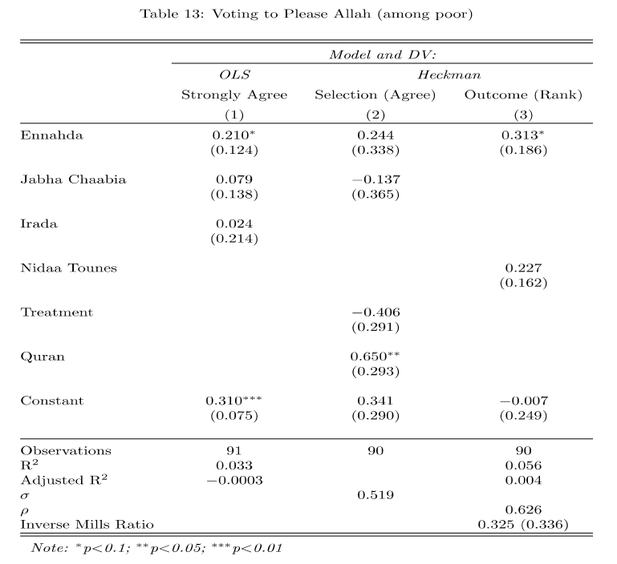

# Sample Selection Models {#selection}

This section will provide a brief overview of models designed to address issues where we do not observe our full outcome data, or the outcome is censored or truncated in some way. In each of these cases, if we only use the standard methods discussed so far in the course, we may end up with biased estimates.

Here is a brief video overview.

```{r, echo=FALSE, warning=FALSE, message=FALSE}
library("vembedr")
library(knitr)

embed_url("https://www.youtube.com/watch?v=sY6H9LuamGI")
```


|Sample | Y | X | Example |
|:-------|-------|---------|-------:|
|Censored | y is known exactly only if some criterion defined in terms of y is met. | x variables are observed for the entire sample, regardless of whether y is observed exactly | If income is measured exactly only if above the poverty line. All other incomes are reported at the poverty line. |
|Sample Selected | y is observed only if a criteria defined in terms of some other random variable (Z) is met. | the determinants of whether Z =1 are observed for the entire sample, regardless of whether y is observed or not | Survey data with item or unit non-response |
|Truncated | y is known only if some criterion defined in terms of y is met | x variables are observed only if y is observed | Donations to political campaigns |


Here are supplemental resources

  - King, Gary. 1998. Unifying political methodology: The likelihood theory of statistical inference. University of Michigan Press. Chapters: 9. Available online through Rutgers libraries.
  - Fox, John. Applied Regression and Generalized Linear Models. Excerpts from Chapter 20 (see Canvas)
  - The documentation for the `sampleSelection` package in R is [here](https://cran.r-project.org/web/packages/sampleSelection/vignettes/selection.pdf)
  
## Sample Selection

Here are a few thought exercises to underscore the potential issues with common sources of data.

***Graduate School Admissions***
Suppose we observe that college grades are uncorrelated with success in graduate school. Can we infer that college grades are irrelevant?

  - No. applicants admitted with low grades may not be representative of the population with low grades. Unmeasured variables (e.g. motivation) used in the admissions process might explain why those who enter graduate school with low grades do as well as those who enter graduate school with high grades.
      + Selection into graduate school is not random 
  - Implication: may be unmeasured factors that bias our inferences from the sample we do have complete data about (graduate school students)
  - Solution: May want to use a sample selection model to account for non-random sample

***What leads rivals to wage war?***

[Lemke and Reed 2001](https://doi.org/10.2307/2669352) argue that if we only focus on rivals, this may lead to biased inference.

  - Need first DV: whether members of "great power" dyads are rivals
  - In addition to second: whether "great power rivals" wage war

"We discover that what makes great powers more likely to be rivals is statistically related to their propensity to experience war." Results suggest that any analysis of the onset of war between rivals that fails to control for the prior influence of variables on the existence of rivalry almost surely produces inaccurate estimate.

### How do we go about estimating this? 

The technical details, followed by implementation.

Selection equation- into grad school sample?

  - $\zeta_i = z_i^T\gamma + \delta_i$
      + $\zeta_i$ DV of selection equation
      + $z_i^T$ vector of covariates for selection equation
      + $\gamma$ vector of coefficients for selection equation
      + $\delta_i$ random disturbances

Outcome equation

  - $\xi_i = x_i^T\beta + \epsilon_i$
      + $\xi_i$ DV of outcome equation (success in grad school)
      + $x_i^T$ vector of covariates for outcome equation
      + $\beta$ vector of coefficients for outcome equation
      + $\epsilon_i$ random disturbances

***The Problem***

We actually want estimates of $Y_i$ not $\xi_i$.

  - $Y_i =$ 

\begin{cases} \text{missing }, \; \text{for } \zeta_i \leq 0\\ \xi_i,\; 
\text{for } \zeta_i > 0\end{cases}


Two-step Estimation

  - Define a dichotomous outcome to indicate if in the sample or not
  $W_i =$ 

\begin{cases} 1, \; \text{if } Y_i \text{ is observed } \\ 0, \; \text{ if } Y_i \text{ is missing } \end{cases}

  1. Fit a probit regression with $W_i$ as the outcome with the linear predictor: $\hat \psi_i = z_i^T\hat \gamma$ 
      + Calculate the "inverse Mills ratio" of $\hat \eta_i = \frac{\phi(\hat \psi_i)}{\Phi(\hat \psi_i)}$
      + Note this is `dnorm()/pnorm()`, ratio of the probability density function over the cumulative distribution function for each i
  2. Use $\hat \eta_i$ as an auxiliary regressor of $Y_i$ on the $x_i^T$ for those where $Y_i$ is observed. 
      + Note the SEs have to be adjusted (not just the standard OLS errors).


### Sample Selection Model Assumptions

Big assumptions

  - ***Exclusion restriction*** -- selection equation should contain at least one variable that predicts selection but not the outcome
  - Errors in the probit equation are homoskedastic
  - Error terms for selection equation and outcome are correlated ($\rho_{\epsilon \delta}$).
      + $\epsilon_i$ and $\delta_i$ should be distributed as bivariate normal if using the MLE approach discussed below.
  - $\epsilon_i$ and $\delta_i$ should be independent of the regressors in their equations
  - Results can be sensitive to how you specify the selection equation

A useful discussion in IR about these issues is Simmons and Hopkins (2005). An extension of this model has also been developed for models where the outcome is dichotomous (see: [bivariate probit models](http://docs.zeligproject.org/articles/zeligchoice_bprobit.html))


## Fitting Sample Selection in R
      
We can use functions in R to do this calculation for us. We will follow the example from the [R Pubs resource](https://rpubs.com/wsundstrom/t_selection), which uses data from 

  - Mroz, T. A. (1987) "The sensitivity of an empirical model of married women’s hours of work to economic and statistical assumptions." Econometrica 55, 765–799.
  
Review the summary at the link above for information about the setup, where our outcome is married women's wages, and the selection is labor force participation.
      
```{r, message=F, warning=F}
## install.packages("sampleSelection")
library(sampleSelection)

data("Mroz87")
```

The selection variable is `lfp`, a 0 or 1 variable indicating labor force participation.
```{r}
table(Mroz87$lfp)
```

The sample selection issue is we do not observe wages for those out of the labor force. Thus, we can first estimate a model predicting labor force participation, and then a model predicting wages. We do so in the below code.

  - Note, we need at least one variable in the selection equation that predicts selection but not wages. Here, we use `kids` for this. 

```{r}
Mroz87$kids <- (Mroz87$kids5 + Mroz87$kids618)
```

We fit the model by providing two regression formulas in the `selection` function.
```{r}
## 2-step estimator
selection1 <- selection(selection = lfp ~ age  +
                          faminc + kids + educ,
                        outcome = wage ~ exper + age + educ + city, 
                        data = Mroz87,
                        method = "2step")
summary(selection1)
```


Maximum likelihood also allows us to estimate the equations simultaneously. We just specify `ml` as the method. 
```{r}
## alternative using maximum likelihood
selection2 <- selection(selection = lfp ~ age +
                          faminc + kids + educ,
                        outcome = wage ~ exper + age + educ + city, 
                        data = Mroz87,
                        method = "ml")
```


We can see what is going on under the hood by fitting the 2-step process manually. The only difference is our manual standard errors would be wrong.
```{r}
## Selection equation
seleqn1 <- glm(lfp ~ age  + faminc + kids + educ,
               family=binomial(link="probit"), data=Mroz87)

## Calculate inverse Mills ratio by hand ##
Mroz87$IMR <- dnorm(seleqn1$linear.predictors)/pnorm(seleqn1$linear.predictors)

## Outcome equation correcting for selection 
outeqn1 <- lm(wage ~ exper + exper + age + educ + city+IMR , data=Mroz87,
              subset=(lfp==1))

## Compare with the selection package results
coef(outeqn1)
```


How should we interpret these results?

  - If variables are only in the outcome equation, like city and experience, we can interpret them like OLS coefficients.
  - If variables appear in both equations, then we can also make an adjustment to have an estimate for the full average marginal effect, that also accounts for selection instead of just specifying the effect of the variable for those "that are selected".
  
```{r}
## Example
selection3 <- selection(selection = lfp ~ age +
                          faminc + kids + educ,
                        outcome = wage ~ 
                          exper + age + educ + city, data = Mroz87,
                        method = "2step")
## average marginal effect:
beta.educ.sel <- selection3$coefficients[5]
beta.educ.out <- selection3$coefficients[9]
beta.IMR <- selection3$coefficients[11]
delta <- selection3$imrDelta

marginal.effect <- beta.educ.out - (beta.educ.sel * beta.IMR * delta)
## average marginal effect
mean(marginal.effect)
```


## Heckman Example Using Survey Data

This example is from "Poverty and Divine Rewards: The Electoral Advantage
of Islamist Political Parties" published in the *American Journal of Political Science* in 2019.

*Abstract* Political life in many Muslim-majority countries has been marked by the electoral dominance of Islamist parties. Recent attempts to explain why have highlighted their material and organizational factors, such as the provision of social services. In this article, we revive an older literature that emphasizes the appeal of these parties’ religious nature to voters experiencing economic hardship. Individuals suffering economic strain may vote for Islamists because they believe this to be
an intrinsically virtuous act that will be met with divine rewards in the afterlife. We explore this hypothesis through a series of laboratory experiments in Tunisia. Individuals assigned to treatment conditions instilling feelings of economic strain exhibit greater support for Islamist parties, and this support is causally mediated by an expectation of divine compensation in the hereafter. The evidence suggests that the religious nature of Islamist parties may thus be an important factor in their electoral success.

We are going to replicate a small part of their analysis of an experiment:

  - Experiment 2 induced economic strain by exposing participants (n = 201) to four hypothetical financial scenarios
      + Half were randomly assigned to a "hard" condition, in which the four scenarios involved financial costs that were relatively high, whereas
      + Half were assigned to an "easy" condition that involved substantially lower costs.
  - One of the secondary dependent variables was: In Experiment 2, why they chose to vote for the party they did, giving them six options, including "Allah will be
more pleased if I vote for this party than other parties."
    + For each answer option, we asked respondents for their
level of agreement with the statement and 
    + subsequently asked them to rank each statement they agreed with in
importance. 

Let's load the data and explore the variables.

```{r}
exp2 <- read.csv("https://github.com/ktmccabe/teachingdata/raw/main/exp2.csv")
```

The authors are looking to verify that pleasing Allah had something to do with Ennahda vote choice, particularly among poor voters. Let's look at the variable `votenahda`, which is a 0 or 1 outcome.

  - 1 if plan to vote for Ennahda if elections held tomorrow, 0 if not

```{r}
table(exp2$votenahda)
```

Whether a voter is poor is determined by if they fall below 7 on the variable `inc`. Let's subset our data to only examine poor voters.

```{r}
subdata <- subset(exp2, inc < 7)
```

They want to understand if pleasing Allah was a top reason for voting for the party. This information is only available for those that agreed or strongly agreed with the statement, "Allah will be more pleased if I vote for this party than other parties."

This information is in the variable `voteAllah2`

  - `voteAllah2`: 1=strongly agree or agree, 0=otherwise

```{r}
table(exp2$voteAllah2)
```

The ranking information is available in the variable, `voteAllahrank3`:

  - `voteAllahrank3`: 1 if voteAllahrank $>$ 4 (top two reasons); NA if voteAllahrank = 0; 0 otherwise.
  
```{r}
table(exp2$voteAllahrank3)
```

Let's identify the sample selection issue.

  - `voteAllahrank3` is only observed for those who strongly agreed or agreed with the statement

```{r}
table(RankedTopTwo=exp2$voteAllahrank3, Agreed=exp2$voteAllah2)
```

What makes this a candidate for a Heckman sample selection model?

<details> <summary>Try on your own, then expand.</summary>
  - We are interested in estimating whether Ennahda voters are more likely than others to rank pleasing Allah among the top two reasons. Our desired outcome is $Y_i =$ `voteAllahrank3`
      + $Y_i$ only observed for those who met some criteria set by another random variable (in this case `voteAllah2` = 1).
      + However, we still have information on the independent variables for all respondents, regardless of whether they are a 0 or 1 on `voteAllah2`
</details>

Estimate the two-step process, following the authors in terms of what variables to include in each stage according to columns 2 and 3 in the table.

{width=80%}

  - Prior to fitting the model, subset the data to include only respondents who voted for `votenahda`, `votenidaa`, `votejabha`,
  `voteirada`, indicated by respondents being coded as a 1 on these variables. These correspond to the party variables in columns 2 and 3.
      + other relevant variables are `treat` and `quran`

<details> <summary>Try on your own, then expand for the solution.</summary>

As the authors note, "The ranking is a two-step process, as respondents only get to rank factors that they agree with. To model their rankings, we therefore employ a Heckman selection model, analyzing first who agreed that pleasing Allah is important in their vote choice, and then analyzing second who ranked pleasing Allah as one of their top two factors."

```{r}
subdata2 <- subset(subdata, votenahda==1 |
                     votenidaa==1 | votejabha==1 |
                     voteirada==1)
two <- selection(selection = voteAllah2~votenahda+votejabha+treat+quran, 
                  outcome = voteAllahrank3~votenahda+votenidaa, 
                  data=subdata2, 
                 method="2step")

summary(two)
```

</details>

How should we interpret the results in light of the researchers' hypothesis that Ennahda voters would be more likely to rank pleasing Allah as a top reason?


<details> <summary>Try on your own, then expand for the solution.</summary>

As the authors note describing the outcome equation, "results suggest that poor Ennahda voters were about 31\% more likely to rank pleasing Allah among their top two factors (p = .096; see the SI, p. 22) than poor supporters of secular parties."

We could also perform the adjustment to get an estimated average marginal effect accounting for selection. This ends up being slightly smaller, but still in the same direction as what the authors note.

```{r}
beta.en.sel <- two$coefficients[2]
beta.en.out <- two$coefficients[7]
beta.IMR <- two$coefficients[9]
delta <- two$imrDelta

marginal.effect <- beta.en.out - (beta.en.sel * beta.IMR * delta)
## average marginal effect
mean(marginal.effect)
```

</details>


## Tobit Model aka Censored regression model

Dealing with outcomes that are "top-coded" or "bottom-coded" at a threshold value

***Example: if income is top-coded as "above \$250k"***

$Y_i$ = \begin{cases} Y_i^*, \; Y_i < 250 \\ \text{ above 250 } \; Y_i \geq 250 \end{cases}

We are interested in $Y_i^*$: actual income, not censored income. Problem- it's unobserved for part of the sample

  - Example: want to use SAT as measure of aptitude, but scores capped between 200 and 800
  - Example: want to measure support for candidate but legal maximum for campaign donations is \$5000
  - Example: want to measure like-dislike of candy bars, but candy bars consumed bottom-coded at 0
  - Note: in classic tobit model, censoring happens at zero

For elaboration in R, see this UCLA [resource](https://stats.idre.ucla.edu/r/dae/tobit-models/) and `tobit()` in the AER package

### Tobit Model Assumptions

  - Assume homoskedastic and normally distributed errors
  - When data are censored at zero (clumping at zero), assume same underlying stochastic process to determine 
      + whether the response is zero or positive 
      + as well as the value of a positive response
      + Any variable which increases the probability of a non-zero value must also increase the mean of positive values.
  - Should generally be used in cases where the dependent variable could take on negative values

An alternative model discussed in the count data section: "two-part" and hurdle model--appropriate when the 0 is a "true zero"


## Truncated Models

Sample selection is determined by values of the $Y$ variable. Do not observe x or y for truncated observations

  - Example: interested in effect of education on income, but only sample people below a certain income.
  - Example: studies of electoral success of newly formed political parties. Problem: likely only observe new parties whn their chance of success is likely high
  - Example: studies using newspaper reports on social movements to study predictors of violence in these movements. Problem: newspapers select which movements to report on- likely those with chance of violence.

Solution? Requires information about the mechanism that leads to the incomplete (or truncated) data set

  - [See more on R implementation here](https://stats.idre.ucla.edu/r/dae/truncated-regression/)

