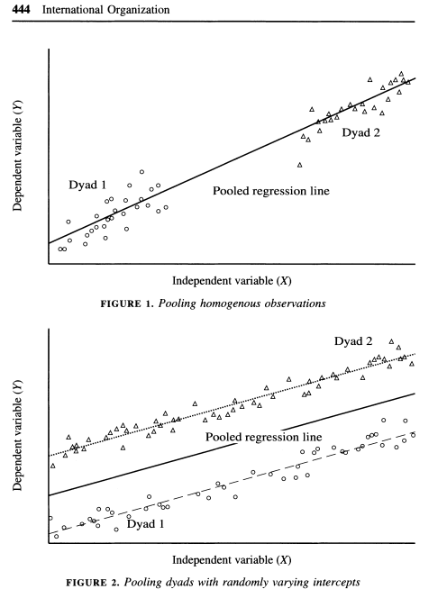
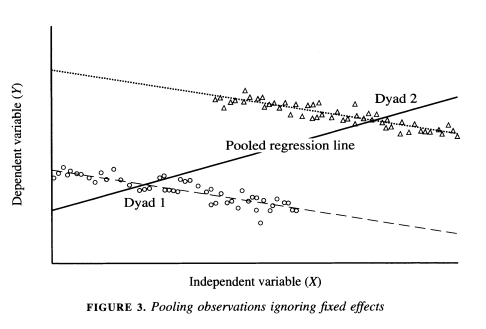

# Panel and Hierarchical Data {#hier}

This section will provide an overview of considerations and basic modeling strategies for data that include repeated observations across units or over time. This may relate to panel data, time series cross-sectional data, and hierarchical data.

To motivate why we might use different models in these cases, please watch this video from Ben Lambert (like and/or subscribe to support him).


```{r, echo=FALSE, warning=FALSE, message=FALSE}
library("vembedr")
library(knitr)

embed_url("https://www.youtube.com/watch?v=aYx88zmTM0U")
```


These are some supplemental resources

  - Vignettes describing use of `plm` package [here](https://mran.microsoft.com/snapshot/2018-07-03/web/packages/plm/vignettes/plm.pdf)
  - Oscar Torres-Reyna's [introduction](https://www.princeton.edu/~otorres/Panel101R.pdf) to fixed/random effects
  - Gelman and Hill, Data Analysis Using Regression and Multilevel/Hierarchical Models, Part 2A, Cambridge University Press.
  - Jeffrey M. Wooldridge. 2010. Econometric Analysis of Cross-Sectional and Panel Data. MIT Press. Chapter 10.
  - Related papers:
      + Nathaniel Beck. "TIME-SERIES–CROSS-SECTION DATA: What
Have We Learned in the Past Few Years?" [Annual Review of Political Science. 2001.](https://www.annualreviews.org/doi/abs/10.1146/annurev.polisci.4.1.271) 
      + Donald P. Green, Soo Yeon Kim, and David H. Yoon. "Dirty Pool." International Organization 55, 2, Spring 2001, 441-468.
      + Nathaniel Beck and Jonathan Katz. "Throwing Out the Baby with the Bath Water: A comment on Green, Kim, and Yoon." International Organization 55, 2, Spring, 2001, pp. 487-495.


## Week 10 Tutorial

In this section, we are going to use data from the CDC on national and state-level COVID hospitalizations and positive case increases between July 2020- end September 2020.

Let's load the national and state data.

```{r}
library(rio)
national <- import("https://github.com/ktmccabe/teachingdata/blob/main/national.RData?raw=true")
states <- import("https://github.com/ktmccabe/teachingdata/blob/main/states.RData?raw=true")

head(national)

head(states)
```
During this time period, the national level of hospitalizations was declining.

```{r, warning=F, message=F}
library(ggplot2)
ggplot(national, aes(x=date, y=hospitalizedCurrently))+
  geom_line()
```

However, the national data represents aggregated state-level data. It is possible that these trends might look different if we looked within each state.

```{r, fig.height=15, fig.width=15, warning=F, message=F}
ggplot(states, aes(x=date, y=hospitalizedCurrently))+
  geom_line()+
  facet_wrap(~state, scales = "free")
```

When we have data that are grouped in some way, it is important to consider how group-specific factors may influence the results. 

Let's look at the relationship between positive increases in cases and hospitalizations using the state-level data. Note, we are not epidemiologists here, so this is in no way exactly how you would want to model this in practice. We will leave that to the experts. Nonetheless, it will give us some visualizations. The regression line below is from the following regression, which pools across states and dates:

$hospitalizedCurrently_{it} = \alpha + positiveIncrease_{it} + \epsilon_{it}$

```{r, warning=F, message=F}
ggplot(states, aes(x=positiveIncrease, y=hospitalizedCurrently, color=state))+
  geom_point()+
  geom_smooth(aes(y=hospitalizedCurrently),method="lm", se=F, color="black")+
  ylim(0, 15000)
```


What issues do you have with that type of analysis?

  - How could we improve it?
  
Let's look at the variation by state.

```{r, fig.height=15, fig.width=15, warning=F, message=F}
ggplot(states, aes(x=positiveIncrease, y=hospitalizedCurrently, color=state))+
  geom_point()+
  geom_smooth(method="lm", se=F)+
  facet_wrap(~state, scales = "free")

```
One thing we could do to account for the variation in cases, is to add controls for state. This is called adding "fixed effects." It allows the intercept for each state to be different in regression, but the slopes are considered the same.

```{r, fig.height=15, fig.width=15, warning=F, message=F}
fit <- lm(hospitalizedCurrently ~ positiveIncrease + as.factor(state), data=states)
fit.pred <- predict(fit)

ggplot(states, aes(x=positiveIncrease, y=hospitalizedCurrently, color=state))+
  geom_point()+
  geom_smooth(aes(y=hospitalizedCurrently),method="lm", se=F, color="black")+
  geom_line(aes(y=fit.pred))+
  ylim(0, 15000)

ggplot(states, aes(x=positiveIncrease, y=hospitalizedCurrently, color=state))+
  geom_point()+
  geom_line(aes(y=fit.pred))+
  facet_wrap(~state, scales = "free")
```

We could also add interactions with state, which will allow the slopes to vary.

```{r, fig.height=15, fig.width=15, warning=F, message=F}
fit <- lm(hospitalizedCurrently ~ positiveIncrease*as.factor(state), data=states)
fit.pred <- predict(fit)


ggplot(states, aes(x=positiveIncrease, y=hospitalizedCurrently, color=state))+
  geom_point()+
  geom_line(aes(y=fit.pred))+
  facet_wrap(~state, scales = "free")
```

Any downsides to adding interactions?

## Panel and Hierarchical Data

$Y_i, X_i$ now become $Y_{it}, X_{it}$ where $i$ is a unique indicator for the unit and $t$ is a unique indicator for time (or question, task, etc., other repeated measurement) 

  - For example, perhaps we observe a set of $N$ European countries, each indexed by $i$ over $10=T$ years, each indexed by $t$.
  - The dataset can be represented in "wide" or "long/stacked" format (see section 2 of the course notes)
  - Can get more complicated. Perhaps we have a Member of Parliament in a year in a country: $Y_{itj}, X_{itj}$. Now we have three indices for our variables.
  - We also might not have variation over time, but instead, multiple levels of units-- perhaps students ($i$) nested in schools ($j$).

  
***Why do we like this type of data in social science?***

  - We think some $Z$ variable is related to some $Y$ outcome.
  - So we test this with data by comparing data that vary on $Z$ to see if they vary systematically on $Y$.
  - Our goal is to isolate $Z$. We want to "control" on everything that differs between our units that could affect $Y$ except for $Z$, which varies.
  - Problem: this can feel almost impossible in cross-sectional data
      + Example: Bob and Suzy probably differ in a million ways, but we can only measure and account for so many covariates
      + Example: France and Germany probably differ in a million ways, but we can only measure and account for so many covariates
      + This makes comparing Bob vs. Suzy and France vs. Germany for our variation is a somewhat suspect way to show how $Z$ relates to $Y$ if we cannot control on all possible relevant factors.
      
Possible solution: enter repeated observations

  - Idea: Bob in wave 1 is probably pretty similar to Bob at wave 2. This might be a more sensible comparison than Bob  vs. Suzy.
  - Idea: France in 1968 vs. France 1970 is probably a more sensible comparison than France vs. Germany
      + So, perhaps we incorporate Bob vs. Bob and Suzy vs. Suzy; France vs. France and Germany vs. Germany comparisons instead of just making between-unit comparisons.
  - Issue: need to learn new methods to account for our grouped/repeated data structure.
  
Why?

***Recall OLS***

\begin{align*}
Y_i =  \beta_0 + \beta_1 x_i + \epsilon_i
\end{align*}

Assumptions:

  - $\mathbf E(\epsilon_i) = 0$; 
  - Errors independent of regressors: Cov$(\epsilon_i, X_i) = 0$;
  - Errors of different observations not correlated: Cov$(\epsilon_i, \epsilon_j) = 0$
  - Constant error variance $V(\epsilon_i | X) = \sigma^2$. 

When we have grouped/longitudinal data, many of these assumptions are likely violated. For elaboration, see the video on the previous page that discusses how unobserved factors related to particular geographical areas might influence the explanatory variable crime rate [video](https://www.youtube.com/watch?v=aYx88zmTM0U).

Let's take a look at why.

What if we have
\begin{align*}
Y_{it} =  \beta_0 + \beta_1 x_{it} + \epsilon_{it}
\end{align*}

We could still treat this as OLS if we believe the assumptions hold. But often, we are concerned that our model actually looks like this:

\begin{align*}
Y_{it} =  \beta_0 + \beta_1x_{it}+ (c_i + \epsilon_{it}).
\end{align*}

We think there may be $c_i$ unobserved characteristics about our units $i$ that are related to our explanators. If unaccounted for and left as part of the error term, this would cause bias in our coefficients. 

  - Note: in OLS, we assume Cov$(c_i + \epsilon_{it}, x_{it}) = 0$. Here, we believe there may be unmeasured factors that induce covariance between $c_i$ and $x_{it}$.

One Solution: fixed effects: removes time-constant unobserved characteristics about our units.


## Fixed Effects

In fixed effects, we allow the intercept to be different across our $N$ groups (e.g., countries), where these terms are going to account for time-invariant (time constant) characteristics of these areas.

\begin{align*}
Y_{it} &=  \alpha_i + \beta_1x_{it} + \epsilon_{it}
\end{align*}

where $\alpha_{i}$ absorbs all unobserved time-invariant characteristics for unit $i$ (e.g., features of geography, culture, etc.)

  - This is huge! It's going to help us get around the assumption we just talked about. The idea is that when we are comparing observations within a particular unit (e.g., within France), all of those time-invariant characteristics specific to France are held constant. 

Below we discuss how to estimate fixed effects models. It is not the solution to everything. Keep these in mind.

  - Still assume homoskedastic errors $\rightarrow$ may want to adjust the SE's.
  - Cannot model "level-2" factors. Problematic if that's what you're interested in! (E.g., if you have time-invariant country-level covariates). Can only do this through interactions.
      + For example, suppose we have a measure of a country's culture ($culture_{i}$), that does not vary over time. We could not include that in our regression model because the model removes all time-invariant characteristics. In contrast, if something like country GDP changes a lot over time ($GDP_{it}$), it could still and should be accounted for.
  - Only works if you have a decent number of observations
  - Leverages within-group variation on your outcomes. Need to have this variation for it to make sense!

There are two general approaches for fitting fixed effects estimators: the within-estimator and LSDV.

### Within-Estimator 

Time Demeaning. First calculate averages of the $it$ terms. 

  - Note, the mean of $\alpha_i$ is just $\alpha_i$ because it does not vary over time. $\alpha_i$ because: $\frac{1}{T} \sum_{t=1}^T \alpha_i = \frac{1}{T}*T*\alpha_i = \alpha_i$.

\begin{align*}
\bar y_i &= \alpha_i +  \beta\bar x_i  + \bar \epsilon_i\\
\end{align*}

Subtracting we get:
\begin{align*}
Y_{it} - \bar y_i &= (\alpha_i -\alpha_i) +  \beta(x_{it}- \bar x_i) + (\epsilon_{it}- \bar \epsilon_i)\\
\widetilde{Y_{it}} &= \beta\widetilde{x_{it}} + \widetilde{\epsilon_{it}}
\end{align*}
$\beta$ is estimated just from deviations of the units from their means. Removes anything that is time-constant.

This [video](https://www.youtube.com/watch?v=sFvV9b1cGFc&ab_channel=BenLambert) from Ben Lambert goes through the demeaning process.

### Least Squares Dummy Variable Regression

We can estimate the equivalent model by including dummy variables in our regression. This is sometimes why you have seen authors add dummies for region and call them "fixed effects."

OLS with dummy variables for each unit (e.g., countries). Start with "stacked" data where: $Y = X\beta + U\delta + \epsilon$. 

  - $Y$ is $NT \times 1$ outcome vector where $N$ is number of $i$ units and $T$ is number of time points $t$.
  - $X$ is $NT \times k$ matrix  where $k$ is the number of covariates plus general intercept
  - $U$ is a set of $m$ dummy variables (e.g., country dummies), leaving one as reference
  
By accounting for these groups in our regression, we are now estimating how the covariates in $\mathbf x$ affect our outcomes, holding constant the group-- leveraging within-group variation.
  
### Fixed Effects Implementation in R

The `plm` package allows us to indicate that our data are panel in nature and fit the within-estimator.

Run `install.packages("plm")` and load Grunfeld. 200 observations at the firm-year level. Here, we can think of firms as indexed by $i$ and years indexed by $t$.

```{r, warning=F, message=F}
library(plm)
data(Grunfeld)
head(Grunfeld)
## Unique N- firms
length(unique(Grunfeld$firm))
## Unique T- years
length(unique(Grunfeld$year))
```

For more detail on`plm`, see [documentation](https://cran.r-project.org/web/packages/plm/vignettes/plm.pdf)


These data are used to study the effects of `capital` (stock of plant and equipment) on gross investment `inv`.

Let's first run a standard OLS model, which we will call the "pooled" model because it pools observations across firms and years without explicitly accounting for them in the model. We can use the standard `lm` model to do this or the `plm` function from the `plm` package by indicating `model="pooling"`. Both give equivalent results.
```{r}
## Pooled model
fit.pool <- plm(inv~ capital, data = Grunfeld, model = "pooling")
coef(fit.pool)["capital"]

## Equivalent
fit.ols  <- lm(inv~ capital, data = Grunfeld)
coef(fit.ols)["capital"]
```

We could visualize this model as follows by plotting the regression line. This provides a good benchmark against which we can see how fixed effects change the results. Note that the line ignores which firm that the data are coming from, using between-firm variation to help fit the regression slope.

```{r, message=F, warning=F}
library(ggplot2)
ggplot(Grunfeld, aes(x=capital, y=inv, color=as.factor(firm)))+
  geom_point()+
  geom_smooth(aes(y=inv), se=F, method="lm", color="black")
```

Let's now fit our fixed effects model. Here, we have to add an argument that specifies which variables are indexed by $i$ and $t$ so that `plm` knows how to incorporate the individual firm units. We will first fit the `within` model using the `plm` package. We can then use `lm` by explicitly adding dummy variables. You will note that the individual dummy variable coefficients are only included in the output of `lm` and not `plm`. When you have a large number of units, it might be more computationally efficient and cleaner to use `plm.` However, both give us equivalent results for our coefficients of interest.

```{r}
## Within model with firm fixed effects
fit.within <- plm(inv~capital, 
                  data = Grunfeld, 
                  model = "within", 
                  index = c("firm", "year"))
coef(fit.within)["capital"]

## numerical equivalent
fit.lsdv  <- lm(inv~  capital + as.factor(firm), 
                data = Grunfeld)
coef(fit.lsdv)["capital"]
```

Recall, what fixed effects does is create a different intercept by firm. We can visualize this by generating predicted gross investments for each observation in our data.

Fixed effects leverages within-firm variation to fit the regression model. That is, holding constant the firm, how does capital influence investment, on average? 

Here, we see that when the variation is coming from within-firm, the estimated slope for the `capital` variable is slightly more shallow than when the pooled model used data across different firms to estimate the slope. Sometimes, the difference between the pooled OLS and fixed effects estimation can be so severe as to reverse the sign of the slopes. This is the idea of Simpson's paradox discussed [here](https://medium.com/pew-research-center-decoded/how-to-break-regression-f48230f0ca68).
```{r}
fit.lsdvpred <- predict(fit.lsdv)
library(ggplot2)
ggplot(Grunfeld, aes(x=capital, y=inv, color=factor(firm)))+
  geom_point()+
  geom_smooth(aes(y=inv), se=F, method="lm", color="black")+
  geom_line(aes(y=fit.lsdvpred))

```

[Green et al. (2003)](https://www.cambridge.org/core/journals/international-organization/article/abs/dirty-pool/F58CBC01FE96E2BADFDB9EFE2A943C73) also discuss the dangers of pooling data in certain cases in the article ``Dirty Pool." Below are three examples. In the first two, pooling vs. fixed effects will not make much of a difference, but it will in the third. 

As the authors describe, "The plot in Figure 1 depicts a positive relationship between X and Y where N = 2 and T = 50. Because both dyads share a common intercept, pooling creates no estimation problems. One obtains similar regression estimates regardless of whether one controls for fixed effects by introducing a dummy variable for each dyad. A pooled regression is preferable in this instance because it saves a degree of freedom. In Figure 2 we encounter another instance in which dyads have different intercepts, but there is no correlation between the intercepts and
 X. The average value of the independent variable is the same in each dyad. Again,
 pooled regression and regression with fixed effects give estimates with the same
 expected value. Figure 3 illustrates a situation in which pooled regression goes awry. Here, the causal relationship between X and Y is negative; in each dyad higher
 values of X coincide with lower values of Y. Yet when the dyads are pooled together, we obtain a spurious positive relationship. Because the dyad with higher values of X also has a higher intercept, ignoring fixed effects biases the regression line in the positive direction. Controlling for fixed effects, we correctly ascertain the true negative relationship between X and Y" (443-445).

{width=40%} {width=40%}


### Standard errors with fixed effects

Even if we use fixed effects, we may want to adjust standard errors. Fixed effects assumes homoskedasticity (constant error variance). We might instead think that the random error disturbances are correlated in some way or vary across time or units. For example, we might fear we have serial correlation (autocorrelation), where errors are correlated over time. Below are a few options.

*Clustered standard errors*. We came across this before in our section on ordinal probit models and the Paluck and Green paper. This blog post discusses why you may still want to cluster standard errors even if you have added [fixed effects](https://stats.stackexchange.com/questions/185378/when-to-use-fixed-effects-vs-using-cluster-ses).

*Note: the functions below are designed to work with the `plm` package and models. For models fit through other functions, you may need to use different functions to make adjustments. See section 8.5.1. For linear models `lm_robust` from the `estimatr` package works well. For other models, see the alternative applications in that section.*
```{r}
## Cluster robust standard errors to match stata (c only matters if G is small). Can omit if do not want to adjust for degrees of freedom.
## Generally want G to be 30 or 40
G <- length(unique(Grunfeld$firm))
c <- G/(G - 1)
sqrt(diag(c*vcovHC(fit.within,type = "HC1", cluster = "group")))
```

*Panel corrected SE*: Beck and Katz have also developed standard errors for panel data. Explained in the documentation, observations may be clustered either by "group" to account for timewise heteroskedasticity and serial correlation or by "time" to account for cross-sectional heteroskedasticity and correlation. This is sensitive to $N$ and $T$.

```{r}
## Alternative: Beck and Katz panel corrected standard errors
sqrt(diag(vcovBK(fit.within, cluster = "group"))) # also can change type
```

Alternative: Adjusted for heteroskedasticity and/or serial correlation. 

```{r}
sqrt(diag(vcovHC(fit.within, type = "HC1", method = "arellano")))
```

For more information, see pg. 24 of this [resource](https://www.princeton.edu/~otorres/Panel101R.pdf)


## Additional considerations for fixed effects

### Binary dependent variables

You should use caution when adding fixed effects to binary models, such as the logit. They can suffer from the "incidental parameters" [problem](https://stats.stackexchange.com/questions/185998/incidental-parameter-problem). Instead of using the logit, with a large number of fixed effects (some would even say not that large), you can use a linear probability model or the *conditional* logit mode.

For a resource on fitting the conditional logit in R, see [here](https://data.princeton.edu/wws509/r/fixedRandom3).

  - The `xtlogit` fe command in Stata fits this type of model
  - Note that computing marginal effects and predictions from this model can be more difficult


### Two-way fixed effects

We might be concerned not just about unobserved unit effects but also unobserved time effects
\begin{align*}
Y_{it} =  \beta_0 + \beta_1x_{it}+ (c_i + v_t + \epsilon_{it}).
\end{align*}

Here, we may include fixed effects for both units and time. Warning: can be difficult to interpret.

Alternative, sometimes instead of including dummies for each $t$ period, people will include a "time trend." This could be a linear time trend, for example, a year variable treated as numeric.

\begin{align*}
Y_{it} =  \alpha_i + \beta_1  x_{it}+ \beta_2 year_{t} + \epsilon_{it}.
\end{align*}

Or this could be a polynomial, such as a cubic time trend

\begin{align*}
Y_{it} =  \alpha_i + \beta_1 x_{it}+ \beta_2 year_{t} + \beta_3 year_{t}^2 + \beta_4year_{t}^3 + \epsilon_{it}.
\end{align*}


### First Differences

The within- and LSDV estimators are not the only way to incorporate fixed effects into our models. Another type of estimation is first differences.

$\Delta Y_{it} = \beta \Delta x_{it} + \Delta \epsilon_{it}$ where, for example, $\Delta Y_{it} = Y_{it} - Y_{it- 1}$. Instead of demeaning over all time. We subtract the previous instance.

  - Both remove unobserved heterogeneity (i.e., $\alpha_i - \alpha_i$)
  - Requires variation in time. $t$ vs. $t-1$ or else $x_{it} - x_{it-1} = 0$ and falls out
  - When $T = 2$, fixed effects = first differences
  - When $T > 2$, fixed effects $\neq$ first differences
  - Under assumptions, both unbiased and consistent
  - When no serial correlation, then $SE(\hat \beta_{FD}) > SE(\hat \beta_{FE})$ 
  - If $\Delta \epsilon_{it}$ are uncorrelated, FD preferred. 
  - In general, hopefully both produce very similar results
  
I recommend watching this [video](https://www.youtube.com/watch?v=1SchyQ77VFg&ab_channel=BenLambert) by Ben Lambert who provides a summary overview of the differences between fixed effects, first differences, and pooled OLS.

```{r, echo=FALSE, warning=FALSE, message=FALSE}
library("vembedr")
library(knitr)

embed_url("https://www.youtube.com/watch?v=1SchyQ77VFg")
```

### Additional Models in R

```{r}
## first differences
fit.fd <- plm(inv~value+capital, data = Grunfeld, model = "fd", 
              index = c("firm", "year"),
                  effect = "individual")
coef(fit.fd)["capital"]

## firm and year effects
fit.twoway <- plm(inv~value+capital, data = Grunfeld, model = "within",
                  index = c("firm", "year"),
                  effect = "twoways")
                  
coef(fit.twoway)["capital"]
```


## Random Effects

We have now discussed pooled OLS and fixed effects estimation (often called no-pooling). We will now shift to estimation strategies that involve partial-pooling.

Tradeoff between complete pooling and no-pooling (i.e., fixed effects). 

  - Complete pooling ignores variation between groups BUT
  - No-pooling may overfit the data within group and prevents estimation of "level-2" effects.
  
To motivate partial-pooling, we can take a look at an example.

Example: What will Mookie Betts's batting average be in 2018?

{width=70%}

  - In March 2018, Mookie went 2 for 11. If we fit his average just based on his data $n_{mookie}=11$, we get an average of .182.
  - Over the entire season, Mookie ended up with an average of .346. Is there any way we could have adjusted our initial estimate to end up with a more accurate estimate of what his average would be?
  - Possible solution: fit the average based on a combination of Mookie's data ($\bar y_{mookie}$) and data from all players ($\bar y_{all}$). It will move Mookie's estimate closer to the "grand" average across all players by partially pooling his data with the others.

### Random effects models

In random effects estimation, for the $ith$ observation, we allow the intercept $\alpha$ to vary by some unit $j$. Where $j[i]$ refers to the group-level coding for the $ith$ observation. Perhaps $j=3$ for $j[4]$, the 4th observation.

\begin{align*}
Y_{ij} &=  \alpha_{j[i]} + \beta x_{ij} + \epsilon_{ij}
\end{align*}

The group index is a factor with $J$ levels.

Approximation of multilevel estimates of the group average in case of no predictors:

$\hat \alpha_j = \frac{\frac{n_j}{\sigma^2_y}\bar y_j + \frac{1}{\sigma^2_\alpha}\bar y_{all}}{\frac{n_j}{\sigma^2_y} + \frac{1}{\sigma^2_\alpha}}$

  - Assume we have a random sample of $n$ units within each $j$, $n_j$
  - Then, our estimate for a given group $j$ is a weighted average of observations within $j$ ($\bar y_j$) and the mean overall $j$'s ($\bar y_{all}$).
  - These are weighted according to the variance in $y$ within $j$ ($\sigma^2_y$) and variance among the averages of $y$ across $j$ ($\sigma^2_\alpha$)

This [video](https://www.youtube.com/watch?v=EbdBHJYbOrg&ab_channel=BenLambert) by Ben Lambert shows how this idea of a "weighted average" extends to regression with covariates. Random effects provides a balance between fixed effects and OLS, no-pooling and pooling, which is why it is considered partial pooling.

  - When $\sigma^2_\alpha$ is very small, random effects will be close to OLS.
  - If $\sigma^2_\alpha$ is very big, then the weighted balance will be closer to fixed effects.

***Differences with pooling and no pooling***

  - Pooling- intercepts all fixed to $\alpha$ ($\sigma^2_{\alpha} = 0$)
  - No pooling- $\alpha_j$'s correspond to models fit within each $j$. Do not come from a common distribution.
      + A downside: cannot include time-invariant group characteristics.
  - Partial pooling (shrinkage)- $\alpha_j$'s have a probabilitiy distribution $\alpha_j \sim N(u_{\alpha}, \sigma^2_{\alpha})$. Has the effect of pulling estimates of $\alpha_j$ toward the mean of all groups.
      + $\alpha_j = u_{\alpha} + \eta_j$ where $\eta_j$ is a group-level error term (model without group-level predictors)
      + ***Must assume $\mathbf E(x_{ij}\alpha_{j[i]}) = 0$***. Unmodeled, unmeasured characteristics about your group-level effects (e.g., countries) that affect the outcome are not correlated with the regressors in your model. \underline{Don't need to make this assumption in FE.}
      + Good news: Can include group-level predictors: Now $\alpha_j$ coeffcients have a distribution $\alpha_j \sim N(U_j\gamma, \sigma^2_\alpha)$
  

Scholars can have strong feelings about these choices, which often vary by subfield conventions along with the specifics of any research question. For example, the Green et al. piece advocating the use of fixed effects called pooling a ``Dirty Pool." In response, [Beck and Katz](https://www.jstor.org/stable/3078640) made the analogy that "Green, Kim, and Yoon's fixed-effects "cure" for column 3 is akin to curing a cold with chemotherapy" (492).

### Random Effects Implementation in R

If comparing with fixed effects, can use`plm`.
```{r}
## Firm random effects
data("Grunfeld")
fit.re <- plm(inv~value+capital, 
              data = Grunfeld, 
              model = "random", 
                index = c("firm"), 
              effect = "individual")
coef(fit.re)["capital"]
```

One approach to deciding whether to use fixed vs. random effects is the Hausman test, which assesses the correlation assumption.

```{r}
## Compares beta hats for FE and RE and covariance
## Under null hypothesis of no correlation estimates should be similar
## Under null, RE preferred due to efficiency gains
fit.within <- plm(inv~capital+value, 
                  data = Grunfeld, 
                  model = "within", 
                  index = c("firm", "year"))
phtest(fit.within, fit.re) 
```
With a small p-value, we reject the null, suggesting fixed effects is preferred for this model. With a large p-value, we fail to reject the null, suggesting random effects is preferred. Note: while the test provides one way to adjudicate between fixed and random effects, it cannot tell you if the model you have specified is "correct."

### Using lme4 for random effects

More flexible package for random effects: `lme4`. Uses "REML" by default- a variation on MLE. Ben Bolker provides a great overview of the package [here](https://bbolker.github.io/mixedmodels-misc/glmmFAQ.html). Here is a video walking through the syntax and output.

```{r, echo=FALSE, warning=FALSE, message=FALSE}
library("vembedr")
library(knitr)

embed_url("https://www.youtube.com/watch?v=Myk4bV-LrN0")
```

```{r, warning=F, message=F}
library(lme4)
fit.re2 <- lmer(inv~ value + capital + (1 | firm), data = Grunfeld)

## extract model coefficients
fixef(fit.re2)["capital"]
```

WHERE ARE MY P VALUES?!?!?!?!
```{r}
summary(fit.re2)$coefficients
```

Not without controversy. Several ways to compute p-values in these models. This post describes three and provides the [code](https://www.r-bloggers.com/three-ways-to-get-parameter-specific-p-values-from-lmer/).

For example, if you load the package `lmerTest` prior to running the model, it will include these results using the Satterthwaite method by default. Clicking on the pdf through this [link](https://www.jstatsoft.org/article/view/v082i13) will give you information on what this package does.

```{r, warning=F, message=F}
library(lme4)
library(lmerTest)
fit.re2 <- lmer(inv~ value + capital + (1 | firm), data = Grunfeld)

summary(fit.re2)
```


Can use output to interpret the nature of the variance. Note that the summary output includes a table for the Random Effects, the variance, and Std. Dev. of each. We can interpret the intercept row as the variability of the intercept across firms (firm-to-firm) variability. The residual is the left-over or within-firm variability. One use of this is to compute the intraclass correlation coefficient (ICC).


The ICC is the proportion of the variance explained by the grouping structure in the population. The Adjusted ICC indexes how strongly measurements in the same group resemble each other. This index goes from 0, if the grouping conveys no information, to 1, if all observations in a group are identical (Gelman \& Hill, 2007, p. 258). If the value were really small, you might not need to include random effects for the grouping factor.

```{r, warning=F, message=F}
# install.packages("performance")
7367/(7367+2781)

performance::icc(fit.re2)
```


### Random Effects Extensions


Can have multiple levels. E.g., students ($i$) nested in classrooms ($j$) nested in schools ($s$). Each level may or may not have group-level predictors. Example:

  - $Performance_{ijs} =  \beta_{0js[i]} + \beta_1 Income_{ijs} + \beta_2 Gender_{ijs} + \epsilon_{ijs}$ where
  - $\beta_{0js} = \gamma_{0s} + \gamma_{3}Teacher_{js} + r_{js}$ and
  - $\gamma_{0s} = z + v_{s}$
  - Combined: $Performance_{ijs} = m  + m_{1}Teacher_{js}  + m_2 Income_{ijs} + m_3 Gender_{ijs} + v_{s} + r_{js} + \epsilon_{ijs}$

Levels can be nested or non-nested. Students are nested in schools, but for a different example, survey questions may not be nested in a single poll. Perhaps some items are repeated *across* different polls.

Can allow slopes (regression coefficients to vary). Perhaps the effect of gender on student success varies by classroom. Then $\beta_{2}$ becomes $\beta_{j, 2} = \gamma_{1s} + r_{1js}$. 

Let's return to the `Grunfeld` data and fit the following model:
```{r, warning=F, message=F}
## firm and year random intercepts
fit.retwoways <- lmer(inv~ value + capital + 
                        (1 | firm) + 
                        (1 | year), 
                      data = Grunfeld)
fixef(fit.retwoways)["capital"]
```


***Sleep deprivation study***: how is a subject's reaction time associated with sleep deprivation?

```{r, warning=F, message=F}
data(sleepstudy)
## Random intercepts for subjects
fit.re3 <- lmer(Reaction ~ Days + (1 | Subject), data = sleepstudy)
fixef(fit.re3)["Days"]

## Random intercepts for subject, varying slope for days
fit.re4 <- lmer(Reaction ~ Days + (Days | Subject), data = sleepstudy)
fixef(fit.re4)["Days"]
```

Recall, the big assumption when adding random effects is that the unobserved group-level random disturbances caught through the intercept terms are not correlated with the regressors. 

One suggestion is if concerned about correlation between predictors $x_i$ and group effects $\alpha_j$, add group means of regressors as predictors in the model. 

  - See [here](http://www.stat.columbia.edu/~gelman/research/unpublished/Bafumi_Gelman_Midwest06.pdf) and [here](https://www.r-bloggers.com/why-i-use-panelmultilevel-methods/).
  - Disentangles individual vs. contextual effect of regressors on outcome. First proposed by Mundlak (1978).


### Extracting lmer output

Caution: `coef()`, `ranef()`, and `fixef()` all different.

  - `coef()` produces the set of regression coefficients associated with each group

```{r}
## Example from random intercepts model
head(coef(fit.re3))
```

  - `fixef()` produces the set of fixed effects regression coefficients-- similar to OLS-- with global intercept.

```{r}
## Example from random intercepts model
fixef(fit.re3)
```

  - `ranef()` produces the set of random effects as deviations from the global estimates

```{r}
## Example from random intercepts model
head(ranef(fit.re3)$Subject)

## Note the relationship between the three for the first [1] subject
fixef(fit.re3)[1] + ranef(fit.re3)$Subject[1,]

coef(fit.re3)$Subject[1,1]
```

### Generating predicted values for each unit

```{r}
## Manual
allsubjects <- unique(sleepstudy$Subject)
for(i in 1:nrow(sleepstudy)){
  n <- as.character(sleepstudy$Subject[i])
  sleepstudy$subjectRE[i] <- ranef(fit.re3)$Subject[n, 1]
}

## XB like usual, but need to add random effects
yhat <-  model.matrix(fit.re3)%*%fixef(fit.re3) + sleepstudy$subjectRE

## Compare to Automatic
cbind(yhat, fitted(fit.re3), predict(fit.re3, type = "response"))[1:5,]
```

Predicting out of sample. Can "ignore" random effects if desired.

  - This is often how people make predictions for hypothetical values of the main covariates-- without specifying specific groups.

```{r}
predict(fit.re3, newdata= data.frame(Days = 4), type = "response", re.form = NA)

fixef(fit.re3)[1] + 4*fixef(fit.re3)[2]
```

Compare predictions if we ignored the random effects:

```{r}
cbind(yhat, 
      predict(fit.re3, type = "response"),
      predict(fit.re3, type = "response", re.form=NA),
      model.matrix(fit.re3)%*%fixef(fit.re3))[1:5,]
```

### Week 11 Tutorial

In this section, we are going to again use data from the CDC on national and state-level COVID hospitalizations and positive case increases between July 2020- end September 2020 to give some examples of how to visualize random effects.

Let's load the state data.

```{r, warning=F, message=F}
library(rio)
states <- import("https://github.com/ktmccabe/teachingdata/blob/main/states.RData?raw=true")
head(states)
```

Let's fit a random effects model with random intercepts for states.
```{r, warning=F, message=F}

## Random Effects
library(lme4)
library(lmerTest)
fit.re <- lmer(hospitalizedCurrently ~ positiveIncrease 
               + (1 | state), data=states)
summary(fit.re)
performance::icc(fit.re)
```

The function `dotplot` from the `lattice` package provides a fast way to visualize the random effects of the model.

```{r, fig.width=15, fig.height=15, warning=F, message=F}
library(lattice)
dotplot(ranef(fit.re), condVar=TRUE)
```


The `merTools` package also has many useful functions. For example, the `plotREsim` function acts similar to the `dotplot` function and will plot the random effects for each group.

```{r, fig.width=15, fig.height=15, warning=F, message=F}
## install.packages("merTools")
library(merTools)
plotREsim(REsim(fit.re), labs=TRUE)+
  coord_flip()
```

The package also has a tool for plotting the coefficient results with confidence intervals constructed through simulation. If you had several variables, the plot would display all coefficients.

```{r, warning=F, message=F}
feEx <- FEsim(fit.re, 1000)
head(feEx)

plotFEsim(feEx) +
  theme_bw() + 
  labs(title = "Coefficient Plot",
       x = "Median Effect Estimate", 
       y = "Hospitalizations")

```

For more on this tool's capabilities, particularly as it relates to generating predicted values, see [here](https://cran.r-project.org/web/packages/merTools/vignettes/merToolsIntro.html).

Finally, let's try another model using the `sleepstudy` data to show how the plots can also incorporate varying slopes.

```{r, warning=F, message=F}
library(lme4)
data("sleepstudy")
## Random intercepts for subject, varying slope for days
fit.re4 <- lmer(Reaction ~ Days + (Days | Subject), data = sleepstudy)
```

```{r, fig.width=15, fig.height=15, warning=F, message=F}
library(merTools)
plotREsim(REsim(fit.re4), labs=TRUE)+
  coord_flip()
```

### Generalized LMER

Generalized Linear Mixed Effects Regression: `glmer()` is to  `lmer()` as `glm()` is to `lm()`. Example:

```{r, warning=F, message=F}
## What if reaction time was dichotomous? 
sleepstudy$rdi <- ifelse(sleepstudy$Reaction >
                         mean(sleepstudy$Reaction), 1, 0)

## GLMER with logit
fit.glmer <- glmer(rdi ~ Days + (1 | Subject), 
                   data = sleepstudy, 
                   family = binomial(link = "logit"))
```


Generating predicted probabilities for each unit

```{r}
## Manual
allsubjects <- unique(sleepstudy$Subject)
for(i in 1:nrow(sleepstudy)){
  n <- as.character(sleepstudy$Subject[i])
  sleepstudy$subjectRE[i] <- ranef(fit.glmer)$Subject[n, 1]
}

## XB like usual, but need to add random effects
py <-  plogis(model.matrix(fit.glmer)%*%fixef(fit.glmer) + sleepstudy$subjectRE)

## Compare to Automatic
cbind(py, fitted(fit.glmer), predict(fit.glmer, type = "response"))[1:5,]
```


## Summing Up

In your own research you might ask the following questions:

  - Are my observations independent? Do I have constant error variance?
      + If independent, you might be fine with a standard model
      + If worried about the error variance, you could be fine with implementing some type of robust standard errors. See Gary King's [video](https://www.youtube.com/watch?v=j3Sxbkd9iIs&ab_channel=GaryKing) for guidance and section 8.5.1 of the course notes.
  - Alternatively, is there some grouping structure to my data?
      + What are the different levels?
  - Are observations repeated over time?
      + Large N, few T, generally considered panel data
      + Large T, fewer N, generally considered time series cross-sectional

Then, you might consider the following choices if you have a grouping structure:

  - Consider clustering standard errors by group in a standard model
      + See guidance [here](https://economics.mit.edu/files/13927), [here](https://blogs.worldbank.org/impactevaluations/when-should-you-cluster-standard-errors-new-wisdom-econometrics-oracle), and [here](https://stats.stackexchange.com/questions/185378/when-to-use-fixed-effects-vs-using-cluster-ses#:~:text=Clustered%20standard%20errors%20are%20for,panel%20of%20firms%20across%20time.)
  - Or, incorporating the grouping structure into a multilevel random effects model
      + Do you meet the random effects assumptions?
      + Do you need random effects? Perhaps use the ICC to help with this.
      + Should you add varying slopes?
  - Or, incorporating fixed effects for the groups and/or time
      + How much data do you have within groups?
      + Do you need to model "level-2" factors?

What we have not yet discussed are the following issues. See links for further study.

  - Using fixed effects models for causal inference, specifically
      + See [Imai and Kim (2019)](https://imai.fas.harvard.edu/research/files/FEmatch.pdf), [Imai and Kim (2020)](https://www.cambridge.org/core/journals/political-analysis/article/on-the-use-of-twoway-fixed-effects-regression-models-for-causal-inference-with-panel-data/F10006D0210407C5F9C7CAC1EEE3EF0D) 
      + And R packages [PanelMatch](https://github.com/insongkim/PanelMatch) and [wfe](https://cran.r-project.org/web/packages/wfe/wfe.pdf)
  - Incorporating dynamics into longitudinal data: $Y_{it} = \alpha_i + \rho Y_{i t-1} + \beta x_{it} + \epsilon_{it}$
      + Outcome of today is a function of the past outcome modified by new information. Consider including if you think past outcomes influence future outcomes.
      + $\rho$ is an "autocorrelation" term such that $|\rho| < 1$.
      + Problem: Unless $\rho = 0$, correlation created between regressors and error term $\rightarrow$ strict exogeneity violated $\rightarrow$ Nickell Bias. In random effects models, $y_{it-1}$ also correlated with any group-level effects $\alpha_i$.
      + Video [explanation](https://www.youtube.com/watch?reload=9&v=wL8NgC0Fm0Y). 
      + Concern greatest in samples with small $T$.
      + A lot of debates on the inclusion of an LDV and "dynamic" models in general. See [here](https://www.univ-orleans.fr/deg/masters/ESA/CH/Geneve_Chapitre2.pdf) 
          + Achen C. H. (2001) Why lagged dependent variables can suppress the explanatory power of other independent variables
          + Keele, L. and Kelly N. J. (2005) Dynamic models for dynamic theories: the ins and outs of lagged dependent variables
          + Arjun Wilkins. (2017). To Lag or Not to Lag?: Re-Evaluating the Use of Lagged Dependent Variables in Regression Analysis
          + Arellano-Bond and Anderson-Hsiao estimators

