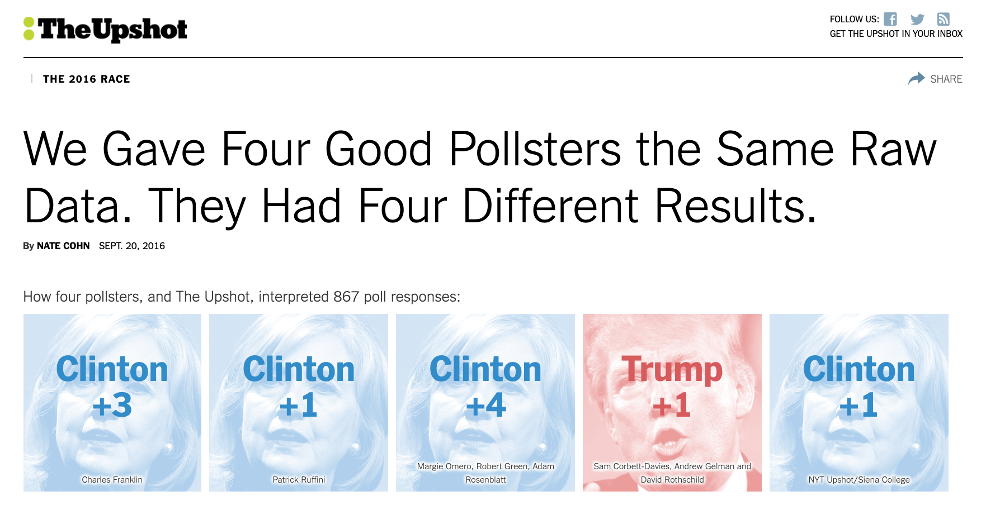

# Survey Data {#survey}

This section will provide a brief introduction to tools available in R for the analysis of survey data.

Here are some supplemental resources:

  - The primary survey package we will be using is from Thomas Lumley, appropriately called `survey`.
      + Recently, there has been a package `srvyr` that incorporates more tidyverse language. See this [tutorial](https://cran.r-project.org/web/packages/srvyr/vignettes/srvyr-vs-survey.html) for details.
  - The Pew Research center has released a [tutorial](https://medium.com/pew-research-center-decoded/how-to-analyze-pew-research-center-survey-data-in-r-f326df360713) for the analysis of their survey datasets. This can be applied more generally to analyze other types of survey data.


## What's the fuss?

Let's first discuss why we might even want special methods for analyzing survey data in the first place.

When you have survey data, oftentimes as researchers are interested in making inferences from a *sample* available in the survey to a broader *population*. However, there may be many ways in which our sample is not representative of the population. The represenativeness of a survey is one component of what is called the "total survey error" framework.

  - Matt Salganik's book *Bit by Bit* describes this in [section 3.3](https://www.bitbybitbook.com/en/1st-ed/asking-questions/total-survey-error/)


In the ideal case, we would draw a *simple random sample* from the population using probability sampling.

  - Sample n units from an N population where each unit has equal probability of being sampled. We can get sample statistics very simply in this case. 
      + For example, the simple mean of a variable measured in the sample would be equivalent to the expected value in the population.

\begin{align*}
\bar y &= \frac{1}{n}\sum_{i=1}^n y_i\\
\mathbf E(\bar y) &= \mu
\end{align*}

In this estimator, we assume that all sample units $i$ represent the same number of units in the population. When could this go wrong? Basically, almost any time we actually try to sample from a population in practice. It is very, very hard to get simple random samples of the population.

Sometimes the way survey samples are collected are through complex designs. Example:

*Stratified sample* of the United States

  - Consider each county a "strata"
  - Conduct a random sample within strata
  - Why? If you conduct a simple random sample at the individual-level, just by chance you might not not sample within each county

*Clustered random sample* within the United States

  - Consider each county 
  - Sample $m$ number of counties (these are considered to be "clusters")
  - Sample within each cluster

When you have generated a sample using cluster or stratified sampling, it is best to account for this data generating process in the analysis to get accurate estimates for sample averages and variances. The R package we will use will account for this.

### Weighting Surveys

In many cases, our survey data are not perfectly representative of the population. In these cases, often a researcher might want to employ weights to adjust the estimates calculated from a sample in order to make them more accurate for the population of interest.

  - What was the problem: Each unit $i$ in the sample no longer represents the same number of units in the cluster, strata, or population. Some types of people might be "overrepresented" in the sample relative to the population, and some might be underrepresented.
  - One Solution: Weights $w$ to reflect/ adjust for the number of units in the population that the sampled unit $i$ represents. 
  - What do we need? Auxiliary information about the target population so we know how to adjust the data
      + Where do we get this? Sometimes it is provided by survey firms or described in the codebook of existing surveys. Other times, you could consider constructing your own weights.

Example:
\begin{align*}
\bar y &= \sum_{i=1}^n y_i*w_i\\
\end{align*}

When will weights matter?

  - Weights will matter particularly when your data are unrepresentative on characteristics that directly influence your outcomes of interest. 
      + For example, let's say you had a survey that was representative except for age. You had too many young people in the sample relative to the population. Let's say you are interested in predicting the proportion of people who voted for Biden in 2020. If age did not matter for vote choice, then it might not matter that your survey was unrepresentative by age. But, if age does matter, then the unweighted estimate from your sample might be biased!

Where can weights go wrong?

  - Let's be real here. Weighting is an art as much or more than a science.
      + It is not always immediately obvious what the target population is (e.g., if the target population is the set of people who will vote in an election).
      + It is not always immediately obvious how to get accurate data on this target population, even if known (e.g., not every population as up-to-date Census information).
      + It is not always obvious which variables to choose to weight on (e.g., which demographics?)
      + You may also not have all variables of interest available in your sample or at the population level.
      + Missing cells. Even if you have all of the above, weighting can still be insufficient if your sample simply does not contain certain subgroups of the population or contains too few members of a certain subgroup of the population. (e.g., suppose your sample only includes 18-25 year olds -- it will be hard to infer things about older populations.)
  
For example, The Upshot gave different polling firms the same survey data. They each came up with different estimates of vote choice in 2016 due to small differences in choices about weighting and identifying the target population.The [linked article](https://www.nytimes.com/interactive/2016/09/20/upshot/the-error-the-polling-world-rarely-talks-about.html) describes the different choices the pollsters likely made.


{width=80%}


### Broad Types of Survey Sampling Techniques

Survey sampling techniques are sometimes broken into two types: non-probability and probability sampling. 

In probability samples, the probability that a respondent is selected for the survey is known, and this helps ensure that the sample will be representative. However, what is becoming increasingly less known, is the probability that a person will *respond* to a survey. Because this is less well-known, even probability samples will need adjustments for weighting to get accurate estimates.

Non-probability samples come in many different forms, such as those that use "quota sampling," convenience samples from online labor markets, or more sophisticated algorithms for choosing respondents that reflect the population. Pew describes different types of non-probability samples [here](https://www.pewresearch.org/methods/2016/05/02/variation-in-online-nonprobability-survey-design/).

Matt Salganik, as part of the curriculum for the Summer Institutes in Computational Social Science, provides a nice overview of the tradeoffs between probability and non-probability samples and what this means for survey weighting.


```{r, echo=FALSE, warning=FALSE, message=FALSE}
library("vembedr")
library(knitr)

embed_url("https://www.youtube.com/watch?v=SLAi9v5CCnM")
```

Pew provides a somewhat more pessimistic take on nonprobability samples in this [report](https://www.pewresearch.org/methods/2016/05/02/evaluating-online-nonprobability-surveys/).

## Survey R package

Let's assume for now that we have some survey data, and those data contain some information about the sampling process, as well as survey weights. With this information, we are ready to use the `survey` package to conduct analysis.

The `survey` package by Thomas Lumley allows you to declare the nature of the survey design. 

  1. Load your dataset as usual into a dataframe in R
  2. Construct the variables you will use in analysis
  3. Declare to R the survey design by assigning your data frame as a new survey object.
  4. Perform analyses using functions from the `survey` package

`svydesign`(`data =` ...,
           `weights=` ...,
           `fpc=` ..., 
           `strata =` ...,
           `id = `...)

  - `data`: data frame
  - `weights`: sampling weights
  - `fpc`: Finite population correction (less common)
  - `strata`: Formula or vector specifying strata (NULL by default)
  - `ids`: Primary sampling unit. Formula or data frame with cluster ids. Use ~1 or ~0 if no clusters.

### Examples of specifying svydesigns

The easiest, but also common, way to specify a survey design occurs when you have survey data and a column of survey weights that the survey firm has provided-- no clusters or strata. 

Let's look at this using data from within the `survey` package. The `apisrs` represents a simple random sample with a column `pw` for survey sampling weights. We can specify the design below:

  - See also, a detailed [example](https://medium.com/pew-research-center-decoded/how-to-analyze-pew-research-center-survey-data-in-r-f326df360713) from Pew analyzing one of their datasets with the survey package. 


*Example: Sample of students in California.*

```{r, warning=F, message=F}
library(survey)
data(api) # loads several dataframes 

## Sample with just weights, no clusters/strata
head(apisrs)

## Specify design
apisrs_design <- svydesign(data = apisrs, 
                             weights = ~pw, 
                             id = ~1)
```

*Example: Sample of students in California. Samples stratified by School type*

Here is an example with a stratified random sample with a known finite population variable. Here, we had the `fpc` column and strata column `stype`. We still supply the weights `pw`.

```{r}
## Use apistrat
apistrat_design <- svydesign(data = apistrat, 
                             weights = ~pw, 
                             fpc = ~fpc, # population of school types known
                             id = ~1, # no clusters
                             strata = ~stype)
```


*Example: Sample of students in California by clustering.* 

Here is a more complex example.

  - Samples clustered by school districts `dnum`. 
  - Within district, five schools were sampled `snum`. 
  - Fpc for district and school are `fpc1` and `fpc2`

```{r}
apiclus_design <- svydesign(data = apiclus2, 
                             weights = ~pw, 
                             fpc = ~fpc1 + fpc2, 
                             id = ~dnum + snum) # start from biggest clu
```

For more established surveys, often the codebook might include documentation on how to account for survey weights and sampling design. For example, the American National Election Study will generally include this guidance in recent codebooks. Here is an example accounting for the sampling design in the [2016 ANES](https://electionstudies.org/wp-content/uploads/2018/12/anes_timeseries_2016_userguidecodebook.pdf).

You can use `foreign`, `rio`, or what we will use here, `haven` to load the .dta data.
```{r, warning=F, message=FALSE}
library(haven)
an <- read_dta("https://github.com/ktmccabe/teachingdata/blob/main/anes_timeseries_2016_Stata12.dta?raw=true")
```

One benefit of loading data through `haven` and some of the newer packages is it will help retain value labels from the original data that R might not otherwise load. (E.g., labels that would show up in SPSS or Stata but seem lost in R.)

Let's check this for an example: "How well does feminist describe you?
```{r, message=F, warning=F}
library(tidyverse)
an$V161346 %>% attr("labels")
```

OK enough about that. Let's specify the survey design.
```{r}
anes_design <-
    svydesign( 
        ids = ~V160202 , 
        strata = ~V160201 , 
        data = an, 
        weights = ~V160102,
        nest = TRUE)
```
The `nest` argument indicates if cluster ids should be relabeled to align with strata. 


### Working with survey designs

The good news is that once you have specified the survey design, the rest of the analysis will flow similarly across types of survey designs. The bad news is that you will need to use special functions to analyze the data instead of the functions we are used to working with. These generally start with `svy`..... but the good news is, they are not that different from our normal functions!

Here are a few examples of common functions using the survey design.

```{r}
## Means and uncertainty of variables
## Note: we put design where you would normally see data
svymean(~mobility, design = apiclus_design)
SE(svymean(~mobility, design = apiclus_design))
confint(svymean(~mobility, design = apiclus_design))
```

```{r}
## Linear Regression
fit.lin <- svyglm(mobility ~ meals + awards, family = "gaussian",
       design = apiclus_design)

## Logit Regression
fit.logit <- svyglm(awards ~ meals, 
              family = binomial(link = "logit"),
       design = apiclus_design)
```
For an example of ordinal logistic regression see section 8.6 of the course notes.

```{r}
## Can also subset like normal with subset command
apiclus_design2 <- subset(apiclus_design, meals > 1)
```


  - The Pew research center has also written a tutorial for using various `tidyverse` tools with survey data. See [here](https://medium.com/pew-research-center-decoded/using-tidyverse-tools-with-pew-research-center-survey-data-in-r-bdfe61de0909) for details.
  - In addition, there has been a package `srvyr` recently developed that incorporates more tidyverse language with the same set of survey tools. See this [tutorial](https://cran.r-project.org/web/packages/srvyr/vignettes/srvyr-vs-survey.html) for details and some analysis examples.
  - Our friends the `prediction` and `margins` packages have some capabilities for models fit through the `survey` package.
      + With the `margins` package, you will want to specify the `design` in order to make sure the average marginal effects reported are based on the survey design object. Example:
      
```{r, warning=F, message=F}
library(margins)
res <-margins(fit.logit, variables = "meals",
              design=apiclus_design, 
              change="iqr")
summary(res)
```


### Why do we need the `survey` package? 

The benefits of the survey package really come from the tool's specialty in calculating appropriate variances for the survey design and accounting for very complex stratified or clustered designs. There are other weighting functions in R that will allow you to recover the same point estimates as the survey tools in some cases. However, it won't always be the case that they will give you accurate measures of uncertainty.

If you don't need measures of uncertainty, then other functions from base R, such as `weighted.mean` can also work in cases where you just have a column of survey weights.

```{r}
weighted.mean(apisrs$mobility, w=apisrs$pw)
svymean(~mobility, design = apisrs_design)
```

## Constructing your own weights

Sometimes you might have collected your own survey data, which you know is not representative, but no weights are provided for you. 

If you think that weighting the data will be important, then you can construct your own weights! We can:

  - Collect information on our respondents to compare sample to population (including demographic questions on your survey)
  - Gather statistics on the population (e.g., Census data)
  - Construct weights to indicate how many units in the population each $i$ unit in our sample should represent
      + One example of constructing your own weights is through a process called Raking. Here, we find weights so that the weighted distributions of your variables in your sample match the distributions of the variables in the general population very closely. How?
          1. Decide the variables on which you want to weight your data (e.g., gender, education, age)
          2. Find the proportion that each subgroup within these variables exist in your target population (e.g., maybe .55 women, .45 men)
          3. Use a raking algorithm to adjust your sample data to, when weighted, reflect these distributions in the population. For example, perhaps your sample had 70\% women. After raking, we would hope that when `svymean` is applied, you would find the weighted proportion in your data is 55\%.
          
This [R bloggers tutorial](https://www.r-bloggers.com/2014/04/survey-computing-your-own-post-stratification-weights-in-r/) goes through an example using the `survey` package and function `rake`.

In addition, Pew has released an R package with similar weighting capabilities described [here](https://medium.com/pew-research-center-decoded/weighting-survey-data-with-the-pewmethods-r-package-d040afb0d2c2).

Raking is not the only type of weighting that is possible. Pew describes and evaluates other weighting processes [here](https://www.pewresearch.org/methods/2018/01/26/for-weighting-online-opt-in-samples-what-matters-most/).

Several pollsters interested in measuring vote choice and public opinion have started turning to a process called multilevel regression and post-stratfication (MRP or, fondly, Mr. P). 

  - This "multilevel" refers to the same multilevel modeling approach we discussed, using `lme4`. An R introduction to this is [here](https://jayrobwilliams.com/files/html/teaching-materials/MRP#) with a companion paper [here](https://scholar.princeton.edu/sites/default/files/jkastellec/files/mrp_primer.pdf) that has citations to political science examples using MRP.
  - The technique has been around for a long time, but now is starting to infiltrate mainstream polling in addition to political science.
      + See Andy Gelman's take on it [here](https://statmodeling.stat.columbia.edu/2016/10/12/31398/) along with a debate with Nate Silver [here](https://statmodeling.stat.columbia.edu/2020/02/03/mrp-carmelo-anthony-update-trash-talkings-fine-but-you-gotta-give-details-or-links-or-something/).
      + For example, CBS used MRP in their [2020 election tracking](https://www.cbsnews.com/news/cbs-news-2020-battleground-tracker-5-things-to-know/) .
      + Doug Rivers provided a short course on MRP at an AAPOR conference. Slides [here](https://github.com/rdrivers/mrp-aapor/blob/master/slides.pdf).


