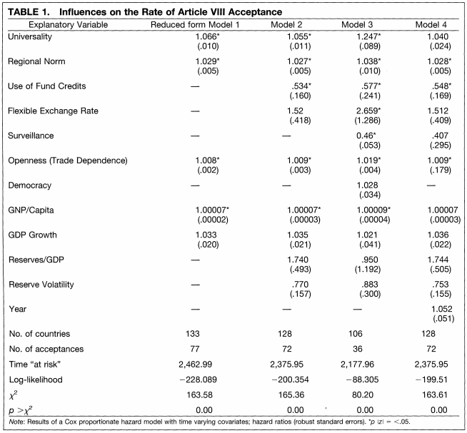

# Survival Data {#survival}

This section will provide a brief introduction to survival data analysis, or similarly, "event history" or "duration" analysis.

Here are some supplemental resources:

  - Overviews with R code (less on the technical aspects)
      + Focus on cox proportional hazards description [here](https://www.datacamp.com/community/tutorials/survival-analysis-R)
      + Also includes [Weibull and exponential models](https://folk.ntnu.no/bo/TMA4275/Download/R.tutorialDiez.pdf)
      + Several examples (not much explanation) [here](https://stats.idre.ucla.edu/other/examples/asa2/)
  - Overview of the stats
      + Freedman. (2008). ["Survival Analysis: A Primer" The American Statistician, Vol. 62, pp. 110–119.](https://www.stat.berkeley.edu/~census/survival.pdf)
      + And Chapter excerpt from [Sage](https://www.sagepub.com/sites/default/files/upm-binaries/39847_9781848601017_Mills.pdf)
  - Applications and discussions in political science
      + [Alt and King.(1994).](https://gking.harvard.edu/files/abs/transfers-abs.shtml) (debate on government power transfers)
      + Box-Steffensmeier, Janet M. and Bradford S. Jones. 1997. "Time is of the Essence: Event History Models in Political Science." American Journal of Political Science 45:972–988.
      + Beck, Nathaniel, Jonathan Katz, and Richard Tucker. 1998.
      "Taking Time Seriously: Time-Series-Cross-Section Analysis with a Binary Dependent Variable." American Journal of Political Science 42:1260-1288.
      
      
## Survival Overview

Survival data is also known as event history or duration data analysis. When we have this type of data, we are generally interested in these types of questions:

  - How long does something last? 
      + Examples: length of conflict, length of peace agreement, length of congressional career
  - What is the expected time to an event?
  - And how does this duration differ across subgroups?
  - How do covariates influence this duration?

There are two key components to survival data: **time** (e.g., days, months, years. etc) and the **event** of interest or "status" (i.e., whether an event has occurred). Canonically this could be an event such as death, but in political science this might be an event like the experience of a conflict, end of conflict, end of regime, etc.)

### Survival and hazard functions
  
For example, we might call something "survival" analysis in a context where we were interested in the time to death of someone who has just had a particular medical diagnosis. 

We will have two primary components: the survival function $S(Y)$:

  - This gives the probability that the duration of survival (time to event) is longer than some specified time ($Pr(Y_i > y)$)

Time to failure $Y_i$ as outcome: $Y_i \geq 0$ 

  - $S(y) = Pr(Y_i > y) = 1 - Pr(Y_i \leq y)$ 
      + where $Pr(Y_i \leq y)$ is the CDF
  - PDF $f(y) = - \frac{d}{dy} S(y)$
  - This is nondecreasing.

```{r}
## Example of S(y) according to the Weibull distribution
## Note: It is 1-pweibull()
y <- seq(0, 100, 1)
Fy <- pweibull(y, shape=2, scale=50)
plot(x=y, y=(1-Fy), type="l")
```

More on the Weibull distribution [here](https://www.weibull.com/hotwire/issue14/relbasics14.htm).

And the hazard function $h(y)$: Given survival up until $y$, the instantaneous rate at which something fails (that the event occurs).

  - $h(y)=\frac{f(y)}{S(y)} =- \frac{d}{dy} \log S(y)$
  - $S(y) = exp (-\int_0^y h(t)dt)$

Note: hazard rate is not exactly a probability and is difficult to interpret, but higher hazard rates reflect greater likelihood of failure.


### Censoring

In survival data, right-censoring of the data is common

  - E.g., An observation does not experience an event during the study period, but the study period ends.
      + Example: How many years does it take to finish grad school? If we cut off our period of study right now, you might be a censored observation. You are going to finish grad school at some point, but we have not observed that during our observation period.
      + Can address by assumption: Given covariates, hazard rates of those who are censored $C_i$ do not systematically differ from those who are not: $Y_i \perp C_i | X_i$. $Y_i$ independent of censoring status, conditional on covariates.
      
  

## Kaplan-Meier Survival Function

A common way to summarize survival curves for actual data is through Kaplan-Meier curves. 

This is a non-parametric analysis: Where $n_j$ is the number of units at "risk" and $d_j$ are the number of units failed at $t_j$

  - For $j: t_j \leq y$: $S(\hat y) = \prod \frac{n_j - d_j}{n_j}$
  - Units surviving divided by unit at risk. Units that have
died, dropped out, or not reached the time yet are not
counted as at risk. 

Example from Simmons (2000), ["International law and state behavior: Commitment and compliance in international monetary affairs"](https://dash.harvard.edu/bitstream/handle/1/3153320/simmons_internationallaw.pdf?sequence=2) published in the *American Political Science Review*.

  - Note: unlike the nice theoretical parametric curve from above, often survival estimates from real data are more like "step functions."


### Kaplan-Meier in R

We will use the `lung` data from the `survival` package. For plotting, we will use the package `survminer`.

```{r, warning=F, message=F}
## install.packages("survival")
library(survival)
data("lung")
head(lung)
```

  - `time`: days of survival. 
  - `status`: whether observation has failed or is right-censored. 1=censored, 2=dead.
  - `sex`: Male=1; Female =2

Note: the place where we would normally put our outcome variable in a regression formula now takes `Surv(time, event)`
```{r, fig.height=10, fig.width=10, warning=F, message=F}
## Kaplan-Meier
sfit <- survfit(Surv(time=time, event=status)~sex, data=lung)

## install.packages("survminer")
library(survminer)
ggsurvplot(sfit, 
           conf.int=TRUE, 
           risk.table=TRUE, 
           pval = TRUE,
           legend.labs=c("Male", "Female"), 
           legend.title="Sex",  
           title="Kaplan-Meier: for Lung Cancer Survival")
```

## Modeling Approaches

By using parametric approaches (using an underlying probability distribution), we can build on Kaplan-Meier to accept a broader range of covariates in the independent variables. There are three common distributions used:

  1. Exponential: $h(y) = \tau$
      + hazard function is constant (the hazard of exiting is the same regardless of how long it's been succeeding). no duration dependence.
  2. Weibull: $h(y) = \frac{\gamma}{\mu_i^\gamma}y^{\gamma-1}$
      + Generalizes exponential. Adds parameter for duration dependence. Monotonic.
  3. Cox proportional hazards: $h(y|x) = h_0(y) \times r(x)$
      + Generalizes Weibull. Multiplicative effect of the baseline hazard $h_0(y)$ and changes in
covariates $r(x) = \mu_i$ in this case. Non-monotonic.
      + Must assume proportional hazards. Hazard ratio of one group is a multiplicative of another, ratio constant over time.

Other variations also exist (e.g., recurrent events, multi-state models). 

Example of Cox Proportional Hazards table from Simmons (2000)



### Survival Models in R

We will do an example of these modeling approaches using the same package in R and dataset.

### Weibull Model

```{r}
wfit <- survreg(Surv(time=time, event=status)~ age + sex, 
                data=lung,
                dist = "weibull")
summary(wfit)
```
We can interpret this as women having a higher survival duration than men. Positive coefficients for this model are associated with longer duration times. The hazard decreases and average survival time increases as the $x$ covariate increases.


We can get different quantities of interest, such as a point at which 90\% of patients survive.
```{r}
# 90% of patients of these types survive past time point above
predict(wfit, type = "quantile", p =1-0.9,newdata =
          data.frame(age=65, sex=c(1,2)))
```

A survival curve can then be visualized as follows:
```{r}
pct <- seq(.99, .01, by = -.01)
wb <- predict(wfit, type = "quantile", p =1-pct,newdata =
          data.frame(age=65, sex=1))

survwb <- data.frame(time = wb, surv = pct, 
                      upper = NA, lower = NA, std.err = NA)
ggsurvplot(fit = survwb, surv.geom = geom_line, 
           legend.labs="Male, 65")
```

### Cox proportional Hazards Model

```{r}
fit <- coxph(Surv(time, status) ~ age  + sex, 
             data = lung) 
summary(fit)
```

Here, positive coefficients mean that the hazard (risk of death) is higher. 

  - $exp(\beta_k)$  is ratio of the hazards between two units where $x_k$ differ by one unit. 
  - Hazard ratio above 1 is positively associated with event probability (death).

Visualizing Results

  - The `survminer` package has some shortcuts for this type of model.
  - A simple plot would be the overall survival probabilities from the model
```{r, message=F, warning=FALSE}
library(ggplot2)
library(survminer)
cox1 <- survfit(fit)
ggsurvplot(cox1, data = lung)
```

We can also visualize the results by using the same types of approaches we do when we use the `predict()` function and specify new $X$ data in other types of regression. Here, we will use the command `survfit`.
```{r}
sex_df <- data.frame(sex = c(1,2), age = c(62, 62) )
cox1 <- survfit(fit, data = lung, newdata = sex_df)
ggsurvplot(cox1, data = lung, legend.labs=c("Sex=1", "Sex=2"))
```  


You may wish to test the proportional hazards assumption. Here are two resources for this [here](http://www.sthda.com/english/wiki/cox-model-assumptions) and [here](https://stats.stackexchange.com/questions/61131/test-cox-proportional-hazard-assumption-bad-schoenfeld-residual).


