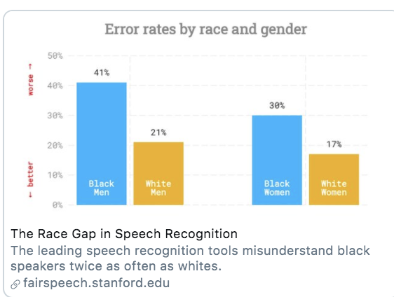

---
title: "MLE for Political Science"
author: "Instructor: Katie McCabe"
site: bookdown::bookdown_site
documentclass: book
output:
  bookdown::gitbook:
    dev: svglite
    css: css/style.css
    split_by: section
    split_bib: true
    number_sections: true
---

# Course Overview

This document will include important links and course notes for 16:790:677:01: Maximum Likelihood Estimation.

  - This webpage will be updated throughout the semester with new content. This initial content in Sections 2 and 3 is optional, but encouraged, and includes tutorials and resources for basics in R and mathematical concepts used in the course. Material introduced in the course will assume some familiarity with these concepts. I recommend you go through on your own leading up to and during the first week of the course. You can then always return to it throughout the course and beyond. I always have to return to it because I don't often keep the special rules of logarithms and derivatives in my working memory.
  - Sprinkled throughout this document are links to additional resources that might provide more in-depth explanations of a given topic. In particular, several of the sections have benefited from previous materials developed by Kosuke Imai and the book [Quantitative Social Science](https://qss.princeton.press/), Chris Bail and [SICSS](https://sicss.io/), Marc Ratkovic, In Song Kim, Will Lowe, and others.
  - This is a new and living document. If you spot errors or have questions or suggestions, please email me at k.mccabe@rutgers.edu.

<!-- If you need PDF output, uncomment bookdown::pdf_book above in YAML. You will need a LaTeX installation, e.g., https://yihui.name/tinytex/ -->

<!-- Instructions: https://ontheline.trincoll.edu/bookdown.html -->

<!--chapter:end:index.Rmd-->


# R Overview {#rover}

Placeholder


## First Time with R and RStudio
### **Open RStudio**
### **Using R as a Calculator**
### **Working in an R Script**
### **Preparing your R script**
### **Executing Commands in your R script**
### **Objects**
### **Practice** 
## Tutorials
## Data Wrangling
### Dealing with Uninformative Variable Names
### Dealing with Missing Data
### Dealing with Variable Codings that Aren't Quite Right
### Dealing with Incomplete Data (Merging!)
### Dealing with Poorly Shaped Data
### Subsetting data by rows and columns
### Visualizing Data
### Reproducing your steps
## Tools for writing up results
### R Markdown
### LaTex
### Formatting and Exporting R Results
### Additional formatting examples
### Additional Table Types
## Exploratory Data Analysis Tools

<!--chapter:end:02-ROverview.Rmd-->


# The MATH {#math}

Placeholder


## Mathematical Operations
### **Order of Operations**
### **Exponents**
### **Summations and Products**
### **Logarithms**
## Mathematical Operations in R
### PEMDAS
### Exponents
### Summations
### Logarithms
## Derivatives
### **Derivatives** 
### **Critical Points for Minima or Maxima** 
### **Common Derivative Rules** 
## Vectors and Matrices
### **Matrix Basics**
### Matrix Operations
## Additional Matrix Tidbits that Will Come Up
### **Transpose**
### **Additional Matrix Properties and Rules**
### **Matrix Rules**
### **Derivatives with Matrices and Vectors**
## Practice Problems
### Practice Problem Solutions

<!--chapter:end:03-TheMATH.Rmd-->


# Review of OLS {#ols}

Placeholder


## Introducing OLS Regression 
## Diving Deeper into OLS Matrix Representation
### Estimating the Coefficients
## OLS Regression in R
### Example: Predicting Current Election Votes from Past Election Votes
### Plotting Regression Results
### Finding Coefficients without `lm`
### OLS Practice Problems
### Code for solutions
## Week 1 Thursday Tutorial
## Uncertainty and Regression
### Variance of the Coefficients
### Hypothesis Testing
### Goodness of Fit
## Generating predictions from regression models
## Wrapping up OLS
### Practice Problems
### Practice Problem Code for Solutions
## Week 2 Thursday Example

<!--chapter:end:04-ReviewofOLS.Rmd-->


# Introduction to MLE {#mle}

Placeholder


## What is likelihood?
### Summarizing Steps for Maximum Likelihood
## Generalized Linear Models
### GLM Model.
### Linking likelihood and the GLM
### GLM in R
## MLE Estimation 
### Deriving Estimators 
### Score function
### Hessian and Information Matrix
### MLE Estimation Algorithm
## MLE Properties
### Hypothesis Tests
### Model Output in R

<!--chapter:end:05-IntrotoMaximumLikelihood.Rmd-->


# Binary Dependent Variables {#binary}

Placeholder


## Data Generating Process
### MLE Estimation
## R code for fitting logistic regression
### Writing down the regression model
## Probit Regression
## To logit or to probit?
## Latent propensity representation
## Linear Probability Models
## Week 3 Tutorial
### Loading data and fitting glm
### Numeric Optimization
### Predicted Probabilities

<!--chapter:end:06-BinaryOutcomes.Rmd-->


# Quantities of Interest {#qoi}

Placeholder


## Using the response functions to generate quantities of interest
## QOI at Designated Values
### Marginal Effects
### Marginal effects at the mean
### Marginal effects at representative values
### Average marginal effects 
### `prediction` and `margins` packages.
### QOI Practice Problems
## Uncertainty
### Bootstrapping
### Simulated Confidence Intervals
## Visualizing Results
## Additional R shortcuts
### Prediction
### Margins
### Zelig
### Using `expand.grid`
## Week 4 Tutorial 
## Putting everything together

<!--chapter:end:07-QuantitiesofInterest.Rmd-->


# Ordinal Outcomes {#ordinal}

Placeholder


## Ordinal Outcome Data
### Ordinal Model
### Interpretation
## Likelihood Framework 
### Likelihood
## Fitting Ordinal Models in R
### Quantities of Interest
## Assumptions
## Ordinal Practice Problems
### A note on robust standard errors
## Week 6 Tutorial

<!--chapter:end:08-OrdinalandOutcomes.Rmd-->


# Multinomial Outcomes {#ml}

Placeholder


## Overview of Nominal Data
### Multinomial Likelihood
## Motivating Example
### Assumption and Considerations
### Key Assumption: Independence of Irrelevant Alternatives
## Running multinomial logit in R
### Multinomial Quantities of Interest
## Practice Problems for Multinomial
## Week 7 Tutorial

<!--chapter:end:09-NominalOutcomes.Rmd-->


# Count data {#count}

Placeholder


## Overview of Count Data
## Poisson Model
## Motivating Example for Count Data
### Fitting Poisson in R
### Interpreting regression output
## Poisson Quantities of Interest
### Expected Counts
### Sidenote: Multiplicative coefficient interpretation
### Incidence Rate Ratios
### Where Poisson is poisonous:
## Quasipoisson and Negative Binomial Models
### Negative Binomial Models
## Count data practice problems
## Week 8 Tutorial
## Additional Considerations
### Offset
## How to think about Zero Counts
### Hurdle Models
### Zero Inflated Poisson/Negative binomial

<!--chapter:end:10-CountData.Rmd-->


# Sample Selection Models {#selection}

Placeholder


## Sample Selection
### How do we go about estimating this? 
### Sample Selection Model Assumptions
## Fitting Sample Selection in R
## Heckman Example Using Survey Data
## Tobit Model aka Censored regression model
### Tobit Model Assumptions
## Truncated Models

<!--chapter:end:11-SampleSelection.Rmd-->


# Panel and Hierarchical Data {#hier}

Placeholder


## Week 10 Tutorial
## Panel and Hierarchical Data
## Fixed Effects
### Within-Estimator 
### Least Squares Dummy Variable Regression
### Fixed Effects Implementation in R
### Standard errors with fixed effects
## Additional considerations for fixed effects
### Binary dependent variables
### Two-way fixed effects
### First Differences
### Additional Models in R
## Random Effects
### Random effects models
### Random Effects Implementation in R
### Using lme4 for random effects
### Random Effects Extensions
### Extracting lmer output
### Generating predicted values for each unit
### Week 11 Tutorial
### Generalized LMER
## Summing Up
## Week 12 Exercise

<!--chapter:end:12-PanelData.Rmd-->


# Survey Data {#survey}

Placeholder


## What's the fuss?
### Weighting Surveys
### Broad Types of Survey Sampling Techniques
## Survey R package
### Examples of specifying svydesigns
### Working with survey designs
### Why do we need the `survey` package? 
## Constructing your own weights

<!--chapter:end:13-SurveyData.Rmd-->


# Survival Data {#survival}

Placeholder


## Survival Overview
### Survival and hazard functions
### Censoring
## Kaplan-Meier Survival Function
### Kaplan-Meier in R
## Modeling Approaches
### Survival Models in R
### Weibull Model
### Cox proportional Hazards Model

<!--chapter:end:14-SurvivalData.Rmd-->

# Prediction and Classification {#predict}

This section will provide a brief introduction to tools related to the goals of prediction and classification. 

In the social sciences, we often have one of a few goals in mind:

  - Describe
  - Explain, evaluate, and recommend $\rightarrow$ Causality
  - Discover and Predict
  
Most of the tools we have been working on thus far have focused on first describing our data and then conducting hypothesis tests through different types of regression, in order to assess a deductive hypothesis, *explaining* the relationship between two variables.

Here, we are going to turn to the third goal above.

Some supplemental resources for this section include the following R packages:

  - I highly recommend this [online interactive course](https://supervised-ml-course.netlify.app/) (free- amazing!) from Jilia Silge which walks through a newer package, `tidymodels` similar to caret, that can apply several different types of machine learning models. It draws on the fundamentals covered in this section but adds more advanced techniques. Here is an additional detailed tutorial on this package [here](https://hansjoerg.me/2020/02/09/tidymodels-for-machine-learning/) and [here](https://www.r-bloggers.com/2020/03/machine-learning-with-tidymodels-2/).
  - `caret` [package](http://topepo.github.io/caret/index.html) and [presentation](https://www.r-project.org/conferences/useR-2013/Tutorials/kuhn/user_caret_2up.pdf}{presentation)
  - `RTextTools` (may or may not be updated) [here](https://cran.r-project.org/web/packages/RTextTools/index.html) and [here](https://journal.r-project.org/archive/2013-1/collingwood-jurka-boydstun-etal.pdf}{summary)

## Overview of Prediction and Classification

When we predict something, we are estimating some unknown using information we do know and trying to do so as accurately and precisely as possible.

  - Often prediction involves classification--  predicting a categorical outcome (e.g., prediction of who wins vs. who loses)

Some social science examples of this might include


  - Trying to detect hate speech online
  - Trying to flag "fake news" and other misinformation
  - Trying to forecast the results of an election
  - Trying to classify a large amount of text into subject or topic categories for analysis
  

### How to predict or classify

Goal: Estimate/guess some unknown using information we have -- and do so as accurately and precisely as possible.

  1. Choose an approach
      - Using an observed (known) measure as a direct proxy to predict an outcome (e.g., a dictionary)
      - Using one or more observed (known) measures in a (often, regression) model to predict an outcome
      - Using a model to automatically select the measures to use for predicting an outcome
  2. Assess accuracy and precision in-sample and out-of-sample using some sample "training" data where you do know the right answer ("ground truth").
      - Prediction error: $Truth - Prediction$ 
      - Bias: Average prediction error: $\text{mean}(Truth - Prediction)$
          + A prediction is `unbiased' if the bias is zero (if the prediction is on average true)
      - In regression: R-squared or Root-mean squared error 
          + RMSE is like `absolute' error-- the average magnitude of the prediction error 
      - For classification: Confusion Matrix 
          + A cross-tab of predictions you got correct vs. predictions you got wrong (misclassified)
          + Gives you true positives and true negatives vs. false positives and false negatives
  3. Repeat steps 1 and 2 until you are confident in your method for predicting or classifying.
  4. Apply to completely unknown data. 
  

## In-sample vs. Out-of-Sample

Problem: Models that fit our existing ("in-sample") data might not be the best for predicting out-of-sample data. Issues with variability and overfitting.

  - There may be idiosyncratic features of the data for which we do know the ground truth (e.g., outliers, different levels of variability) that could lead to poor predictions. This can lead to overfitting-- predicting your particular dataset reaaaaaallly well, but any other data, more poorly.
  - Our training data could be unrepresentative of the population in some way
  
For example, many AI tools suffer from gender and/or racial biases due to unrepresentative training data. If most of the data used to train a speech detection or facial recognition tool was trained on white faces/ white voices, it may have poor accuracy for other groups.



Solutions:

  - Choose your training data wisely!
  - Search for systematic biases along key variables (instead of aggregate accuracy, also look for accuracy measures by subgroups)
  - Use out-of-sample predictions/classification tests to help avoid overfitting
      + Split data into train vs. test and/or do this repeatedly with
      + Cross-validation


## Cross-Validation

Cross-Validation is an approach to address overfitting issues

  - Take data for which you know the answer -- we call this "training data"
  - Randomly subset out a portion of the training data. This will become our "test" data.
  - Develop a model based on  the training data. 
  - Test the accuracy of the model on the test data (out-of-sample data that was not used to train the model).
  - Repeat process for different portions of the data.

Goal: See how well our model will generalize to new data (data the model hasn't seen).


### k-fold cross-validation

Divide your data into folds (how many $k$ depends on how much data you have)

  - Fit your model to $k-1$ folds
  - See how well your model predicts the data in the $k$th fold.
  - Can repeat, leaving out a different fold each time

### Leave-one-out cross-validation

Best for smaller data

  - Fit your model to all but one observation in your data
  - See how well your model predicts the left-out observation
  - Can repeat, continuing to leave out one observation each time


## Examples of Prediction and Classification

You may be wondering why we are covering these topics in a maximum likelihood course. Well, one of the most fundamental types of classification relies on logistic regression. We are just going to reframe the tools we have already learned for a different purpose.

Let's use an example with the `donation` data from [12.7](https://ktmccabe.github.io/mlebook/week-12-exercise.html)

```{r}
library(rio)
don <- import("https://github.com/ktmccabe/teachingdata/blob/main/donation.dta?raw=true")
```

Recall that a key outcome variable here was `donation` indicating if a particular member of the donorate donated to a given senator (=1) or not (=0)

```{r}
table(don$donation)
```

Can we predict whether someone will donate to a Senator?

Outcome: `donation` (1 or 0), binary variable = binary classifier

  1. Choose an approach: Build a model (e.g., logistic regression)
  2. Train the model
  3. Assess accuracy 
      - Within sample and test model using cross-validation out-of-sample
  4. If we were very satisfied with our model, we could apply the model to data for which we do not know the answer in the future. 
      - If you were a campaign, could you predict who will donate?
  
Let's go!

```{r}
## build a model (choose "features" you think will be good for prediction)

## you will want to remove missing data first
donsub <- don[, c("donation", "NetWorth", "Edsum")]
donsub <- na.omit(donsub)

fit <- glm(donation ~ NetWorth + Edsum, 
           family = binomial(link = "logit"), data = donsub)
```

In-Sample Accuracy Assessments
```{r}
## generate probability of donation for each observation
donsub$prob <- predict(fit, type = "response")

## set a prediction threshold
donsub$pred <- ifelse(donsub$prob > mean(donsub$donation), 1, 0)

## accuracy- proportion where prediction matches reality
mean(donsub$pred == donsub$donation)

## confusion matrix
table(truth = donsub$donation, predicted = donsub$pred)
```
      
There are different measures for accuracy that focus on particular types of errors:

```{r}
## where did we miss
table(actual = donsub$donation, pred = donsub$pred)
truepos <- table(actual = donsub$donation, pred = donsub$pred)[2,2]
falsepos <- table(actual = donsub$donation, pred = donsub$pred)[1,2]
trueneg <- table(actual = donsub$donation, pred = donsub$pred)[1,1]
falseneg <- table(actual = donsub$donation, pred = donsub$pred)[2,1]

## precision
precision <- truepos/(truepos + falsepos)

## specificity
specificity <- trueneg / (trueneg + falsepos)

## false positive rate
falsepos <- falsepos/(trueneg+ falsepos)

## recall aka sensitivity
recall <- truepos/(truepos + falseneg)

## f-score, combination of precision/recall
F1 <- (2 * precision * recall) / (precision + recall)
```
See [this post](https://towardsdatascience.com/accuracy-recall-precision-f-score-specificity-which-to-optimize-on-867d3f11124) for more details and guidance on which one to choose.


Another common way to assess accuracy is through an ROC curve

ROC curves plot the true positive rate/precision (y) vs. 1 - false positive (x) rates. Want the curve to be away from the diagonal, increasing the area under the curive (AUC).
```{r, message=F, warning =F}
# install.packages("pROC")
library(pROC)
ROC <- roc(response = donsub$donation,
                  predictor = donsub$pred)
plot(ROC, print.thres = "best")
auc(ROC)
```
For more information, see [here](http://fouryears.eu/2011/10/12/roc-area-under-the-curve-explained/).


Out-of-Sample Tests: Cross-Validation

```{r, message=F, warning=F}
## split data into k folds
library(cvTools)
set.seed(1234)
folds <- cvFolds(nrow(donsub), K = 10)
```

Let's run through the process for one fold
```{r}
## leave one fold out != i
fit <- glm(donation ~ NetWorth + Edsum, family = binomial(link = "logit"), 
           data = donsub[folds$subsets[folds$which != 1],])

## out of sample prediction on left out fold == i
testdata <- donsub[folds$subsets[folds$which == 1],]
testdata$prob <- predict(fit, newdata = testdata, 
                       type = "response")

## choose some criteria to assess accuracy
## we will just assess basic matches, but you may want a different one
## set a prediction threshold
testdata$pred <- ifelse(testdata$prob > .5, 1, 0)
acc <- mean(testdata$pred == testdata$donation)
acc
```

Let's make a loop to repeat this process for each fold.

```{r}
## container vector for assessment criteria
accs <- rep(NA, 10)

## set to length of container
for(i in 1:10){
  
  ## leave one fold out != i
  fit <- glm(donation ~ NetWorth + Edsum, family = binomial(link = "logit"), 
           data = donsub[folds$subsets[folds$which != i],])
  
  ## out of sample prediction on left out fold == i
  testdata <- donsub[folds$subsets[folds$which == i],]
  testdata$prob <- predict(fit, newdata = testdata, 
                       type = "response")

  ## choose some criteria to assess accuracy
  ## set a prediction threshold
  testdata$pred <- ifelse(testdata$prob > .5, 1, 0)
  accs[i] <- mean(testdata$pred == testdata$donation)
}
accs

mean(accs)
```

We've done it! If we are satisfied with this level of accuracy, we could stop here and apply our model with any new data. If we are not satisfied, we would start by building a new model and repeat the process.

  - Note: this is actually probably a bad measure of accuracy for our case given the skew in our data. We are only accurate because the model is predicting no one will donate! Bad news for campaigns. How do we know this? By inspecting the confusion matrix. Our threshold of .5 was probably too high.


***Continuous Outcome***

Let's now try an example with a continuous outcome: How much will someone donate to a Senator? One way to judge accuracy of a linear model is the root mean squared error

One basic approach would be to use a linear regression model. Other than that, it's the same process as before, but we will use a different assessment for accuracy.
```{r}
fit <- lm(total_donation ~ NetWorth + Edsum, data = don)

## Root mean squared error
rmse <- sqrt(sum(residuals(fit)^2)/fit$df.residual)
rmse
```

## Extending Machine Learning

How do I know which variables matter? Examples of more complex machine learning methods.

  - Random forests
  - Gradient boosting 
  - LASSO
  - SVM

Tradeoffs: Machine Learning as "black box"- see [here](https://towardsdatascience.com/the-black-box-metaphor-in-machine-learning-4e57a3a1d2b0)


Here is a rough example using `caret` with one of these methods along with cross-validation. Be sure to look at the [documentation](https://cran.r-project.org/web/packages/caret/vignettes/caret.html) before using this in your own work. The performance metrics are described [here](https://topepo.github.io/caret/measuring-performance.html).
```{r, message=F, warning = F}
library(caret)

## Establish type of training
fitControl <- trainControl(## 5-fold CV
                           method = "cv",
                           number = 5)

## Train model. Note the . means include all variables. Let's subset first
library(tidyverse)
don2 <- don %>% dplyr::select(donation, Edsum, same_state, sameparty, NetWorth, peragsen)
don2$donation <-as.factor(ifelse(don2$donation == 1, "Donated", "Not Donated"))
don2 <- na.omit(don2)
mod_fit <- train(donation ~ ., data = don2, 
                 method = 'gbm',
                 verbose=F,
                 trControl = fitControl)
mod_fit
```


There are nearly countless ways to use machine learning. See [here](http://topepo.github.io/caret/train-models-by-tag.html).


<!--chapter:end:15-PredictionClassification.Rmd-->

